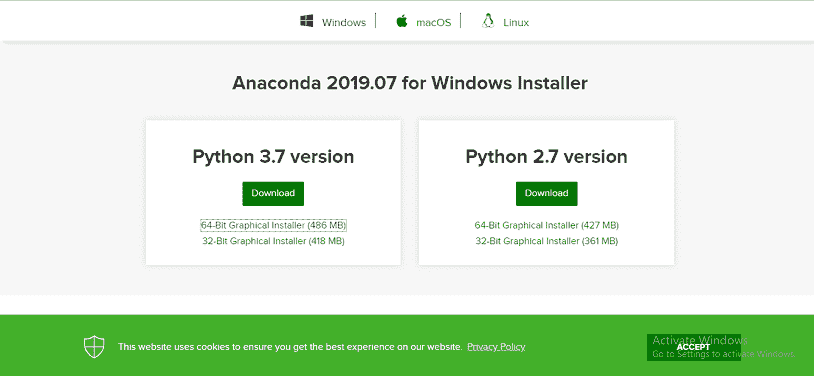
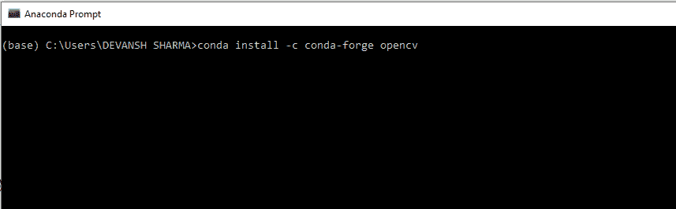
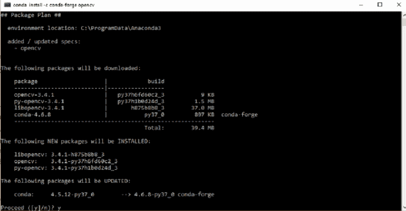
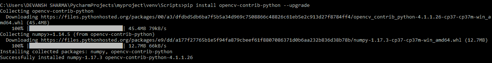
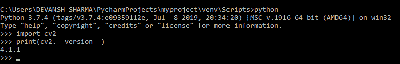

# OpenCV 的安装

> 原文：<https://www.javatpoint.com/opencv-installation>

### 使用 Anaconda 安装 OpenCV

第一步是从 it [官方网站](https://www.anaconda.com/distribution/)下载最新的 Anaconda Windows 图形安装程序。选择您的位图形安装程序。建议您使用 Python 3 安装 3.7。


选择图形位安装程序



安装后，打开 Anaconda 提示符并键入以下命令。

```

conda install -c conda-forge opencv

```



按回车键，它将下载所有相关的 OpenCV 配置。



### 通过画中画在视窗中安装 OpenCV

OpenCV 是一个 Python 库，因此需要在系统中安装 Python，并使用 pip 命令安装 OpenCV:

```

pip install opencv-contrib-python --upgrade

```

我们可以通过以下命令在没有额外模块的情况下安装它:

```

pip install opencv-python

```



打开命令提示符，键入以下代码，检查是否安装了 OpenCV。



### 在 MacOS 中安装 OpenCV

在本节中，我们将学习如何使用自制程序在苹果电脑上安装 OpenCV。使用自制程序的优点是它简化了安装过程。它需要一些命令来安装。安装步骤如下:

**第一步:安装 Xcode 命令行工具**

要安装 Xcode，请在终端中键入以下命令。

```

sudo xcode-select --install

```

要验证安装是否成功，请键入以下命令。

```

sudo xcode-select -p

```

如果显示**/Application/xcode . app/Content/Developer**，那么我们可以继续。

**第二步:安装自制**

要安装自制程序，请在终端中键入以下命令。

```

ruby -e "$(curl -fsSL https://raw.github.com/Homebrew/homebrew/go/install)"

```

一个外壳脚本**。bashrc** 位于您的主目录中，每当 Bash 以交互方式启动时，它都会运行。我们可以使用以下命令定位主目录。

```

echo $HOME

```

它应该显示如下输出

```

/Users/MATHEW

```

**第三步:安装 Python 3**

从 OpenCV 开始，需要安装 Python。要使用自制程序安装 Python 3，请键入以下命令:

```

brew install python3

```

要通过运行以下命令来检查 python 版本:

```

python3 --version

```

它将显示下载的 Python 版本。

**步骤- 4 安装 OpenCV**

要安装 OpenCV3，请键入以下命令:

```

brew install opencv3 -with-contrib -with-python3

```

### 设置 Python 3 虚拟环境

virtualenv 和 virtualenvwrapper 包提供了设置虚拟环境的工具。重要的是将虚拟环境设置为与多个项目一起工作，而不会在它们的依赖关系中引入冲突。

要安装 **virtualenv** 和 **virtualenvwrapper** ，我们使用 pip (Python 包管理器):

```

pip3 install virtualenv and virtualenv virtualenvwrapper

```

我们还需要更新 **~/。bashrc** :

```

#virtualenv/VirtualenvWrapper
VIRTUALENVWRAPPER_PYTHON ='/user/local/bin/python3'
Source/user/local/bin/virtualenvwrapper.sh
export WORKON_HOME = $HOME/.virtualenvs

```

现在我们可以创建一个 Python 3 虚拟环境:

```

mkvirtualenv cv3 -p python3

```

我们可以使用下面的命令来访问 OpenCV。

```

workon cv3

```

上述命令激活系统中的 OpenCV。

* * *