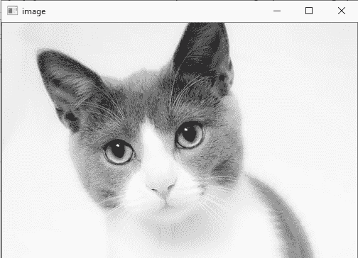

# 读取并保存图像

> 原文：<https://www.javatpoint.com/opencv-read-and-save-image>

## OpenCV 阅读图像

OpenCV 允许我们对图像执行多种操作，但要做到这一点，需要读取一个图像文件作为输入，然后我们就可以对其执行各种操作。OpenCV 提供了以下用于读取和写入图像的功能。

### OpenCV imread 函数

函数的作用是:从指定的文件中加载图像并返回。语法是:

```

cv2.imread(filename[,flag])

```

### 参数:

**文件名:**要加载的文件的名称

**标志:**标志指定加载图像的颜色类型:

*   **CV_LOAD_IMAGE_ANYDEPTH -** 如果我们将其设置为标志，当输入有相应深度时，它将返回 16 位/32 位图像，否则将其转换为 8 位。
*   **CV_LOAD_IMAGE_COLOR -** 如果我们将其设置为标志，它总是将转换后的图像返回到彩色图像。
*   **C V _ LOAD _ IMAGE _ grade-**如果我们将其设置为标志，它总是将图像转换为灰度。

如果图像因不支持的文件格式、丢失文件、不支持或无效格式而无法读取，则 **imread()** 函数返回一个矩阵。目前，支持以下文件格式。

视窗点阵图 - *。bmp、*。dib
**JPEG 文件** - *。jpeg、*。jpg、*。jpe
**【便携网络图形】** - *。png
**【便携式图像格式】** - *。多溴联苯醚*。PGM . *。ppm
**【tiff 档案】** - *。tiff、*。tif(基准)

#### 注意:彩色图像、解码图像将具有以 BGR 顺序存储的通道。

让我们考虑以下示例:

```

#importing the opencv module
import cv2

# using imread('path') and 0 denotes read as  grayscale image
img = cv2.imread(r'C:\Users\DEVANSH SHARMA\cat.jpeg',1)

#This is using for display the image
cv2.imshow('image',img)

cv2.waitKey(3) # This is necessary to be required so that the image doesn't close immediately.
#It will run continuously until the key press.
cv2.destroyAllWindows()

```

**输出:**将显示如下图。



## 保存图像

OpenCV **imwrite()** 功能用于将图像保存到指定文件。文件扩展名定义了图像格式。语法如下:

```

cv2.imwrite(filename, img[,params])

```

### 参数:

**文件名-** 要加载的文件的名称

**图像-** 要保存的图像。

**参数-** 当前支持以下参数:

*   对于 JPEG，质量可以从 0 到 100。默认值为 95。
*   对于巴布亚新几内亚，质量可以是从 0 到 9 的压缩级别。默认值为 1。
*   对于 PPM、PGM 或 PBM，它可以是二进制格式标志 0 或 1。默认值为 1。

让我们考虑以下示例:

```

import cv2

# read image as grey scale
img = cv2.imread(r'C:\Users\DEVANSH SHARMA\cat.jpeg', 1)

# save image
status = cv2.imwrite(r'C:\Users\DEVANSH SHARMA\cat.jpeg', 0, img)
print("Image written to file-system : ", status)

```

**输出:**

```
Image written to file-system : True

```

如果 imwrite()函数返回 True，这意味着文件成功写入指定文件。

* * *