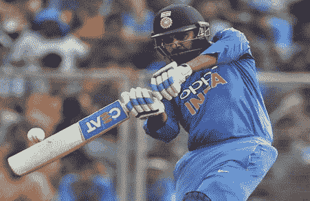
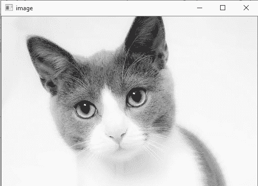

# 图像的基本操作

> 原文：<https://www.javatpoint.com/opencv-basic-operation-on-images>

在本教程中，我们将学习与图像相关的基本操作。我们将讨论以下主题。

*   访问像素值并修改它们
*   访问图像属性
*   设置图像区域
*   拆分和合并图像
*   更改图像颜色

## 访问和修改像素值

我们可以通过像素的行和列坐标来检索像素值。它返回 BGR 图像的蓝色、绿色和红色值的数组。它返回灰度图像的相应强度。首先，我们需要加载 BGR 图像。

```

import numpy as np
import cv2
img = cv2.imread("C:\Users\DEVANSH SHARMA\cat.jpeg",1)
pixel = img[100,100]
print(pixel) 

```

**输出:**

```
[190 166 250]

```

## 访问图像属性

最好知道图像的大小，以便使用图像处理应用程序。在 OpenCV 中，图像通常存储在 Numpy 数组中。若要获取图像的形状或大小，请使用 ndarray.shape 查找图像的尺寸。然后，我们可以使用索引位置来获得通道的高度、宽度和数量。

考虑以下示例:

```

import cv2
# read image
img = cv2.imread(r'C:\Users\DEVANSH SHARMA\cat.jpeg',1)

# height, width, number of channels in image
height = img.shape[0]
width = img.shape[1]
channels = img.shape[2]
size1 = img.size

print('Image Dimension    : ',dimensions)
print('Image Height       : ',height)
print('Image Width        : ',width)
print('Number of Channels : ',channels)
print('Image Size  :', size1)

```

**输出:**

```
Image Dimension    :  (4, 1, 3)
Image Height       :  4
Image Width        :  1
Number of Channels :  3
Image Size  : 12

```

## 图像感兴趣区域

有时，我们需要处理图像的某些区域。正如我们在前面的教程中所讨论的，人脸检测已经覆盖了整个画面。当获得人脸时，我们只选择人脸区域，并在其中搜索眼睛，而不是搜索整个图像。它提高了准确性和性能，因为眼睛总是在脸上，不需要搜索整个图像。



在上图中，如果我们需要选择球。我们只需要选择球的区域。

## 分割和合并图像通道

当需要时，图像的 BGR 通道可以被分成它们的平面。然后，各个通道可以再次从 BGR 图像中合并回来。这可以通过以下方式实现:

```

b,g,r = cv2.split(img)
img = cv2.merge((b,g,r))

```

或者

```

b = img[:,:,0]

```

#### 注意:cv2.split()函数是一个慢速函数。Numpy 索引非常有效，如果可能，应该使用它。

## 为图像制作边框

OpenCV 提供了**cv2 . copymakedborder()**功能，在图像周围创建一个边框，类似于相框。下面给出了函数的语法。

```

cv2.copyMakeBorder(src,top,bottom,left,right,border type)

```

**参数:**

**src -** 表示输入图像。

**上、下、左、右-** 定义对应方向的边框宽度，以像素为单位。

**边框类型-** 定义要添加哪种边框。边框可以是以下类型。

**值-** 如果边框类型为 cv，则为边框颜色。边框 _ 常数

考虑以下示例:

```

import cv2 as cv
import numpy as np
from matplotlib import pyplot as plt
BLUE = [255,0,0]
img1 = cv.imread(r'C:\User\DEVANSH SHARMA\flower.jpg',1)
replicate = cv.copyMakeBorder(img1,10,10,10,10,cv.BORDER_REPLICATE)
reflect = cv.copyMakeBorder(img1,10,10,10,10,cv.BORDER_REFLECT)
reflect101 = cv.copyMakeBorder(img1,10,10,10,10,cv.BORDER_REFLECT_101)
wrap = cv.copyMakeBorder(img1,10,10,10,10,cv.BORDER_WRAP)
constant= cv.copyMakeBorder(img1,10,10,10,10,cv.BORDER_CONSTANT,value=BLUE)
plt.subplot(231),plt.imshow(img1,'gray'),plt.title('ORIGINAL')
plt.subplot(232),plt.imshow(replicate,'gray'),plt.title('REPLICATE')
plt.subplot(233),plt.imshow(reflect,'gray'),plt.title('REFLECT')
plt.subplot(234),plt.imshow(reflect101,'gray'),plt.title('REFLECT_101')
plt.subplot(235),plt.imshow(wrap,'gray'),plt.title('WRAP')
plt.subplot(236),plt.imshow(constant,'gray'),plt.title('CONSTANT')
plt.show() 

```

## 图像颜色的变化

### OpenCV cvtColor

**cvtColor** 用于将图像从一个颜色空间转换到另一个颜色空间。语法如下:

```

cv2.cvtColor(src, dst, code)

```

### 参数:

**src -** 用于输入图像:8 位无符号。

**dst -** 用于显示图像作为输出。输出图像的大小和深度将与输入图像相同。

**代码-** 颜色空间转换代码。

考虑以下示例:

```

# importing cv2  
import cv2  

# path of the input image
path = (r'C:\Users\DEVANSH SHARMA\cat.jpeg')

# Reading an image in default mode 
src = cv2.imread(path) 

# Window name in which image is displayed 
window_name = 'Image' 
# Using cv2.cvtColor() method 
# Using cv2.COLOR_BGR2GRAY color space for convert BGR image to grayscale
# conversion code 
image = cv2.cvtColor(src, cv2.COLOR_BGR2GRAY ) 
# Displaying the image  
cv2.imshow(window_name, image)

```

**输出:**



* * *