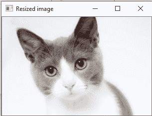
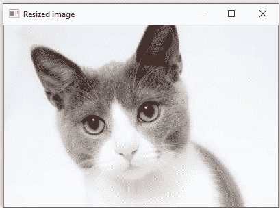
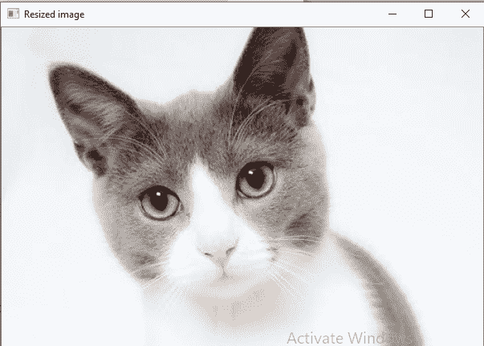
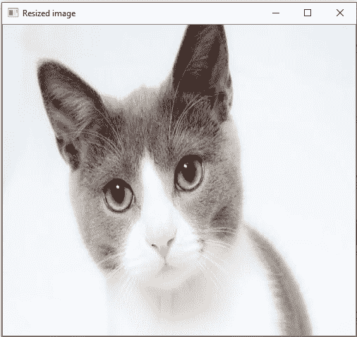
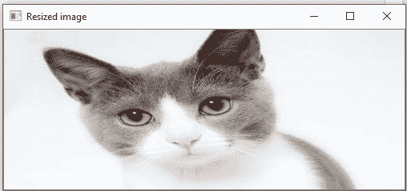
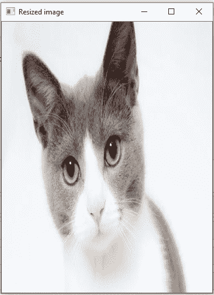

# 调整图像大小

> 原文：<https://www.javatpoint.com/opencv-resize-image>

有时，需要变换加载的图像。在图像处理中，我们需要调整图像的大小来执行特定的操作。图像通常存储在数组中。使用**标准形状**获得图像的尺寸。我们可以通过使用维度变量的索引来获得每个像素的通道的宽度、高度和数量。

### 示例:1

```

import cv2

img = cv2.imread(r'C:\Users\DEVANSH SHARMA\cat.jpeg', 1)
scale = 60
width = int(img.shape[1] * scale / 100)
height = int(img.shape[0] * scale / 100)
dim = (width, height)
# resize image
resized = cv2.resize(img, dim, interpolation=cv2.INTER_AREA)

print('Resized Dimensions : ', resized.shape)

cv2.imshow("Resized image", resized)
cv2.waitKey(0)
cv2.destroyAllWindows()

```

**输出:**

```
Resized Dimensions : (199, 300, 3)

```



调整图像大小意味着改变图像的尺寸、宽度或高度以及两者。此外，原始图像的纵横比可以通过调整图像大小来保持。OpenCV 提供 **cv2.resize()** 功能调整图像大小。语法如下:

```

cv2.resize(src, dsize[, dst[, fx[,fy[,interpolation]]])

```

### 参数:

*   **src** -源/输入图像(必需)。
*   **dsize** -输出图像的所需大小(必需)
*   **fx** -沿水平轴的比例因子。(可选)
*   **fy** -沿垂直轴的比例因子。
*   **插值(可选)** -该标志使用以下方法:
    *   最近内插利用像素面积关系进行重采样。当我们尝试进行图像缩放时，它类似于 INTER _ NEAREST 方法。
    *   INTER _ CUBIC-44 像素邻域内的双三次插值。
    *   88 像素邻域内的 INTER _ lancoz4-lanzos 插值。

### 调整图像大小的示例

有几种方法可以调整图像的大小。以下是一些执行调整大小操作的示例:

1.  保留纵横比(保留图像的高度与宽度之比)
    *   缩小(图像尺寸减小)
    *   放大(图像尺寸的增加)
2.  不保留纵横比
    *   仅调整宽度
    *   仅调整高度
3.  调整指定的宽度和高度

**保留纵横比**

*   **使用 resize()缩小比例**

```

import cv2

img = cv2.imread(r'C:\Users\DEVANSH SHARMA\cat.jpeg', 1)

print('Original Dimensions : ', img.shape)

scale = 60  # percent of original size
width = int(img.shape[1] * scale / 100)
height = int(img.shape[0] * scale / 100)
dim = (width, height)
# resize image
resized = cv2.resize(img, dim, interpolation=cv2.INTER_AREA)

print('Resized Dimensions : ', resized.shape)

cv2.imshow("Resized image", resized)
cv2.waitKey(0)
cv2.destroyAllWindows()

```

**输出:**

```
Original Dimensions :  (332, 500, 3)
Resized Dimensions :  (199, 300, 3)

```



在上面的例子中，scale_per 变量保存了需要缩放的图像的百分比。**值< 100** 用于缩小所提供的图像。我们将使用此 **scale_per** 值以及原始图像的尺寸来计算输出图像的宽度和高度。

**用 resize()升级**

```

import cv2

img = cv2.imread(r'C:\Users\DEVANSH SHARMA\cat.jpeg', 1)

print('Original Dimensions : ', img.shape)

scale = 150  # percent of original size
width = int(img.shape[1] * scale / 100)
height = int(img.shape[0] * scale / 100)
dim = (width, height)
# resize image
resized = cv2.resize(img, dim, interpolation=cv2.INTER_AREA)

print('Resized Dimensions : ', resized.shape)

cv2.imshow("Resized image", resized)
cv2.waitKey(0)
cv2.destroyAllWindows()

```

**输出:**

```
Original Dimensions :  (332, 500, 3)
Resized Dimensions :  (398, 600, 3)

```



### 不保持纵横比

*   **仅调整宽度**

在下面的例子中，我们为宽度和高度提供了一个特定的像素值，高度将不受影响。

```

import cv2

img = cv2.imread(r'C:\Users\DEVANSH SHARMA\cat.jpeg', cv2.IMREAD_UNCHANGED)
print('Original Dimensions : ', img.shape)

width = img.shape[1]  # keep original width
height = 440 
dim = (width, height)

# resize image
resized = cv2.resize(img, dim, interpolation=cv2.INTER_AREA)

print('Resized Dimensions : ', resized.shape)

cv2.imshow("Resized image", resized)
cv2.waitKey(0)
cv2.destroyAllWindows()

```

**输出:**

```
Original Dimensions :  (332, 500, 3)
Resized Dimensions :  (440, 500, 3)

```



*   **调整高度**

在下面的例子中， **scale_per** 值保存了必须缩放高度的百分比，或者我们可以提供以像素为单位的特定值。

```

import cv2

img = cv2.imread(r'C:\Users\DEVANSH SHARMA\cat.jpeg', 1)
print('Original Dimensions : ', img.shape)
width = img.shape[1]  # keep original width
height = 200
dim = (width, height)

# resize image
resized = cv2.resize(img, dim, interpolation=cv2.INTER_AREA)

print('Resized Dimensions : ', resized.shape)

cv2.imshow("Resized image", resized)
cv2.waitKey(0)
cv2.destroyAllWindows()

```

**输出:**

```
Original Dimensions :  (332, 500, 3)
Resized Dimensions :  (200, 500, 3)

```



调整特定的宽度和高度

*   我们可以指定宽度和高度。

```

import cv2

img = cv2.imread(r'C:\Users\DEVANSH SHARMA\cat.jpeg', 1)
print('Original Dimensions : ', img.shape)

width = 350
height = 450
dim = (width, height)
# resize image
resized = cv2.resize(img, dim, interpolation=cv2.INTER_AREA)

print('Resized Dimensions : ', resized.shape)
cv2.imshow("Resized image", resized)
cv2.waitKey(0)
cv2.destroyAllWindows()

```

**输出:**



* * *