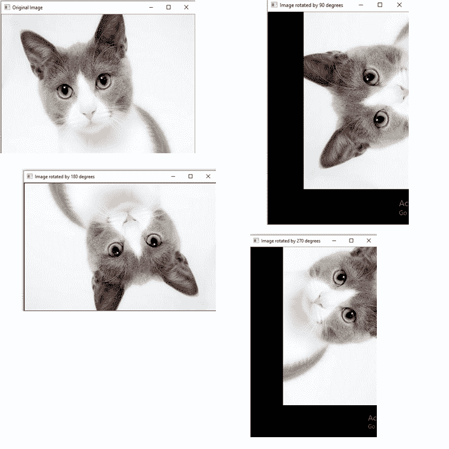

# OpenCV 图像旋转

> 原文：<https://www.javatpoint.com/opencv-image-rotation>

图像可以以各种角度(90°、180°、270°和 360°)旋转。OpenCV 计算执行仿射变换的仿射矩阵，这意味着它不保留线之间的角度或点之间的距离，尽管它保留了位于线上的点之间的距离比。

旋转图像的语法如下:

```

cv2.getRotationMatrix2D(center, angle, scale rotated = cv2.warpAfifne(img,M,(w,h))

```

### 参数:

*   **中心:**代表图像的中心。
*   **角度:**表示特定图像逆时针旋转的角度。
*   **旋转:**保存旋转图像数据的数组。
*   **刻度:**值 1.0 表示形状保留。根据提供的值缩放图像。

### 示例-1

```

import cv2
# read image as greyscale
img = cv2.imread(r'C:\Users\DEVANSH SHARMA\cat.jpeg')
# get image height, width
(h, w) = img.shape[:2]
# calculate the center of the image
center = (w / 2, h / 2)

angle90 = 90
angle180 = 180
angle270 = 270

scale = 1.0

# Perform the counterclockwise rotation holding at the center
# 90 degrees
M = cv2.getRotationMatrix2D(center, angle90, scale)
rotated90 = cv2.warpAffine(img, M, (h, w))

# 180 degrees
M = cv2.getRotationMatrix2D(center, angle180, scale)
rotated180 = cv2.warpAffine(img, M, (w, h))

# 270 degrees
M = cv2.getRotationMatrix2D(center, angle270, scale)
rotated270 = cv2.warpAffine(img, M, (h, w))

cv2.imshow('Original Image', img)
cv2.waitKey(0)  # waits until a key is pressed
cv2.destroyAllWindows()  # destroys the window showing image

cv2.imshow('Image rotated by 90 degrees', rotated90)
cv2.waitKey(0)  # waits until a key is pressed
cv2.destroyAllWindows()  # destroys the window showing imag

cv2.imshow('Image rotated by 180 degrees', rotated180)
cv2.waitKey(0)  # waits until a key is pressed
cv2.destroyAllWindows()  # destroys the window showing image

cv2.imshow('Image rotated by 270 degrees', rotated270)
cv2.waitKey(0)  # waits until a key is pressed
cv2.destroyAllWindows()  # destroys the window showing image

```

**输出:**



* * *