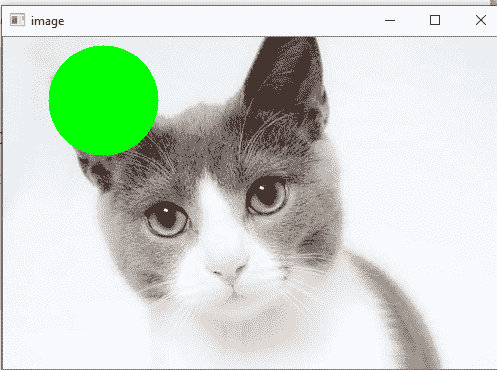
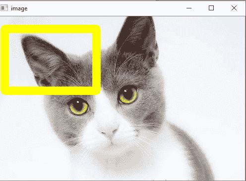
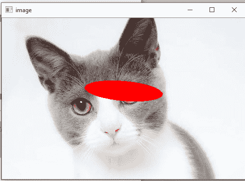
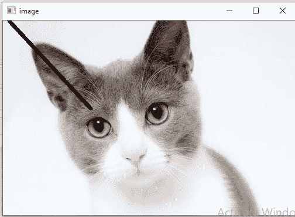
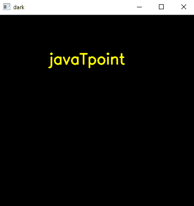
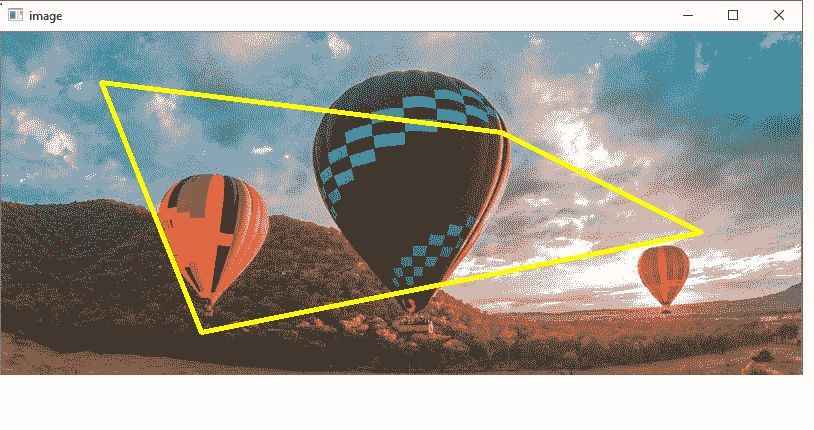

# 绘图函数

> 原文：<https://www.javatpoint.com/opencv-drawing-functions>

我们可以在图像上绘制各种形状，如**圆、矩形、椭圆、折线、凸、**等。当我们想要突出显示输入图像中的任何对象时，会用到它。OpenCV 为每个形状提供功能。这里我们将学习绘图功能。

## 画圆

我们可以使用 **cv2.circle()** 函数在图像上画圆。语法如下:

```

cv2.circle(img, center, radius, color[,thickness [, lineType[,shift]]])

```

### 参数:

*   **img-** 代表给定的图像。
*   **圆心-** 圆心
*   **半径-** 圆的半径
*   **颜色-** 圆形颜色
*   **厚度-** 表示圆轮廓的厚度，如果是正的。而负厚度意味着要画一个实心圆。
*   **线型-** 定义圆边界的类型。
*   **shift-** 表示中心坐标的小数位数和半径值。

考虑以下示例:

```

import numpy as np
import cv2
img = cv2.imread(r"C:\Users\DEVANSH SHARMA\cat.jpeg",1)
cv2.circle(img,(80,80), 55, (0,255,0), -1)
cv2.imshow('image',img)
cv2.waitKey(0)
cv2.destroyAllWindows()

```

**输出:**



## 绘制矩形

OpenCV 提供了一个函数来绘制一个简单的、粗的或填充的右上方矩形。语法如下:

```

cv2.rectangle(img, pt1, pt2, color[, thickness[,lineType[,shift]]])

```

### 参数:

*   **img-** 它代表一个图像。
*   **pt1-** 表示矩形的**顶点**。
*   **pt2-** 表示与 pt1 相对的矩形的顶点。
*   **颜色-** 表示亮度的矩形颜色(灰度图像)。
*   **厚度-** 表示组成矩形的线条的厚度。负值(CV_FILLED)意味着函数必须绘制一个填充的矩形。
*   **线型-** 表示线条的类型。
*   **shift-** 表示点坐标中的小数位数。

考虑以下示例:

```

import numpy as np
import cv2
img = cv2.imread(r"C:\Users\DEVANSH SHARMA\cat.jpeg",1)
cv2.rectangle(img,(15,25),(200,150),(0,255,255),15)
cv2.imshow('image',img)
cv2.waitKey(0)
cv2.destroyAllWindows()

```

**输出:**



## 绘制椭圆

我们可以使用 **cv2.ellipse()** 函数在图像上画一个椭圆。它可以画一个简单或粗的椭圆弧，也可以填充一个椭圆扇形。

```

cv2.ellipse(img, center, axes, angle, startAngle, endAngle, color[, thickness[, lineType[, shift]]]) 
cv2.ellipse(img, box, color[, thickness[, lineType]]) 

```

### 参数:

*   **img -** 它代表一个图像。
*   **框-** 通过 RotatedRect 或 CvBox2D 表示备选椭圆表示。这意味着该函数用于在弯曲的矩形中绘制椭圆。
*   **颜色-** 表示椭圆颜色。
*   **角度-** 表示旋转角度。
*   **起始角度-** 表示椭圆弧的初始角度，单位为度。
*   **endAngle -** 表示椭圆弧的终止角，单位为度。
*   **厚度-** 如果数值为正，用于绘制椭圆弧轮廓的厚度。否则，这将指定绘制填充椭圆。
*   **线型-** 表示椭圆边界的类型。
*   **shift -** 表示中心坐标的小数位数和轴的数值。

考虑以下示例:

```

import numpy as np
import cv2
img = cv2.imread(r"C:\Users\DEVANSH SHARMA\cat.jpeg",1)

cv2.ellipse(img, (250, 150), (80, 20), 5, 0, 360, (0,0,255), -1)
cv2.imshow('image',img)
cv2.waitKey(0)
cv2.destroyAllWindows()

```

**输出:**



有两个函数可以绘制椭圆。第一个函数用于绘制整个椭圆，而不是绕过**起始角度=0** 和**角度= 360** 的圆弧。椭圆的第二个功能用于绘制椭圆轮廓、填充椭圆、椭圆弧或填充椭圆扇形。

## 画线

OpenCV 提供**线()**功能，在图像上画线。它在图像中的 ptr1 和 ptr2 点之间绘制一条线段。图像边界剪切线条。

```

cv2.line(img, pt1, pt2, color[, thickness[, lineType[, shift]]])

```

### 参数:

*   **img-** 它代表一个图像。
*   **pt1-** 表示线段的第一点。
*   **pt2-** 表示线段的第二点。
*   **颜色-** 代表线条颜色
*   **厚度-** 代表线条厚度
*   **线型-** 有各种类型的线:
    *   8(或省略)- 8 条连接线。
    *   4 - 4 连接线路。
    *   CV__AA-抗锯齿线
*   **shift-** 表示点坐标中的小数位数。

考虑以下示例:

```

import numpy as np
import cv2
img = cv2.imread(r"C:\Users\DEVANSH SHARMA\cat.jpeg",1)
cv2.line(img,(10,0),(150,150),(0,0,0),15)
cv2.imshow('image',img)
cv2.waitKey(0)
cv2.destroyAllWindows()

```

**输出:**



### 在图像上书写文本

我们可以使用 **putText()** 功能在图像上写文字。语法如下。

```

cv2.putText(img, text, org, font, color)

```

### 参数:

*   **img:** 代表一个图像
*   **文字:**表示我们要写在图像上的文字。
*   **org:** 表示图像中文本字符串的左下角。
*   **字体:** CvFont 结构使用 InitFont()初始化。
*   **颜色:**代表文字颜色。

考虑下面的例子。

```

import numpy as np
import cv2
font = cv2.FONT_HERSHEY_SIMPLEX
# Create a black image.
img = cv2.imread(r"C:\Users\DEVANSH SHARMA\cat.jpeg",1)
cv2.putText(img,'Hack Projects',(10,500), font, 1,(255,255,255),2)
#Display the image
cv2.imshow("image",img)
cv2.waitKey(0)

```

**输出:**



## 绘制多段线

我们可以在图像上绘制折线。OpenCV 提供**折线()**功能，用于在图像上绘制多边形曲线。语法如下:

```

cv2.polyLine(img, polys, is_closed, color, thickness=1, lineType=8, shift=0)

```

### 参数:

*   **img -** 它代表一个图像。
*   **pts -** 表示多边形曲线的阵列。
*   **npts -** 它表示多边形顶点计数器的数组。
*   **n 计数器-** 表示曲线的数量。
*   **是 _Closed -** 表示绘制的折线是否闭合的标志。
*   **颜色-** 折线的颜色。
*   **厚度-** 表示折线边的厚度。
*   **线型-** 线段的类型。
*   **shift-** 表示点坐标中的小数位数。

考虑以下程序在图像中绘制折线

```

import numpy as np
import cv2
img = cv2.imread(r'C:\Users\DEVANSH SHARMA\forest.jpg',cv2.IMREAD_COLOR)
#defining points for polylines
pts = np.array([[100,50],[200,300],[700,200],[500,100]], np.int32)
# pts = pts.reshape((-1,1,2))
cv2.polylines(img, [pts], True, (0,255,255), 3)
cv2.imshow('image',img)
cv2.waitKey(0)
cv2.destroyAllWindows()

```

**输出:**



* * *