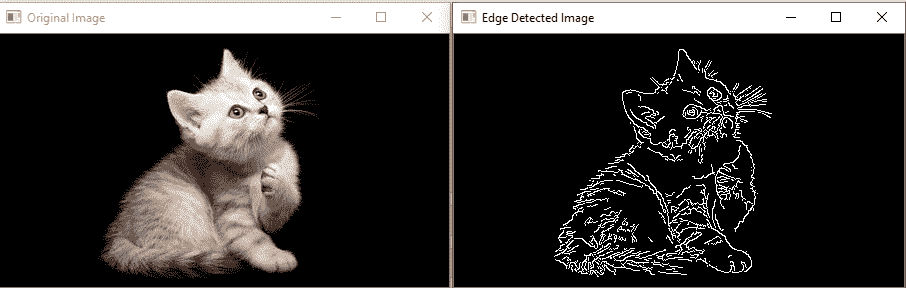
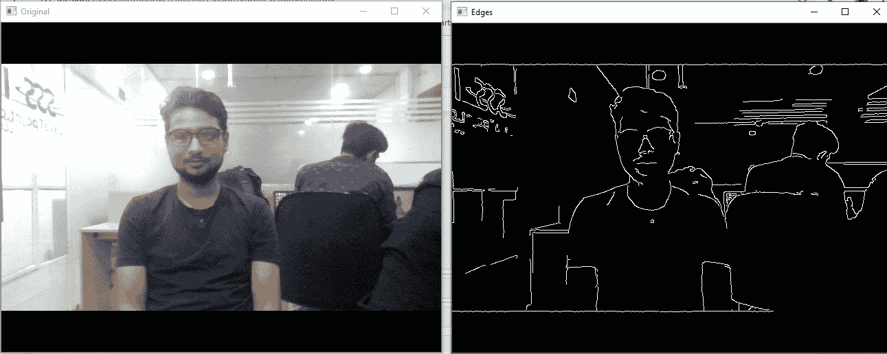

# Canny 边缘检测

> 原文：<https://www.javatpoint.com/opencv-canny-edge-detection>

边缘检测是识别图像中物体边界的术语。我们将学习使用 canny 边缘检测技术的边缘检测。语法是 canny 边缘检测函数给出为:

```

edges = cv2.Canny('/path/to/img', minVal, maxVal, apertureSize, L2gradient)

```

### 参数-

*   **/path/to/img:** 图像的文件路径(必需)
*   **minVal:** 最小强度梯度(必需)
*   **最大值:**最大强度梯度(必需)
*   **光圈:**是可选参数。
*   **l2grade:**其默认值为 false，如果值为 true，Canny()使用一个计算量更大的等式来检测边缘，这样可以以资源为代价提供更高的精度。

### 示例:1

```

import cv2
img = cv2.imread(r'C:\Users\DEVANSH SHARMA\cat_16x9.jpg')
edges = cv2.Canny(img, 100, 200)

cv2.imshow("Edge Detected Image", edges)
cv2.imshow("Original Image", img)
cv2.waitKey(0)  # waits until a key is pressed
cv2.destroyAllWindows()  # destroys the window showing image

```

**输出:**



### 示例:实时边缘检测

```

# import libraries of python OpenCV  
import cv2

# import Numpy by alias name np
import numpy as np

# capture frames from a camera 
cap = cv2.VideoCapture(0)

# loop runs if capturing has been initialized 
while (1):

    # reads frames from a camera 
    ret, frame = cap.read()

    # converting BGR to HSV 
    hsv = cv2.cvtColor(frame, cv2.COLOR_BGR2HSV)
    # define range of red color in HSV 
    lower_red = np.array([30, 150, 50])
    upper_red = np.array([255, 255, 180])

    # create a red HSV colour boundary and  
    # threshold HSV image 
    mask = cv2.inRange(hsv, lower_red, upper_red)

    # Bitwise-AND mask and original image 
    res = cv2.bitwise_and(frame, frame, mask=mask)

    # Display an original image 
    cv2.imshow('Original', frame)

    # discovers edges in the input image image and 
    # marks them in the output map edges 
    edges = cv2.Canny(frame, 100, 200)

    # Display edges in a frame 
    cv2.imshow('Edges', edges)

    # Wait for Esc key to stop 
    k = cv2.waitKey(5) & 0xFF
    if k == 27:
        break

# Close the window 
cap.release()

# De-allocate any associated memory usage 
cv2.destroyAllWindows()

```

**输出:**



* * *