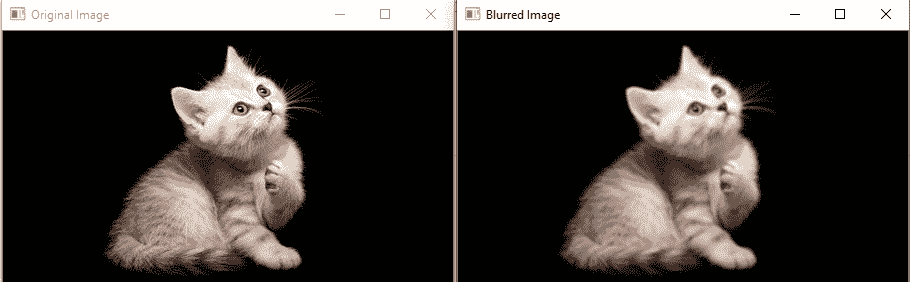
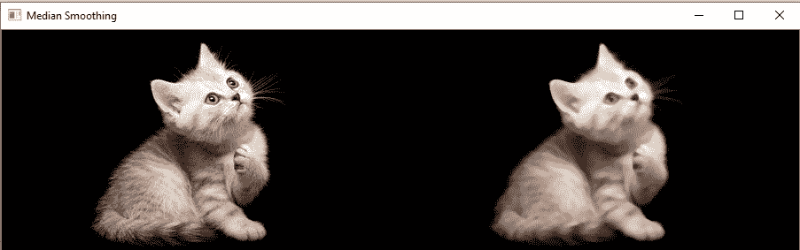
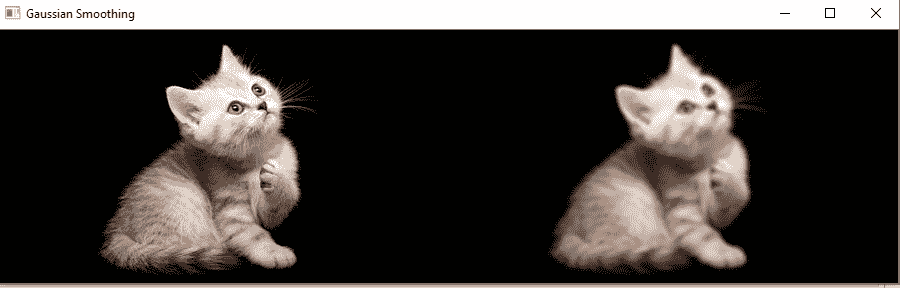

# 图像平滑

> 原文：<https://www.javatpoint.com/opencv-blur>

模糊是图像处理中常用的去噪技术。它一般用于消除图像中的噪声、边缘等高频内容。当我们对图像应用模糊时，边缘会变得模糊。模糊的优点如下:

## 模糊的优点

模糊的好处如下:

*   它去除了低强度边缘。
*   它有助于平滑图像。
*   有利于隐藏细节；例如，在许多情况下需要模糊，例如警察故意想要隐藏受害者的脸。

OpenCV 主要提供以下类型的模糊技术。

## OpenCV 平均

在这种技术中，图像与箱式滤波器卷积(归一化)。它计算内核区域下所有像素的平均值，并用计算出的平均值替换中心元素。OpenCV 提供 **cv2.blur()** 或 **cv2.boxFilter()** 来执行此操作。我们应该定义内核的宽度和高度。 **cv2.blur()** 函数的语法如下。

```
cv2.blur(src, dst, ksize, anchor, borderType)

```

### 参数:

**src -** 表示源(输入)图像。

**dst -** 表示目的地(输出)图像。

**ksize -** 表示内核的大小。

**锚点-** 表示锚点。

**边框类型-** 它表示要用于输出的边框类型。

考虑以下示例:

```
im = cv2.imread(r'C:\Users\DEVANSH SHARMA\cat_16x9.jpg')
cv2.imshow('Original Image',im)
cv2.imshow('Blurred Image', cv2.blur(im, (3,3)))
cv2.waitKey(0)
cv2.destroyAllWindows()

```

**输出**



## 中值模糊

中值模糊操作与高斯模糊非常相似。OpenCV 提供 **medianblur()** 功能执行模糊操作。它取核区域下所有像素的中值，中心元素用这个中值代替。它对图像中的盐和纸噪声非常有效。内核大小应该是一个奇数正整数。下面是这个方法的语法。

```
cv2.medianBlur(src, dst, ksize)

```

### 参数:

**src-** 表示源(输入图像)。

**dst -** 表示目的地(输出图像)。

**ksize -** 表示内核的大小。

考虑以下示例:

```
import cv2  
import numpy  
# read image  
img = cv2.imread(r'C:\Users\DEVANSH SHARMA\cat_16x9.jpg', 1)    
# apply gaussian blur on src image  
dst = median = cv2.medianBlur(img,5)
# display input and output image  
cv2.imshow("Gaussian Smoothing", numpy.hstack((src, dst)))  
cv2.waitKey(0)  # waits until a key is pressed  
cv2.destroyAllWindows()  # destroys the window showing image

```

**输出**



## 高斯模糊

图像平滑是一种有助于降低图像噪声的技术。由于相机传感器的原因，图像可能包含各种类型的噪声。它基本上消除了图像中的高频(噪声、边缘)内容，因此在此操作中边缘会稍微模糊。OpenCV 提供**Gaussian bulr()**功能，对图像进行平滑处理。语法如下:

```
dst=cv2.GuassiasBlur(src, ksize, sigmaX[,dst[,sigmaY[, borderType=BORDER_DEFAULT]]]

```

### 参数:

*   **src**-用于输入图像。
*   **dst**-它是一个存储输出图像的变量。
*   **ksize**-定义高斯核大小【高度宽度】。高度和宽度必须是奇数(1，3，5，..)并且可以具有不同的值。如果 ksize 设置为[0，0]，则 ksize 根据σ值计算。
*   **sigmaX** -沿 X 轴的核标准求导。(水平方向)。
*   **sigmaY** -沿 Y 轴(垂直方向)的核标准求导。如果 sigmaY = 0，则 sigmaX 值取为 sigmaY。

**边界类型-** 这些是指定的图像边界，而内核应用于图像边界。可能的边框类型是:

*   简历。边框 _ 常数
*   简历。BORDER_REPLICATE
*   简历。边框 _ 反射
*   简历。BORDER_WRAP
*   简历。边框 _ 反射 _101
*   简历。边框 _ 透明
*   简历。边框 _ 反射 101
*   简历。BORDER_DEFAULT
*   简历。边框 _ 隔离

考虑以下示例:

```
import cv2  
import numpy  

# read image  
src = cv2.imread(r'C:\Users\DEVANSH SHARMA\cat_16x9.jpg', 1)    
# apply gaussian blur on src image  
dst = cv2.GaussianBlur(src, (5, 5), cv2.BORDER_DEFAULT)  

# display input and output image  
cv2.imshow("Gaussian Smoothing", numpy.hstack((src, dst)))  
cv2.waitKey(0)  # waits until a key is pressed  
cv2.destroyAllWindows()  # destroys the window showing image  

```

**输出:**



* * *