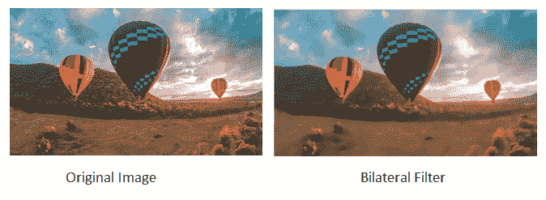
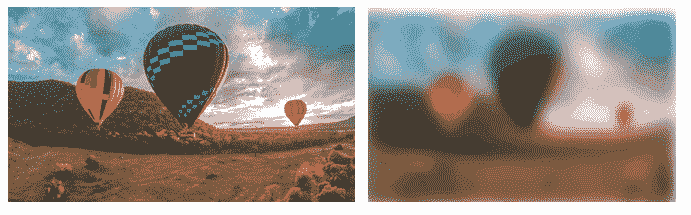
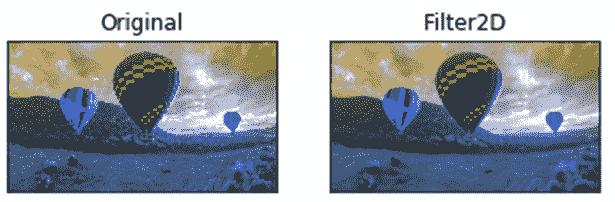

# 图像过滤器

> 原文：<https://www.javatpoint.com/opencv-image-filters>

图像过滤是通过改变像素的阴影或颜色来修改图像的过程。它也用于增加亮度和对比度。在本教程中，我们将学习几种类型的过滤器。

## 双边滤波器

OpenCV 提供**双边滤镜()**功能，对图像应用双边滤镜。双边滤波器可以很好地减少不想要的噪声，同时保持边缘清晰。该函数的语法如下:

```

 cv2.bilateralFilter(src, dst, d, sigmaSpace, borderType)

```

### 参数:

*   **src-** 表示图像的来源。它可以是 8 位或浮点 1 通道图像。
*   **dst-** 表示相同大小的目的图像。它的类型将与 src 映像相同。
*   **d -** 表示滤波时使用的像素邻域(整数型)的直径。如果它的值是负的，那么它是从 sigmaSpace 计算出来的。
*   **sigmaColor -** 表示颜色空间中的滤镜σ。
*   **sigmaSpace -** 表示坐标空间中的滤波器σ。

考虑以下示例:

```

import cv2
import numpy as np
from matplotlib import pyplot as plt
img = cv2.imread(r'C:\Users\DEVANSH SHARMA\baloon.jpg',1)

kernel = np.ones((5,5),np.float32)/25
blur = cv2.bilateralFilter(img,9,75,75)
plt.subplot(121),plt.imshow(img),plt.title('Original')
plt.xticks([]), plt.yticks([])
plt.subplot(122),plt.imshow(blur),plt.title('Bilateral Filter')
plt.xticks([]), plt.yticks([])
cv2.imshow("Image",blur)

```

**输出**



## 箱式滤器

我们可以使用 **boxfilter()** 功能来执行该过滤。它类似于平均模糊操作。该函数的语法如下:

```

cv2\. boxfilter(src, dst, ddepth, ksize, anchor, normalize, bordertype) 

```

### 参数:

*   **src -** 表示图像的来源。它可以是 8 位或浮点 1 通道图像。
*   **dst-** 表示相同大小的目的图像。它的类型将与 src 映像相同。
*   **ddepth -** 表示输出图像深度。
*   **ksize -** 模糊内核大小。
*   **锚点-** 表示锚点。默认情况下，其值指向坐标(-1，1)，这意味着锚点位于内核中心。
*   **normalize -** 是标志，指定内核是否应该规范化。
*   **边框类型-** 整数对象表示使用的边框类型。

考虑以下示例:

```

import cv2
import numpy as np  
# using imread('path') and 0 denotes read as  grayscale image  
img = cv2.imread(r'C:\Users\DEVANSH SHARMA\baloon.jpg',1)  
img_1 = cv2.boxFilter(img, 0, (7,7), img, (-1,-1), False, cv2.BORDER_DEFAULT)
#This is using for display the image 
cv2.imshow('Image',img_1)
cv2.waitKey(3) # This is necessary to be required so that the image doesn't close immediately.  
#It will run continuously until the key press.  
cv2.destroyAllWindows()

```

**输出**



## 过滤器 2D

它将图像与内核相结合。我们可以使用 **Filter2D()** 方法对图像执行此操作。该函数的语法如下:

```

cv2.Filter2D(src, dst, kernel, anchor = (-1,-1))

```

### 参数:

*   **src -** 代表输入图像。
*   **dst-** 表示相同大小的目的图像。它的类型将与 src 映像相同。
*   **核-** 是卷积核，单通道浮点矩阵。如果您想要将不同的内核应用到不同的通道，请使用 split()将图像分割成单独的颜色平面，并单独处理它们。
*   **锚点-** 它表示锚点，默认情况下它的值是 Point(-1，1)，这意味着锚点位于内核中心。
*   **边框类型-** 整数对象表示使用的边框类型。

考虑以下示例:

```

import cv2
import numpy as np
from matplotlib import pyplot as plt
img = cv2.imread(r'C:\Users\DEVANSH SHARMA\baloon.jpg',1)

kernel = np.ones((5,5),np.float32)/25
dst = cv2.filter2D(img,-1,kernel)
plt.subplot(121),plt.imshow(img),plt.title('Original')
plt.xticks([]), plt.yticks([])
plt.subplot(122),plt.imshow(dst),plt.title('Filter2D')
plt.xticks([]), plt.yticks([])
plt.show()

```

**输出**



* * *