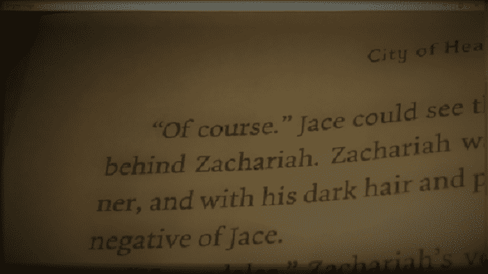
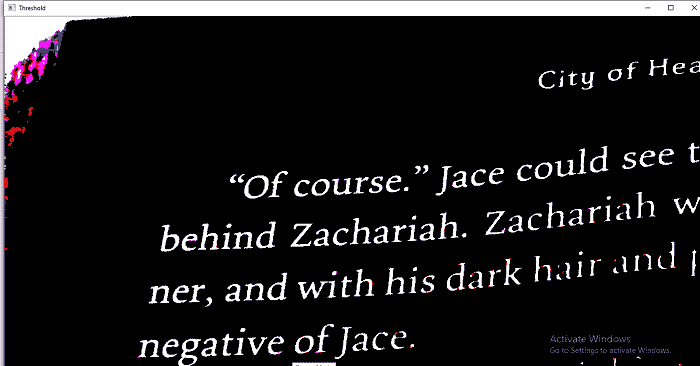

# 图像阈值

> 原文：<https://www.javatpoint.com/opencv-image-threshold>

阈值的基本概念是，更加简化可视化数据进行分析。当我们将图像转换为灰度时，我们必须记住灰度至少还有 255 个值。阈值会根据阈值将所有内容转换为白色或黑色。假设我们希望阈值为 125(255 个中的一个)，那么低于 125 的所有内容都将转换为 0 或黑色，高于 125 的所有内容都将转换为 255 或白色。语法如下:

```

retval,threshold = cv2.threshold(src, thresh, maxValue, cv2.THRESH_BINARY_INV)

```

### 参数-

**src:** 源图像，应该是灰度图像。

**thresh:** 用于对像素值进行分类。

**maxVal:** 它表示如果像素阈值。

OpenCV 提供了不同样式的阈值，用作函数的第四个参数。这些是:

*   cv2。THRESH_BINARY
*   cv2。THRESH_BINARY_INV
*   S7-1200 可编程控制器
*   cv2.THRESH_TOZERO
*   S7-1200 可编程控制器

让我们来看一个输入图像的例子



我们把上面的图像作为输入。我们描述阈值实际上是如何工作的。上图略显暗淡，有点难看。有些部分足够轻，可以阅读，而另一部分则需要更多的焦点才能正确阅读。

让我们考虑以下示例:

```

import cv2
img  = cv2.imread(r'C:\Users\DEVANSH SHARMA\book1.jpg',1)
retval, threshold = cv2.threshold(img, 62, 255, cv2.THRESH_BINARY)
cv2.imshow("Original Image", img)
cv2.imshow("Threshold",threshold)
cv2.waitKey(0)

```

**输出:**



上面的程序突出显示了图像。现在我们可以轻松地阅读图像的内容。

* * *