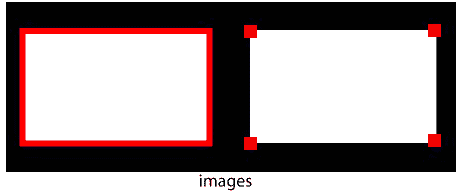

# OpenCV 轮廓

> 原文：<https://www.javatpoint.com/opencv-contours>

轮廓被定义为连接所有连续点(沿边界)的曲线，具有相同的颜色或强度。另一方面，我们在二值图像中寻找计数器，我们聚焦在二值图像中寻找边界。官方定义如下:

> 轮廓是形状分析和目标检测和识别的有用工具。

为了保持准确性，我们应该使用二值图像。首先，我们应用阈值或 canny 边缘检测。

在 OpenCV 中，在二值图像中寻找轮廓与从黑色背景中寻找白色物体是一样的。

OpenCV 提供 **findContours()** ，用于查找二值图像中的轮廓。语法如下:

```

cv2\. findContours (thes, cv2.RETR_TREE, cv.CHAIN_APPROX_SIMPLE)

```

**findContours ()** 接受三个参数第一个参数是源图像，第二个是轮廓检索模式，第三个是轮廓近似。

让我们考虑以下示例:

```

import numpy as np
import cv2 as cv
im = cv.imread(r'C:\Users\DEVANSH SHARMA\binary.png')
imgray = cv.cvtColor(im, cv.COLOR_BGR2GRAY)
ret, thresh = cv.threshold(imgray, 127, 255, 0)
contours, hierarchy = cv.findContours(thresh, cv.RETR_TREE, cv.CHAIN_APPROX_SIMPLE)

```

## 如何绘制等高线？

OpenCV 提供了 cv2.drawContours()函数，用于绘制轮廓。它也用于通过提供边界点来绘制任何形状。cv2 . draw 等高线()函数的语法如下:

要绘制图像中的所有轮廓:

```

cv2.drawCounter(img, contours,-1, (0,255,0),3)

```

要绘制单个轮廓，假设 3 <sup>rd</sup> 计数器

```

cnt = contours[3]
cv2.drawCounter(img,[cnt],0,(0,255,0),3)

```

第一个参数表示图像源，第二个参数表示应该作为 Python 列表传递的轮廓，第三个参数用作轮廓的索引，其他参数用于颜色粗细。

## 轮廓逼近法

这是 **cv2.findCounter()** 中的第三个参数。上面，我们已经描述了用相同的强度绘制形状的边界。它存储形状边界的 **(x，y)** 坐标。但是问题来了，它存储了所有的坐标吗？这是由轮廓近似方法指定的。

如果我们通过 **cv。CHAIN _ neuro _ NONE**，会存储所有的边界点。有时它不需要存储所有的点坐标，假设我们找到了一条直线的轮廓，在那里它不需要存储所有的轮廓点，它只需要两个端点来存储。所以对于这样的情况，我们用 **cv。CHAIN _ neuro _ NONE**，去除所有冗余点，压缩轮廓，从而节省内存。

**示例-1**



在上面的矩形图像中，第一幅图像显示了使用 **cv 的点。CHAIN _ neuro _ NONE(734)**第二张图为 **cv2。CHAIN _ neuro _ SIMPLE(仅 4 分)**。我们可以看到两幅图像之间的差异。

* * *