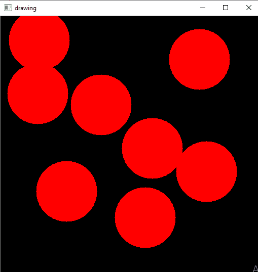
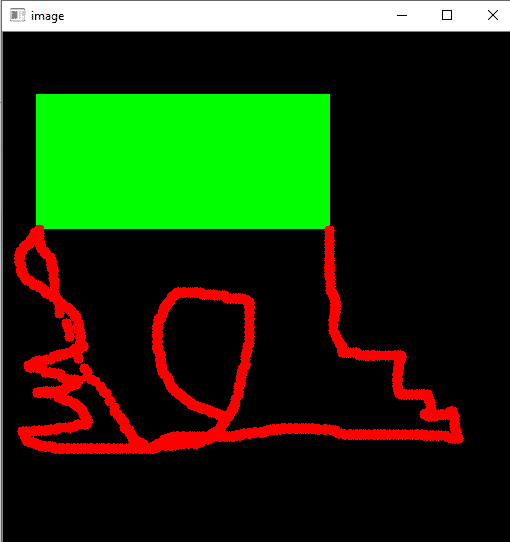

# OpenCV 鼠标事件

> 原文：<https://www.javatpoint.com/opencv-mouse-event>

## 鼠标作为画笔

OpenCV 提供了将鼠标用作画笔或绘图工具的工具。每当窗口屏幕上发生任何鼠标事件，它都可以绘制任何东西。鼠标事件可以是左键向下，左键向上，双击等。它给出了每个鼠标事件的坐标(x，y)。通过使用这些坐标，我们可以画出我们想要的任何东西。要获取所有可用事件的列表，请在终端中运行以下代码:

```

import cv2
mouse_events = [j for j in dir(cv2) if 'EVENT' in j]
print(mouse_events)

```

上面的代码将返回 OpenCV 支持的所有鼠标事件的列表。

**输出:**

```
['EVENT_FLAG_ALTKEY', 'EVENT_FLAG_CTRLKEY', 'EVENT_FLAG_LBUTTON', 'EVENT_FLAG_MBUTTON', 'EVENT_FLAG_RBUTTON', 'EVENT_FLAG_SHIFTKEY', 'EVENT_LBUTTONDBLCLK', 'EVENT_LBUTTONDOWN', 'EVENT_LBUTTONUP', 'EVENT_MBUTTONDBLCLK', 'EVENT_MBUTTONDOWN', 'EVENT_MBUTTONUP', 'EVENT_MOUSEHWHEEL', 'EVENT_MOUSEMOVE', 'EVENT_MOUSEWHEEL', 'EVENT_RBUTTONDBLCLK', 'EVENT_RBUTTONDOWN', 'EVENT_RBUTTONUP']

```

## 画圆

要在窗口屏幕上画一个圆，我们首先需要使用 **cv2.setMouseCallback()** 函数创建一个鼠标回调函数。它有一个特定的格式，在任何地方都保持不变。我们的鼠标回调函数是通过双击画一个圆来实现的。考虑以下程序:

```

import cv2
import numpy as np
# Creating mouse callback function
def draw_circle(event,x,y,flags,param):
    if(event == cv2.EVENT_LBUTTONDBLCLK):
        	cv2.circle(img,(x,y),100,(255,255, 0),-1)
# Creating a black image, a window and bind the function to window
img = np.zeros((512,512,3), np.uint8)
cv2.namedWindow('image')
cv2.setMouseCallback('image',draw_circle)
while(1):
    cv2.imshow('image',img)
    if cv2.waitKey(20) & 0xFF == 27:
        break
cv2.destroyAllWindows()

```



在上面的代码中，我们首先创建了一个发生鼠标事件的黑色窗口屏幕。当我们双击黑色窗口时，它会按照我们在回调 draw_circle()函数中定义的那样画一个圆。

### 绘制矩形和曲线

我们可以在窗纱上画任何形状。我们通过拖动鼠标来绘制矩形或圆形(取决于我们选择的模型)，就像我们在 Paint 应用程序中所做的那样。我们考虑这个例子，其中我们创建了一个回调函数，它有两个部分。第一部分是画矩形，另一部分是画圆。让我们看看给定的例子，以更具体的方式理解它:

```

import cv2
import numpy as np
draw = False # true if the mouse is pressed. Press m to shift into curve mode.
mode = True # if True, draw rectangle.
a,b = -1,-1
# mouse callback function
def draw_circle(event,x,y,flags,param):
    global a,b,draw,mode
    if(event == cv2.EVENT_LBUTTONDOWN):
        draw = True
        a,b = x,y
    elif (event == cv2.EVENT_MOUSEMOVE):
        if draw == True:
            if mode == True:
                cv2.rectangle(img,(a,b),(x,y),(0,255,0),-1)
            else:
                cv2.circle(img,(x,y),5,(0,0,255),-1)
    elif(event == cv2.EVENT_LBUTTONUP):
        draw = False
        if mode == True:
            cv2.rectangle(img,(a,b),(x,y),(0,255,0),-1)
        else:
            cv2.circle(img,(x,y),5,(0,0,255),-1)
# We bind the keyboard key m to toggle between rectangle and circle.
img = np.zeros((512,512,3), np.uint8)
cv2.namedWindow('image')
cv2.setMouseCallback('image',draw_circle)
while(1):
    cv2.imshow('image',img)
    k = cv2.waitKey(1) & 0xFF
    if k == ord('m'):
        mode = not mode
    elif(k == 27):
        break
cv2.destroyAllWindows()

```

**输出**



在上面的程序中，我们创建了两个鼠标回调函数。它与 OpenCV 窗口绑定。在 while 循环中，我们为键“m”设置了一个键盘绑定，以便在矩形和曲线之间移动。

* * *