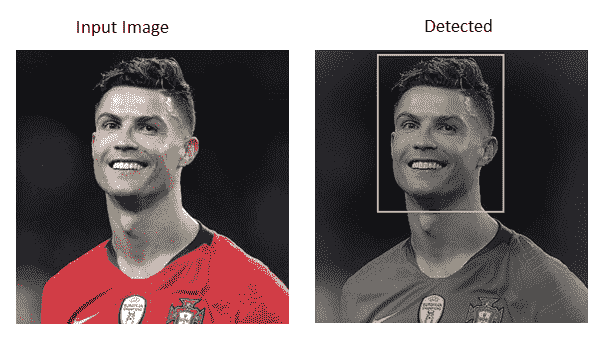
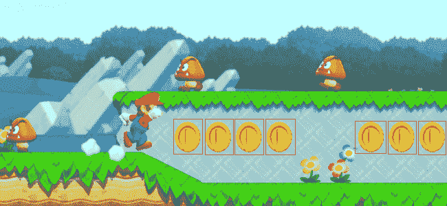

# OpenCV 模板匹配

> 原文：<https://www.javatpoint.com/opencv-template-matching>

模板匹配是一种用于在较大图像中找到模板图像位置的技术。OpenCV 为此提供了 **cv2.matchTemplates()** 功能。它只是在输入图像上滑动模板图像，并比较输入图像下的模板和补丁。

有各种方法可供比较；我们将在进一步的主题中讨论一些流行的方法。

它返回一个灰度图像，其中每个像素代表该像素与输入模板匹配的邻域数。

## OpenCV 中的模板匹配

模板匹配包括以下步骤:

**步骤- 1:** 取实际图像，转换成灰度图像。

**步骤 2:** 选择模板作为灰度图像。

**步骤- 3:** 找到精度等级匹配的位置。这是通过模板图像在实际图像上滑动来完成的。

**步骤- 4:** 当结果大于精度水平时，将该位置标记为检测到。

考虑以下示例:

```

import cv2 
import numpy as np 
# Reading the main image 
rgb_img = cv2.imread(r'C:\Users\DEVANSH SHARMA\rolando.jpg',1)
# It is need to be convert it to grayscale 
gray_img = cv2.cvtColor(rgb_img, cv2.COLOR_BGR2GRAY) 
# Reading the template image 
template = cv2.imread(r'C:\Users\DEVANSH SHARMA\ronaldo_face.jpg',0) 
# Store width in variable w and height in variable h of template
w, h = template.shape[:-1] 
# Now we perform match operations. 
res = cv2.matchTemplate(gray_img,template,cv2.TM_CCOEFF_NORMED) 
# Declare a threshold 
threshold = 0.8
# Store the coordinates of matched location in a numpy array 
loc = np.where(res >= threshold) 
# Draw the rectangle around the matched region. 
for pt in zip(*loc[::-1]): 
	cv2.rectangle(img_rgb, pt, (pt[0] + w, pt[1] + h), (0,255,255), 2) 
# Now display the final matched template image 
cv2.imshow('Detected',img_rgb)

```

**输出:**



## 多对象模板匹配

在上面的例子中，我们在图像中搜索只出现过一次的模板图像。假设特定对象在特定图像中出现多次。在这种情况下，我们将使用阈值，因为 **cv2.minMaxLoc()** 不会给出模板图像的所有位置。考虑下面的例子。

```

import cv2 
import numpy as np 
# Reading the main image 
img_rgb = cv2.imread(r'C:\Users\DEVANSH SHARMA\mario.png',1)
# It is need to be convert it to grayscale 
img_gray = cv2.cvtColor(img_rgb, cv2.COLOR_BGR2GRAY) 
# Read the template 
template = cv2.imread(r'C:\Users\DEVANSH SHARMA\coin1.png',0) 
# Store width in variable w and height in variable h of template
w, h = template.shape[:-1] 
# Now we perform match operations. 
res = cv2.matchTemplate(img_gray,template,cv2.TM_CCOEFF_NORMED) 
# Declare a threshold 
threshold = 0.8
# Store the coordinates of matched region in a numpy array 
loc = np.where( res >= threshold) 
# Draw a rectangle around the matched region. 
for pt in zip(*loc[::-1]): 
	cv2.rectangle(img_rgb, pt, (pt[0] + w, pt[1] + h), (0,255,255), 2) 
# Now display the final matched template image 
cv2.imshow('Detected',img_rgb)

```

**输出:**



在上面的程序中，我们以一个流行的超级马里奥游戏的图像作为主图像，硬币图像作为模板图像。硬币在主图像中出现多次。当它在图像中找到硬币时，它在硬币上画一个长方形。

## 模板匹配的局限性

模板匹配几乎没有限制，如下所示:

*   计算中到大图像的模式相关图像是一个耗时的过程。
*   图案出现必须保持参考模板图像的方向
*   模板匹配不适用于旋转或缩放版本的模板，因为形状/大小/剪切等发生了变化。

* * *