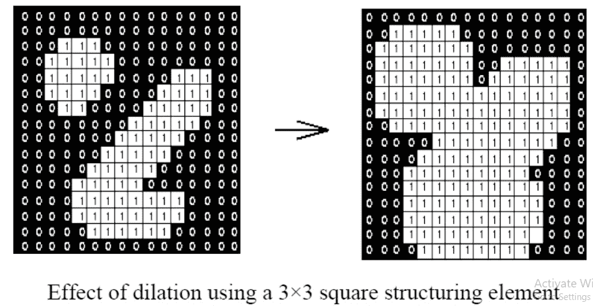
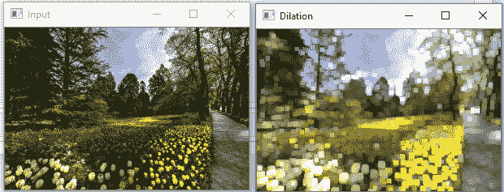
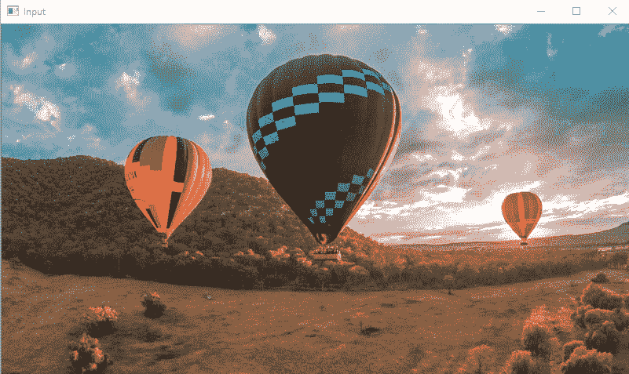
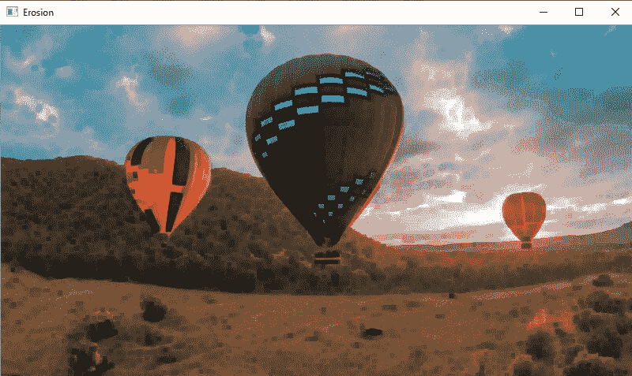

# 侵蚀和膨胀

> 原文：<https://www.javatpoint.com/opencv-erosion-and-dilation>

腐蚀和膨胀是**形态图像处理**操作。OpenCV 形态学图像处理是修改图像中几何结构的过程。在态射中，我们发现物体的形状、大小或结构。这两种操作都是为二值图像定义的，但是我们也可以在灰度图像上使用它们。这些以下列方式广泛使用:

*   消除噪音
*   识别图片中的强度凸起或孔洞。
*   独立元素的隔离和图像中不同元素的连接。

在本教程中，我们将简要解释侵蚀和膨胀。

## 扩张

膨胀是一种我们扩展图像的技术。它将图像中对象边界的像素数相加。结构元素控制着它。结构元素是由 1 和 0 组成的矩阵。

### 结构元素

结构化元素的大小和形状定义了应该从图像中的对象添加或移除多少像素。

它是一个由 1 和 0 组成的矩阵。图像的中心像素称为原点。

它包含带有一些内核(B)的图像 A，内核可以具有任何形状或大小，通常是正方形或圆形。这里内核 B 有一个定义好的锚点。它是内核的中心。

在下一步中，将内核重叠在图像上，以计算最大像素值。计算完成后，图像会被替换为中心的锚点。较亮的区域尺寸增加，使得图像尺寸增加。



例如，对象的大小在白色阴影中增加；另一方面，黑色阴影中的对象的大小会自动减小。

使用**cv2 . expansion()**方法进行扩张操作。语法如下:

```

cv2.dilate(src, dst, kernel)

```

**参数:****扩张()**函数接受以下参数:

*   **src** -代表输入图像。
*   **dst** -代表输出图像。
*   **内核** -代表内核。

考虑以下示例:

```

import cv2
import numpy as np
img = cv2.imread(r'C:\Users\DEVANSH SHARMA\jtp_flower.jpg, 0)

kernel = np.ones((5,5), np.uint8)
img_erosion = cv2.erode(img, kernel, iterations=1)
img_dilation = cv2.dilate(img, kernel, iterations=1)
cv2.imshow('Input', img)
cv2.imshow('Dilation', img_dilation)
cv2.waitKey(0)

```

**输出**



## 侵蚀

侵蚀和膨胀非常相似。不同的是，像素值在膨胀中计算的是最小值而不是最大值。图像在锚点下被替换为计算出的最小像素。不太可能膨胀，较暗阴影的区域增加。而它在白色阴影或较亮的一面减少。

OpenCV 提供 **cv2.erode()** 功能来执行此操作。该函数的语法如下:

```

cv2.erode(src, dst, kernel)

```

### 参数:

*   **src** -代表源(输入)图像。
*   **dst** -表示目的地(输出)图像。
*   **内核** -代表内核。

考虑以下示例:

```

import cv2
import numpy as np
img = cv2.imread(r'C:\Users\DEVANSH SHARMA\baloon.jpg', 1)
kernel = np.ones((5,5), np.uint8)
img_erosion = cv2.erode(img, kernel, iterations=1)
img_dilation = cv2.dilate(img, kernel, iterations=1)
cv2.imshow('Input', img)
cv2.imshow('Erosion', img_erosion)
cv2.waitKey(0)

```

**输出**

上述程序将给出以下输出。我们可以看到两幅图像之间的不同。



应用于输入图像的腐蚀操作。



* * *