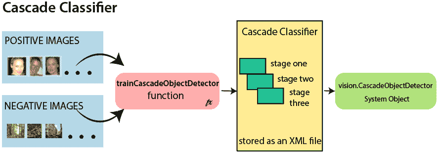
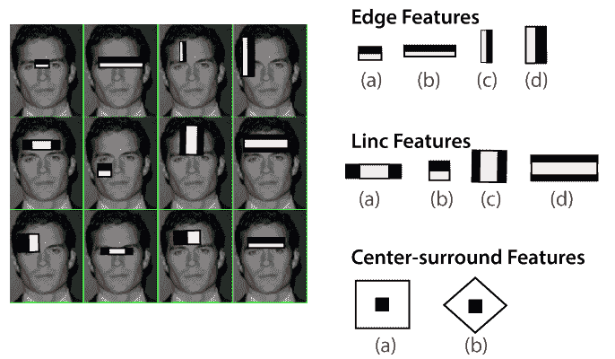
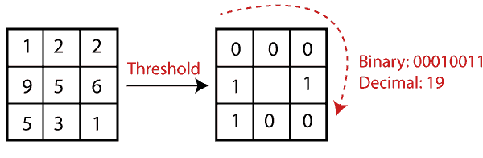
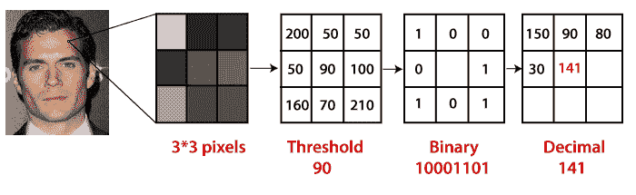
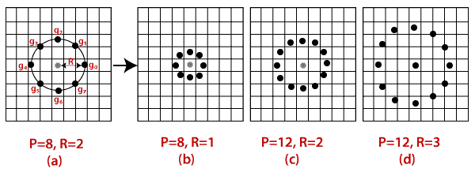
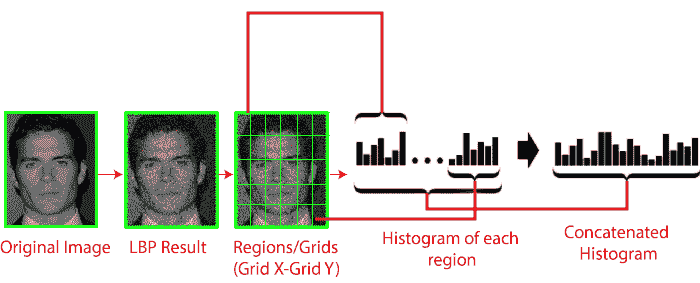
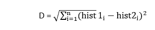

# 基于 OpenCV 的人脸识别和人脸检测

> 原文：<https://www.javatpoint.com/face-recognition-and-face-detection-using-opencv>

人脸识别是一种从数字图像或视频帧中识别或验证人脸的技术。一个人不用费多大力气就能迅速辨认出这些面孔。对我们来说，这是一项毫不费力的任务，但对计算机来说，这是一项艰巨的任务。存在各种复杂性，例如低分辨率、遮挡、照明变化等。这些因素极大地影响了计算机更有效地识别人脸的准确性。首先要了解人脸检测和人脸识别的区别。

**人脸检测:**人脸检测一般被认为是找到图像中的人脸(位置和大小)，并可能提取出来供人脸检测算法使用。

**人脸识别:**人脸识别算法用于寻找图像中唯一描述的特征。面部图像已经被提取、裁剪、调整大小，并且通常被转换为灰度。

人脸检测和人脸识别有多种算法。这里我们将学习使用 HAAR 级联算法的人脸检测。

## 哈尔级联算法的基本概念

HAAR 级联是一种机器学习方法，其中级联函数是从大量正负图像中训练出来的。正面图像是那些由脸组成的图像，而负面图像是没有脸的。在人脸检测中，图像特征被视为从图片中提取的数字信息，可以区分不同的图像。

我们将算法的每个特征应用于所有训练图像。在开始时，每个图像都被赋予相同的权重。它找到了一个最佳阈值，可以将人脸分为正面和负面。可能存在错误和错误分类。我们选择具有最小错误率的特征，这意味着这些是对人脸和非人脸图像进行最佳分类的特征。

每个内核所有可能的大小和位置都被用来计算大量的特征。

## 开放计算机视觉中的哈尔级联检测

OpenCV 提供了训练器和检测器。我们可以使用 OpenCV 为任何物体训练分类器，比如汽车、飞机和建筑物。级联图像分类器主要有两种状态，一是训练，二是检测。

OpenCV 提供两个应用来训练级联分类器**OpenCV _ haarttraining**和 **opencv_traincascade** 。这两个应用程序以不同的文件格式存储分类器。

为了训练，我们需要一组样本。有两种类型的样本:

*   **阴性样本:**与非物像有关。
*   **阳性样本:**是与检测对象相关的图像。

必须手动准备一组阴性样本，而阳性样本的收集是使用 **opencv_createsamples** 实用程序创建的。

### 阴性样本

阴性样本取自任意图像。负样本被添加到文本文件中。文件的每一行都包含负样本的图像文件名(相对于描述文件的目录)。该文件必须手动创建。定义的图像可能大小不同。

### 阳性样本

阳性样本由 opencv_createsamples 实用程序创建。这些示例可以从带有对象的单个图像中创建，也可以从早期的集合中创建。重要的是要记住，我们需要一个正样本的大数据集，然后才能将它提供给所提到的实用程序，因为它只应用透视变换。

这里我们将讨论检测。OpenCV 已经包含了各种预先训练好的人脸、眼睛、微笑等分类器。这些 XML 文件存储在**open cv/data/haarcscades/**文件夹中。让我们了解以下步骤:

**第一步**

首先，我们需要加载必要的 XML 分类器，并以灰度模式加载输入图像(或视频)。

**第 2 步**

将图像转换为灰度后，我们可以进行图像处理，如果需要，可以调整图像的大小、裁剪、模糊和锐化。下一步是图像分割；识别单个图像中的多个对象，因此分类器可以快速检测图片中的对象和人脸。

**第三步**

haar-Like 特征算法用于寻找人脸在帧或图像中的位置。所有的人脸都有一些共同的人脸通用属性，比如眼睛区域比其邻居的像素暗，鼻子区域比眼睛区域亮。

**第 4 步**

在这一步中，我们借助边缘检测、直线检测和中心检测，从图像中提取特征。然后提供 x，y，w，h 的坐标，在图片中做一个长方形的方框来显示人脸的位置。它可以在检测人脸的所需区域制作一个矩形框。

## 基于 OpenCV 的人脸识别

人脸识别对人类来说是一项简单的任务。成功的人脸识别往往能有效识别内部特征(眼睛、鼻子、嘴巴)或外部特征(头、脸、发际线)。问题是人脑是如何编码的？

**大卫·胡贝尔**和**托尔斯滕·威塞尔**表明，我们的大脑有专门的神经细胞对场景的独特局部特征做出反应，如线条、边缘角度或运动。我们的大脑将不同的信息来源组合成有用的模式；我们不认为视觉是分散的。如果我们用一个简单的词来定义人脸识别，“自动人脸识别就是从图像中提取出那些有意义的特征，并将其转化为有用的表示，然后对其进行一些分类”。

人脸识别的基本思想是基于人脸的几何特征。这是一种可行的、最直观的人脸识别方法。第一个自动人脸识别系统被描述在眼睛、耳朵、鼻子的位置。这些定位点被称为特征向量(点之间的距离)。

人脸识别是通过计算探针特征向量与参考图像之间的**欧氏**距离来实现的。这种方法就其本质而言在照明变化方面是有效的，但它有一个相当大的缺点。制造商的正确注册非常困难。

人脸识别系统基本上可以在两种模式下运行:

*   **面部图像的认证或验证-**

它将输入的面部图像与用户相关的面部图像进行比较，这是认证所必需的。这是一个 1x1 的比较。

*   **识别或面部识别**

它基本上比较来自数据集的输入面部图像，以找到匹配该输入面部的用户。这是 1xN 的比较。

有各种类型的人脸识别算法，例如:

*   **自脸(1991)**
*   **局部二值模式直方图(LBPH) (1996)**
*   **Fisherfaces (1997)**
*   **尺度不变特征变换(SIFT) (1999)**
*   **加速鲁棒特征(SURF) (2006)**

每种算法都遵循不同的方法来提取图像信息并执行与输入图像的匹配。这里我们将讨论局部二值模式直方图算法，它是最古老和流行的算法之一。

## 枸杞多糖的介绍

局部二值模式直方图算法是一种简单的方法，它将图像的像素标记为每个像素的邻域阈值。换句话说，LBPH 通过将每个像素与其邻居进行比较来总结图像中的局部结构，并将结果转换为二进制数。它最早定义于 1994 年(LBP)，从那时起，它被发现是一种强大的纹理分类算法。

该算法通常集中于从图像中提取局部特征。基本思想是不要把整个图像看成一个高维向量；它只关注对象的局部特征。

在上图中，以一个像素为中心，对其相邻像素进行阈值处理。如果中心像素的强度大于-等于它的邻居，那么用 1 表示，如果不是，那么用 0 表示。

让我们了解算法的步骤:

**1。选择参数:**LBPH 接受四个参数:

*   **半径:**表示围绕中心像素的半径。通常设置为 1。它用于构建循环局部二进制模式。
*   **邻居:**构建圆形二元模式的样本点数。
*   **网格 X:** 水平方向的单元格数。代表的单元越多，网格越细，得到的特征向量的维数越高。
*   **网格 Y:** 垂直方向的单元数。代表的单元越多，网格越细，得到的特征向量的维数越高。

#### 注:以上参数略有混淆。在接下来的步骤中会更清楚。

**2。训练算法:**第一步是训练算法。它需要一个数据集，其中包含我们想要识别的人的面部图像。每个图像应提供一个唯一的标识(可能是一个数字或人的名字)。然后，该算法使用这些信息来识别输入图像并给出输出。特定人的图像必须具有相同的标识。让我们在下一步了解 LBPH 计算。

**3。使用 LBP 操作:**在这一步中，LBP 计算用于创建中间图像，该中间图像通过突出面部特征以特定的方式描述原始图像。参数**半径**和**邻居**用于滑动窗口的概念。

为了更具体地理解，让我们将其分成几个小步骤:

*   假设输入的面部图像是灰度。
*   我们可以得到这个图像的一部分，作为一个 3x3 像素的窗口。
*   我们可以使用包含每个像素强度的 3×3 矩阵(0-255)。
*   然后，我们需要以矩阵的中心值作为阈值。
*   该值将用于定义 8 个邻居的新值。
*   对于中心值(阈值)的每个邻居，我们设置一个新的二进制值。值 1 设置为等于或高于阈值，值 0 设置为低于阈值。
*   现在矩阵将只由二进制值组成(跳过中心值)。我们需要把每个二进制值从矩阵的每个位置一行一行地变成新的二进制值(10001101)。还有其他连接二进制值的方法(顺时针方向)，但最终结果是一样的。
*   我们将这个二进制值转换为十进制值，并将其设置为矩阵的中心值，即原始图像的一个像素。
*   在完成 LBP 过程之后，我们得到新的图像，它代表了原始图像的更好的特征。

**4。从图像中提取直方图:**图像在最后一步生成，我们可以使用**网格 X** 和**网格 Y** 参数将图像分成多个网格，让我们考虑以下图像:

*   我们有一个灰度图像；每个直方图(来自每个网格)将只包含 256 个代表每个像素强度出现的位置。
*   需要通过连接每个直方图来创建一个新的更大的直方图。

**5。执行人脸识别:**现在，算法已经训练好了。提取的直方图用于表示训练数据集中的每个图像。对于新图像，我们再次执行步骤并创建新的直方图。为了找到与给定图像匹配的图像，我们只需要匹配两个直方图，并返回直方图最接近的图像。

*   比较直方图的方法有多种(计算两个直方图之间的距离)，例如:**欧氏距离、卡方、绝对值、**等。我们可以根据以下公式使用欧几里得距离:

*   该算法将返回 ID 作为具有最接近直方图的图像的输出。该算法还应返回可称为**置信度**测量的计算距离。如果置信度低于阈值，则表示算法已成功识别人脸。

我们已经讨论了人脸检测和人脸识别。haar 类级联算法用于人脸检测。人脸识别的算法有很多种，其中 LBPH 是一种简单而流行的算法。它通常关注图像中的局部特征。

* * *