# Python 绘图库

> 哎哎哎:# t0]https://www . javatppoint . com/matplot lib


人类的思维更适合数据的视觉表现，而不是文本数据。当事物被可视化时，我们可以很容易地理解它们。最好通过图来表示数据，这样我们可以更有效地分析数据，并根据数据分析做出具体的决策。在学习 matplotlib 之前，我们需要了解数据可视化以及为什么数据可视化很重要。

## 数据可视化


图形为探索数据提供了一种极好的方法，这对呈现结果至关重要。数据可视化是一个新名词。它表达的思想不仅仅是以图形形式(而不是使用文本形式)表示数据。

这在发现和了解数据集时非常有用，并且有助于对模式、损坏数据、异常值等进行分类。只要掌握一点领域知识，数据可视化就可以用来表达和演示图表中的关键关系。静态确实关注数据的定量描述和估计。它为获得定性理解提供了一套重要的工具。

有五个关键图用于数据可视化。

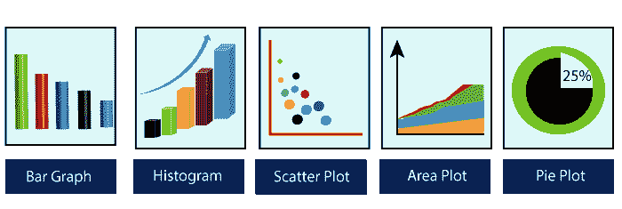

有五个阶段对组织做出决策至关重要:

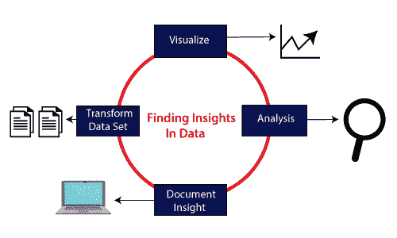

*   **可视化:**我们分析原始数据，这意味着它使复杂的数据更易于访问、理解和使用。表格数据表示用于用户查找特定测量值的地方，而几种类型的图表用于显示一个或多个变量的数据模式或关系。
*   **分析:**数据分析定义为对数据进行清理、检查、转换和建模，以获得有用的信息。每当我们为事业或日常生活做决定时，都是凭过去的经验。**选择一个特定的决定会发生什么**，无非是分析我们的过去。这在未来可能会受到影响，因此对于任何企业或组织来说，正确的分析对于更好的决策都是必要的。
*   **文档洞察:**文档洞察是将有用的数据或信息以标准格式组织在文档中的过程。
*   **变换数据集:**利用标准数据更有效地做出决策。

## 为什么需要数据可视化？


数据可视化可以执行以下任务:

*   它确定了需要改进和关注的领域。
*   它澄清了这些因素。
*   它有助于了解将哪种产品放在哪里。
*   预测销量。

## 数据可视化的好处

以下是数据可视化的一些好处，有助于组织或企业做出有效的决策:

**1。建立吸收信息的方式**

数据可视化允许用户接收大量关于运营和业务状况的信息。它帮助决策者看到多维数据集之间的关系。它提供了通过使用地图、发热图和其他丰富的图形表示来分析数据的新方法。

可视化数据发现更有可能找到组织需要的信息，并最终比其他竞争公司更有效率。

**2。可视化业务中的关系和模式**

数据可视化的关键优势在于，在当今高度竞争的商业环境中，找到运营状况和业务绩效之间的相关性至关重要。

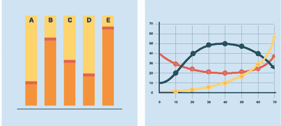

建立这种关联的能力使管理人员能够识别问题的根本原因，并迅速采取行动解决问题。

假设一家食品公司正在查看他们的月度客户数据，数据以条形图呈现，显示该公司在该特定地区的得分在前几个月下降了 5 分；数据显示，这一领域的客户满意度存在问题。

**3。更快地对新兴趋势采取行动**

数据可视化使决策者能够更有效地掌握跨多个数据集的客户行为和市场状况的变化。

了解客户情绪和其他数据揭示了一个新的机会，公司可以先于竞争对手抓住新的商业机会。

**4。基于地质的可视化**

由于许多网站提供网络服务，吸引了访问者的兴趣，地理空间可视化应运而生。这些类型的网站需要利用特定于位置的信息，这些信息已经存在于客户详细信息中。

**Matplotlib** 是 Python 库，定义为建立在 Numpy 数组上的多平台数据可视化库。它可以用于 python 脚本、shell、web 应用程序和其他图形用户界面工具包。

约翰·d·亨特最初在 2002 年的《T2》中构思了马特洛特利布。它有一个活跃的开发社区，并以 **BSD 风格的许可证**分发。其首个版本于 2003 年发布，最新的**版本 3.1.1** 于 2019 年 7 月 1 日**发布**。

到 2007 年 6 月 23 日，Matplotlib 2.0.x 支持 Python 版本 2.7 到 3.6。Python3 支持始于 Matplotlib 1.2。Matplotlib 1.4 是最后一个支持 Python 2.6 的版本。

有多种工具包可用于增强 **matplotlib** 的功能。这些工具中的一些是单独下载的，其他的可以用 matplotlib 源代码转移，但是有外部依赖性。

*   **Bashmap:** 这是一个地图绘制工具包，包含多个地图投影、海岸线和政治边界。
*   **Cartopy:** 它是一个由面向对象的地图投影定义，以及任意点、线、面和图像变换能力组成的映射库。
*   **Excel 工具:** Matplotlib 为实用程序提供了与微软 Excel 交换数据的工具。
*   **Mplot3d:** 用于 3d 地块。
*   **Natgrid:** 是 Natgrid 库的一个接口，用于空间数据的不规则网格化。

## Matplotlib 体系结构

matplotlib 的架构中有三个不同的层，如下所示:

*   后端层
*   艺术家层
*   脚本层

**后端层**

后端层是图的底层，由绘图所需的各种功能的实现组成。从后端层**图形画布**(将在其上绘制图形的表面)**渲染器**(负责在表面上绘制的类)和**事件**(它处理鼠标和键盘事件)有三个基本类。

**艺术家层**

艺术家层是架构中的第二层。它负责各种绘图功能，如 axis，它协调如何在图形画布上使用渲染器。

**脚本层**

脚本层是我们大部分代码运行的最顶层。脚本层中的方法几乎自动处理其他层，我们只需要关心当前状态(图&子图)。

## Matplotlib 的一般概念

Matplotlib 图可分为以下几个部分:

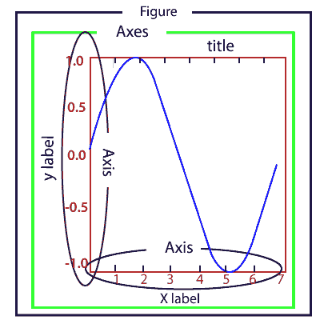

**图形:**是一个可以包含一个或多个轴(图)的整体图形。我们可以把一个人物想象成一个容纳情节的画布。

**轴:**一个图形可以包含多个轴。它由两个或三个(在 3D 的情况下)轴对象组成。每个轴由一个标题、一个 x 标签和一个 y 标签组成。

**轴:**轴是线状物体的数量，负责生成图形界限。

**艺术家:**艺术家是我们在图形上看到的所有东西，如文本对象、线 2D 对象和收藏对象。大多数艺术家都被绑在斧头上。

## 安装 Matplotlib

在开始使用 Matplotlib 或其绘图功能之前，需要先安装它。matplotlib 的安装取决于计算机上安装的发行版。这些安装方法如下:

**使用蟒蛇分布的蟒蛇**

安装 Matplotlib 最简单的方法是下载 Python 的 Anaconda 发行版。Matplotlib 预装在 anaconda 发行版中，无需进一步安装。

*   访问蟒蛇的官方网站，点击下载按钮


*   根据您的 Python 解释器配置选择下载。


**使用 Anaconda 提示符安装 Matplotlib】**

通过键入命令，可以使用 Anaconda 提示符安装 Matplotlib。要安装 matplotlib，请打开 Anaconda 提示符并键入以下命令:

```

conda install matplotlib

```


**用画中画安装 Matplotlib】**

python 包管理器 pip 也用于安装 matplotlib。打开命令提示符窗口，键入以下命令:

```

pip install matplotlib

```

## 验证安装

要验证 matplotlib 是否安装正确，请键入以下命令，包括调用。__ 版本 _ _ 在终端。

```

import matplotlib
matplotlib.__version__
'3.1.1'

```

## 绘制图形的基本示例

下面是生成简单图形的基本示例；该计划如下:

```

from matplotlib import pyplot as plt
#ploting our canvas
plt.plot([1,2,3],[4,5,1])
#display the graph
plt.show()

```

**输出:**

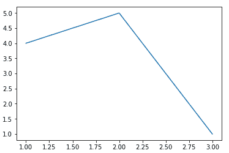

使用 Python matplotlib 绘制一个简单的图形只需要三行代码。我们可以给我们的图表添加标题和标签，它们是由 Python matplotlib 库创建的，以使它更有意义。例子如下:

```

from matplotlib import pyplot as plt

x = [5, 2, 7]
y = [1, 10, 4]
plt.plot(x, y)
plt.title('Line graph')
plt.ylabel('Y axis')
plt.xlabel('X axis')
plt.show()

```

**输出:**

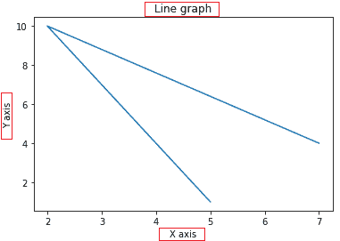

从前面的图表中可以更好地理解这个图表。

## 使用 Pyplot

**matplotlib.pyplot** 是集合命令风格的函数，让 matplotlib 感觉像是在用 MATLAB 工作。pyplot 函数用于对图形进行一些更改，例如创建图形、在图形中创建绘图区域、在绘图区域中绘制一些线条、装饰包括标签在内的图形等。

当我们想要快速绘制一些东西而不实例化任何图形或轴时，使用它是很好的。

在使用 **matplotlib.pyplot** 时，一些状态存储在函数调用中，以便它跟踪当前图形和绘图区域等内容，并且这些绘图函数指向当前轴。

pyplot 模块提供了**绘图()**功能，常用于绘制图形。让我们看一下这个简单的例子:

```

from matplotlib import pyplot as plt
plt.plot([1,2,3,4,5])
plt.ylabel("y axis")
plt.xlabel('x axis')
plt.show()

```

**输出:**

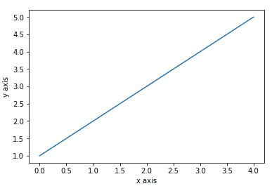

在上面的程序中，它绘制了 x 轴范围为 0-4，y 轴范围为 1-5 的图形。如果我们向绘图()提供一个列表，matplotlib 会假设它是一个 y 值序列，并自动生成 x 值。因为我们知道 python 索引从 0 开始，所以默认 x 向量的长度与 y 相同，但从 0 开始。因此 x 数据是[0，1，2，3，4]。

我们可以将任意数量的参数传递给图()。例如，要绘制 x 与 y 的关系图，我们可以通过以下方式进行:

```

from matplotlib import pyplot as plt
plt.plot([1,2,3,4,5],[1,4,9,16,25])
plt.ylabel("y axis")
plt.xlabel('x axis')
plt.show()

```

**输出:**

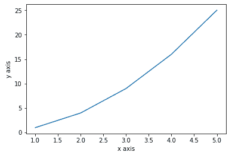

**格式化绘图的样式**

还有一个可选的第三个参数，它是一个格式字符串，指示绘图的颜色和线型。默认格式字符串是“ **b-** ”，这是您可以在上面绘制的图表中观察到的纯蓝色。让我们考虑下面的例子，我们用红色圆圈绘制图表。

```

from matplotlib import pyplot as plt
plt.plot([1, 2, 3, 4,5], [1, 4, 9, 16,25], 'ro')
plt.axis([0, 6, 0, 20])
plt.show()

```

**输出:**

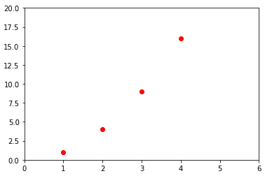

**示例格式字符串**

| **‘b’** | 用于默认形状的蓝色标记。 |
| **【ro】** | 红色圆圈 |
| **'-g'** | 绿色实线 |
| **' - '** | 具有默认颜色的虚线 |
| **'^k:'** | 由虚线连接的黑色三角形向上标记 |

matplotlib 支持以下颜色缩写:

| 性格；角色；字母 | 颜色 |
| **“b”蓝色** |
| **‘g’** | 格林（姓氏）；绿色的 |
| **'r'** | 红色 |
| **‘c’** | 蓝绿色 |
| **'m'** | 品红 |
| **‘y’** | 黄色 |
| **'k'** | 黑色 |
| **'w'** | 白色的 |

### 用分类变量绘图

Matplotlib 允许我们将分类变量直接传递给许多绘图函数:考虑下面的例子

```

from matplotlib import pyplot
names = ['Abhishek', 'Himanshu', 'Devansh']
marks= [87,50,98]

plt.figure(figsize=(9,3))

plt.subplot(131)
plt.bar(names, marks)
plt.subplot(132)
plt.scatter(names, marks)
plt.subplot(133)
plt.plot(names, marks)
plt.suptitle('Categorical Plotting')
plt.show()

```

**输出:**

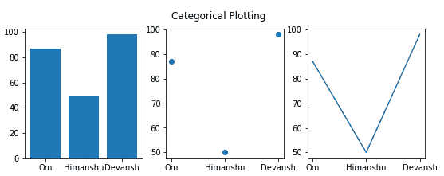

在上面的程序中，我们使用**子图()**函数绘制了分类图。让我们来看看子剧情()函数。

## 什么是支线剧情()

Matplotlib **子图()**功能定义为在一个图形中绘制两个或多个图。我们可以使用这种方法来分离两个绘制在同一轴上的图形。Matplotlib 支持所有类型的子场景，包括 2x1 垂直、2x1 水平或 2x2 网格。

它接受三个参数:它们是**nrow、ncols 和 index** 。它表示行数、列数和索引。

子场景()函数可以通过以下方式调用:

```

subplot(nrows,ncols,index,**kwargs)
subplot(pos,**kwargs)	
subplot(ax)

```

**参数:**

*   * args:

三个独立的整数或三位数的整数描述子情节的位置。如果这三个整数按顺序为 **nrows、ncol 和 index** ，子图将采用带有 **nrows 行**和 **ncol 列**的网格上的索引位置。

参数 **pos** 为三位数整数，其中第一位表示行数，第二位表示列数，第三位表示子图的索引。**例如**支线剧情(1、3、2)与支线剧情(132)相同。

#### 注意:传递的整数必须小于 10。

*   ****kwargs**

subplot()函数也接受返回的 axes 基类的关键字参数。

考虑以下示例:

## 创建不同类型的图形

### 1.线图

折线图是将信息显示为一系列线条的图表之一。该图由 plot()函数绘制。线图绘制简单；让我们考虑以下示例:

```

from matplotlib import pyplot as plt

x = [4,8,9]
y = [10,12,15]

plt.plot(x,y)

plt.title("Line graph")
plt.ylabel('Y axis')
plt.xlabel('X axis')
plt.show()

```

**输出:**

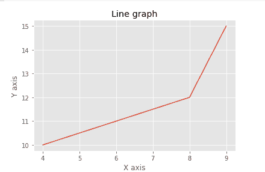

我们可以通过导入样式模块来定制图形。样式模块将内置于 matplotlib 安装中。它包含了各种功能，让剧情更加吸引人。在下面的程序中，我们使用样式模块:

```

from matplotlib import pyplot as plt
from matplotlib import style

style.use('ggplot')
x = [16, 8, 10]
y = [8, 16, 6]
x2 = [8, 15, 11]
y2 = [6, 15, 7]
plt.plot(x, y, 'r', label='line one', linewidth=5)
plt.plot(x2, y2, 'm', label='line two', linewidth=5)
plt.title('Epic Info')
fig = plt.figure()
plt.ylabel('Y axis')
plt.xlabel('X axis')
plt.legend()
plt.grid(True, color='k')
plt.show()

```

**输出:**

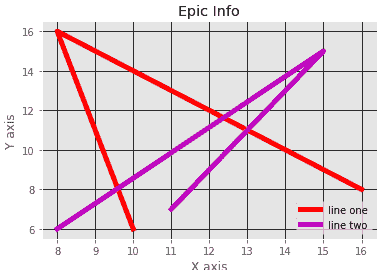

在 Matplotlib 中，图形(plt 类的一个实例。图)可以被认为是一个由表示轴、图形、文本和标签的所有对象组成的容器。

**示例-3**

```

import numpy as np
import matplotlib.pyplot as plt

fig = plt.figure()
ax = plt.axes()

x = np.linspace(0, 10, 1000)
ax.plot(x, np.sin(x))

```

**输出:**

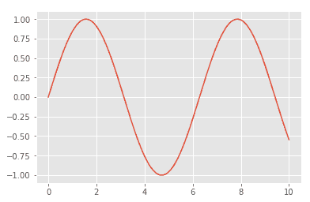

matplotlib 提供 **fill_between()** 功能，用于根据用户定义的逻辑填充线条周围的区域。

### 示例-4

```

import numpy as np
import matplotlib.pyplot as plt

fig = plt.figure()
ax = plt.axes()

x = np.linspace(0, 10, 1000)
ax.plot(x, np.sin(x))

import matplotlib.pyplot as plt
import numpy as np

x = np.arange(0.0, 2, 0.01)
y1 = np.sin(2 * np.pi * x)
y2 = 1.2 * np.sin(4 * np.pi * x)
fig, ax = plt.subplots(1, sharex=True)
ax.plot(x, y1, x, y2, color='black')
ax.fill_between(x, y1, y2, where=y2 >= y1, facecolor='blue', interpolate=True)
ax.fill_between(x, y1, y2, where=y2 <= y1, facecolor='red', interpolate=True)
ax.set_title('fill between where')

```

**输出:**

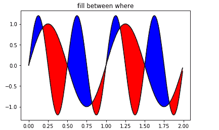

### 2.条形图

条形图是最常见的图表类型之一，用于显示与分类变量相关的数据。Matplotlib 提供了一个**条()**来制作条形图，该条形图接受诸如:分类变量、它们的值和颜色等参数。

```

from matplotlib import pyplot as plt
players = ['Virat','Rohit','Shikhar','Hardik']
runs = [51,87,45,67]
plt.bar(players,runs,color = 'green')
plt.title('Score Card')
plt.xlabel('Players')
plt.ylabel('Runs')
plt.show()

```

**输出:**

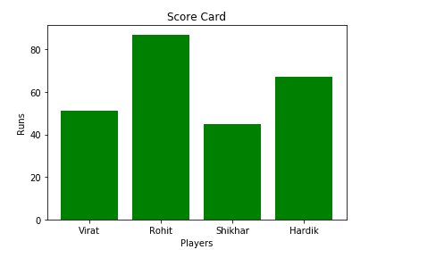

另一个函数 **barh()** 用于制作横条图。它接受 **xerr** 或 **yerr** 作为参数(在垂直图的情况下)来描述我们数据中的差异，如下所示:

```

from matplotlib import pyplot as plt
players = ['Virat','Rohit','Shikhar','Hardik']
runs = [51,87,45,67]
plt.barh(players,runs, color = 'green')
plt.title('Score Card')
plt.xlabel('Players')
plt.ylabel('Runs')
plt.show()

```

**输出:**

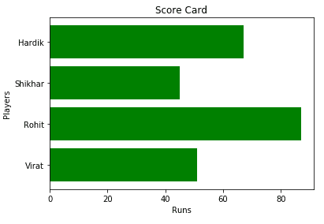

让我们看看另一个使用 **style()** 函数的例子:

```

from matplotlib import pyplot as plt
from matplotlib import style

style.use('ggplot')

x = [5,8,10]
y = [12,16,6]

x2 = [6,9,11]
y2 = [7,15,7]

plt.bar(x, y, color = 'y', align='center')
plt.bar(x2, y2, color='c', align='center')

plt.title('Information')

plt.ylabel('Y axis')
plt.xlabel('X axis')

```

**输出:**

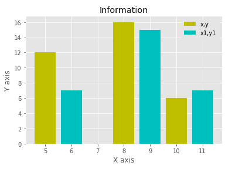

与垂直堆叠类似，条形图通过使用底部参数和定义条形图结合在一起，下面我们要堆叠条形图及其值。

```

from matplotlib import pyplot as plt
import numpy as np

countries = ['USA', 'India', 'China', 'Russia', 'Germany']
bronzes = np.array([38, 17, 26, 19, 15])
silvers = np.array([37, 23, 18, 18, 10])
golds = np.array([46, 27, 26, 19, 17])
ind = [x for x, _ in enumerate(countries)]

plt.bar(ind, golds, width=0.5, label='golds', color='gold', bottom=silvers+bronzes)
plt.bar(ind, silvers, width=0.5, label='silvers', color='silver', bottom=bronzes)
plt.bar(ind, bronzes, width=0.5, label='bronzes', color='#CD853F')

plt.xticks(ind, countries)
plt.ylabel("Medals")
plt.xlabel("Countries")
plt.legend(loc="upper right")
plt.title("2019 Olympics Top Scorers")

```

**输出:**


### 3.圆形分格统计图表

饼图是一个圆形图，按饼图的一段或多段进行细分。它通常用于表示百分比或比例数据，其中每个饼图切片代表一个特定类别。让我们看看下面的例子:

```

from matplotlib import pyplot as plt

# Pie chart, where the slices will be ordered and plotted counter-clockwise:
Players = 'Rohit', 'Virat', 'Shikhar', 'Yuvraj'
Runs = [45, 30, 15, 10]
explode = (0.1, 0, 0, 0)  # it "explode" the 1st slice 

fig1, ax1 = plt.subplots()
ax1.pie(Runs, explode=explode, labels=Players, autopct='%1.1f%%',
        shadow=True, startangle=90)
ax1.axis('equal')  # Equal aspect ratio ensures that pie is drawn as a circle.

plt.show()

```

**输出:**

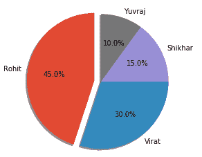

### 4.柱状图

首先，我们需要了解条形图和直方图的区别。直方图用于分布，而条形图用于比较不同的实体。直方图是一种条形图，显示了多个值与一组值范围相比的频率。

**例如**我们获取不同年龄组的人的数据，并绘制相对于箱的直方图。现在，bin 表示被分成一系列区间的值的范围。垃圾箱通常创建为相同的大小。

```

from matplotlib import pyplot as plt
from matplotlib import pyplot as plt
population_age = [21,53,60,49,25,27,30,42,40,1,2,102,95,8,15,105,70,65,55,70,75,60,52,44,43,42,45]
bins = [0,10,20,30,40,50,60,70,80,90,100]
plt.hist(population_age, bins, histtype='bar', rwidth=0.8)
plt.xlabel('age groups')
plt.ylabel('Number of people')
plt.title('Histogram')
plt.show()

```

**输出:**

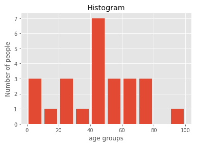

让我们考虑另一个绘制直方图的例子:

```

from matplotlib import pyplot as plt
# Importing Numpy Library
import numpy as np
plt.style.use('fivethirtyeight')

mu = 50
sigma = 7
x = np.random.normal(mu, sigma, size=200)
fig, ax = plt.subplots()

ax.hist(x, 20)
ax.set_title('Historgram')
ax.set_xlabel('bin range')
ax.set_ylabel('frequency')

fig.tight_layout()
plt.show()

```

**输出:**

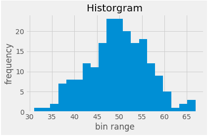

### 5.散点图

当我们需要定义一个变量受另一个变量影响的程度时，散点图主要用于比较变量。数据显示为点的集合。每个点都有一个变量的值，它定义了水平轴上的位置，而另一个变量的值代表了垂直轴上的位置。

让我们考虑下面这个简单的例子:

**示例-1:**

```

from matplotlib import pyplot as plt
from matplotlib import style
style.use('ggplot')

x = [5,7,10]
y = [18,10,6]

x2 = [6,9,11]
y2 = [7,14,17]

plt.scatter(x, y)

plt.scatter(x2, y2, color='g')

plt.title('Epic Info')
plt.ylabel('Y axis')
plt.xlabel('X axis')

plt.show()

```

**输出:**

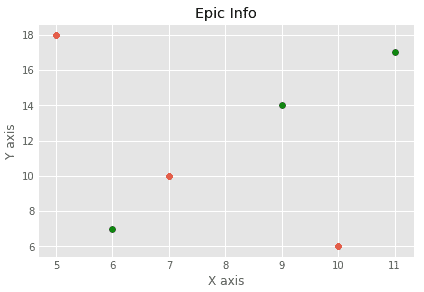

**示例-2**

```

import matplotlib.pyplot as plt
x = [2, 2.5, 3, 3.5, 4.5, 4.7, 5.0]
y = [7.5, 8, 8.5, 9, 9.5, 10, 10.5]

x1 = [9, 8.5, 9, 9.5, 10, 10.5, 12]
y1 = [3, 3.5, 4.7, 4, 4.5, 5, 5.2]
plt.scatter(x, y, label='high income low saving', color='g')
plt.scatter(x1, y1, label='low income high savings', color='r')
plt.xlabel('saving*100')
plt.ylabel('income*1000')
plt.title('Scatter Plot')
plt.legend()
plt.show()

```

**输出:**

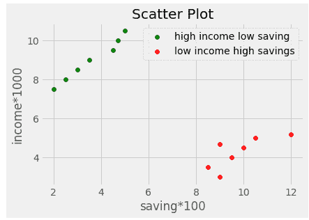

### 6.三维曲线图

Matplotlib 最初是用二维图开发的。它的 1.0 版本在二维显示的基础上构建了一些三维绘图工具，结果是一套方便的三维数据可视化工具。

通过导入 **mplot3d** 工具包可以创建三维图，包括主 Matplotlib 安装:

```

from mpl_toolkits import mplot3d

```

在程序中导入该模块时，可以通过将关键字 **projection='3d'** 传递给任意一个法向轴创建例程来创建三维轴:

让我们看看简单的 3D 图

**示例-1:**

```

from mpltoolkits import mplot3d
import numpy as np
import matplotlib.pyplot as plt
fig = plt.figure()
ax = plt.axes(projection='3d')_

```

**输出:**

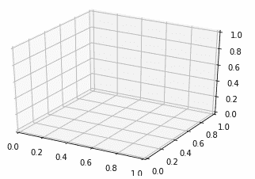

**示例-2:**

```

from mpl_toolkits import mplot3d
import numpy as np
import matplotlib.pyplot as plt

height = np.array([100,110,87,85,65,80,96,75,42,59,54,63,95,71,86])
weight = np.array([105,123,84,85,78,95,69,42,87,91,63,83,75,41,80])

scatter(height,weight)

fig = plt.figure()
ax = plt.axes(projection='3d')
# This is used to plot 3D scatter
ax.scatter3D(height,weight)
plt.title("3D Scatter Plot")
plt.xlabel("Height")
plt.ylabel("Weight")
plt.title("3D Scatter Plot")
plt.xlabel("Height")
plt.ylabel("Weight")

plt.show()

```

**输出:**

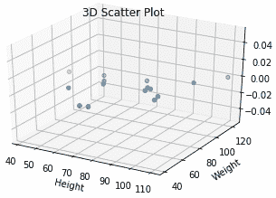

#### 注意:我们可以使用 plot3D()来绘制简单的 3D 线图。

**示例-3**

```

import matplotlib as mpl
from mpl_toolkits.mplot3d import Axes3D
import numpy as np
import matplotlib.pyplot as plt

mpl.rcParams['legend.fontsize'] = 10

fig = plt.figure()
ax = fig.gca(projection='3d')
theta1 = np.linspace(-4 * np.pi, 4 * np.pi, 100)
z = np.linspace(-2, 2, 100)
r = z**2 + 1
x = r * np.sin(theta1)
y = r * np.cos(theta1)
ax.plot3D(x, y, z, label='parametric curve', color = 'red')
ax.legend()

plt.show()

```

**输出:**

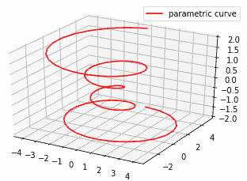

## Matplotlib 的重要功能

| 功能 | 描述 |
| 绘图(x 轴值，y 轴值) | 它用于绘制 x 轴值与 y 轴值的简单线图。show()用于显示图形。 |
| 标题(“字符串”) | 它用于设置由字符串指定的绘图的标题。 |
| xlabel(“字符串”) | 它用于设置由字符串指定的 x 轴标签。 |
| ylabel("字符串") | 它用于设置由字符串指定的 y 轴标签。 |
| 图() | 它用于控制图形级别的属性。 |
| 子出图(非政府组织、ncl、索引) | 它用来给最近的数字增加一个子情节。 |
| 副标题(“字符串”) | 它向由字符串指定的绘图添加一个公共标题。 |
| 子出图(非政府组织、ncols、figsize) | 它提供了在一次调用中创建子图的简单方法，并返回一个图形和轴数的元组。 |
| set_title(“字符串”) | 这是一个轴级别的方法，用于设置子剧情的标题。 |
| 条形(分类变量、值、颜色) | 它用于创建垂直条形图。 |
| 分类变量、数值、颜色 | 它用于创建水平条形图。 |
| 图例(锁定) | 它用于制作图表的图例。 |
| 极限(指数，分类变量) | 它用于设置或获取 x 轴的当前刻度位置标签。 |
| 饼图(值、分类变量) | 它用于创建饼图。 |
| hist(值、箱数) | 它用于创建直方图。 |
| xlim(开始值，结束值) | 它用于设置 x 轴的极限值。 |
| ylim(开始值，结束值) | 它用于设置 y 轴的极限值。 |
| 散布(x 轴值、y 轴值) | 它用于绘制 x 轴值与 y 轴值的散点图。 |
| 轴() | 它用于向最近的图形添加轴。 |
| set_xlabel(“字符串”) | 这是一种轴级方法，用于将绘图的 x 标签设置为字符串。 |
| set_ylabel("字符串") | 它用于设置指定为字符串的绘图的 y 标签。 |
| 散射 3D(x 轴值，y 轴值) | 它用于绘制三维散点图，x 轴值相对于 y 轴。 |
| 绘图 3D(x 轴值，y 轴值) | 它用于绘制带有 x 轴值和 y 轴值的三维线图。 |

在本教程中，我们了解了 matplotlib (Python 库)，其中我们介绍了数据可视化的简要介绍，以及数据可视化对于组织做出决策的重要性。我们已经为数据的图形表示绘制了不同类型的图表。

* * *