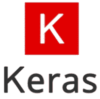

# 硬教程

> 原文： [https://www.javatpoint.com/keras](https://www.javatpoint.com/keras)

Keras 是一个开源的高级神经网络库，它是用 Python 编写的，足以在 Anano、TensorFlow 或 CNTK 上运行。它是由谷歌工程师之一弗朗索瓦·乔莱特开发的。它是用户友好的，可扩展的，模块化的，便于更快的深度神经网络实验。它不仅单独支持卷积网络和递归网络，而且支持它们的组合。

它不能处理低级计算，所以它利用**后端**库来解决它。后端库充当低级应用编程接口的高级应用编程接口包装器，允许它在 TensorFlow、CNTK 或 Antano 上运行。

最初，它在发布时有 4800 多名贡献者，现在已经有 25 万名开发人员。自从每年增长以来，它都有 2 倍的增长。像微软、谷歌、英伟达和亚马逊这样的大公司都为 Keras 的发展做出了积极的贡献。它有着惊人的行业互动，并被用于网飞、优步、谷歌、Expedia 等热门公司的发展。

## 是什么让 Keras 与众不同？

*   关注用户体验一直是 Keras 的主要部分。
*   业内大量采用。
*   它是一个多后端和支持多平台，这有助于所有的编码器走到一起进行编码。
*   为 Keras 呈现的研究社区与生产社区惊人地合作。
*   容易掌握所有概念。
*   它支持快速原型制作。
*   它在中央处理器和图形处理器上无缝运行。
*   它提供了设计任何架构的自由，这些架构后来被用作项目的应用编程接口。
*   开始真的很简单。
*   模型的简单制作实际上让 Keras 很特别。

## Keras 用户体验

1.  **Keras 是一个为人类设计的 API**
    Keras 遵循最佳实践来降低认知负荷，确保模型一致，对应的 API 简单。
2.  **不是为机器设计的**
    Keras 会在出现任何错误时提供清晰的反馈，从而最大限度地减少大多数常见用例的用户操作数量。
3.  **易学易用。**
4.  **高度灵活**
    Keras 通过集成 TensorFlow 或 antao 等低级深度学习语言，为其所有开发人员提供了高度的灵活性，这确保了用基础语言编写的任何东西都可以在 Keras 中实现。

## Keras 如何支持多后端多平台的主张？

Keras 既可以用 R 语言开发，也可以用 Python 开发，这样代码就可以根据需要用 TensorFlow、CNTK、CNTK 或 MXNet 运行。Keras 可以在 CPU、NVIDIA GPU、AMD GPU、TPU 等上运行。它保证了用 Keras 制作模型真的很简单，因为它完全支持用 TensorFlow 服务、GPU 加速(WebKeras、Keras.js)、Android (TF、TF Lite)、iOS (Native CoreML)和树莓 Pi 运行。

## 硬后端

Keras 是一个模型级的库，通过提供高层次的构件来帮助开发深度学习模型。所有低级计算，如张量积、卷积等。不是由 Keras 本身处理的，而是依赖于一个专门的张量操作库，该库经过了很好的优化，可以作为后端引擎。Keras 将它管理得如此完美，以至于它没有合并一个单一的张量库并执行与该特定库相关的操作，而是将不同的后端引擎插入 Keras。

Keras 包括三个后端引擎，如下所示:

*   **TensorFlow**
    TensorFlow 是谷歌的一款产品，是机器学习和深度神经网络研究领域广泛使用的最著名的深度学习工具之一。它于 2015 年 11 月 9 日在阿帕奇许可证 2.0 下上市。它以这样一种方式构建，即它可以轻松地在多个中央处理器和图形处理器以及移动操作系统上运行。它由不同语言的各种包装器组成，如 Java、C++或 Python。
    
*   **安诺**
    安诺是由 MILA 集团在加拿大魁北克蒙特利尔大学研发的。它是一个开源 python 库，通过合并 scipy 和 numpy，广泛用于对多维数组执行数学运算。它利用图形处理器进行更快的计算，并通过自动构建符号图来有效地计算梯度。它非常适合不稳定的表达式，因为它首先用数值观察它们，然后用更稳定的算法计算它们。
    
*   **CNTK**
    微软认知工具包是深度学习的开源框架。它由构成神经网络所需的所有基本构件组成。模型是使用 C++或 Python 训练的，但是它结合了 C#或 Java 来加载模型以进行预测。
    

## Keras 的优势

Keras 具有以下优势:

*   网络模型的快速部署非常容易理解和整合。
*   它在市场上拥有巨大的社区支持，因为大多数人工智能公司都热衷于使用它。
*   它支持多后端，这意味着您可以根据需要使用 TensorFlow、CNTK 和带有 Keras 的 Antano 中的任何一个作为后端。
*   因为它易于部署，所以它也支持跨平台。以下是可以部署 Keras 的设备:
    1.  带 CoreML 的 iOS
    2.  安卓与 TensorFlow 安卓
    3.  带有的 Web 浏览器。js 支持
    4.  云引擎
    5.  覆盆子馅饼
*   它支持数据并行，这意味着可以在一个实例中在多个 GPU 上训练 Keras，以加快训练时间并处理大量数据。

## Keras 的缺点

*   唯一的缺点是 Keras 有自己的预配置层，如果你想创建一个抽象层，它不会让你做，因为它不能处理低级别的 API。它只支持运行在后端引擎(TensorFlow、茶诺和 CNTK)顶部的高级 API。

## 先决条件

这个 Keras 教程是为初学者和专业人士制作的，帮助他们理解 Keras 的基本概念。完成本教程后，你会发现自己处于中等水平的专业知识，从那里你可以将自己提升到下一个水平。

## 观众

由于 Keras 是深度学习的高级库，所以要求你既要有 Python 语言的动手能力，又要有神经网络的基础知识。

## 问题

我们向您保证，您在本教程中不会发现任何困难。如果你想出了一个问题，或者你在本教程中发现了任何错误，请在联系表格中发布，让我们知道，这样我们可以进一步改进它。

* * *