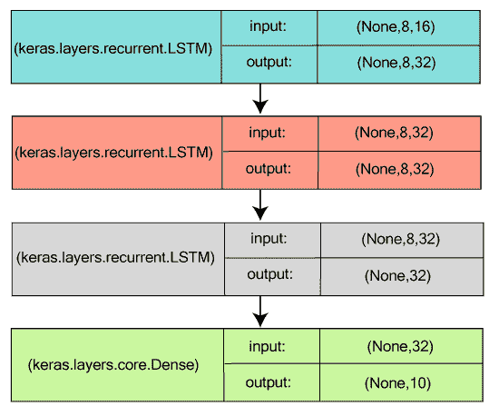
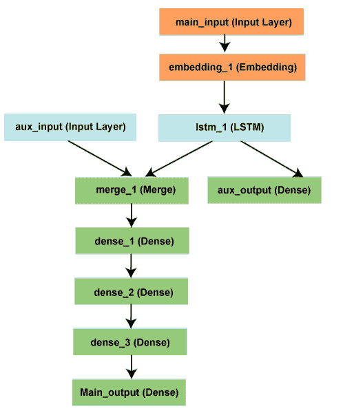

# 硬模型

> 原文：<https://www.javatpoint.com/keras-models>

Keras 提出了两种内置模式；顺序模型和一个高级模型类，带有函数式应用编程接口。顺序模型往往是最简单的模型之一，因为它构成了一组线性的层，而功能性的应用编程接口模型导致了任意网络结构的创建。

## Keras 序列模型

顺序模型中的层是按顺序排列的，因此被称为顺序应用编程接口。在大多数人工神经网络中，层是按顺序排列的，这样，层与层之间的数据流就按照指定的顺序进行，直到到达输出层。

### Keras 顺序模型入门

通过将层实例列表传递给构造器，可以简单地创建**顺序**模型:

```

from keras.models import Sequential 
from keras.layers import Dense, Activation 
model = Sequential([
          Dense(32, inpuit_shape=(784,)),
          Activation('relu'),
         Dense(10), 
         Activation('softmax'), 
])

```

**。add()** 方法用于添加图层:

```

model = Sequential()
model.add(Dense(32, input_dim=784 )) 
model.add(Activation('relu')) 

```

### 指定输入形状

由于模型必须知道预期的输入大小，因此**序列**模型中的第一层需要输入形状的细节，因为其他层可以自动推测形状。可以通过以下方式完成:

*   **input_shape** 参数被传递到最前面的层。它由元组形状组成，即整数元组或**无**，这样无意味着任何正整数都可能预期)。它不包括批次维度。
*   一些 2D 图层，如**密集**，通过**输入 _ 调光**参数支持输入形状规范，而一些三维时间图层支持**输入 _ 调光**和**输入 _ 长度**
*   将**批处理大小**参数传递给图层，以定义输入的批处理大小。如果将 **batch_size=32** 和 **input_shape=(6，8)** 传递到一个层，那么，在这种情况下，预计每一批输入都将有一个 batch shape **(32，6，8)。**

以下是严格等价的片段:

```

model=Sequential ()
model.add(Dense(32, input_shape=(784,))) 

```

```

model=Sequential ()
model.add(Dense(32, input_dim=784))

```

### 汇编

首先编译模型，使用**编译**过程来构建学习过程，然后在下一步中对模型进行训练。该编译包括如下三个参数:

*   **优化器:**顾名思义，优化器可以是一串现有的优化器，如( **rmsprop** 或 **adagrad** ，或者只是类**优化器**的一个实例。
*   **损失函数:**损失函数充当每个模型试图最小化的目标，例如**分类交叉熵**或**均方误差**。它也被称为目标函数。
*   **度量列表:**度量列表是指现有度量或自定义度量函数的标识符字符串。对于任何分类问题，建议设置为**度量=['准确性']** 。

```

#for a multi-class classification problem
model.compile(optimizer='rmsprop',
                          loss='categorical_crossentropy',
                          metrics=['accuracy'])
#for a binary classification problem 
model.compile(optimizer='rmsprop',
	              loss='binary_crossentropy',
                           metrics=['accuracy']
#for a mean squared error regression problem
model.compile(optimizer='rmsprop',
                          loss='mse')
#for custom metrics 
import keras.backend as K
def mean _pred(y_true, y_pred):
      return K.mean(y_pred)
model.compile(optimizer='rsmprop',
                          loss='binary_crossentropy'
                          metrics=['accuracy', mean_pred])

```

### 培养

输入数据或标签的 Numpy 数组被合并用于训练 Keras 模型，因此它使用**拟合**函数。

```

#for a single-input model with 2 classes (binary classification)
model = Sequential ()
model.add(Dense(32, activation='relu', input_dim=100 )) 
model.add(Dense(1, activation='sigmoid'))
model.compile(optimizer='rmsprop',
                         loss='binary_crossentropy',
                         metrics=['accuracy'])
#generate dummy data
import numpy as np
data =  np.random.random((1000, 100))
labels =  np.random.randint(2, size=(1000, 1))
#train the model, iterating on the data in batches of 32 samples 
model.fit(data, labels, epochs=10, batch_size=32)

```

```

#for a single input model with 10 classes (categorical classification)
model = Sequential ()
model.add(Dense(32, activation='relu', input_dim=100))
model.add(Dense(10, activation='softmax'))
model.compile(optimizer='rmsprop',
                         loss='categorical_crossentropy',
                         metrics=['accuracy'])
#generate dummy data
import numpy as np
data = np.random.random((1000,100))
labels=np.random.randint(10, size=(1000,1))
#convert labels to categorical one-hot encoding
one_hot_labels = keras.utils.to_categorical(labels, num_classes=10)
#train the model, iterating on the data in the batches of 32 samples
model.fit(data, one_hot_labels, epochs=10, batch_size=32)

```

**示例:在 MNIST 数据集上训练简单的深度学习神经网络**

```

import keras
from keras.datasets import mnist
from keras.models import Sequential
from keras.layers import Dense, Dropout
from keras.optimizers import RMSprop

batch_size = 128
num_classes = 10
epochs = 20

# split the data between train and test sets
(x_train, y_train), (x_test, y_test) = mnist.load_data()

x_train = x_train.reshape(60000, 784)
x_test = x_test.reshape(10000, 784)
x_train = x_train.astype('float32')
x_test = x_test.astype('float32')
x_train /= 255
x_test /= 255
print(x_train.shape[0], 'train samples')
print(x_test.shape[0], 'test samples')

# convert class vectors to binary class matrices
y_train = keras.utils.to_categorical(y_train, num_classes)
y_test = keras.utils.to_categorical(y_test, num_classes)

model = Sequential()
model.add(Dense(512, activation='relu', input_shape=(784,)))
model.add(Dropout(0.2))
model.add(Dense(512, activation='relu'))
model.add(Dropout(0.2))
model.add(Dense(num_classes, activation='softmax'))

model.summary()

model.compile(loss='categorical_crossentropy',
              optimizer=RMSprop(),
              metrics=['accuracy'])

history = model.fit(x_train, y_train,
                    batch_size=batch_size,
                    epochs=epochs,
                    verbose=1,
                    validation_data=(x_test, y_test))
score = model.evaluate(x_test, y_test, verbose=0)
print('Test loss:', score[0])
print('Test accuracy:', score[1])

```

### 用于序列分类的叠加 LSTM

为了使模型有足够的能力学习高级时间表示，3 个 LSTM 层堆叠在彼此之上。

这些层以这样的方式堆叠，即前两层产生完整的输出序列，第三层产生其输出序列中的最后阶段，这有助于将输入序列成功转换为单个向量(即时间维度的下拉)。



```

from keras.models import Sequential 
from keras.layers import LSTM, Dense 
import numpy as np
data_dim = 16
timesteps = 8
num_classes = 10
#expected input data shape: (batch_size, timesteps, data_dim)
model = Sequential ()
model.add(LSTM(32, return_sequences=True,
                  input_shape(timesteps, data_dim))) #returns a sequence of sequence of vectors of dimension 32
model.add(LSTM(32, return_sequences=True)) #returns a sequence of vectors of dimension 32
model.add(LSTM(32)) #return a single vector of dimension 32
model.add(Dense(10, activation='softmax'))
model.compile(loss='categorical_crossentropy',
                         optimizer='rmsprop',
                         metrics=['accuracy'])
#generate dummy training data
x_train = np.random.random((1000, timesteps, data_dim))
y_train = np.random.random((1000, num_classes))
#generate dummy validation data
x_val = np.random.random((100, timesteps, data_dim))
y_val = np.random.random((100, num_classes))
model.fit(x_train, y_train, 
                batch_size=64, epochs=5,
                validation_data=(x_val, y_val))

```

### 相同的堆叠 LSTM 模型，渲染为“有状态”

其中心(内部)状态被再次用作另一批样本的初始状态的模型被称为“有状态递归模型”，该初始状态是在一批样本被处理之后获得的。它不仅管理计算复杂性，而且允许处理更长的序列。

```

from keras.models import Sequential
from keras.layers import LSTM, Dense
import numpy as np
data_dim = 16
timesteps = 8
num_classes = 10
batch_size = 32
# Expected input batch shape: (batch_size, timesteps, data_dim)
# Note that we have to provide the full batch_input_shape since the network is stateful.
# the sample of index i in batch k is the follow-up for the sample i in batch k-1.
model = Sequential()
model.add(LSTM(32, return_sequences=True, stateful=True,
               batch_input_shape=(batch_size, timesteps, data_dim)))
model.add(LSTM(32, return_sequences=True, stateful=True))
model.add(LSTM(32, stateful=True))
model.add(Dense(10, activation='softmax'))

model.compile(loss='categorical_crossentropy',
              optimizer='rmsprop',
              metrics=['accuracy'])

# Generate dummy training data
x_train = np.random.random((batch_size * 10, timesteps, data_dim))
y_train = np.random.random((batch_size * 10, num_classes))

# Generate dummy validation data
x_val = np.random.random((batch_size * 3, timesteps, data_dim))
y_val = np.random.random((batch_size * 3, num_classes))

model.fit(x_train, y_train,
          batch_size=batch_size, epochs=5, shuffle=False,
          validation_data=(x_val, y_val))

```

## 功能性原料药

Keras Functional API 用于描述复杂的模型，例如，多输出模型、有向无环模型或具有共享层的图形。换句话说，可以说功能性的应用编程接口让您可以概述那些共享层的输入或输出。

### 第一个例子:密集连接的网络

为了实现一个密集连接的网络，顺序模型的结果会更好，但是如果我们用另一个模型来尝试它，这将是一个不错的决定。

Keras 功能 API 的实现类似于 Keras 顺序模型的实现。

*   实例层由张量调用，并返回一个张量作为输出。
*   为了定义模型，输入张量和输出张量都被使用。

```

from keras.layers import Input, Dense
from keras.models import Model
# Returns a Tensor
inputs = Input(shape=(784,))
# An instance layer is callable on a tensor and returns a tensor
output_1 = Dense(64, activation='relu')(inputs)
output_2 = Dense(64, activation='relu')(output_1)
predictions = Dense(10, activation='softmax')(output_2)
# Creates a model that includes the Input layer and three Dense layers
model = Model(inputs=inputs, outputs=predictions)
model.compile(optimizer='rmsprop',
              loss='categorical_crossentropy',
              metrics=['accuracy'])
model.fit(data, labels)  # start training

```

### 所有模型都是可调用的，就像层一样

由于我们正在讨论功能 API 模型，我们可以简单地通过将任何这样的模型视为一个层来重用训练好的模型。这是通过调用张量上的模型来实现的。

当我们称一个模型为 tenor 时，应该注意的是，我们不仅重用了它的架构，还重用了它的权重。

```

x = Input(shape=(784,))
# It works, and returns the 10-way softmax we defined above.
y = model(x)

```

上面给出的代码允许实例为处理输入序列构建模型。此外，借助于单独的线，我们可以将图像分类模型转换成视频分类模型。

```

from keras.layers import TimeDistributed

# Input tensor for sequences of 20 timesteps, such that each contains a 784-dimensional vector
input_sequences = Input(shape=(20, 784))

# It applies our previous model to every timestep in the input sequences. The output of the previous model was a 10-way softmax, so the output of the layer given below will be a sequence of 20 vectors of size 10.
processed_sequences = TimeDistributed(model)(input_sequences)

```

### 多输入多输出模型

由于函数式 API 很好地解释了多输入多输出模型，所以它通过操纵这些模型来处理大量交织在一起的数据流。让我们看下面给出的一个例子来更简单地理解它的概念。基本上，我们将预测在像 twitter 这样的社交媒体上有多少人转发和喜欢一个新闻标题。

标题(一系列单词)和辅助输入都将提供给接受数据的模型，例如，标题发布的时间或日期等。双损失函数也用于监督模型，因此如果我们在初始步骤中使用主损失函数，它将是正则化深度学习模型的最佳选择。



这里 **main_input** 获得标题作为整数序列，每个整数将对每个单词进行编码。整数的范围是 1 到 10，000，序列是 100 个单词。

```

from keras.layers import Input, Embedding, LSTM, Dense
from keras.models import Model
import numpy as np
np.random.seed(0)  # Sets a random seed for reproducibility.

# Headline input receive sequences of 100 integers in between 1 and 10000.
# Here we can name any layer by passing it a "name" argument.
main_input = Input(shape=(100,), dtype='int32', name='main_input')

# The embedding layer encodes the input sequence into a sequence of dense 512-dimensional vectors.
x = Embedding(output_dim=512, input_dim=10000, input_length=100)(main_input)

# The LSTM transforms the vector sequence into a single vector that contains the information about an entire sequence.
lstm_out = LSTM(32)(x)

```

然后将插入辅助损耗，这将允许 LSTM 和嵌入层平滑地训练自己，即使模型中的主损耗较高。

```

auxiliary_output = Dense(1, activation='sigmoid', name='aux_output')(lstm_out)

```

接下来我们将把 **aux_input** 输入到我们的模型中，这是通过把它和 LSTM 输出连接起来完成的。

```

auxiliary_input = Input(shape=(5,), name='aux_input')
x = keras.layers.concatenate([lstm_out, auxiliary_input])

# Stacks a densely-connected deep network on the top.
x = Dense(64, activation='relu')(x)
x = Dense(64, activation='relu')(x)
x = Dense(64, activation='relu')(x)

# Then add the main logistic regression layer.
main_output = Dense(1, activation='sigmoid', name='main_output')(x)

```

```

# Defines a model with two inputs and outputs
model = Model(inputs=[main_input, auxiliary_input], outputs=[main_output, auxiliary_output])

```

之后，我们将通过给辅助损失分配 **0.2** 的权重来编译我们的模型。然后我们将使用列表或目录来识别所有不同输出的**损失**或**损失 _ 体重**。为了在每个输出上使用相同的损失，将传递一个损失参数(lost)。

```

model.compile(optimizer='rmsprop', loss='binary_crossentropy',
              loss_weights=[1., 0.2])

```

接下来，我们将通过传递输入数组和目标数组的列表来训练我们的模型。

```

headline_data = np.round(np.abs(np.random.rand(12, 100) * 100))
additional_data = np.random.randn(12, 5)
headline_labels = np.random.randn(12, 1)
additional_labels = np.random.randn(12, 1)
model.fit([headline_data, additional_data], [headline_labels, additional_labels],
          epochs=50, batch_size=32) 

```

由于我们已经命名了输入和输出，模型将被编译如下；

```

model.compile(optimizer='rmsprop',
              loss={'main_output': 'binary_crossentropy', 'aux_output': 'binary_crossentropy'},
              loss_weights={'main_output': 1., 'aux_output': 0.2})

# And train it through:
model.fit({'main_input': headline_data, 'aux_input': additional_data},
          {'main_output': headline_labels, 'aux_output': additional_labels},
          epochs=50, batch_size=32)

```

该模型可以通过以下方式推断:

```

model.predict({'main_input': headline_data, 'aux_input': additional_data})

```

或者，

```

pred = model.predict([headline_data, additional_data])

```

### 共享层

理解功能 API 模型需要考虑的另一个例子是共享层。为此，我们将检查推文的数据集。既然我们愿意构建这样一个可以确定两条推文是否属于同一个人的模型，这将使一个实例很容易根据推文的相似性来比较用户。

我们将构建一个模型，将两条推文编码成向量，然后将它们串联起来，然后我们将包括逻辑回归。该模型将输出属于同一个人的两条推文的概率。接下来，我们将训练我们的模型对积极的和消极的推文。

由于这里我们选择的问题是对称的，我们的机制必须重用第一个编码的推文，以便对我们将使用共享 LSTM 层的其他推文进行编码。

为了用一个功能 API 构建这个模型，我们将为一条推文输入一个二元形状矩阵(280，256)。这里 280 是大小为 256 的向量序列，使得每个 256 维向量将编码字符的存在或不存在。

```

import keras
from keras.layers import Input, LSTM, Dense
from keras.models import Model

tweet_a = Input(shape=(280, 256))
tweet_b = Input(shape=(280, 256))

```

接下来，我们将输入一个层，然后根据需要在各种输入上调用它，这样我们就可以在几个输入上共享一个层。

```

# The layer takes an input as a matrix and will return a vector of size 64
shared_lstm = LSTM(64)

# When we reuse the same layer instance multiple times, the weights of the layer will also be reused (it is effectively *the same* layer)
encoded_a = shared_lstm(tweet_a)
encoded_b = shared_lstm(tweet_b)

# Next we will concatenate the two vectors:
merged_vector = keras.layers.concatenate([encoded_a, encoded_b], axis=-1)

# And then we will add logistic regression on top
predictions = Dense(1, activation='sigmoid')(merged_vector)

# After that we will define a trainable model by linking the tweet inputs to the predictions
model = Model(inputs=[tweet_a, tweet_b], outputs=predictions)

model.compile(optimizer='rmsprop',
              loss='binary_crossentropy',
              metrics=['accuracy'])
model.fit([data_a, data_b], labels, epochs=10)

```

现在为了理解如何读取共享图层的输出或输出形状，我们将简要地看一下**图层“节点”**的概念。

在调用任何输入上的层时，我们实际上是通过在层上附加一个节点并将输入张量链接到输出张量来生成新的张量。如果同一层被多次调用，那么该层将拥有如此多的节点，这些节点将被索引为 0，1，2，..

为了获得一个图层实例的张量输出，我们使用了 **layer.get_output()** 作为它的输出形状，在旧版本的 Keras 中使用了 **layer.output_shape** 。但是现在 get_output()已经被 output 代替了。

只要一个层连接到单个输入，该层将返回该层的一个输出。

```

 a = Input(shape=(280, 256))

lstm = LSTM(32)
encoded_a = lstm(a)

assert lstm.output == encoded_a

```

如果该层包括多个输入；

```

 a = Input(shape=(280, 256))
b = Input(shape=(280, 256))

lstm = LSTM(32)
encoded_a = lstm(a)
encoded_b = lstm(b)

lstm.output

```

输出:

```
>> AttributeError: Layer lstm_1 has multiple inbound nodes,
hence the notion of "layer output" is ill-defined.
Use `get_output_at(node_index)` instead.

```

下面将执行它；

```

assert lstm.get_output_at(0) == encoded_a
assert lstm.get_output_at(1) == encoded_b

```

所以**输入 _ 形状**和**输出 _ 形状**等字符也是如此。如果一个层由单独的层组成，或者所有的节点具有相似的输入/输出，那么只有这样，我们才能说“层输入/输出形状”的概念被完全定义，并且形状将逐层返回。

在这种情况下，如果我们将 conv2D 层应用于形状(32，32，3)的输入，然后应用于(64，64，3)，那么该层将包含几个形状的输入/输出。为了获取它们，我们需要指定它们所属节点的索引。

```

a = Input(shape=(32, 32, 3))
b = Input(shape=(64, 64, 3))

conv = Conv2D(16, (3, 3), padding='same')
conved_a = conv(a)

# Only one input so far, the following will work:
assert conv.input_shape == (None, 32, 32, 3)

conved_b = conv(b)
# now the "input_shape" property wouldn't work, but this does:
assert conv.get_input_shape_at(0) == (None, 32, 32, 3)
assert conv.get_input_shape_at(1) == (None, 64, 64, 3)

```

* * *