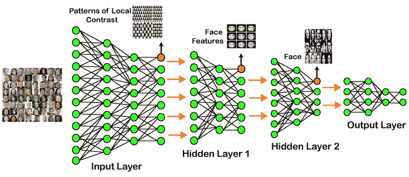
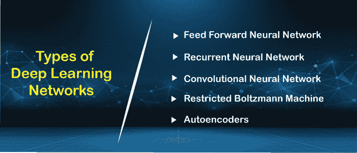

# 深度学习教程

> 原文：<https://www.javatpoint.com/deep-learning>

深度学习是基于机器学习的分支，它是人工智能的一个子集。既然神经网络模仿人脑，那么深度学习就可以了。在深度学习中，没有什么是明确编程的。基本上，它是一个机器学习类，利用许多非线性处理单元来执行特征提取和变换。每个前一层的输出被每个后续层作为输入。

深度学习模型只需要程序员的一点点指导，就足以专注于精确的特征本身，并且非常有助于解决维度问题。[使用深度学习算法](deep-learning-algorithms)，特别是当我们有大量的输入和输出时。

由于深度学习是由[机器学习](https://www.javatpoint.com/machine-learning)进化而来的，而[机器学习本身是人工智能的一个子集，而作为](https://www.javatpoint.com/machine-learning)[人工智能](https://www.javatpoint.com/artificial-intelligence-tutorial)背后的想法是模仿人类的行为，所以“深度学习的想法是构建这样一个可以模仿大脑的算法”。

深度学习是借助神经网络来实现的，[神经网络](https://www.javatpoint.com/artificial-neural-network)的动机背后的想法是生物神经元，它只不过是一个脑细胞。

> 深度学习是机器学习统计技术的集合，用于学习实际上基于人工神经网络的特征层次。

所以基本上，深度学习是借助深度网络来实现的，深度网络只不过是具有多个隐藏层的神经网络。

## 深度学习的例子

在上面给出的例子中，我们将图像的原始数据提供给输入层的第一层。然后，这些输入层将确定局部对比度的模式，这意味着它将根据颜色、亮度等进行区分。然后第一个隐藏层将确定面部特征，即它将注视眼睛、鼻子和嘴唇等。然后，它会将这些面部特征固定在正确的面部模板上。所以，在 2 和 2隐藏层中，它实际上会在这里确定正确的人脸，如上图所示，之后它会被发送到输出层。同样，可以添加更多的隐藏层来解决更复杂的问题，例如，如果您想要找出具有大肤色或浅肤色的特定类型的面部。因此，当隐藏层增加时，我们能够解决复杂的问题。

## 体系结构

*   ***【深度神经网络】***
    它是一个融合了一定层次复杂性的神经网络，这意味着在输入层和输出层之间包含了若干个隐藏层。他们非常精通模型和过程非线性关联。
*   ***深度信念网络***
    深度信念网络是由多层信念网络组成的一类深度神经网络。
    **执行 DBN 的步骤:**
    1.  借助对比发散算法，从可感知单元中学习一层特征。
    2.  接下来，先前训练的特征被视为执行特征学习的可视单元。
    3.  最后，当最终隐藏层的学习完成时，整个 DBN 被训练。
*   ***【递归神经网络】***
    它允许并行和顺序计算，并且它与人脑(连接神经元的大反馈网络)完全相似。因为他们有足够的能力回忆所有与他们收到的输入相关的必要的事情，所以他们更精确。

## 深度学习网络的类型

### 1.前馈神经网络

前馈神经网络不是别人，正是[人工神经网络](https://www.javatpoint.com/keras-artificial-neural-networks)，保证节点不形成循环。在这种神经网络中，所有的感知器都组织在层内，这样输入层接受输入，输出层产生输出。由于隐藏层不与外部世界链接，因此将其命名为隐藏层。一个单层中包含的每个感知器与后续层中的每个节点相关联。可以得出结论，所有的节点都是完全连接的。它不包含同一层中节点之间的任何可见或不可见的连接。前馈网络中没有反馈回路。为了最小化预测误差，可以使用反向传播算法来更新权重值。

**应用:**

*   数据压缩
*   模式识别
*   计算机视觉
*   声纳目标识别
*   语音识别
*   手写字符识别

### 2.递归神经网络

[递归神经网络](https://www.javatpoint.com/keras-recurrent-neural-networks)是前馈网络的又一个变体。这里，隐藏层中存在的每个神经元接收具有特定时间延迟的输入。递归神经网络主要访问现有迭代的先验信息。例如，要猜测任何句子中的下一个单词，必须了解以前使用过的单词。它不仅处理输入，而且共享长度和权重。它不会让模型的大小随着输入大小的增加而增加。然而，这种递归神经网络的唯一问题是它的计算速度慢，并且它不考虑当前状态的任何未来输入。它在回忆以前的信息时有问题。

**应用:**

*   机器翻译
*   机器人控制系统
*   时间序列预测
*   语音识别
*   语音合成
*   时间序列异常检测
*   节奏学习
*   音乐创作

### 3.卷积神经网络

[卷积神经网络](https://www.javatpoint.com/keras-convolutional-neural-network)是一种特殊的神经网络，主要用于图像分类、图像聚类和目标识别。dnn 支持无监督地构建分层图像表示。为了获得最好的精度，深度卷积神经网络比任何其他神经网络更受欢迎。

**应用:**

*   识别面部、街道标志、肿瘤。
*   图像识别。
*   视频分析。
*   NLP。
*   异常检测。
*   药物发现。
*   跳棋游戏。
*   时间序列预测。

### 4.受限玻尔兹曼机

[RBMs](https://www.javatpoint.com/keras-restricted-boltzmann-machine) 是玻尔兹曼机器的又一个变种。这里，输入层和隐藏层中的神经元包含它们之间的对称连接。但是，在相应的层中没有内部关联。但与 RBM 相反，玻尔兹曼机器确实包含了隐藏层内部的联系。BMs 中的这些限制有助于模型有效地训练。

**应用:**

*   过滤。
*   特征学习。
*   分类。
*   风险检测。
*   商业和经济分析。

### 5.自动编码器

自动编码器神经网络是另一种无监督机器学习算法。这里隐藏单元的数量仅仅比输入单元的数量少。但是输入单元的数量相当于输出单元的数量。一个自动编码器网络被训练成显示类似于 fed 输入的输出，以迫使 AE 找到共同的模式并概括数据。自动编码器主要用于输入的较小表示。它有助于从压缩数据重建原始数据。该算法相对简单，因为它只需要输出与输入相同。

*   **编码器:**转换低维输入数据。
*   **解码器:**重构压缩数据。

**应用:**

*   分类。
*   聚类。
*   特征压缩。

## 深度学习应用

*   ***【自动驾驶汽车】***
    在自动驾驶汽车中，它能够通过处理大量数据来捕捉周围的图像，然后它会决定应该合并哪些动作来向左或向右行驶，或者应该停止。因此，相应地，它将决定它应该采取什么行动，这将进一步减少每年发生的事故。
*   ***声控辅助***
    当我们谈到声控辅助的时候，那么 **Siri** 就是我们脑海中浮现的一个东西。所以，你可以告诉 Siri 你想要它为你做的任何事情，它会为你搜索它，为你显示它。
*   ***【自动图像字幕生成】***
    无论你上传什么图像，算法都会相应地生成字幕。如果您说蓝色眼睛，它将显示一个蓝色眼睛，并在图像底部带有标题。
*   ***【自动机器翻译】***
    在自动机器翻译的帮助下，我们能够借助深度学习将一种语言转换成另一种语言。

## 限制

*   它只能通过观察来学习。
*   它包括偏见问题。

## 优势

*   它减少了对特征工程的需求。
*   它消除了所有不必要的成本。
*   它很容易识别困难的缺陷。
*   它在问题上的表现是同类最佳的。

## 不足之处

*   它需要大量的数据。
*   训练相当昂贵。
*   它没有强大的理论基础。

* * *