# ANN

> 原文：<https://www.javatpoint.com/keras-artificial-neural-networks>

在早期，传统的计算机结合了算法方法，即计算机用来遵循一组指令来解决问题，除非那些计算机需要遵循的特定步骤是已知的，计算机不能解决问题。所以，很明显，需要一个人来解决问题，或者需要一个能给计算机提供指令的人来解决这个特殊的问题。它实际上将常规计算机的问题解决能力限制在我们已经理解并知道如何解决的问题上。

但是那些答案不清楚的问题怎么办呢，这就是我们传统方法面临失败的地方，于是神经网络就出现了。神经网络处理信息的方式与人脑相似，这些网络实际上是从例子中学习的，你不能通过编程让它们执行特定的任务。他们只会从过去的经验和例子中学习，这就是为什么你不需要提供任何特定任务的所有信息。这就是神经网络产生的主要原因。

> ANN是从生物学上受到神经网络的启发，它是继人脑之后构成的。

神经网络是根据人脑建模的，以便模仿其功能。人脑可以定义为由多个神经元组成的神经网络，由无数感知器组成的[ANN](https://www.javatpoint.com/artificial-neural-network)也是如此。

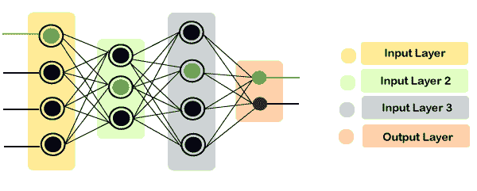

神经网络由以下三个主要层组成:

*   **输入层:**输入层接受程序员提供的所有输入。
*   **隐藏层:**在输入层和输出层之间，有一组隐藏层，在这些隐藏层上执行计算，进而产生输出。
*   **输出层:**输入层经过隐藏层的同时经过一系列变换后，产生输出层交付的输出。

## 神经网络背后的动机

基本上，神经网络是以神经元为基础的，神经元只不过是脑细胞。生物神经元从其他来源接收输入，以某种方式组合它们，然后对结果执行非线性操作，输出就是最终结果。

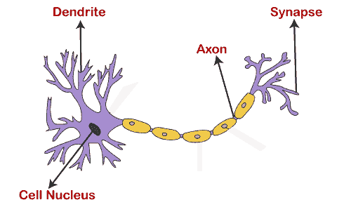

**树突**将充当接收器，接收来自其他神经元的信号，然后这些信号被传递到**细胞体**。胞体将执行一些运算，可以是求和、乘法等。对输入集进行运算后，通过**轴**传递给下一个神经元，该轴是神经元信号的发送器。

## 什么是ANN？

ANN是一种计算系统，旨在模拟人脑分析和处理信息的方式。ANN具有自学习能力，使其能够在更多数据可用时产生更好的结果。因此，如果网络是在更多的数据上训练的，它会更精确，因为这些神经网络是从例子中学习的。神经网络可以配置为特定的应用，如数据分类、模式识别等。

在神经网络的帮助下，我们实际上可以看到许多技术已经从将网页翻译成其他语言发展到有一个虚拟助手在线订购杂货。所有这些都是可能的，因为有了神经网络。所以，ANN只不过是各种人工神经元的网络。

### 神经网络的重要性:

*   **无神经网络:**我们来看看下面给出的例子。这里我们有一台机器，比如我们用四种类型的猫来训练它，如下图所示。一旦我们完成了训练，我们将提供一个随机图像给那个有猫的机器。由于这只猫与我们用来训练系统的猫不相似，所以如果没有神经网络，我们的机器就无法识别图片中的猫。基本上，机器会搞不清楚猫在哪里。

    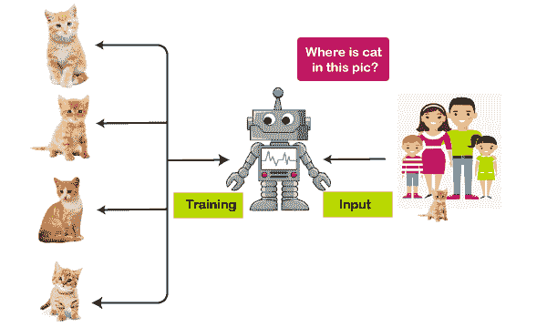
*   **用神经网络:**然而，当我们用神经网络谈论这个案例时，即使我们没有用那只特定的猫训练我们的机器。但是，它仍然可以识别我们训练过的猫的某些特征，它可以将这些特征与特定图像中的猫进行匹配，并且还可以识别猫。所以，借助这个例子，你可以清楚地看到神经网络概念的重要性。

## ANN的工作

与其直接进入ANN的工作，不如让我们分解并尝试理解神经网络的基本单元，它被称为**感知器**。

因此，感知器可以被定义为具有单层的神经网络，用于对线性数据进行分类。它还包括以下四个主要组成部分:

1.  输入
2.  权重和偏差
3.  求和函数
4.  激活或转换功能

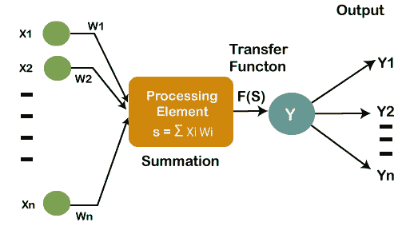

感知器概念背后的主要逻辑如下:

输入(x)被馈送到输入层，输入层与分配的权重(w)相乘，然后相加，以形成加权和。然后，在相关的激活函数上执行这些输入加权和及其相应的权重。

### 权重和偏差

当输入变量被输入网络时，随机值作为特定输入的权重被给出，使得每个单独的权重代表该输入的重要性，以便对结果做出正确的预测。

然而，偏差有助于激活函数曲线的调整，从而实现精确的输出。

### 求和函数

将权重分配给输入后，它会计算每个输入和权重的乘积。然后通过求和函数计算加权和，其中所有乘积相加。

### 激活函数

激活函数的主要目标是在输出上执行加权和的映射。转换函数包括激活函数，如 tanh、ReLU、sigmoid 等。

激活功能分为两个主要部分:

1.  线性激活函数
2.  非线性激活函数

### 线性激活函数

在线性激活函数中，函数的输出不受任何范围的限制。它的范围是从-无穷大到无穷大。对于每个单独的神经元，输入与每个神经元的权重相乘，从而产生与输入成比例的输出信号。如果所有输入层本质上都是线性的，那么最后一层的最终激活实际上将是初始层输入的线性函数。

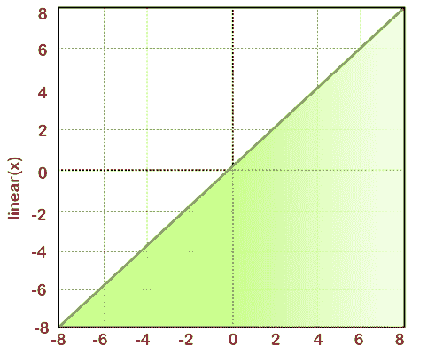

### 非线性函数

这些是最广泛使用的激活功能之一。它有助于模型概括和调整任何类型的数据，以便在输出中执行正确的区分。它解决了线性激活函数面临的以下问题:

*   由于非线性函数带有导数函数，因此与反向传播相关的问题得到了成功的解决。
*   对于深层神经网络的创建，它允许几层神经元的堆叠。

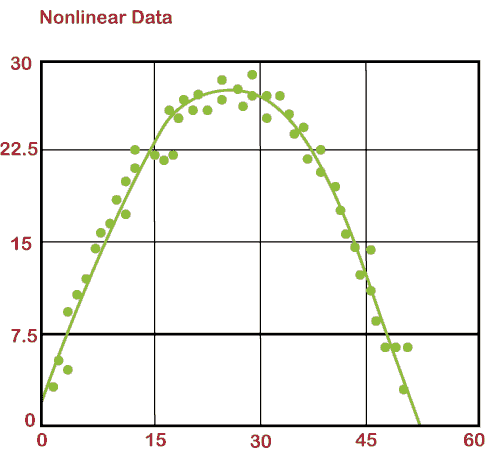

非线性激活函数进一步分为以下几个部分:

1.  **Sigmoid 或 Logistic 激活函数**
    它通过防止输出值的突然跳跃来提供平滑的梯度。它的输出值范围在 0 到 1 之间，有助于每个神经元输出的标准化。对于 X，如果它的值高于 2 或低于-2，那么 y 的值会更陡。用简单的语言来说，就是 X 的一个很小的变化就能带来 y 的很大的变化
    它的取值范围在 0 到 1 之间，因此对于结果为 0 或者 1 的二进制分类来说是非常优选的。
    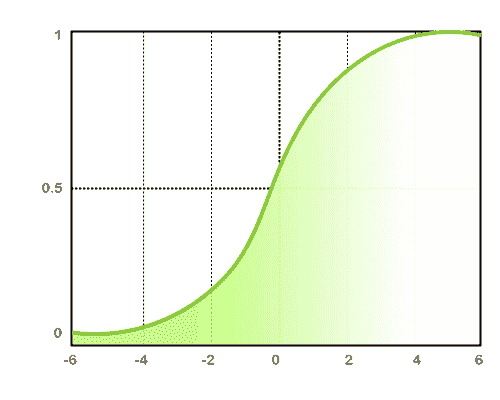
2.  **Tanh 或双曲正切激活函数**
    Tanh 激活函数的效果比 sigmoid 函数好得多，或者简单地说我们可以说它是 sigmoid 激活函数的高级版本。由于它的取值范围在-1 到 1 之间，所以它被神经网络中的隐藏层所利用，正因为如此，它使得学习过程变得更加容易。
    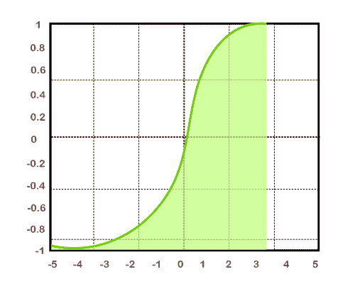
3.  **ReLU(整流线性单元)激活函数**
    ReLU 是神经网络隐层使用最广泛的激活函数之一。它的值从 0 到无穷大。这显然有助于解决反向传播的问题。它往往比 sigmoid 和 tanh 激活功能更贵。它只允许少数神经元在特定情况下被激活，从而导致有效且更容易的计算。
    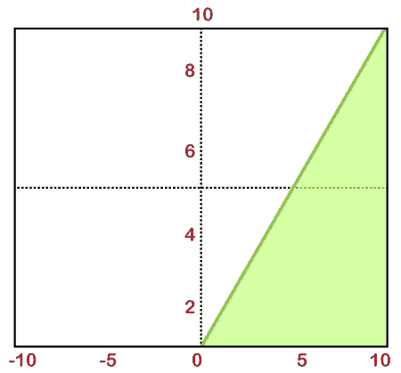
4.  **Softmax 函数**
    它是一种解决分类问题的乙状元函数。它主要用于处理多个类，它将每个类的输出挤压在 0 到 1 之间，然后将其除以输出的总和。输出层的分类器专门使用这种函数。

## 梯度下降算法

梯度下降是一种优化算法，用于最小化各种机器学习算法中使用的成本函数，从而更新学习模型的参数。在线性回归中，这些参数是系数，而在神经网络中，它们是权重。

**程序:**

这一切都始于系数的初始值或函数的系数，可能是 0.0 或任何小的任意值。

coefficient = 0.0

为了估计系数的成本，它们被插入到有助于评估的函数中。

cost = f(coefficient)
or, cost = evaluate(f(coefficient))

接下来，将计算导数，这是微积分的概念之一，与函数在任何给定情况下的斜率有关。为了知道系数的值将移动的方向，我们需要计算斜率，以便在下一次迭代中实现低成本。

delta = derivative(cost)

现在我们已经找到了下坡方向，这将进一步帮助更新系数值。接下来，我们需要指定 alpha，这是一个学习速率参数，因为它处理每次更新时系数所做的修改量。

coefficient = coefficient - (alpha * delta)

直到系数的成本达到 **0.0** 或者稍微接近它，整个过程会反复进行。

可以得出结论，梯度下降是一个非常简单和直接的概念。它只需要你知道成本函数的梯度，或者只是你愿意优化的函数。

### 分批梯度下降

对于梯度下降的每次重复，批量梯度下降的主要目的是处理所有的训练示例。如果我们有大量的训练例子，那么批量梯度下降往往是最昂贵的，也不太可取。

**批量梯度下降算法**

设 **m** 为训练例数， **n** 为特征数。

现在假设**h<sub>ɵ</sub>**代表线性回归的假设，并且 **∑** 计算从 **i=1 到 m** 的所有训练示例的总和。那么函数的成本将由下式计算:

J <sub>列车</sub>=(1/2m)【h<sub>(x<sup>(I)</sup>-(y<sup>(I)</sup>)<sup>2</sup></sub>

重复{

ɵj = ɵj-(学习率/m)*∑(h<sub>ɵ</sub>(x<sup>(I)</sup>)-y<sup>(I)</sup>)x<sub>j</sub><sup>(I)</sup>

对于每个 j = 0...n

}

此处 **x <sup>(i)</sup>** 表示 **i <sup>第</sup>** 训练示例的 **j <sup>第</sup>T7】特征。如果 **m** 非常大，那么导数将无法收敛于**全局最小值**。**

### 随机梯度下降

在一次重复中，随机梯度下降只处理一个训练样本，这意味着在每次迭代处理一个训练样本后，所有参数都必须更新。它往往比批量梯度下降快得多，但是当我们有大量的训练例子时，它也处理单个例子，由于该系统可能经历大量的重复。要均匀地训练每种数据类型提供的参数，请适当地打乱数据集。

**随机梯度下降算法**

假设(x <sup>(i)</sup> 、y <sup>(i)</sup> )为训练例

成本(ɵ，(x <sup>(i)</sup> ，y<sup>(I)</sup>)=(1/2)∑(hɵ(x<sup>(I)</sup>)-(y<sup>(I)</sup>)<sup>2</sup>

J <sub>列车</sub>(ɵ)=(1/m)∑成本(ɵ，(x <sup>(i)</sup> ，y <sup>(i)</sup> ))

重复{

对于 i=1 至 m{

ɵj = ɵj-(学习率)*∑(h<sub>ɵ</sub>(x<sup>(I)</sup>)-y<sup>(I)</sup>)x<sub>j</sub><sup>(I)</sup>

对于每个 j=0...n

}

}

### 梯度下降不同变体的收敛趋势

批处理梯度下降算法遵循一条直线路径到达最小值。如果代价函数为**凸**，算法向**全局最小值**收敛，否则如果代价函数不为凸，算法向**局部最小值**收敛。这里的学习速率通常是恒定的。

然而，在随机梯度下降的情况下，该算法在全局最小值上波动，而不是收敛。学习速率缓慢变化，以便能够收敛。因为它在一次迭代中只处理一个例子，所以结果会很吵。

## 反向传播

反向传播由神经元的输入层、输出层和至少一个隐藏层组成。神经元对输入层执行加权求和，然后由激活函数(尤其是 sigmoid 激活函数)用作输入。它还利用监督学习来教授网络。它不断更新网络的权重，直到网络达到所需的输出。它包括以下影响网络培训和性能的因素:

*   权重的随机(初始)值。
*   多个训练周期。
*   一些隐藏的神经元。
*   训练集。
*   教学参数值，如学习速率和动量。

### 反向传播的工作原理

考虑下面给出的图表。

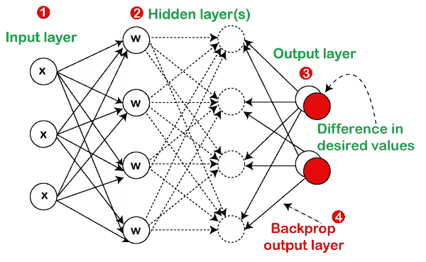

1.  预连接的路径传输输入 **X** 。
2.  然后随机选择权重 **W** ，用于建模输入。
3.  然后，计算从输入层到隐藏层再到输出层的每个神经元的输出。
4.  最后，在输出中评估误差。**误差 <sub>B</sub> =实际输出-期望输出**
5.  误差从输出层发送回隐藏层，用于调整权重以减少误差。
6.  在达到期望的结果之前，继续迭代所有的过程。

### 反向传播的需要

*   因为它既简单又快速，所以很容易实现。
*   除了没有输入，它不包含任何其他参数来执行调谐。
*   因为它不需要任何类型的先验知识，所以它往往更加灵活。
*   这是一个标准的方法，效果很好。

## 建立ANN

在开始构建ANN模型之前，我们需要一个数据集，我们的模型将在这个数据集上工作。数据集是特定问题的数据集合，其形式为 CSV 文件。

**CSV** 代表**逗号分隔值**，以表格格式保存数据。我们使用的是虚构的银行数据集。银行数据集包含其 10，000 名客户的数据及其详细信息。这整件事之所以发生，是因为银行看到了一些不寻常的流失率，这只不过是客户以不寻常的高流失率离开，他们想知道背后的原因，以便能够评估和解决这个特定的问题。

这里我们将使用ANN来解决这个业务问题。我们要处理的问题是一个**分类问题**。我们有几个独立变量，如信用评分、余额和产品数量，在此基础上，我们将预测哪些客户将离开银行。基本上，我们要做一个分类问题，ANN在做这种预测方面可以做得很好。

因此，我们将从在 Anaconda Prompt 上安装 **Keras** 库、 **TensorFlow** 库以及**antao**库开始，为此，您需要以管理员身份打开它，然后依次运行下面给出的命令。

```

pip install theano

```

由于已经安装，输出如下所示。

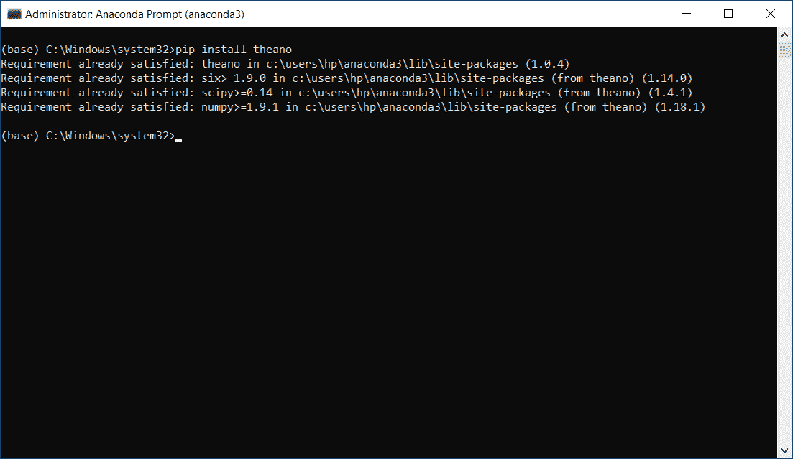

```

pip install tensorflow

```

从下面给出的图片可以看出，TensorFlow 库安装成功。

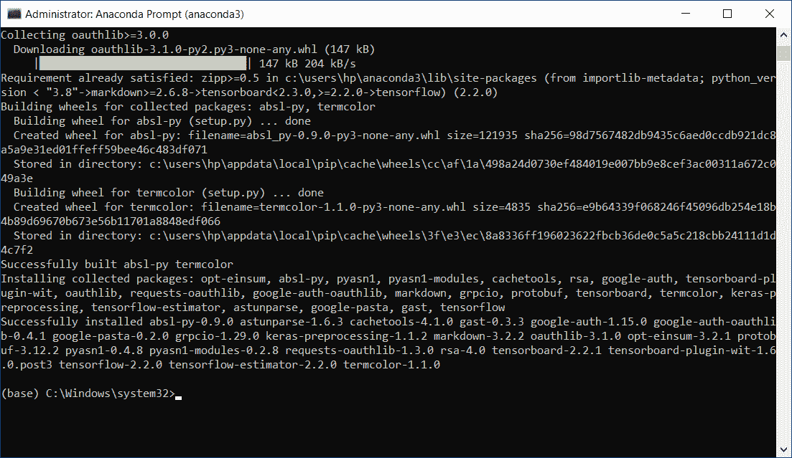
pip install keras
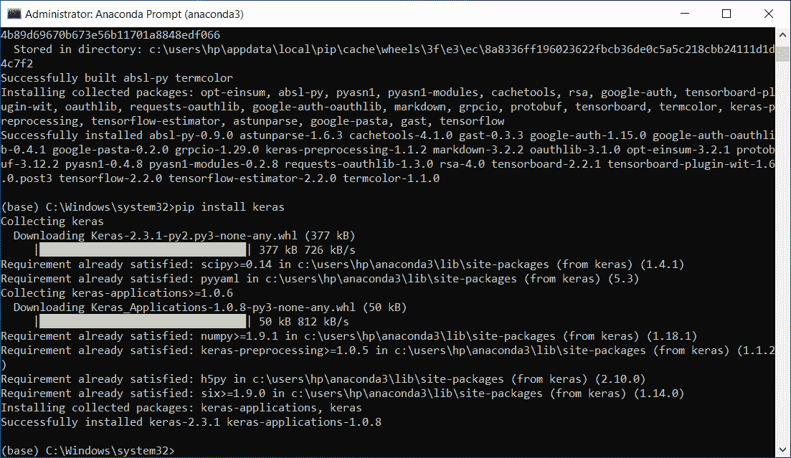

所以，我们也安装了 Keras 库。

现在我们已经完成了安装，下一步是将所有这些库更新到最新版本，这可以通过遵循给定的代码来完成。

```

conda update --all

```

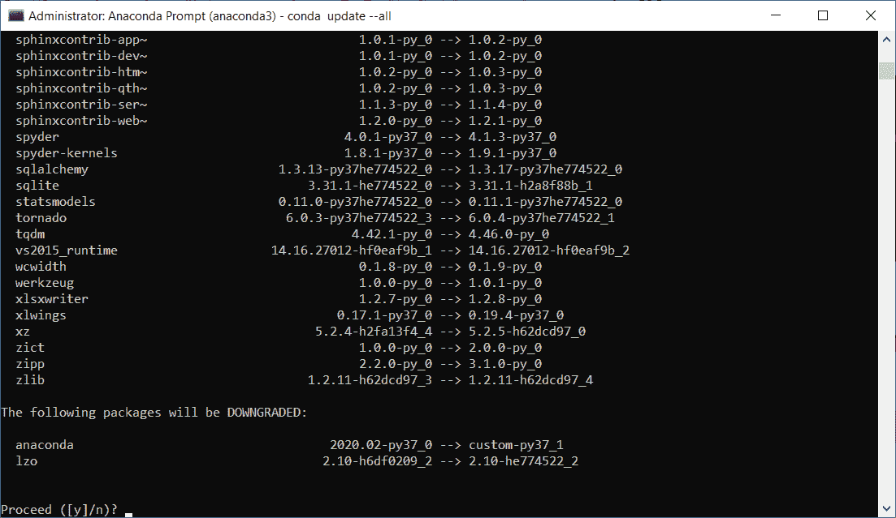

由于我们是第一次这样做，它会问是否继续。用 y 确认并按回车键。

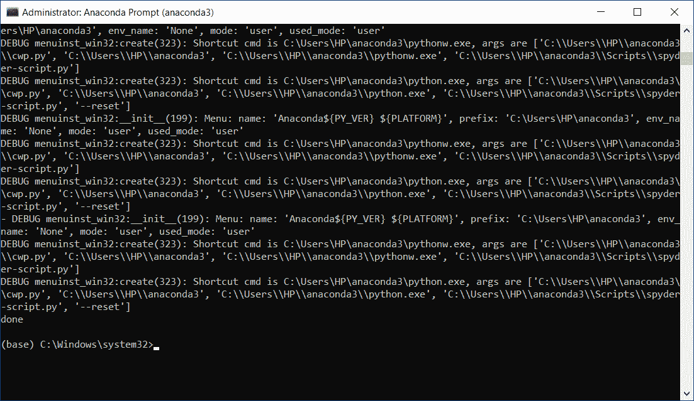

库更新成功后，我们将关闭 Anaconda 提示符并返回到 Spyder IDE。

现在我们将分两部分开始构建我们的模型，这样在部分 **1 <sup>st</sup>** 中，我们将进行**数据预处理**，然而在**2<sup>nd</sup>T9】部分中，我们将**创建 ANN 模型**。**

数据预处理对于正确准备数据以构建未来的深度学习模型是非常必要的。由于我们面对的是一个分类问题，所以我们有一些包含银行客户信息的自变量，我们试图预测因变量的二元结果，即如果客户离开银行，则为 **1** ，如果客户留在银行，则为 **0** 。

### 第一部分:数据预处理

我们将从导入一些预定义的 Python 库开始，如 NumPy、 [Matplotlib](https://www.javatpoint.com/matplotlib) 和 Pandas，以便执行数据预处理。所有这些库都执行某种特定的任务。

num py

[NumPy](https://www.javatpoint.com/numpy-tutorial) 是一个 python 库，代表**数值 Python** ，允许对数组执行线性、数学和逻辑运算，以及傅立叶变换和例程来操作形状。

```

import numpy as np

```

**Matplotlib**

这也是一个开源库，借助它可以在 [python](https://www.javatpoint.com/python-tutorial) 中绘制图表。该库的唯一目的是可视化需要导入其 **pyplot** 子库的数据。

```

import matplotlib.pyplot as plt

```

**Pandas**

Pandas 也是一个开源库，支持高性能数据操作和分析工具。主要用于数据处理和分析。

```

 import pandas as pd

```

下面给出了一个输出图像，显示库已经成功导入。

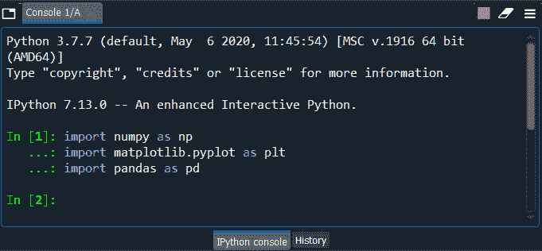

接下来，我们将在 Pandas 的帮助下从当前工作目录中导入数据文件。我们将使用 **read.csv()** 在本地以及通过[网址](https://www.javatpoint.com/url-full-form)读取 csv 文件。

```

dataset = pd.read_csv('Churn_Modelling.csv')

```

从上面给出的代码来看，**数据集**是我们要保存数据的变量的名称。我们已经在 **read.csv()** 中传递了数据集的名称。代码运行后，我们可以看到数据上传成功。

通过点击**变量浏览器**并选择**数据集**，我们可以检查数据集，如下图所示。

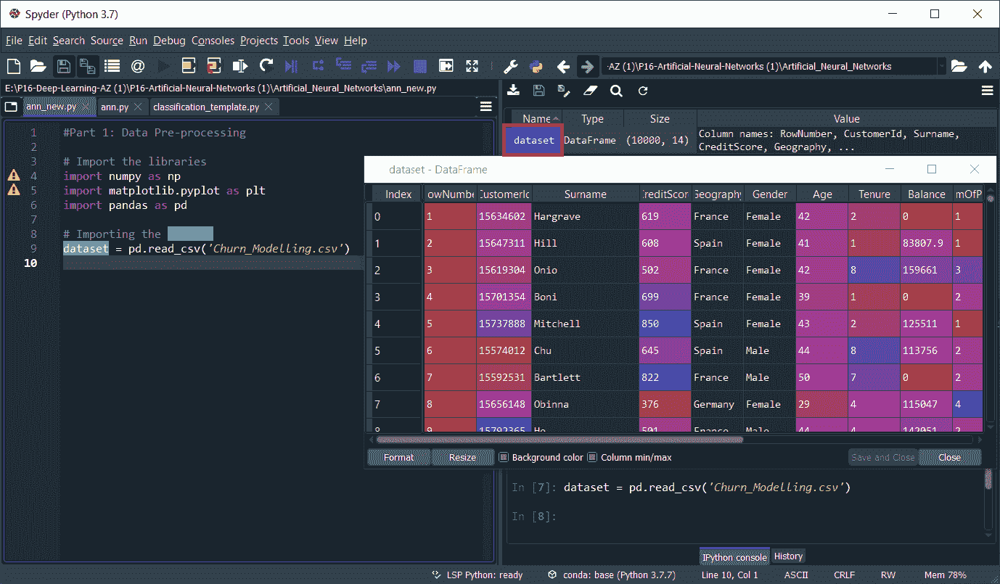

接下来，我们将创建特征的**矩阵，它只不过是自变量的矩阵。因为我们不知道哪个自变量对因变量的影响最大，所以这就是我们的ANN通过观察相关性发现的；它将对神经网络中影响最大的独立变量给予更大的权重。**

因此，我们将包括从**信用评分**到最后一个估计工资的所有自变量。

```

X = dataset.iloc[:, 3:13].values

```

运行以上代码后，我们会看到我们已经成功创建了特征 **X** 的矩阵。接下来，我们将创建一个**因变量向量**。

```

y = dataset.iloc[:, 13].values

```

通过点击 **y** ，我们可以看到 y 包含**二进制结果**，也就是银行全部 10000 个客户 0 或者 1。

**输出:**

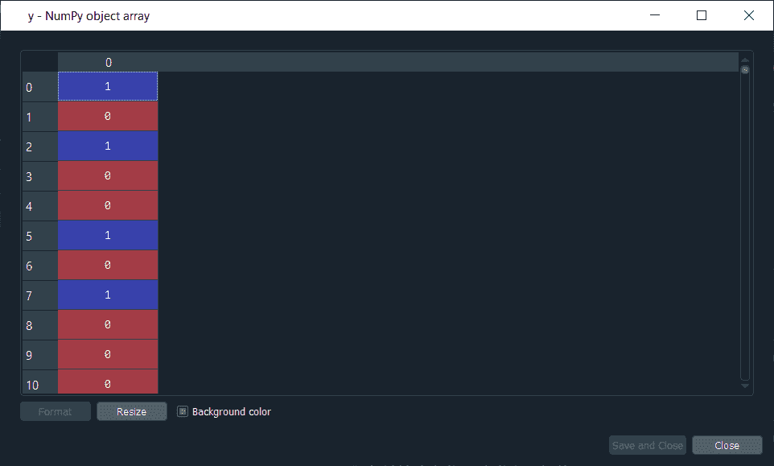

接下来，我们将把数据集分成训练集和测试集。但在此之前，我们需要对特征矩阵进行编码，因为它包含**分类数据**。由于因变量也包括分类数据，但从侧面看，它也需要一个数值，因此不需要将文本编码成数字。但是话说回来，我们有自变量，它有字符串的类别，所以我们需要编码类别自变量。

拆分前对分类数据进行编码的主要原因是必须对 **X** 和因变量 **y** 的矩阵进行编码。

```

from sklearn.preprocessing import LabelEncoder, OneHotEncoder
labelencoder_X = LabelEncoder()
X[:, 0] = labelencoder_X.fit_transform(X[:, 0])
onehotencoder = OneHotEncoder(categorical_features = [0])
X = onehotencoder.fit_transform(X).toarray()

```

因此，现在我们将通过从控制台查看我们的矩阵来编码我们的分类自变量，为此，我们只需要在控制台按下 **X** 。

**输出:**

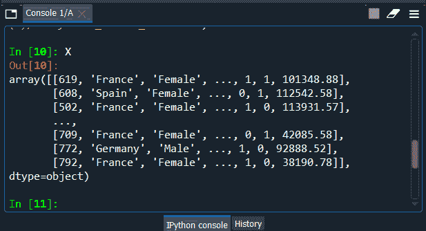

从上面给出的图片中，我们可以看到我们只有两个分类自变量，一个是包含法、西、德三个国家的**国家变量**，另一个是**性别变量**，即男性和女性。所以，我们得到了这两个变量，我们将把它们编码到我们的特征矩阵中。

因此，我们需要创建两个标签编码器对象，这样我们将创建第一个名为 **labelencoder_X_1** 的标签编码器对象，然后应用 **fit_transform** 方法对该变量进行编码，这又会将法国、西班牙和德国的字符串转换为数字 0、1 和 2。

```

from sklearn.preprocessing import LabelEncoder, OneHotEncoder
labelencoder_X_1 = LabelEncoder()
X[:, 1] = labelencoder_X_1.fit_transform(X[:, 1])

```

执行完代码后，我们现在将查看 **X** 变量，只需在控制台中按下 X，就像我们在前面的步骤中所做的那样。

**输出:**

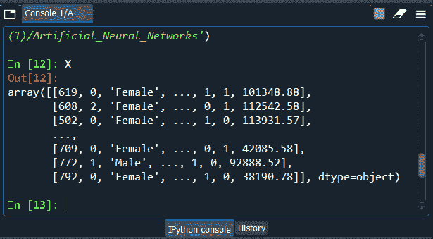

所以，从上面给出的输出图像中，我们可以看到法国变成了 0，德国变成了 1，西班牙变成了 2。

现在以类似的方式，我们将对另一个变量做同样的事情，即性别变量，但是有一个新的对象。

```

labelencoder_X_2 = LabelEncoder()
X[:, 2] = labelencoder_X_2.fit_transform(X[:, 2])

```

**输出:**

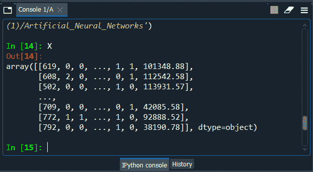

我们可以清楚地看到，雌性变成了 0，雄性变成了 1。由于分类变量的类别之间没有关系顺序，因此我们需要为国家分类变量创建一个虚拟变量，因为它包含三个类别，而性别变量只有两个类别，这就是为什么我们将删除一列以避免**虚拟变量陷阱**。为性别变量创建虚拟变量是没有用的。我们将使用**类来创建虚拟变量。**

```

from sklearn.compose import ColumnTransformer
label_encoder_x_1 = LabelEncoder()
X[: , 2] = label_encoder_x_1.fit_transform(X[:,2])
transformer = ColumnTransformer(
    transformers=[
        ("OneHot",        # Just a name
         OneHotEncoder(), # The transformer class
         [1]              # The column(s) to be applied on.
         )
    ],
    remainder='passthrough' # don't apply anything to the remaining columns 
)
X = transformer.fit_transform(X.tolist())
X = X.astype('float64')

```

**输出:**

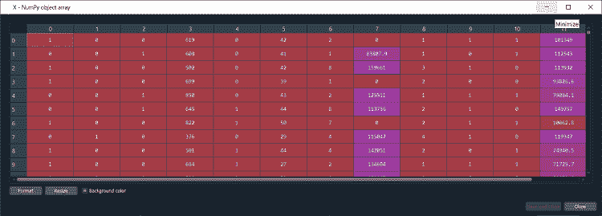

看一下 **X** ，我们可以看到现在所有的柱子都是同一类型的。此外，类型不再是一个对象，而是 float64。我们可以看到我们有 12 个独立变量，因为我们有三个新的虚拟变量。

接下来，我们将移除一个虚拟变量，以避免陷入虚拟变量陷阱。我们将取一个特征 X 的矩阵，并通过取这个矩阵的所有行和除第一列之外的所有列来更新它。

```

X = X[:, 1:]

```

**输出:**

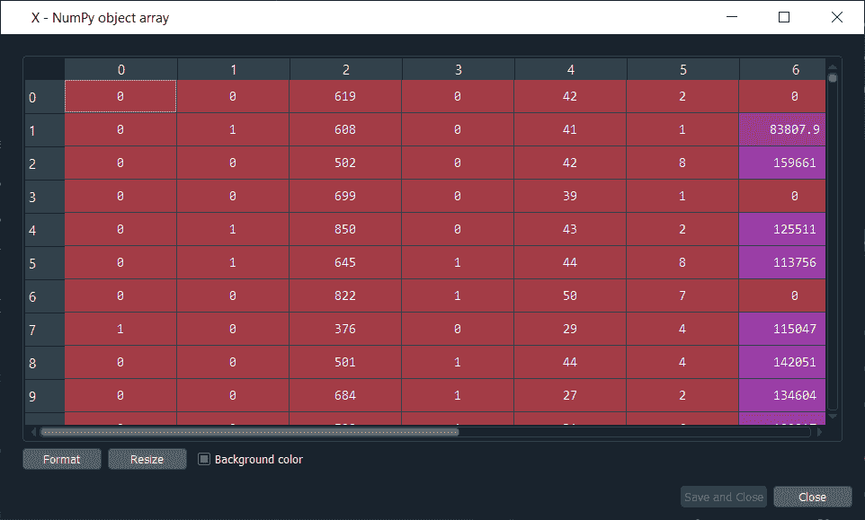

可以看出，我们只剩下两个虚拟变量，所以没有更多的虚拟变量陷阱。

现在我们准备将数据集分为训练集和测试集。我们采用**测试尺寸**至 **0.2** 在**8000**观测值上训练ANN，并在**2000**观测值上测试其性能。

```

from sklearn.model_selection import train_test_split
X_train, X_test, y_train, y_test = train_test_split(X, y, test_size = 0.2, random_state = 0)

```

通过执行上面给出的代码，我们将获得四个不同的变量，可以在变量资源管理器部分看到。

**输出:**

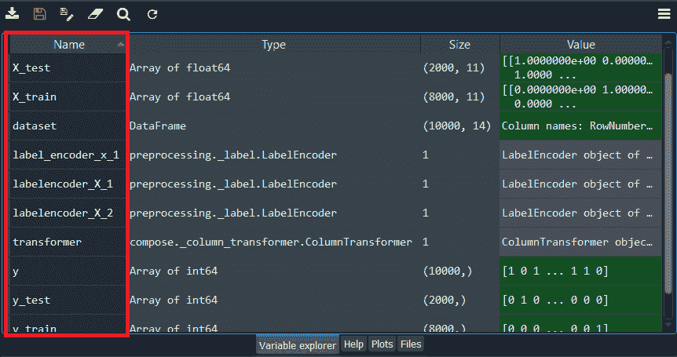

除了并行计算之外，我们还将进行高度计算密集型计算，并且我们不希望一个自变量支配另一个自变量，因此我们将应用特征缩放来简化所有计算。

```

from sklearn.preprocessing import StandardScaler
sc = StandardScaler()
X_train = sc.fit_transform(X_train)
X_test = sc.transform(X_test)

```

执行完上述代码后，我们可以快速查看一下 **X_train** 和 **X_test** ，看看是否所有的自变量都进行了适当的缩放。

**输出:**

**X_train**

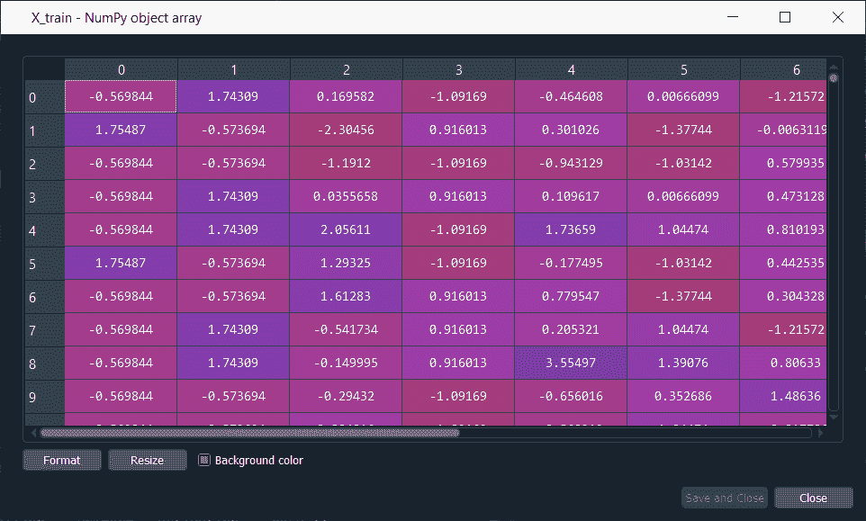

**X_test**

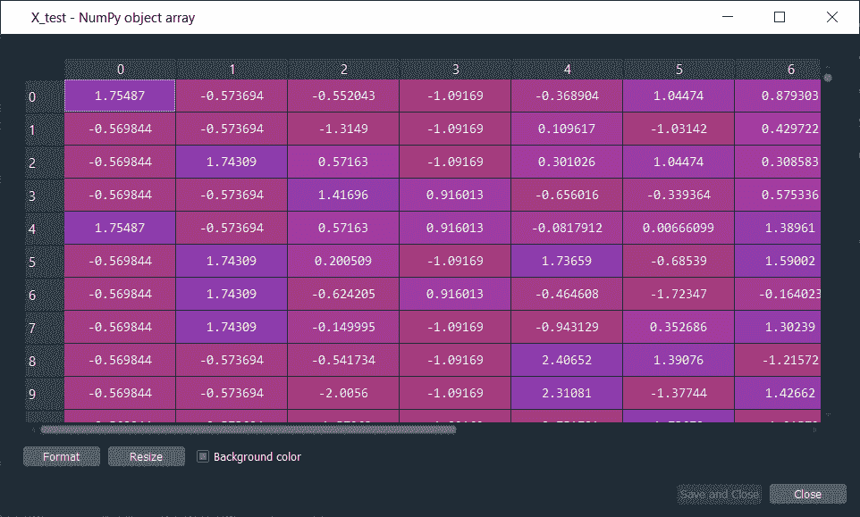

既然我们的数据已经得到了很好的预处理，我们将从构建ANN开始。

### 第二部分:建立ANN

我们将从导入 [Keras](https://www.javatpoint.com/keras) 库以及所需的包开始，因为它将基于 [TensorFlow](https://www.javatpoint.com/tensorflow) 构建神经网络

```

import keras 

```

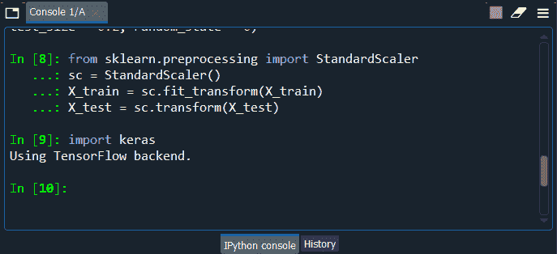

导入 Keras 库后，我们现在将导入两个模块，即初始化我们的神经网络所需的顺序模块和构建我们的 ANN 的层所需的密集模块。

```

from keras.models import Sequential
from keras.layers import Dense

```

接下来，我们将初始化ANN，或者简单地说，我们将把它定义为一系列层。深度学习模型可以通过两种方式初始化，要么定义层的顺序，要么定义一个图。由于我们将使用连续的层来构建我们的ANN，因此我们将通过将其定义为一系列层来初始化我们的深度学习模型。

这可以通过创建序列类的对象来完成，该对象取自序列模型。我们要创建的对象只是模型本身，即一个神经网络，它将有一行分类器，因为我们正在解决一个分类问题，我们必须预测一个类，所以我们的神经网络模型将是一个分类器。在下一步中，我们将使用分类器名称预测测试集结果，因此我们将把我们的模型称为分类器，它只不过是我们将要构建的未来ANN。

因为这个分类器是顺序类的一个对象，所以我们将使用它，但不会传递任何参数，因为我们将从输入层开始，然后添加一些隐藏层，然后是输出层，一步一步地定义层。

```

classifier = Sequential() 

```

之后，我们将从添加输入层和第一个隐藏层开始。我们将采用上一步通过创建序列类的对象初始化的分类器，我们将使用 **add()** 方法在我们的神经网络中添加不同的层。在 add()中，我们将传递**图层**参数，由于我们将添加两个图层，即输入图层和第一个隐藏图层，我们将借助于上面提到的**密集()**功能来完成。

在**密集()**函数中，我们将传递以下参数；

*   **单位**是第一个参数，可以定义为我们想要在隐藏层中添加的节点数。
*   第二个参数是 **kernel_initializer** ，它将权重随机初始化为一个接近于零的小数字，这样它们就可以用一个统一的函数随机初始化。这里我们有一个简单的**均匀**函数，它将根据均匀分布初始化权重。
*   第三个参数是**激活**，可以理解为我们在隐藏层想要选择的功能。因此，我们将使用**整流器功能**用于**隐藏层**，使用 **sigmoid 功能**用于**输出层**。因为我们在隐藏层，所以我们使用“ **relu** ”周长，因为它对应于整流器功能。
*   最后一个是 **input_dim** 参数，指定输入层的节点数，实际上就是自变量的个数。添加参数是非常必要的，因为到目前为止，我们只初始化了我们的ANN，我们还没有创建任何层，这就是为什么它不知道我们正在创建的隐藏层期望哪个节点作为输入。在第一个隐藏层被创建之后，我们不需要为下一个隐藏层指定这个参数。

```

classifier.add(Dense(units = 6, kernel_initializer = 'uniform', activation = 'relu', input_dim = 11))

```

接下来，我们将使用相同的添加方法添加第二个隐藏层，然后传递相同的参数，即**密集()**以及与上一步相同的参数，除了**输入 _ 暗淡**。

```

classifier.add(Dense(units = 6, kernel_initializer = 'uniform', activation = 'relu'))

```

在添加了两个隐藏层之后，我们现在将添加最终的输出层。这再次类似于上一步，只是我们将是单位参数的事实，因为在输出层中，我们只需要一个节点，因为我们的因变量是包含二进制结果的分类变量，并且当我们有二进制结果时，在这种情况下，我们在输出层中只有一个节点。因此，我们将单位等于 1，由于我们在输出层，我们将把**整流器**功能替换为 **sigmoid** 激活功能。

```

classifier.add(Dense(units = 1, kernel_initializer = 'uniform', activation = 'sigmoid'))

```

由于我们已经完成了ANN层的添加，现在我们将通过应用随机梯度下降来编译整个ANN。我们将从我们的分类器对象开始，然后使用编译方法，并在其中传递以下参数。

*   第一个参数是**优化器**，它只是我们想要用来在神经网络中找到最佳权重集的算法。我们要用的算法就是随机梯度下降算法。因为有几种类型的随机下降算法，最有效的一种叫做“T2”亚当，它将是这个优化器参数的输入。
*   第二个参数是损失，它是随机梯度下降算法中的损失函数，用于寻找最佳权重。由于我们的因变量有一个**二进制结果**，所以我们将使用**二进制 _ 交叉熵**对数函数，当有一个**二进制结果**时，我们将合并**分类 _ 交叉熵**。
*   最后一个论点是度量标准，这只是评估我们模型的标准，我们使用的是“**精度**”因此，当每次观察后更新权重时，算法会利用这种准确性来提高模型的性能。

```

classifier.compile(optimizer = 'adam', loss = 'binary_crossentropy', metrics = ['accuracy'])

```

接下来，我们将使ANN适合训练集，我们将使用适合方法使我们的ANN适合训练集。在 fit 方法中，我们将传递以下参数:

*   第一个参数是我们要在其上训练分类器的数据集，它是分成两个参数的训练集，例如 **X_train** (包含训练集的观测值的特征矩阵)和 **y_train** (包含训练集中所有观测值的因变量的实际结果)。
*   下一个参数是 **batch_size** ，这是观察的次数，之后我们要更新权重。
*   最后，我们将应用的**时期**的数量，以查看算法在不同时期的运行情况以及准确性的提高。

```

classifier.fit(X_train, y_train, batch_size = 10, epochs = 100)

```

**输出:**

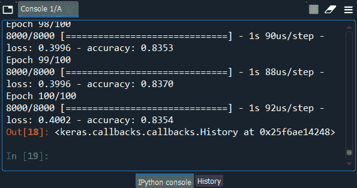

从上面给出的输出图像中，您可以看到我们的模型已经准备好了，并且已经达到了约为 **84%** 的**精度**，所以这就是随机梯度下降算法的执行方式。

### 第三部分:预测和评估模型

既然我们已经在训练集上完成了ANN的训练，现在我们将在训练集上进行预测。

```

y_pred = classifier.predict(X_test)

```

**输出:**

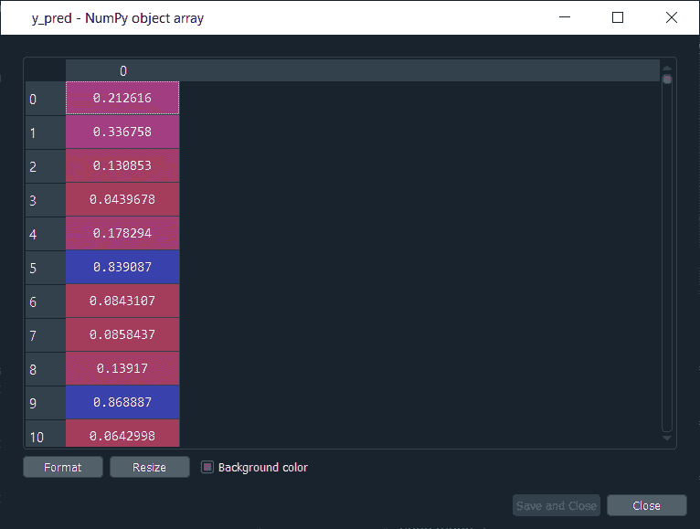

从上面给出的输出图像中，我们可以看到测试集的 2000 个客户离开银行的所有概率。例如，如果我们看一下第一概率，即 21%意味着测试集的第一个客户，由零索引，有 20%的机会离开银行。

由于预测方法返回客户离开银行的概率，并且为了使用这个混淆矩阵，我们不需要这些概率，但是我们确实需要以真或假的形式的预测结果。所以，我们需要把这些概率转化为预测结果。

我们将选择一个阈值来决定预测结果何时为 1，何时为零。因此，我们预测 **1** 超过阈值， **0** 低于阈值，我们将采取的自然阈值是 **0.5** ，即 50%。如果 **y_pred** 较大，则返回真，否则返回假。

```

y_pred = (y_pred > 0.5) 

```

现在，如果我们看一下 **y_pred** ，我们会看到它已经以**假**或者**真**的形式更新了结果。

**输出:**

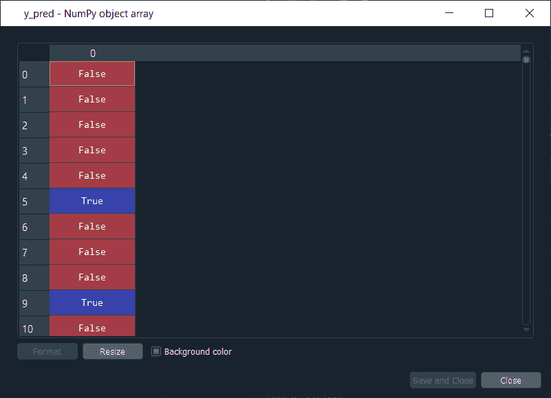

因此，测试集的前五个客户不会按照模型离开银行，而测试集中的第六个客户会离开银行。

接下来，我们将执行以下代码来获得混淆矩阵。

```

from sklearn.metrics import confusion_matrix
cm = confusion_matrix(y_test, y_pred)

```

**输出:**

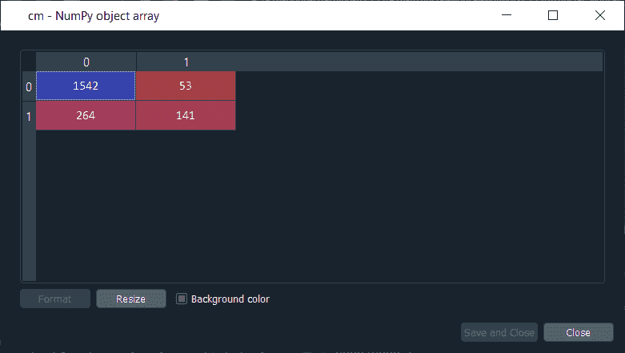

从上面给出的输出，我们可以看到，在 2000 个新的观察中；我们得到 1542+141= **1683** 正确预测 264+53= **317** 不正确预测。

所以，现在我们将在控制台上计算精度，即正确预测的数量除以预测的总数。

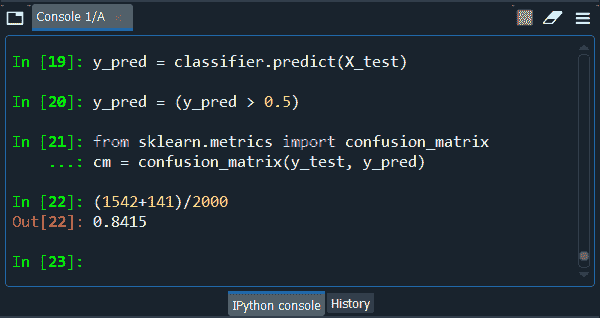

因此，我们可以看到，我们在新的观测上获得了 84%的准确率，而我们并没有对新的观测训练神经网络，即使这样也获得了很高的准确率。因为这与我们在训练集中获得的精度相同，但也是在测试集中获得的。

因此，最终，我们可以验证我们的模型，现在银行可以使用它对他们的客户进行排名，按照他们离开银行的概率进行排名，从离开银行的概率最高的客户到离开银行的概率最低的客户。

* * *