# 卷积神经网络

> 原文：<https://www.javatpoint.com/keras-convolutional-neural-network>

卷积神经网络是一种特殊类型的前馈ANN，其神经元之间的连接模式受视觉皮层的启发。

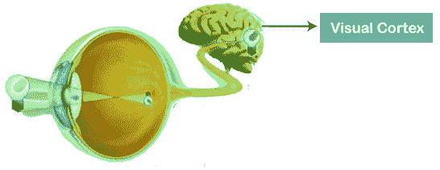

视觉皮层包含一小部分对视野敏感的细胞区域。在某些特定方向边缘存在的情况下，只有一些单独的神经元细胞在大脑中被激发，例如一些神经元在暴露于垂直边缘时做出反应，然而一些神经元在暴露于水平或对角边缘时做出反应，这只是卷积神经网络背后的动机。

卷积神经网络，也称为协网络，只不过是共享参数的神经网络。假设有一个形象，体现为一个长方体，它包括长、宽、高。这里，图像的尺寸由红色、绿色和蓝色通道表示，如下图所示。

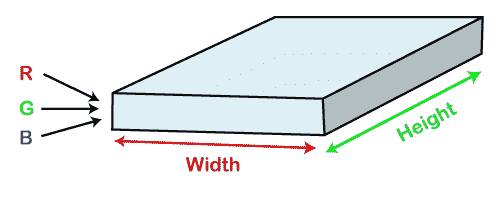

现在假设我们拍摄了同一张图像的一小块，然后在上面运行一个小的神经网络，具有 k 个输出，以垂直方式表示。现在，当我们在整个图像上滑动我们的小神经网络时，它将导致另一个图像构成不同的宽度、高度以及深度。我们会注意到，我们遇到的不是 R、G、B 通道，而是更多的通道，宽度和高度也更小，这实际上就是卷积的概念。在这种情况下，如果我们实现了与图像相似的面片大小，那么它将是一个常规的神经网络。由于这个小补丁，我们有一些假发。

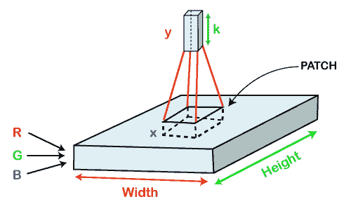

数学上可以这样理解:

*   卷积层包含一组可学习的过滤器，使得每个过滤器包含与所提供的输入体积一样小的宽度、高度和深度(如果图像是输入层，那么它可能是 3)。
*   假设我们想要在包含 34x34x3 维的图像上运行卷积，这样过滤器的大小可以是 axax3。这里的 a 可以是上述 3、5、7 等中的任何一个。与图像的尺寸相比，它必须很小。
*   在前向通过过程中，每个滤波器在整个输入音量范围内滑动。它一步一步地滑动，将每个单独的步骤称为一个步长，对于更高维的图像，该步长包含 2、3 或 4 的值，然后根据输入体积计算过滤器权重和面片之间的点积。
*   当我们滑动滤镜，然后将它们堆叠在一起，以获得与滤镜数量具有相似深度值的输出体积时，这将导致每个滤镜的二维输出。然后，网络会学习所有的过滤器。

## 美国有线电视新闻网工作

一般来说，卷积神经网络有三层，如下所示；

*   **输入:**如果图像由 32 个宽度、32 个高度组成，包含三个 R、G、B 通道，那么它将保存图像的原始像素([32x32x3])值。
*   **卷积:**它计算这些神经元的输出，这些神经元与输入的局部区域相关联，这样每个神经元将计算权重和输入体积中它们实际链接到的小区域之间的点积。例如，如果我们选择合并 12 个过滤器，那么它将产生[32x32x12]的体积。
*   **ReLU Layer:** 它专门用于元素方式应用激活函数，如最大(0，x)阈值为零。它会产生([32x32x12])，这与卷的大小不变有关。
*   **汇集:**该图层用于沿空间维度(宽度、高度)执行下采样操作，从而产生[16x16x12]体积。
    T3】
*   **局部连通:**它可以定义为一个规则的神经网络层，它接收来自前一层的输入，然后计算类别分数，并产生一个与类别数量大小相等的一维数组。
    T3】

我们将从输入图像开始，我们将对其应用多个特征检测器，这些检测器也被称为过滤器，以创建由卷积层组成的特征图。然后在该层的顶部，我们将应用 ReLU 或整流线性单元来消除图像中的任何线性或增加非线性。

接下来，我们将对卷积图层应用一个汇集图层，这样我们就可以从每个要素地图创建一个汇集要素地图，因为汇集图层的主要目的是确保我们的图像具有空间不变性。这也有助于减少我们的图像大小，以及避免任何类型的过度拟合我们的数据。之后，我们将把所有汇集的图像展平成所有这些值的一个长向量或列，然后将这些值输入到我们的ANN中。最后，我们将把它馈送到本地连接层，以实现最终输出。

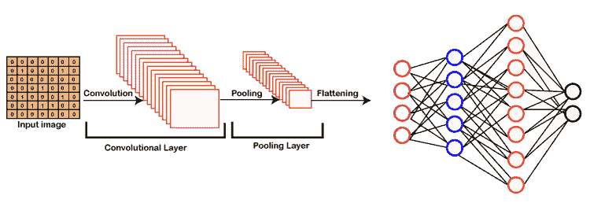

## 建立美国有线电视新闻网

基本上，卷积神经网络包括添加一个额外的层，称为卷积，它为人工智能或深度学习模型提供了一个视角，因为在它的帮助下，我们可以轻松地将 3D 帧或图像作为输入，而以前的ANN只能将包含一些特征的输入向量作为信息。

但是在这里，我们将在前面添加一个卷积层，它将能够像人类一样可视化图像。

在我们的数据集中，我们有训练中的猫和狗的所有图像，也有测试集文件夹中的图像。我们将在 4000 张猫的图像和 4000 张狗的图像上训练我们的 CNN 模型，每张图像分别出现在训练集中，然后用新的 1000 张猫的图像和 1000 张狗的图像评估我们的模型，每张图像分别出现在没有训练我们模型的测试集中。所以，我们实际上要建立和训练一个卷积神经网络来识别图像中是否有狗或猫。

为了实现 CNN，我们将使用 [Jupyter 笔记本](https://www.javatpoint.com/jupyter-notebook)。因此，我们将从导入库、数据预处理开始，然后构建 CNN、训练 CNN，最后，我们将进行单一预测。所有的步骤将以与我们在 ANN 中相同的方式执行，唯一的区别是，现在我们不是对经典数据集进行预处理，而是对一些图像进行预处理，这就是为什么数据预处理不同，将包括执行两个步骤，即在第一步中，我们将对训练集进行预处理，然后对测试集进行预处理。

第二部分，我们将构建 CNN 的整体架构。我们将把 CNN 初始化为一系列层，然后我们将添加卷积层，接着添加最大池层。然后，我们将添加第二个卷积层，使其成为深度神经网络，而不是浅神经网络。接下来，我们将进入展平层，将所有卷积和汇集的结果展平为一维向量，该向量将成为完全连接的神经网络的输入。最后，我们将所有这些连接到输出层。

第三部分先编译 CNN，然后在训练集上训练 [CNN](https://www.javatpoint.com/convolutional-neural-network-in-tensorflow) 。然后，最后，我们将做一个单一的预测来测试我们的模型，在一个预测中，当我们将有线电视新闻网部署到不同的图像上时，一个有一只狗，另一个有一只猫。

所以，这只是我们将如何建立我们的有线电视新闻网模型的简短描述，让我们开始它的实际实施。

我们将首先通过 Keras 库导入 [TensorFlow](https://www.javatpoint.com/tensorflow) 库和实际的预处理模块。然后，我们将导入 Keras 库预处理模块的图像子模块，这将允许我们在第 1 部分中进行图像预处理。

```

import tensorflow as tf
from keras.preprocessing.image import ImageDataGenerator

```

**输出**

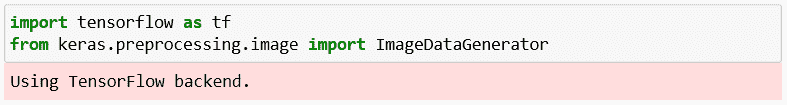

从上面给出的图片可以看出，我们已经成功运行了第一个细胞。使用 TensorFlow 后端，这是第一个单元的输出，为了让它这样工作，我们必须确保运行 TensorFlow 和 [Keras](https://www.javatpoint.com/keras) 的 pip 安装命令。

接下来，我们将检查TensorFlow的版本。

```

tf.__version__

```

**输出**

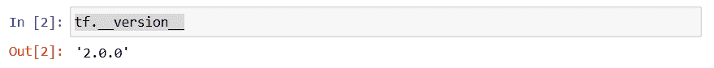

可以看到 TensorFlow 的版本是 2.0.0。

在这之后，我们将进入第 1 部分:数据预处理，这将分两步完成，即首先，我们将对训练集进行预处理，其次，我们将对测试集进行预处理。

### 第一部分:数据预处理

**预处理训练集**

我们将对训练集的所有图像应用一些变换，但不对测试集的图像应用，以避免过度拟合。事实上，如果我们在训练集上训练我们的 CNN 时不应用这些转换，我们将在训练集和测试集上获得巨大的准确性差异。

对于计算机视觉来说，避免过度拟合的方法是应用变换，这些变换只不过是简单的几何变换，或者对图像进行一些缩放或旋转。所以，基本上，我们将应用一些几何变换来移动一些像素，然后旋转一点图像，我们将做一些水平翻转，放大和缩小。我们实际上要应用一些系列的变换来修改图像，并对它们进行增强，这被称为图像增强。它实际上包括转换训练集的图像，这样我们的 CNN 模型就不会过度学习。

我们将创建 **ImageDataGenerator** 类的 **train_datagen** 对象，该对象表示将对训练集的图像应用所有变换的工具，这样， **rescale** 参数将通过将每个像素的值除以 255 来对每个像素应用特征缩放，因为每个像素取 0 到 255 之间的值，这对于神经网络来说是真正必要的，其余的是将对训练集图像执行图像增强的变换，以防止过度拟合。

```

train_datagen = ImageDataGenerator(rescale = 1./255,
                                   shear_range = 0.2,
                                   zoom_range = 0.2,
                                   horizontal_flip = True)

```

之后，我们需要将 **train_datagen** 对象连接到训练集，为此，我们需要导入训练集，可以按照下面给出的方式进行。这里**训练集**是我们在笔记本中导入的训练集的名称，然后我们确实拿我们的**训练集**对象来调用 **ImageDataGenerator** 类的方法。我们将调用的方法是 **flow_from_directory** ，它将有助于将图像增强工具连接到训练集的图像。我们将传递以下参数；

*   第一个参数是通向训练集的路径。
*   下一个参数是 target_size，这是将图像输入卷积神经网络时图像的最终大小。
*   第三个是 batch_size，它与批次的大小有关，即我们希望在每个批次中拥有的图像总数。我们选择了 32，这是经典的默认值。
*   最后，我们将把类模式分类为二进制或分类。既然我们在寻找二元结局，那么就要选择二元类模式。

```

training_set = train_datagen.flow_from_directory('dataset/training_set',
                                                 target_size = (64, 64),
                                                 batch_size = 32,
                                                 class_mode = 'binary')

```

**输出**

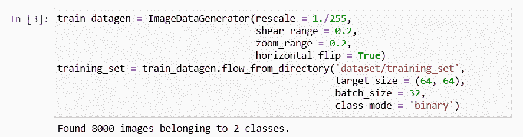

在运行了上面的单元，也就是预处理训练集之后，我们将从上面的图像中得到输出，这确实是我们用数据增强导入和预处理的；8000 张图片，分别属于狗和猫两类。

**预处理测试集**

在我们对训练集进行预处理之后，我们将进一步对测试集进行预处理。我们将再次使用 ImageDataGenerator 对象对测试图像应用转换，但是这里我们不会像上一步那样应用相同的转换。然而，我们需要像以前一样重新缩放它们的像素，因为有线电视新闻网的未来预测方法必须应用于与应用于训练集相同的缩放。

```

test_datagen = ImageDataGenerator(rescale = 1./255)

```

这里 **test_set** 是我们在笔记本中导入的测试集的名称，然后我们确实取了我们的 **test_datagen** ，只有到了测试集图像的像素点才会适用。然后我们调用同一个 **flow_from_directory** 函数从目录中访问测试集。那么我们将需要与上一步中使用的相同的 target_size、batch_size 和 class_mode。

```

test_set = test_datagen.flow_from_directory('dataset/test_set',
                                            target_size = (64, 64),
                                            batch_size = 32,
                                            class_mode = 'binary')

```

**输出**

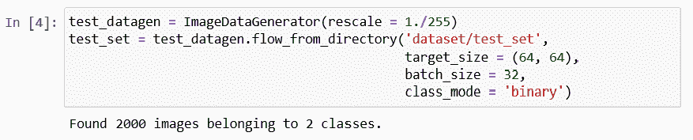

从上面运行预处理测试集单元后得到的图像中，我们可以看到 2000 幅图像属于 2 类。我们没有应用图像增强，只应用了特征缩放。

### 第二部分:建设美国有线电视新闻网

在第二部分中，我们将一起构建卷积神经网络，更具体地说，构建ANN的整个体系结构。所以，它实际上和我们的ANN一样，因为卷积神经网络仍然是一系列的层。

因此，我们要用同一个类初始化我们的 CNN，这个类就是顺序类。

**初始化 CNN**

这是第一步，我们不仅要调用序列类，还要创建 cnn 变量，它将代表这个卷积神经网络。这个 **cnn** 变量将再次被创建为序列类的一个实例，允许我们创建一个ANN作为一系列层。

首先，我们需要调用具有快捷方式 **tf** 的 TensorFlow，我们将从该快捷方式调用 Keras 库，我们将从该快捷方式访问模型的模块，或者我们可以说从该快捷方式调用该顺序类。

```

cnn = tf.keras.models.Sequential()

```

在这之后，我们将逐步使用 add 方法添加不同的层，无论它们是卷积层还是全连接层，最后是输出层。因此，我们现在要成功地使用 add 方法，从步骤 1:卷积开始。

**第一步:卷积**

我们将首先取 **cnn** 对象或卷积神经网络，我们将从中调用 add 方法来添加我们的第一个卷积层，它将进一步是某个类的对象，即 **Conv2D** 类。而这个类，就像允许我们构建全连通层的密集类一样，属于同一个模块，就是来自 Keras 库的层模块，但这次是 TensorFlow。

在类内部，我们将传递三个重要参数，如下所示:

*   第一个参数是**滤镜**，这是我们要应用于图像进行特征检测的特征检测器的数量。
*   **kernel_size** 正好是特征检测器的大小，即行数，也就是列数。
*   第三个是**激活**但是这里我们不打算保留激活函数对应的激活参数的默认值，因为确实只要我们没有到达输出层，我们更希望得到一个整流器激活函数。这就是为什么我们将再次选择 **ReLU** 参数名称，因为它对应于整流器激活功能。
*   最后是**输入 _ 形状**参数，因为需要指定输入的输入形状。因为我们正在处理彩色图像，所以 input_shape 将是[64，64，3]。

```

cnn.add(tf.keras.layers.Conv2D(filters=32, kernel_size=3, activation='relu', input_shape=[64, 64, 3]))

```

**第二步:汇集**

接下来，我们将继续应用池，更具体地说，如果我们谈论，我们将应用最大池，为此，我们将再次从 cnn 对象中调用我们的新方法。由于我们将池层添加到我们的卷积层，所以我们将再次调用 add 方法，在它里面，我们将创建一个 MaxPool2D 层的对象或某个类的实例，称为 **MaxPool2D** 类。课内，我们将**传池 _ 大小**和**大踏步**参数。

```

cnn.add(tf.keras.layers.MaxPool2D(pool_size=2, strides=2))

```

**增加第二层**

现在我们将添加我们的第二层，对于这一层，我们必须像上一步一样应用卷积层和汇集层，但是这里需要更改 **input_shape** 参数，因为只有当我们添加第一层以自动将第一层连接到输入层时，才会输入该参数，输入层会自动添加输入层。

因为我们已经在这里添加了第二个卷积层，所以我们可以简单地删除该参数。所以，我们都准备好进入第三步了。

```

cnn.add(tf.keras.layers.Conv2D(filters=32, kernel_size=3, activation='relu'))
cnn.add(tf.keras.layers.MaxPool2D(pool_size=2, strides=2))

```

**第三步:展平**

在第三步中，我们将对这些卷积的结果进行平坦化，并汇集成一维向量，该向量将以与上一节相似的方式成为完全连接的层神经网络的输入。我们将从再次获取我们的 **cnn** 对象开始，我们将从该对象调用 **add** 方法，因为我们将再次通过创建**flat**类的实例来创建展平层，这样 Keras 将自动理解这是所有这些卷积和汇集的结果，这些卷积和汇集将被展平为一维向量。

因此，我们只需要指定我们想要应用展平，为此，我们将不得不再次调用 TensorFlow 创建的 Keras 库的图层模块，我们将从该模块调用展平类，并且我们不需要在其中传递任何类型的参数。

```

cnn.add(tf.keras.layers.Flatten())

```

**第四步:全转换**

在第 4 步中，我们处于与构建完全连接的神经网络之前完全相同的情况。因此，我们将在展平的层上添加一个新的全连接层，它只是一个一维向量，将成为全连接神经网络的输入。为此，我们将再次从获取一个 **cnn** 神经网络开始，我们将从该网络调用 **add** 方法，因为现在我们将要添加一个新的层，它是属于 **tf.keras.layers** 的完全连接的层。但是这一次，我们将取**一个密集**类，后面是传递**个单位**，这是我们希望拥有的隐藏神经元数量进入这个全连通层和**激活函数**参数。

```

cnn.add(tf.keras.layers.Dense(units=128, activation='relu'))

```

**第五步:输出层**

这里我们需要添加最终的输出层，它将完全连接到前面的隐藏层。因此，我们将以与上一步相同的方式再次调用密集类，但会更改输入参数的值，因为输出层中的单元数量肯定不是 128。因为我们正在进行二进制分类，所以实际上是一个神经元将二进制类编码成“猫”或“狗”。而对于激活层，建议具有 sigmoid 激活功能。否则，如果我们进行多类分类，我们会使用 SoftMax 激活功能。

```

cnn.add(tf.keras.layers.Dense(units=1, activation='sigmoid'))

```

### 第三部分:训练美国有线电视新闻网

在前面的步骤中，我们构建了大脑，它包含在人工智能的眼睛中，现在我们将通过美国有线电视新闻网对我们所有训练集图像的训练来使大脑变得聪明，同时，我们将在不同时期的测试集上评估我们的相同模型。现在我们将训练我们的 CNN 超过 25 个纪元，在每个纪元，我们将实际上看到我们的模型在我们的测试集图像上的表现。这是一种与我们以前不同的培训，因为我们过去总是将培训和评估分开，但在这里，这将在我们进行一些特定应用(即计算机视觉)的同时发生。

**编译 CNN**

现在我们要编译 CNN，这意味着我们要把它连接到一个优化器、一个损失函数和一些指标。当我们再次进行二进制分类时，我们将像编译ANN模型一样编译我们的有线电视新闻网，因为实际上，我们将再次选择 **adam** 优化器来执行随机梯度下降以更新权重，从而减少预测和目标之间的损失误差。然后我们将选择相同的损失，即**二进制 _ 交叉熵**损失，因为我们正在做完全相同的任务二进制分类。然后同样对于度量，我们将选择**准确性**度量，因为这是衡量分类模型性能最相关的方法，这正是我们 CNN 的情况。

因此，我们将从 cnn 调用编译方法，该方法将优化器、损失函数和度量作为输入。

```

cnn.compile(optimizer = 'adam', loss = 'binary_crossentropy', metrics = ['accuracy'])

```

**在训练集上训练 CNN，在测试集上评估**

编译完成后，我们将在训练集上训练 CNN，然后在测试集上同时进行评估，测试集不会与之前完全相同，但会有些相似。基本上，前两个步骤总是相同的，即在第一步中，我们将采用 cnn，然后在第二步中采用 fit 方法，该方法将在训练集上训练 cnn。在其中，我们将传递以下参数:

*   第一个参数是集合，它偏离了我们要在其上训练模型的数据集(**训练集**)，该参数的名称简单地说就是在第 1 部分中创建的 X。
*   第二个参数是与我们之前所做的不同。因此，这当然与我们不仅在训练集上训练 CNN，而且在测试集上同时对其进行评估的事实有关。这正是我们的第二个参数对应的，所以我们将在这里指定**验证数据**(测试集)，这是我们想要评估我们的 CNN 的集。
*   最后是纪元参数，即纪元的数量。这里我们选择了 25 个时期，不仅在训练集上，而且在测试集上收敛精度。

```

cnn.fit(x = training_set, validation_data = test_set, epochs = 25)

```

**输出**

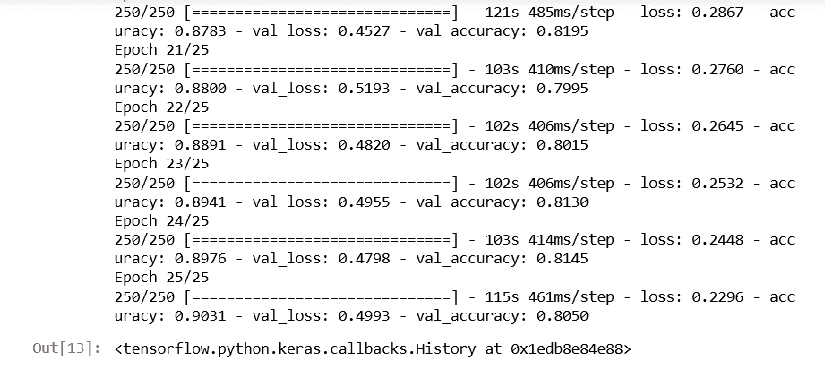

从上面给出的图片可以看出，我们在训练集上的最终准确率为 **90%** ，在测试集上的最终准确率为 **80.50%** 。让我们再次提醒它，如果我们没有在第 1 部分中进行图像增强预处理，我们将在训练集上以大约 **98%** 甚至 **99%** 的精度结束，这清楚地表明**过度拟合**，并且在测试集上以大约 **70%** 的精度降低。这就是为什么我们坚持图像增强绝对是根本的原因。

### 第四部分:做一个单一的预测

在第 4 部分中，我们将进行一个单独的预测，这实际上包括将我们的模型部署在这个单独预测文件夹的两个单独的图像上，对于这两个图像，我们的模型将分别识别狗和猫。所以，基本上，我们将在每一张图片上部署我们的有线电视新闻网模型，我们将希望我们的有线电视新闻网成功地预测一只狗和一只猫。为此，我们将从导入开始。接下来，我们将导入一个之前实际导入的新模块，即从 **Keras** 库预处理模块的图像子模块导入 **ImageDataGenerator** 。事实上，我们现在要导入的是图像模块。但是因为我们专门从那个模块中导入了一些特定的东西，所以我们需要再次导入它。

因此，我们将从 **Keras** 开始，这将帮助我们访问预处理模块，我们将从该模块进一步导入图像模块。下一步当然是加载我们想要部署模型的单个图像，以预测里面是否有猫或狗。我们将创建一个新的变量，即 **test_set** ，它将通过从同一个预测文件夹加载我们想要测试模型的图像来初始化。这可以通过首先调用**图像**子模块来实现，我们将从该子模块调用 **load_img** 函数，在该函数中，我们将简单地传递两个参数，即第一个参数是**路径**，指定我们想要选择的特定图像，该图像将实际上引导我们到 test_set 图像变量，第二个参数起着至关重要的作用，因为它与将成为预测方法输入的图像相关，该图像必须具有与训练期间使用的图像相同的大小。

由于我们实际上将我们的图像大小调整为(64，64)的大小目标，无论是针对训练集还是测试集，并且我们还在构建具有相同输入形状的 CNN 时再次指定了它，因此我们要处理的图像大小必须是(64，64)，无论是训练 CNN 还是调用 predict 方法。所以，为了在这里指定，我们将输入我们的第二个参数，即 **target_size。**

```

import numpy as np
from keras.preprocessing import image
test_image = image.load_img('dataset/single_prediction/cat_or_dog_1.jpg', target_size = (64, 64))

```

但是要使我们的第一个 test _set 图像被 predict 方法接受，我们需要将图像的格式转换为数组，因为 predict 方法期望它的输入是 2D 数组。我们将借助于图像预处理模块的另一个函数来实现这一点，即 **img_to_array** 函数，该函数确实将 **PIL 图像**实例转换为 **NumPy 数组**，这正是预测方法所期望的数组格式。我们将再次使用我们的图像子模块，我们将从其中调用 **img_to_array()** ，在内部，它将采用我们期待将其转换为 NumPy 数组格式的 PIL 格式的 test_size 图像。

```

test_image = image.img_to_array(test_image)

```

由于预测方法必须以与训练期间使用的完全相同的格式调用，因此，如果我们返回到训练集和测试集的预处理阶段，我们将创建成批的图像。因此，我们的 CNN 没有接受过任何单一形象的训练；相反，它是在成批的图像上训练的。因此，当我们有一个额外的批处理维度，并且我们将要在单个图像上部署我们的模型时，那么该单个图像仍然必须在批处理中，即使我们将在批处理中有一个图像，它也必须在这个批处理中，以便我们的 CNN 模型的预测方法可以将该批处理识别为该额外的维度。

接下来，我们将添加一个额外的维度，它将对应于将包含该图像的批处理，这可以简单地通过添加对应于批处理的额外维度来更新我们的测试图像来完成。方法是使用 **NumPy** ，因为 NumPy 数组很容易操作，所以我们将首先调用 NumPy，我们将从它调用这个函数，该函数允许添加一个假维度，或者我们可以说一个与批处理相对应的维度， 该函数被称为 **expand_dims** 函数，在该函数中，我们将输入我们想要添加的图像，该图像对应于该批次，然后添加一个额外的参数，即，我们想要添加该额外的维度，使得该批次的维度始终是我们总是给予第一批图像的第一个维度，然后在每个批次中，我们获得不同的图像。 因此，将批次作为第一个维度并指定这正是我们需要输入的第二个参数似乎是很自然的，这就是我们必须设置为零的**轴**。这就是为什么我们想要添加到图像中的批次的维度将是第一维度。

```

test_image = np.expand_dims(test_image, axis = 0)

```

在此之后，我们可以称之为预测方法，因为实际上，测试集图像不仅在正确的 NumPy 数组中，而且具有对应于批次的额外维度，具有预测方法所期望的正确格式。

因此，我们可以创建一个新的变量，它将调用 result，因为它实际上将使用测试图像预测我们的 CNN 模型。这里我们不称之为预测，因为它只会返回或零或一，这就是为什么我们需要编码，以表示 0 与猫有关，1 是狗。因此，我们将调用我们的第一个结果变量，它实际上是从我们的 CNN 调用的预测方法的输出。在预测方法中，我们将通过 **test_image** ，它现在具有该预测方法所期望的正确格式。

```

result = cnn.predict(test_image)

```

为了弄清楚 0 和 1 之间的关系，我们将调用**训练集**或**测试集**，然后我们将进一步调用**类索引**，这样通过打印它，我们将得到正确的类索引。这样，我们确实得到狗对应于 1，猫对应于 0。

```

training_set.class_indices

```

最后，当对这两张单独的图像做出两个单独的预测时，我们将使用 if 条件来结束它。因为我们已经知道结果包含批次中的结果，因为它是在批次中的测试图像上调用的，所以结果也有批次维度，我们将访问该批次。

之后，在该批次内部，我们将访问该批次的第一个元素，该元素对应于同一 **cat_or_dog_1** 图像的预测。由于我们处理的是单个图像，因此需要单个预测，为了获得该预测，我们需要进入索引为零的批次，这是第一个也是唯一一个预测，索引为[0]。因此，这就是我们如何通过首先访问批处理，然后访问批处理的单个元素来获得我们的预测，如果该预测等于 1，那么我们已经知道它对应于狗，然后我们将创建一个新的变量，我们称之为预测，并将该预测变量设置为狗。同样，在 else 条件下，如果结果预测等于 1，那么预测将是一只猫。现在我们将通过简单地打印预测来结束它。

```

if result[0][0] == 1:
  prediction = 'dog'
else:
  prediction = 'cat'

print(prediction)

```

**输出**

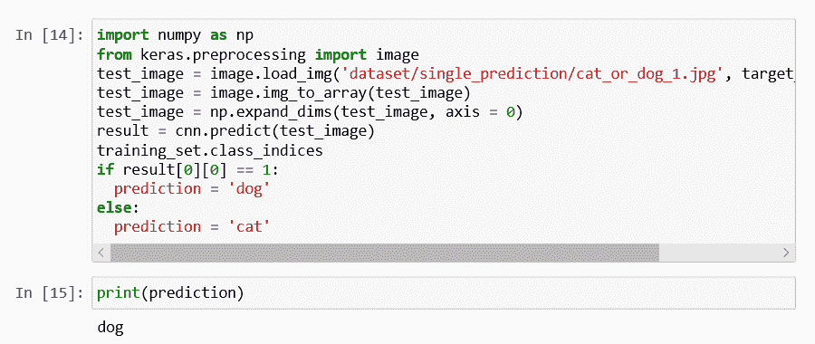

我们可以看到我们的卷积神经网络预测图像里面有一只狗。所以，可以断定我们的第一次测试成功通过了。

现在我们将检查另一张猫的图片，因此我们需要在这张图片上部署我们的模型，并检查我们的 CNN 是否返回了一只猫。为此，我们需要在这里更改名称，即 **cat_or_dog_2.jpg** ，然后点击 Run 按钮再次播放该单元格。

```

import numpy as np
from keras.preprocessing import image
test_image = image.load_img('dataset/single_prediction/cat_or_dog_2.jpg', target_size = (64, 64))
test_image = image.img_to_array(test_image)
test_image = np.expand_dims(test_image, axis = 0)
result = cnn.predict(test_image)
training_set.class_indices
if result[0][0] == 1:
  prediction = 'dog'
else:
  prediction = 'cat'

print(prediction)

```

**输出**

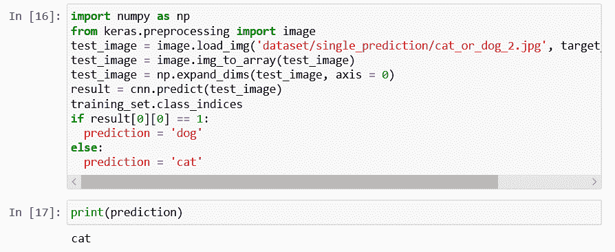

所以，现在很明显，我们的 CNN 模型在控制台的输出中成功预测了 cat。因此，我们的有线电视新闻网得到了所有正确的答案。

* * *