# 递归神经网络

> 原文：<https://www.javatpoint.com/keras-recurrent-neural-networks>

## 为什么不是前馈网络？

前馈网络用于图像分类。让我们通过下面给出的一个例子来理解前馈网络的概念，在这个例子中，我们训练了我们的网络来对各种动物图像进行分类。如果我们喂养一只猫的图像，它将识别该图像，并为该特定图像提供相关标签。类似地，如果你喂养一只狗的图像，它也会为该图像提供一个相关的标签，一个特定的图像。

请考虑下图:

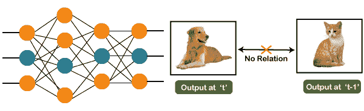

如果你注意到我们得到的新输出是分类，狗和猫的先前输出没有关系，或者你可以说在时间 **t** 的输出独立于时间 **t-1** 的输出。可以清楚地看到，新的输出和以前的输出之间没有关系。因此，我们可以说在前馈网络中，输出是相互独立的。

在一些场景中，我们实际上需要以前的输出来获得新的输出。让我们讨论一个这样的场景，在这个场景中，我们需要使用之前获得的输出。

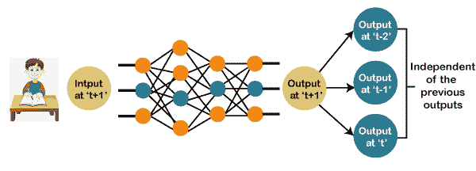

现在，当你读一本书时会发生什么。只有理解了前面的单词，你才会理解那本书。因此，如果我们使用前馈网络并试图预测句子中的下一个单词，那么在这种情况下，我们将无法做到这一点，因为我们的输出实际上取决于以前的输出。但在前馈网络中，新的输出与之前的输出无关，即在“ **t+1** 的输出与在“ **t-2** ”、“ **t-1** ”和“ **t** 的输出无关。”因此，可以得出结论，我们不能使用前馈网络来预测句子中的下一个单词。同样，在我们需要以前的输出或以前输出的一些信息的地方，也可以采取许多其他的例子，从而推断出新的输出。

### 如何克服这个挑战？

请考虑下图:

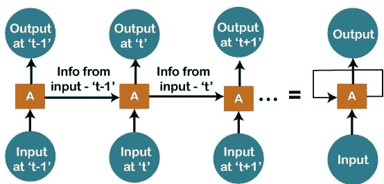

我们在' **t-1** 处有输入，我们将输入到网络中，然后我们将在' **t-1** 处得到输出。然后在下一个时间戳，即在时间“ **t** ”处，我们有一个在时间“ **t** ”处的输入，该输入将与来自前一个时间戳的信息，即“ **t-1** ”一起再次被给予网络，这将进一步帮助我们获得在“ **t** ”处的输出。类似地，在输出端为“ **t+1** ，我们有两个输入；一个是我们给出的新输入，另一个是来自之前时间戳的信息，即“ **t** ”为了得到一次的输出“ **t+1** ”。同样的，它还会这样继续下去。这里我们已经用更一般化的方式体现了它。有一个循环，来自前一个时间戳的信息在其中流动，这就是我们解决特定挑战的方法。

## 什么是递归神经网络？

“递归网络就是这样一种人工神经网络，主要用于识别数据序列中的模式，如文本、基因组、手写、口语、从传感器、股票市场和政府机构发出的数字时间序列数据”。

为了理解递归神经网络的概念，让我们考虑以下类比。


假设你的健身教练为你制定了一个时间表。这些练习每三天重复一次。上图包括你练习的顺序；在你的第一天，你会做肩膀，第二天你会做二头肌，第三天你会做有氧运动，所有这些练习都以适当的顺序重复。

让我们看看如果我们使用前馈网络来预测今天的练习会发生什么。

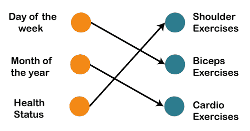

我们在输入中提供了诸如一周中的某一天、一年中的某一个月和健康状况。此外，我们需要在过去练习的基础上训练我们的模型或网络。在那之后，会有一个复杂的投票程序，这将为我们预测演习，这个程序不会那么准确。在这种情况下，无论我们得到什么样的输出，都将如我们所希望的那样准确。现在，如果输入发生变化，我们将输入作为前一天的练习。

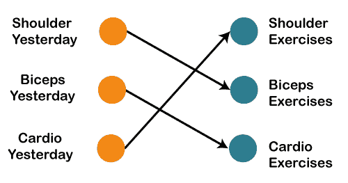

所以，如果肩膀是昨天做的，那么今天肯定会是二头肌日。同样，如果二头肌是昨天做的，那么今天将是有氧运动日，如果昨天是有氧运动日，那么今天，我们将需要进行肩部锻炼。

现在可以有这样一个场景，你因为一些个人原因不能去健身房一天，那么如果是这样的话，我们将返回一个时间戳，并将输入前天发生的锻炼，如下所示。

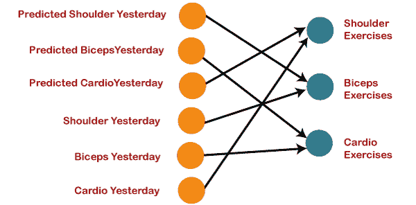

所以，如果前天发生的运动是肩膀，那么昨天就有二头肌的运动。同样，如果二头肌发生在前天，那么昨天应该是有氧运动，如果有氧运动发生在前天，那么昨天应该是肩部运动。对昨天发生的练习的预测将反馈到我们的网络中，以便这些预测可以用作输入，从而预测今天将发生什么练习。同样，如果你错过了你的健身房，比如两天、三天甚至一周，你实际上需要回滚，这意味着你需要去健身房的最后一天，你需要弄清楚那天你做了什么练习，然后只有你会得到关于今天会发生什么练习的相关输出。

接下来，我们将把所有这些东西转换成一个向量，它只不过是一个数字列表。

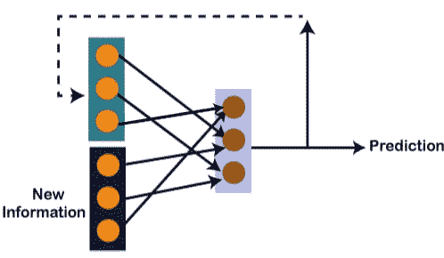

因此，除了我们在先前时间戳从预测中获得的信息之外，还有新的信息，因为我们需要所有这些信息来获得在时间' **t** '的预测。假设你昨天做了肩部练习，那么，在这种情况下，预测将是二头肌练习，因为如果肩膀是昨天做的，那么今天肯定是二头肌，输出将是 **0，1** ，和 **0** ，这实际上是我们向量的工作。

让我们简单地看一下下面给出的图片，来理解[递归神经网络](https://www.javatpoint.com/recurrent-neural-network-in-tensorflow)背后的数学原理。

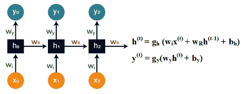

假设“ **w** ”为权重矩阵， **b** 为偏差。考虑到在时间 **t=0** 时，我们的输入是“ **x <sub>o</sub>** ”，我们需要弄清楚到底什么是“ **h <sub>o</sub>** ”。我们将公式中的 **t=0** 代入，如图所示，得到函数 **h <sup>t</sup>** 值。

之后，我们将使用之前应用于新公式时计算的值，找出“ **y <sub>o</sub>** 的值。

相同的过程在模型内的所有时间戳中反复重复，以便对其进行训练。这就是递归神经网络的工作原理。

### 训练递归神经网络

递归神经网络使用反向传播算法进行训练，但是每个时间戳都会发生反向传播，这就是为什么它通常被称为时间反向传播。对于反向传播，有一些问题，即消失和爆炸的梯度，我们将一个接一个地看到。

**消失渐变**

请考虑下图:

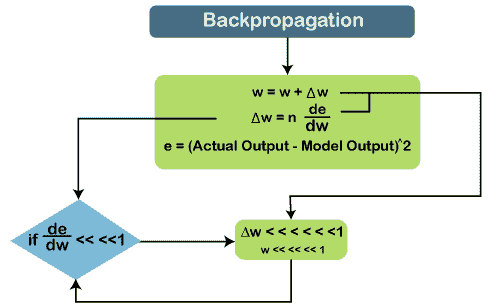

在消失梯度中，当我们使用反向传播时，我们倾向于计算误差，它只不过是我们已经知道的实际输出减去我们通过模型得到的模型输出及其平方，因此我们可以计算出误差，借助于该误差，我们倾向于找出误差相对于重量或任何变量变化的变化，这里称为重量。

因此，误差相对于权重变化的变化乘以学习率，将给出学习率的变化。然后我们将这个重量变化加到旧重量上，得到一个新重量。基本上，这里我们试图减少误差，为此，我们需要弄清楚如果变量发生变化，误差会有什么变化，通过这种方法，我们可以得到变量的变化，并将其添加到旧变量中，得到新变量。

在这里，如果值**de‖dw**，即梯度，或者简单地说，相对于权重变量，误差的变化率变得非常小于 1，如果我们将其乘以学习率，学习率肯定小于 1，那么，在这种情况下，我们将得到权重的变化，这是可以忽略的。

考虑一个场景，你需要预测句子中的下一个单词，你的句子就像“我去过美国”。然后是很多话后那几个人说话，然后你需要预测说话后会发生什么。现在，如果你需要这样做，那么你将不得不回去理解它所谈论的内容的背景，这只不过是我们的长期依赖。在长期的依赖关系中，**de‖dw**变得很小，然后再乘以 ***n*** ，这个又比 **1** 小，就得到**δw**，这个会很小或者根本可以忽略不计。所以，你将在这里获得的新权重将几乎等于你的旧权重，这样权重就不会进一步更新。还有，这里不会有学习，无非就是渐变消失的问题。

同样，如果我们谈论爆炸梯度，它实际上与消失梯度相反。考虑下图，以便更好地理解它。

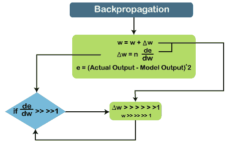

如果**de‖dw**变得非常大或者大于 **1** 并且我们有一些长期的依赖关系，那么，在这种情况下，**de‖dw**将继续增加，并且**δw**将变得非常大，这将使新的权重不同于旧的权重。这是反向传播的两个问题，现在我们来看看如何解决这些问题。

### 如何克服这些挑战？

| 爆炸渐变 | 消失渐变 |
| 爆炸梯度可以通过时间的**截断 BTT** 反向传播来解决，所以我们可以选择一些更小的时间戳，比如 10，而不是开始反向传播作为最后一个时间戳。 | 对于消失的梯度，我们可以利用**的 ReLU 激活功能**，在计算梯度时产生输出。 |
| 另外，我们可以**在阈值**处剪辑渐变。因此，可以有一个阈值，我们可以在这里裁剪渐变。 | 我们也可以集成 **RMSprop** 在梯度高于阈值时进行裁剪。 |
| 我们也用 **RMSprop** 来调整学习率。 | 类似地， **LSTM** 和 **GRUs** 也可以合并为专门设计的网络架构，因为它们是为解决这个问题而制造的。 |

## 长短期记忆网络

长短期记忆网络是一种特殊的递归神经网络，能够学习长期依赖关系。

### 什么是长期依赖？

为了在模型中执行问题，我们只需要最近的数据，这种情况已经发生了很多次。但与此同时，我们可能还需要以前获得的数据。

考虑下面的例子来更好地理解它。

让我们假设有一种语言模型，它试图在先前单词的基础上预测下一个单词。假设我们试图预测句子中的最后一个词，说:*“汽车在路上行驶”。*

这里的上下文很简单，因为最后一个词总是以一条路结束。通过结合递归神经网络，以前的信息和现有的需求之间的差距可以很容易地联系起来。

这就是为什么消失和爆炸梯度问题不存在的原因，然后使这个 LSTM 网络容易处理长期依赖。

LSTM 包含一层链状的神经网络。在标准递归神经网络中，重复模块由一个单一函数组成，如下图所示:

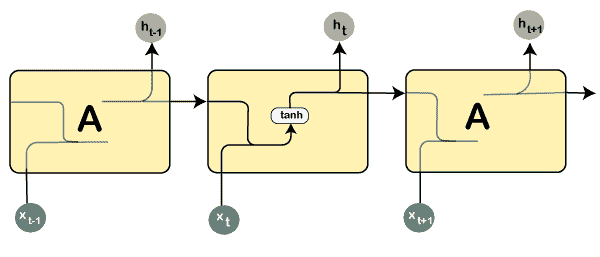

从上面给出的图片可以看出，图层中有一个 **tanh** 函数，叫做**挤压函数**。那么，什么是挤压功能？

挤压功能主要用在 **-1** 到 **+1** 的范围内，这样可以根据输入来操纵数值。

现在，让我们考虑一下 LSTM 网络的结构:

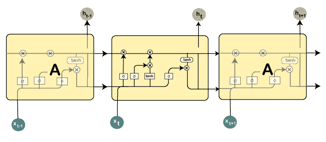

当涉及到 LSTM 网络时，这些层中存在的所有功能都有它们自己的结构。单元状态由水平线表示，充当传送带，通过数据通道线性传送数据。

让我们考虑一个循序渐进的方法来更好地理解 LSTM 网络。

**第一步:**

在 LSTM 的第一步是识别那些不需要的信息，这些信息将从细胞状态中丢弃。这个决定是由一个 **sigmoid 层**做出的，这个层叫做**忘记门层**。

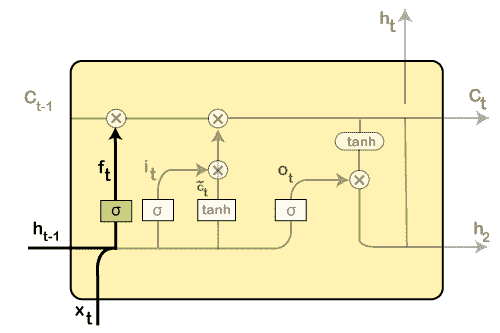

上面突出显示的层是前面提到的 sigmoid 层。

计算是通过考虑新的输入来完成的，而先前的时间戳是，这最终导致在该单元状态下每个数字输出一个介于 **0** 和 **1** 之间的数字。

作为一个典型的二进制数， **1** 代表让**保持**细胞状态，而 **0** 代表让**丢弃**细胞状态。

**f<sub>t</sub>=σ(w<sub>f</sub>【h<sub>t-1</sub>、x<sub>t</sub>]+b<sub>f</sub>**

其中，w <sub>f</sub> =重量

h <sub>t-1</sub> =来自先前时间戳的输出

x <sub>t</sub> =新输入

b <sub>f</sub> =偏差

考虑到性别分类问题，当我们使用网络时，有必要观察正确的性别。

**第二步:**

接下来，我们将决定在单元状态中存储哪些信息。它还包括以下步骤:

*   **sigmoid 层**，也称为“输入门层”，将决定需要更新的值。
*   创建一个新的候选值向量，以便它们可以通过**层**添加到状态中。

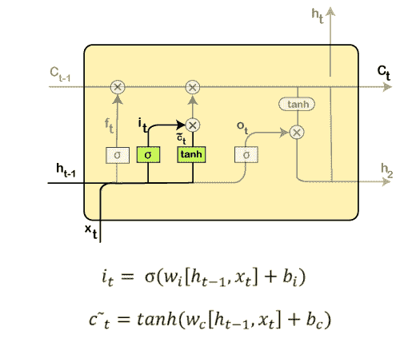

然后，新的输入，以及前面时间戳的输入，将通过一个 sigmoid 函数，得到值 **i(t)** ，然后乘以 **c(t)** ，然后将其添加到**单元状态**。

在下一步中，我们将两者结合起来，以便更新状态。

**第三步:**

在第 3 <sup>步</sup>中，先前的细胞状态 **Ct-1** 将被更新为新的细胞状态 **Ct** 。

为此，我们需要将旧状态 **(Ct-1)** 乘以 **f(t)** ，将我们之前认为决定离开的事情放在一边。

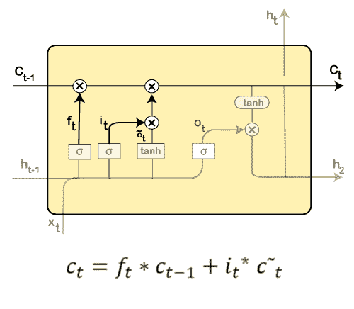

接下来，我们将添加**I _ t * c \\\u t**，这是**的新候选**值。它实际上已经根据我们想要更新每个状态值的程度进行了缩放。

在第二步中，我们决定利用数据，这只是在那个阶段需要的。然而，在第三步中，我们已经执行了它。

第四步:

在第 4 <sup>步</sup>中，我们将运行 **sigmoid 层**，它将决定将产生输出的单元状态的那些部分。

接下来，我们将通过 **tanh** 来设置单元状态，这意味着我们将在 **-1** 和 **1** 之间的范围内推送值。

然后，进一步地，我们将它与 **sigmoid 门的输出**相乘，这样只有决定的部分产生输出。

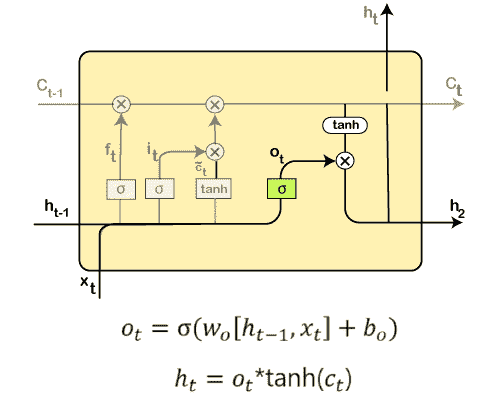

在这一步中，我们将进行一些计算，从而得到输出。

然而，输出只包括在前面的步骤中决定转发的输出，而不是所有的输出。

快速回顾一下:

*   首先，我们找出要丢弃的内容。
*   然后在第二步中，它包括新添加到网络的输入。
*   在第三步中，将先前获得的输入进行组合，以产生新的单元状态。
*   最后，我们达到了要求的产量。

## 建设 RNN

在深度学习的第三部分，即递归神经网络中，我们将在这一部分解决一个非常具有挑战性的问题；我们要预测一下谷歌的**股价。确实存在一种布朗运动，它表明股票价格的未来变化与过去无关。因此，我们将尝试预测谷歌股价存在的上升和下降趋势。为此，我们将实施 LSTM 模式。**

我们将打造一个 LSTM，试图捕捉谷歌股价的下跌和上涨趋势，因为 LSTM 是唯一一个能够做到这一点的强大模型，因为它的表现比传统模型好得多。除此之外，我们不会执行简单的 LSTM 模式。这将是超级稳健的一些高维度，几个层，以及它将是一个堆叠的 LSTM，然后我们将添加一些脱落正则化，以避免过度拟合。此外，我们将使用 Keras 库中最强大的优化器。

为了解决这个问题，我们将在从 2012 年初到 2016 年底的五年谷歌股票价格上训练我们的 LSTM 模型，然后基于这个训练以及识别的相关性或由 LSTM 捕获的谷歌股票价格，我们将尝试预测 2017 年的第一个月。我们将试图预测 2017 年 1 月，同样，我们不会准确预测股价，但我们试图预测谷歌股价的涨跌趋势。

在这里，我们使用 Spyder IDE 来实现我们的 RNN 模型。因此，我们将从导入第 1 <sup>st</sup> 部分的基本库开始，即数据预处理，然后导入训练集，然后我们将构建 RNN。最后，我们将进行预测，并将结果可视化。

### 第一部分:数据预处理

像往常一样，我们将从导入基本库开始，我们将使用与早期模型相同的方式来实现 RNN。所以，我们有 [**NumPy**](https://www.javatpoint.com/numpy-tutorial) 可以让我们制作一些数组，这些数组是神经网络唯一允许的输入，而不是数据帧。然后我们有 **matplotlib.pyplot，**我们将使用它来可视化最终的结果。最后，**熊猫**能够导入数据集并轻松管理它们。

```

# Importing the libraries
import numpy as np
import matplotlib.pyplot as plt
import pandas as pd

```

**输出:**

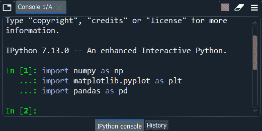

从上图可以看出，我们已经成功导入了这些库。

接下来，我们将导入训练集，而不是整个训练集，这与第 1 部分和第 2 部分相反，因为我们想要强调的是，我们将只在训练集上训练我们的 RNN。

RNN 不会知道测试环境中发生了什么。它在训练过程中对测试集一无所知。就好像 RNN 不存在测试集。但是一旦训练完成，我们将把测试集引入 RNN，这样它就可以对 2017 年 1 月的未来股价做出一些预测。这就是为什么我们现在只导入训练集，训练完成后，我们将导入测试集。

因此，要导入训练集，我们首先需要将数据作为数据帧导入，我们将使用 **read_csv** 函数与熊猫一起导入。但是请记住，我们不仅要选择我们需要的正确的列，这是开放的谷歌股票价格，而且，我们需要使它成为一个 NumPy 数组，因为只有 NumPy 数组可以作为 Keras 中神经网络的输入。

```

# Importing the training set
dataset_train = pd.read_csv('Google_Stock_Price_Train.csv')
training_set = dataset_train.iloc[:, 1:2].values

```

**输出:**

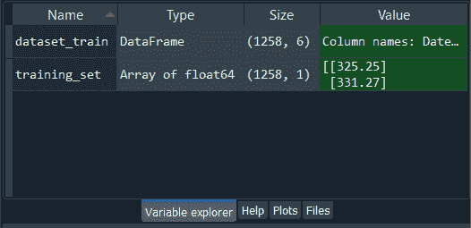

从上图我们可以看到 **dataset_train** 是**data frame****training _ set**是 2012-2016 年间 1258 只股票价格对应的 1258 行的 [**NumPy 数组**](https://www.javatpoint.com/numpy-array) ，一列，是开放的谷歌股价。我们可以通过逐个点击**数据集 _ 训练**和**训练 _ 集合**来打开它们。

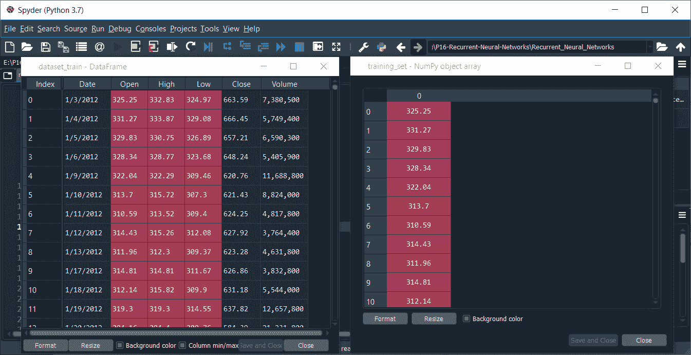

现在我们可以从上面的图片中精确地检查出，训练集中打开的谷歌股票价格具有相同的行数，即相同数量的股票价格。所以，我们有一个一列的 NumPy 数组，但没有向量。

之后，我们将对我们的数据应用特征缩放来优化训练过程，特征缩放可以通过两种不同的方式完成，即**标准化**和**归一化**。在标准化中，我们用同一列中所有观测值的平均值减去观测值，然后除以标准差。然而，在归一化中，我们用所有观测值的最小值，即最低股价减去观测值，然后用所有股价的最大值减去所有股价的最小值来除它。

所以，这个时候更适合使用**归一化**，因为每当我们构建一个 RNN 时，尤其是当递归神经网络的输出层有一个 **sigmoid** 函数作为激活函数时，建议应用归一化。因此，我们将应用规范化，为此，我们将从 scikit learn 库的预处理模块导入 min-max k-load 类，然后从该预处理模块导入 **MinMaxScaler** 类。

现在从这个类开始，我们将创建同一个类的一个对象，我们称之为 **sc** 用于缩放。而 sc 将是 **MinMaxScaler** 类的对象，我们将在其中传递默认参数，即 **feature_range** 。这里我们把 **feature_range** 设为等于 **(0，1)** ，因为如果我们看一下归一化的情况，我们会看到所有新的缩放的股票流程都会在 0 到 1 之间，这正是我们想要的。

接下来，我们将对数据应用 **sc** 对象，以有效地应用规范化。为此，我们将引入一个新的变量，该变量将是缩放的训练集，因此我们将其命名为 **training_set_scaled，**，为了获得归一化的训练集，我们将简单地采用 **sc** 对象，然后应用 **fit_transform** 方法，该方法是 **MinMaxScaler** 类的方法，以便将 **sc** 对象拟合到我们将输入的**训练集**作为参数，然后基本上，**拟合**意味着只需要得到数据的最小值，即最小股价和最大股价，就能够得到归一化公式。然后，用**变换**的方法，它将根据公式为训练集的每个股票价格计算缩放后的股票价格。

```

# Feature Scaling
from sklearn.preprocessing import MinMaxScaler
sc = MinMaxScaler(feature_range = (0, 1))
training_set_scaled = sc.fit_transform(training_set)

```

**输出:**

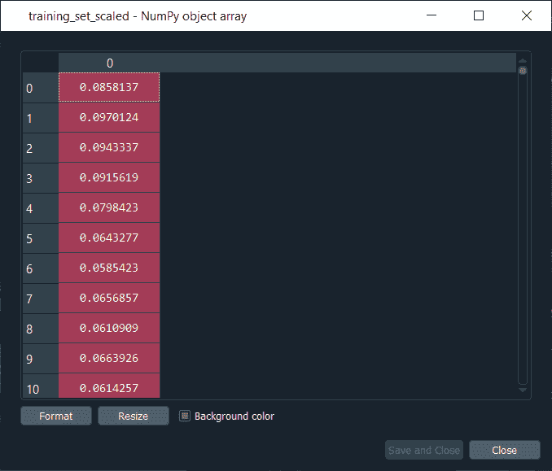

执行完以上几行代码后，我们将获得我们的**训练 _set_scaled** ，如上图所示。如果我们看一下，我们可以看到所有的股票价格都在 **0** 和 **1** 之间正常化了。

下一步，我们将创建一个特定的数据结构，这是递归神经网络数据预处理最重要的一步。基本上，我们将创建一个数据结构，指定 RNN 在预测下一个股价时需要记住什么，这实际上被称为时间步长的数量，拥有正确的时间步长数量非常重要，因为错误的时间步长数量可能会导致过度拟合或无根据的预测。

因此，我们将创建 60 个时间步长和 1 个输出，这样 60 个时间步长意味着在每个时间 T，RNN 将回头看时间 T 之前的 60 个股票价格，即时间 T 之前 60 天和时间 T 之间的股票价格，并且基于趋势，它将在这 60 个先前的时间步长期间捕捉，它将尝试预测下一个输出。因此，60 个时间步长的过去信息，我们的 RNN 将从中学习和理解一些相关性或一些趋势，并基于它的理解，它将尝试预测下一个输出，即在时间 t+1 的股票价格。还有，60 个时间步长是指之前的 60 个金融日，由于一个月有 20 个金融日，所以 60 个时间步长对应三个月，也就是说我们每天都要看之前的三个月，试图预测第二天的股价。

所以，我们首先需要创建两个独立的实体；我们将创建的第一个实体是 **X_train** ，它将是神经网络的输入，第二个将是包含输出的 **y_train** 。基本上，对于每个观察，或者我们可以说对于每个金融日，X_train 将包含该金融日之前的 60 个以前的股价，y_train 包含下一个金融日的股价。我们将开始初始化这两个独立的实体，即 X_train 和 y_train，作为一个空列表。

下一步是循环，因为我们将用 **X_train** 中的 **60 个先前股票价格**和**y _ train**中的**下一个股票价格**填充这些实体。所以，我们将从 60 开始循环，因为然后对于每一个 **i** ，这是股价观察的指标，我们将得到从 **i-60** 到 **i** 的范围，这正好包含了在 **t** 时刻股价之前的 60 个先前股价。因此，我们将从 **60** 开始范围，因为这样更容易找到上限，这偏离了我们观察的最后一个指标，即 **1258** 。在 for 循环中，我们将从 **X_train** 开始，它目前是一个空列表，因此我们将使用**追加**功能向 X_train 追加一些元素。我们将在指数 **i** 的股价前追加前 60 个股价，即 **i <sup>第</sup>个**个财务日的**个股价**。所以，为了得到它们，我们将得到我们的 **training_set_scaled** ，在这种情况下，我们将在 i <sup>第</sup>个金融日之前取 60 个以前的股价，这是从 **i-60** 到 **i** 的指数范围。因为我们已经为 X_train 选择了正确的行，但是我们仍然需要指定列，因为我们在缩放的训练集中有一列，即索引 0 的列，这正是我们在这里需要添加的。

现在，以同样的方式，我们将为 **y_train** 做，这将容易得多，因为我们只需要输入时间 t+1 的股价，因此我们只需要在这里做同样的事情。当然，t+1 的股价将取自 **training_set_scaled** ，在其中我们将对列取相同的指数，即 0，但是对于观察线，我们将取**I<sup>th</sup>T7】指数，因为如果我们考虑相同的例子，当我们有 **i** 等于 60 时，那么 X_train 将包含从 0 到 59 的所有股价，因为上限被排除了， 但我们要预测的其实是基于之前的 60 个股价，是 **t+1** 时刻的股价，也就是 60，这也是我们在这里输入 **i** 而不是 i+1 的原因。**

所以，现在我们有了 X_train 中的前 60 个股价和 y_train 中 t+1 时刻的股价。由于 X_trian 和 y_train 是列表，所以我们再次需要将它们做成 NumPy 数组，以便它们被我们未来的递归神经网络接受。

```

# Creating a data structure with 60 timesteps and 1 output
X_train = []
y_train = []
for i in range(60, 1258):
    X_train.append(training_set_scaled[i-60:i, 0])
    y_train.append(training_set_scaled[i, 0])
X_train, y_train = np.array(X_train), np.array(y_train)

```

**输出:**

一旦我们执行了上面给出的代码，我们就可以通过在变量资源管理器窗格中单击 X_train 和 y_train 来查看它们。

**X_train**

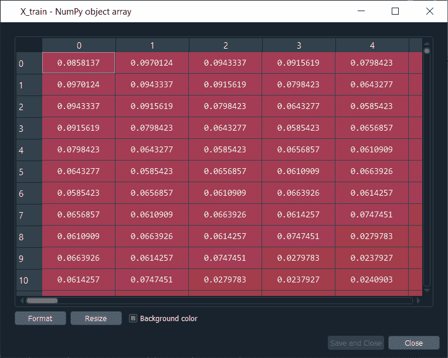

从上图可以看出， **X_train** 是一个**特殊数据结构**。这里第一条观察线对应的是时间 **t** 等于 **60** ，也就是说它对应的是我们训练数据集的 **60 <sup>第</sup>** 个金融日的股价。而所有这些数值都是**60**金融日该股价之前的前 60 个股价，也就是说这里有 59 个数值，这样如果我们看一下第一行，也就是观察 1 <sup>st</sup> 指数，对应的就是训练集第 61 <sup>st</sup> 金融日的股价。所有这些股价都是我们训练数据集的第 61 <sup>st</sup> 股价之前的预览股价。

**y_train**

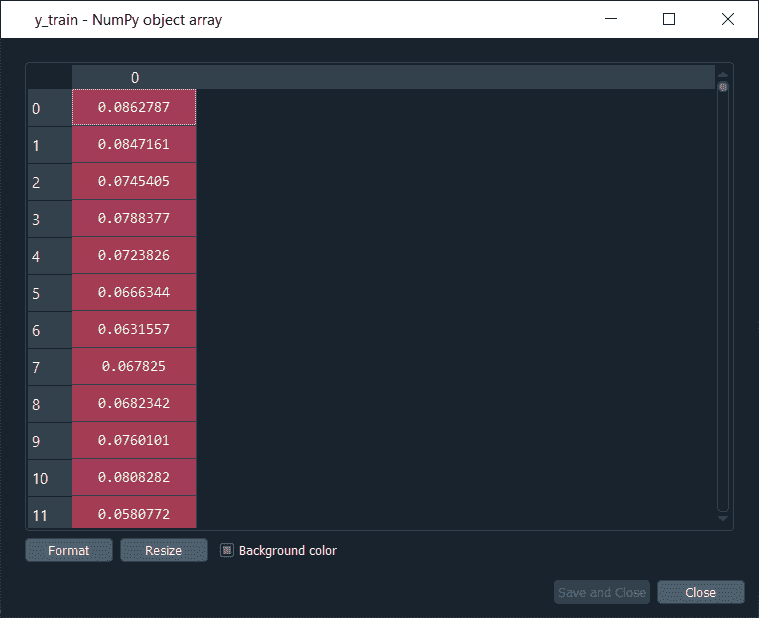

现在，如果我们看一下 **y_train** ，我们可以看到它非常简单地可视化，因为它包含了时间 **t+1** 的股价，如果比较 X_train 和 y_train，我们会看到 **X_train** 包含了所有 60 个以前的股价 **t = 60** ，并且基于每个单独线路的股价，我们会训练我们的递归神经网络来预测时间 **t+1** 的股价。

在这之后，我们将执行数据预处理的最后一步，即重塑数据，或者简单地说，我们可以说我们将在之前的数据结构中增加一些维度。我们要添加的维度是“**单位**”，即我们可以用来预测 t+1 时刻谷歌股价的预测因子数量。

因此，在我们试图预测谷歌股价趋势的金融工程问题的范围内，这些预测因子是**指标**。目前我们有一个指标，那就是谷歌股票价格，所以我们用 60 个以前的谷歌股票价格来预测下一个。但是在我们将要添加到数据结构中的一个新维度的帮助下，我们将能够添加更多的指标，这将有助于更好地预测谷歌股票价格的上升和下降趋势。

我们将使用整形函数在 NumPy 数组中添加一个维度。我们只需要对 X_train 这样做，因为它实际上包含了神经网络的输入。因此，我们创建了新数据结构的新维度，因为这正是我们将在第 2 <sup>和第</sup>部分构建的未来递归神经网络所期望的。

因此，我们将从使用**重塑**功能更新 **X_train** 开始，该功能取自 **NumPy** 库，因为我们正在重塑 NumPy 数组。在重塑函数中，我们将输入以下参数:

*   第一个参数是 NumPy 数组，即 **X_train** ，当我们想要添加对应于预测器的新维度时，我们想要对其进行整形，在我们的例子中，新维度是**指标** r。
*   在重塑函数的第二个参数中，我们需要指定这个新结构，即我们希望我们的 X_train 具有的新形状。因此，我们将在括号中输入结构，因为我们将在其中包含三个元素，因为目前，我们的数据结构有两个维度，即 X_train 由两个维度组成，这是由 1198 行和 60 列组成的 NumPy 数组。因此，现在我们将添加一个新的维度，因此将有一个类似 3D 的形状，包含一个对应于指示器的新维度，我们必须可视化它。
    我们要添加的第一个维度是 **X_train.shape[0]** 因为它将帮助我们获得 X_train 的确切行数，然后获得时间步长的数量，也就是确切的列数，我们将借助 **X_train.shape[1]** 获得它，因为它给出的列数进一步对应于时间步长的数量。最后一个维度将是 **1** ，因为我们只有一个指标，但是如果有几个指标，它们可以改变。

```

# Reshaping
X_train = np.reshape(X_train, (X_train.shape[0], X_train.shape[1], 1))

```

**输出:**

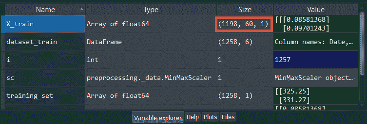

通过执行上面的代码行，我们将看到我们有了新的 X_train，如果我们看一下上面的图像，我们将看到它有三个维度，与我们刚才提到的完全相同。为了进一步了解 X_train，我们需要再次从变量浏览器窗格中单击它，它将类似于下面给出的内容。

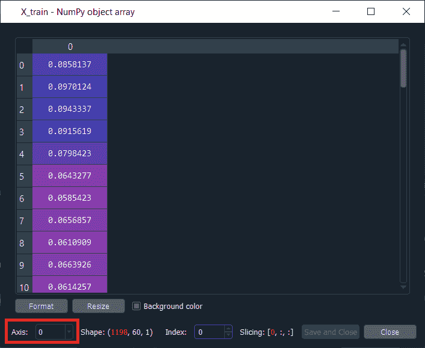

从上面的图像中，我们可以清楚地看到，虽然它不在三维空间中，所以我们可以简单地通过改变轴来看到它。正如我们在图像中看到的，它是一维的，轴是 0。同样，我们会看到轴的其余部分对应于结构的三个维度。

现在我们已经完成了数据预处理，我们现在将进入第 2 部分，即构建递归神经网络，在这里我们将构建具有几个 LSTM 层的堆叠 LSTM 的整个体系结构。

### 第 2 部分-建设 RNN

在第二部分中，我们将构建神经网络的整个体系结构，一个健壮的体系结构，因为我们不仅要制作一个简单的 LSTM，还要制作一个堆叠的 LSTM，带有一些丢失正则化以防止过度拟合。

因此，我们将不导入**顺序**类来帮助我们创建表示一系列层的神经网络对象，而是导入**密集**类来添加输出层。我们还将导入 **LSTM** 类来添加 LSTM 图层，然后导入**drop**类来添加一些 drop 正则化。这就是我们建设强大 RNN 所需要的一切。

```

# Importing the Keras libraries and packages
from keras.models import Sequential
from keras.layers import Dense
from keras.layers import LSTM
from keras.layers import Dropout

```

**输出:**

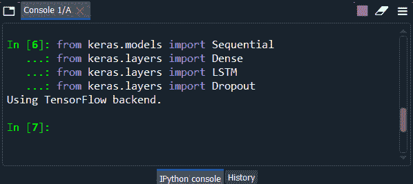

使用 [TensorFlow](https://www.javatpoint.com/tensorflow) 后端，导入所有的类，如上图所示。

接下来，我们将把递归神经网络初始化为一系列层，而不是计算图。我们将使用来自 Keras 的**序列**类来引入**回归器**作为层的序列。回归器只不过是序列类的一个对象，它代表了层的精确序列。

我们称之为回归器，而不是 [ANN](https://www.javatpoint.com/artificial-neural-network) 和 CNN 模型中的分类器，因为这一次，我们预测的是一个连续的输出，或者我们可以说是一个连续的值，也就是 t+1 时刻的谷歌股价。因此，我们可以说我们在做回归，这是关于预测连续值，而分类是预测一个类别或一个类，因为我们在预测连续值，这就是为什么我们称我们的递归神经网络为回归器的原因。

```

# Initialising the RNN
regressor = Sequential()

```

初始化回归器后，我们将添加不同的层，使其成为强大的堆叠 LSTM。因此，我们将从添加我们的递归神经网络的第一个 [LSTM](https://www.javatpoint.com/long-short-term-memory-rnn-in-tensorflow) 层开始，它是作为一系列层和一些丢失正则化引入的，以避免在预测股价时我们不想要的过度拟合。我们将分两步完成:我们将添加第一个 LSTM 层，然后我们将添加脱落正则化。

让我们从添加我们的第一个 LSTM 图层开始，为此，我们将使用我们的**回归器**，这是**顺序**类的一个对象。顺序类包含 **add** 方法，该方法允许添加神经网络的一些层，在 add 方法中，我们将输入我们想要添加的层的类型，即 **LSTM** 层，这是我们使用 LSTM 类的地方，因为实际上我们在这个 add 方法中添加的将是 LSTM 类的对象。因此，我们通过创建一个 LSTM 类的对象来创建 LSTM 图层，该对象将采用如下几个参数:

*   第一个参数是**单位的数量**，这是 LSTM 细胞或记忆单位的数量，但为了简单起见，我们称之为我们希望在这个 LSTM 层中拥有的神经元。所以，我们会选择一个相关的数字。
    即使我们想要堆叠这么多层，我们也希望我们的模型具有高维度。因此，实际上我们正在借助我们将要添加的 LSTM 层来制作高维度，但是我们甚至可以通过在每个 LSTM 层中包含大量神经元来增加它的维度。因为捕捉股票价格的趋势非常复杂，我们需要有这样的高维度，为此我们还需要在 LSTM 层的每个倍数中有大量的神经元。因此，我们将为这个 LSTM 层选择 **50** 神经元，因为如果我们选择的神经元太少，那么它们就不会捕捉到向上和向前的趋势，但是由于我们已经选择了 50 个神经元，这肯定会导致更好的结果。
*   然后第二个参数是**return _ sequence**，我们必须将其设置为等于 **True** ，因为我们正在构建一个堆叠的 LSTM，其中进一步包含几个 LSTM 图层，当我们在创建第一个图层后添加另一个 LSTM 图层时，我们需要将 return _ sequence 参数设置为 True。
    一旦我们完成添加 LSTM 图层，这样我们就不会合并更多的图层，然后我们将它设置为假。但是我们不会这样做，因为这是 return _ sequences 参数的默认值。
*   最后，第三个参数是 **input_shape** ，它正是包含我们在数据预处理部分的最后一步中创建的 **X_train** 的输入的形状。它是对应于观察、时间步长和指示器的三维输入形状。但是在 LSTM 类的第三个参数中，我们不需要添加三个维度，只需要添加对应于时间步长和指标的最后两个维度，因为第一个维度对应于将被自动考虑的观察值。
    所以，我们只指定对应于时间步长的 **X_train.shape[1]** ，以及对应于预测值或指标的**【1】**。

```

# Adding the first LSTM layer and some Dropout regularization
regressor.add(LSTM(units = 50, return_sequences = True, input_shape = (X_train.shape[1], 1)))

```

在我们完成第一步之后，现在我们将处理第一步构建神经网络架构的第二个子步骤，即添加一些 **Dropout 正则化**，为此，我们将再次使用我们的**回归器**，然后使用序列类的 **add** 方法，因为它的工作方式与 LSTM 相同。我们将从创建一个已经导入的 dropout 类的对象开始，以包括这个 Dropout 正则化。

因此，确切地说，对于 LSTM，我们需要在这里将这个类的名称指定为 **Dropout** ，它将只接受一个参数，即 Dropout rate，它只不过是我们想要丢弃的神经元数量，或者简单地说，是我们想要在层中忽略以进行这种正则化的数量。使用它们的相关数字是减少层中 20%的神经元，这正是我们需要在这里输入的。这就是我们增加 **0.2** 的原因，因为它对应 20%。

因此，我们将有 20%的丢失，也就是说，在训练期间，LSTM 层的 20%的神经元将被忽略，也就是说，在训练的每个迭代中发生的前向和后向传播期间。因此，由于 50 的 20%是 10 个神经元，这简单地意味着在训练的每次迭代期间，10 个神经元将被忽略和退出。因此，我们在这里完成了我们的第一个 LSTM 层，我们添加了一些辍学正规化。

```

regressor.add(Dropout(0.2))

```

现在，我们将添加一些额外的 LSTM 层，然后为每个层添加一些脱落正则化。因此，我们将以与上一步相同的方式添加我们的第二个 LSTM 层，因为我们将再次使用来自**序列**类的 **add** 方法向我们的回归器添加新的 LSTM 层和一些脱落正则化，但是我们将对 **input_shape** 参数进行一些更改。与上一步一样，我们必须指定 input_shape 参数，因为这是我们的第一个 LSTM 层，我们需要指定输入的形状，最后两个维度对应于时间步长和预测值，但是现在情况略有不同，我们只是添加了第二个 LSTM 层，这就是为什么我们不再需要指定它的原因。因为它是自动识别的，所以当我们在第一层之后添加下一个 LSTM 层时，将跳过将其添加到代码中。

因此，我们将在第二个 LSTM 层中保持相同数量的神经元，即 50 个神经元，并且由于这是一个相关的选择，所以正则化将保持相同的 20%的丢失。

```

# Adding a second LSTM layer and some Dropout regularization
regressor.add(LSTM(units = 50, return_sequences = True))
regressor.add(Dropout(0.2))

```

同样，为了添加我们的第三个 LSTM 层，我们将完全复制上面两行添加了第二个 LSTM 层的代码，因为添加第三个 LSTM 层类似于添加第二个 LSTM 层。我们只需要指定 LSTM 层中的神经元数量，我们将其保持为 50 个神经元，以便具有相同的高维度目标。我们仍然需要保持 return _ sequences 等于 True，因为我们在第二个 LSTM 层之后添加了另一个 LSTM 层，同样，我们将保持 20%的丢失正则化。

```

# Adding a third LSTM layer and some Dropout regularization
regressor.add(LSTM(units = 50, return_sequences = True))
regressor.add(Dropout(0.2))

```

接下来，我们将添加我们的第四个 LSTM 层，但这一次事情将略有改变。我们将在第四个 LSTM 层保留 50 个神经元，因为这不是递归神经层的最后一层。但是在第四层之后，我们将有输出维度为 1 的输出层，当然，因为我们只预测一个值，即 t+1 时股价的值。由于我们正在添加第四个 LSTM 图层，这是我们正在添加的最后一个 LSTM 图层，因此我们需要将**return _ sequence**设置为 **False** ，因为我们不会再返回任何序列。但是我们知道，return_sequences 参数的默认值是 False，所以我们将删除该部分，因为这是我们必须为第四个 LSTM 层做的。

我们只是增加了 50 个单元的 LSTM 班，同样，我们将保持 20%的辍学率正规化。

```

# Adding a fourth LSTM layer and some Dropout regularization
regressor.add(LSTM(units = 50))
regressor.add(Dropout(0.2))

```

**输出:**

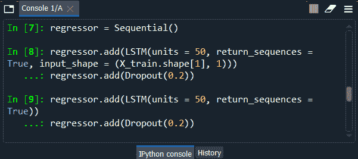

从上面的图片，我们可以清楚地看到，我们成功地完成了 LSTM 部分。

现在我们只需要添加最后一层，也就是输出层。我们将简单地使用我们的回归器，它与人工神经网络和有线电视新闻网完全相同，然后从序列类中再次添加 **add** 方法，以添加我们神经网络的最终输出层。由于我们没有添加 LSTM 层，但实际上是一个经典的全连接层，因为输出层完全连接到以前的 LSTM 层，因此在这种情况下，为了使其成为一个全连接层，我们将需要使用密集类，就像我们对人工神经网络和有线电视新闻网所做的那样。

因此，我们将在 **add** 方法中指定 **Dense** 类，然后我们将添加一个参数，该参数将对应于输出层中需要的神经元数量。由于我们预测的是对应于股票价格的真实值，因此输出只有一个维度，这正是我们需要输入的，其参数是**单位**，因为它对应于输出层的神经元数量或输出层的维度，即 **1** 。

```

# Adding the output layer
regressor.add(Dense(units = 1))

```

现在，我们已经完成了超鲁棒 LSTM 递归神经网络的架构，我们还有两个剩余的步骤来构建 RNN；第一步是用强大的优化器和正确的损失来编译 RNN，这将是均方误差，因为我们正在进行一些回归，第二步是将这个递归神经网络拟合到训练集中。

由于我们的训练集由 X_train 组成，这是神经网络所期望的正确数据结构，因此我们将采用 **X_train** 来代替训练集或 training_set_scaled，当然，我们将需要在将回归器拟合到我们的训练集时指定输出，因为输出包含地面事实，即 t+1 时刻的股价。由于我们正在对 RNN 进行真相训练，即在 60 个产生的金融日期间，在 60 个产生的股票价格之后的时间 t+1 发生的真实股票价格，所以这就是为什么我们还需要包括地面真相，即 y_train。

让我们用正确的优化器和正确的损失函数来编译 RNN。因此，我们将从我们的**回归器**开始，因为我们正在预测一个连续值，然后使用**编译**方法，这是顺序类的另一种方法，在编译方法中，我们将输入两个参数，即**优化器**和**损失函数**。

一般来说，对于递归神经网络，建议使用 RMS prop 优化器，但是在我们遇到问题的情况下，我们将使用 **adam** 优化器，因为它总是一个安全的选择，因为它非常强大，并且总是执行一些相关的权重更新。我们要输入的第二个参数是**损失**功能。由于我们处理的不是分类问题，而是回归问题，因为我们必须预测一个连续的值，所以这一次的损失函数是**均方误差**，因为误差可以用预测值和目标值之间的均方差来衡量，即真实值。

```

# Compiling the RNN
regressor.compile(optimizer = 'adam', loss = 'mean_squared_error')

```

在编译完 RNN 之后，我们将把 RNN 装配到由 **X_train** 和 **y_train** 组成的训练集中。因此，我们将再次从使用**回归器**开始，而不是使用**拟合**方法的分类器，该方法不仅将神经网络连接到训练集，还将在一定数量的**时期**上执行训练，我们将在相同的拟合方法中选择这些时期。在 fit 方法中，我们将传递四个参数，分别是 **X_train** 、 **y_train** 、**纪元**，以及 **batch_size** 。所以，我们的网络不是在单一的观察值上训练，而是在成批的观察值上训练，也就是说，成批的股票价格进入神经网络。

我们将对每 32 个股票价格进行更新，因为我们选择了 **32** 的**批次大小**，而不是将每一个正向传播到神经网络中的股票价格更新权重，然后生成一个反向传播到神经网络中的误差。因此，这里我们已经完成了构建一个超级健壮的递归神经网络，并准备在 5 年的谷歌股票价格上对其进行训练。

```

# Fitting the RNN to the Training set
regressor.fit(X_train, y_train, epochs = 100, batch_size = 32)

```

**输出:**

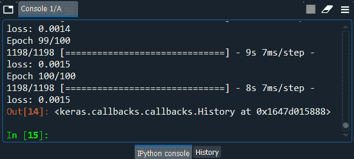

从上面的图片中，我们可以看到，我们已经防止了足够多的过度拟合，甚至没有减少损失，因为如果我们最终获得的损失太小，我们可能会得到一些过度拟合，以及我们的预测，将接近真实的谷歌股价。在训练数据中，这是过去的数据，但不是我们有兴趣进行预测的数据，我们会在上面得到一些很大的损失，在测试数据上得到一些非常糟糕的损失。所以，这正是过度拟合的意义所在。

这是我们训练训练集的唯一原因，我们必须注意不要获得过度训练，因此不要试图尽可能减少损失，这就是为什么我们似乎得到了真正好的结果。

在此之后，我们将进入第 3<sup>部分，在该部分中，我们将把我们的预测与 2017 年第一个财政月的真实谷歌股价进行比较。</sup>

### #第 3 部分-做出预测并可视化结果

首先得到 2017 年的真实股价，然后第二步得到 2017 年的预测股价，最后将结果可视化。因此，为了获得 2017 年的真实股价，我们将从 CSV 文件中的测试集获得它，因此我们将只做与训练集完全相同的事情。

我们将简单地从创建一个数据框开始，通过**熊猫、**导入带有 **read_csv** 函数的**Google _ Stock _ Price _ test . CSV**文件，然后我们将选择正确的列，打开 Google 股票价格，然后使其成为一个 **NumPy** 数组，我们将通过用测试集替换训练集来完成。由于测试集将是 2017 年 1 月
第一个月谷歌股价的真实值，所以我们将简单地用真实的股票价格替换训练集。

```

# Getting the real stock price of 2017
dataset_test = pd.read_csv('Google_Stock_Price_Test.csv')
real_stock_price = dataset_test.iloc[:, 1:2].values

```

执行上述代码后，我们将获得 2017 年 1 月的 real_stock_price，我们可以在变量资源管理器窗格中查看它。

**输出:**

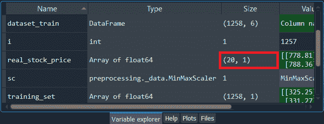

从上面的图片中，我们可以看到 real_stock_price 由 20 个观察值组成，即 20 个股价，因为这些是金融日，一个月有 20 个金融日，不包括周六和周日。我们可以通过点击 real_stock_price 来看一下，它将类似于下面给出的内容。

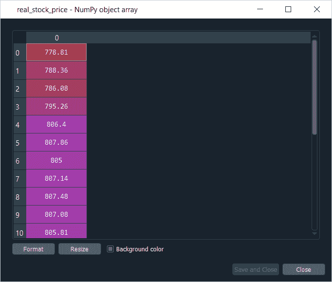

接下来，我们将进入第二步，预测 2017 年 1 月的股价。因此，这里我们将使用我们的**回归器**，借助它我们将预测 2017 年 1 月的谷歌股价。基本上，第一个关键点是，我们训练了我们的模型来预测基于 60 个先前股票价格的时间 **t+1** 的股票价格，因此为了预测 2017 年 1 月的每个财政日的每个股票价格，我们将需要实际日之前的 60 个先前财政日的 60 个先前股票价格。

那么第二个关键点是，为了得到 2017 年 1 月的每一天，前 60 天的前 60 个股票价格，我们将需要训练集和测试集，因为从 2016 年 12 月开始，我们将有一些来自训练集的 60 天，我们也将有一些测试集的股票价格，因为其中一些将来自 2017 年 1 月。

因此，我们需要做的第一件事是对训练集和测试集进行一些串联，以便能够在 2017 年 1 月的每一天获得这 60 个先前的输入，然后理解第三个关键点。我们将通过连接训练集和测试集来进行这种连接，即通过连接包含 2012 年至 2016 年底真实谷歌股票价格的训练集，这样将训练集和测试集连接起来实际上会导致问题，因为这样我们将不得不缩放训练集和测试集的这种连接。为此，我们必须从我们在特征缩放部分创建的 **sc** 对象中应用**fit _ transform**方法来缩放训练集和测试集的连接，以获得缩放后的 real_stock_price。但是它会改变实际的测试值，我们永远不应该这样做，所以我们将保持实际的测试值不变。

因此，我们将进行另一个连接，这将是连接我们仍然拥有的原始数据帧，即**数据集 _ 训练**和**数据集 _ 测试**，从这个连接中，我们将获得每个预测的输入，这是在每个时间 t 产生的股票价格，这是我们将缩放的。这些是我们将在 sc 对象上应用的输入，以及获取预测的比例。这样，我们只是缩放输入，而不是改变实际的测试值，并将引导我们获得最相关的结果。

因此，我们将从引入一个名为 **dataset_total** 的新变量开始，因为它将包含整个数据集，然后我们将进行连接，为此我们将使用熊猫库中的 **concat** 函数。在 pandas 函数中，我们需要输入两个参数，比如第一个参数是我们想要连接的两个数据帧对，即我们将把**数据集 _ 训练**连接到**数据集 _ 测试**，另一个参数是我们想要进行连接的轴。由于我们希望将测试集的股价与训练集的股价相加，所以我们希望沿着直线进行连接，因此我们将沿着垂直轴进行连接，为了指定这一点，我们将添加第二个参数，即**轴=0** ，因为垂直轴标记为 0。

```

# Getting the predicted stock price of 2017
dataset_total = pd.concat((dataset_train['Open'], dataset_test['Open']), axis = 0)

```

现在下一步，我们将获得输入，即在 2017 年 1 月的每个时间 t 或每个财务日，我们需要获得前 60 个财务日的前 60 个股票价格。所以，为了得到这些输入，我们将从引入新的变量**输入**开始。然后我们将获得**数据集 _ 总计**，因为我们目前为止是从我们的数据框架数据集获得这些股票价格的，因此我们将需要从 2017 年第一个财政日减去 60 的股票价格，直到整个数据集的最后一个股票价格。

为此，我们得到了所需输入范围的第一个下限。下限是 1 月 3 日 <sup>rd</sup> 的股价减去 60，要得到这个值，我们需要找到 1 月 3 日 <sup>rd</sup> 的指数，只需取 **len(dataset_total)** 即可，这是总数据集的长度，然后将其减去 **len(dataset_test)** ，这是数据集的长度，当我们想要得到这一天的股价时， 所以我们将再次看到减去 **60** ，因为这是我们需要的输入的下限。 为了得到上限，我们只需要添加一个冒号(即 **:** )。基本上，上限是整个数据集的最后一个指数，因为要预测最后一个财政日的最后一个股价，我们需要之前的 60 个股价，因此我们需要的最后一个股价是最后一个财政日之前的股价。因此，这是将产生数据帧的输入范围，但当然，我们需要继续到 NumPy 数组，为此，我们将添加**点值**使其成为 NumPy 数组。所有这些都将包含我们预测 2017 年 1 月股价所需的所有输入。

```

inputs = dataset_total[len(dataset_total) - len(dataset_test) - 60:].values

```

在下一步中，我们将进行简单的重塑以获得正确的 NumPy 形状，因此我们将更新输入，为此，我们将再次使用我们在上一步中使用的相同的旧**输入**，我们将进一步添加**重塑**功能。在重塑功能中，我们将传递 **(-1，1)** ，因为它将帮助我们获得 1 月 3 日<sup>日</sup> - 3 个月不同股价的输入，直到行和列中的最终股价。

```

inputs = inputs.reshape(-1,1)

```

现在，我们将重复我们之前所做的相同过程，以获得正确的 3D 格式，这不仅是神经网络对训练的期望，也是对预测的期望。所以，无论我们是用拟合的方法来训练回归器，还是用预测的方法来让回归器预测一些东西，为此，我们需要有正确的输入格式，也就是我们之前制作的 3D 格式。在开始制作这个三维特殊结构之前，我们必须缩放我们的输入，因为它们直接来自 dataset_total 中包含的原始数据帧，所以我们有股票价格的原始值，并且由于我们的递归神经网络是在缩放的值上训练的，当然，我们需要缩放输入，这满足了我们前面讨论的第 3 个<sup>第 3 个</sup>关键点，即只缩放输入而不缩放实际测试值，因为我们需要保持测试值不变。

因此，我们将从再次更新输入开始，我们将为其更新缩放对象，即 **sc** ，但是这里我们将不使用 **fit_transform** 方法，因为 sc 对象已经适合训练集，因此我们将直接使用 transform 方法，因为我们需要应用于输入的缩放必须与我们应用于训练集的缩放相同。因此，我们不能再次拟合我们的缩放对象 sc，但是我们必须直接应用变换方法来获得我们的回归器在其上被训练的先前缩放

```

inputs = sc.transform(inputs)

```

接下来，我们将为测试集创建一个特殊的数据集结构，因此我们将引入一个新的变量，并将其称为 **X_test** ，因为它将是我们预测测试集值所需的输入。因为我们没有做任何训练，所以我们需要 y_test。我们实际上在做一些预测，所以我们不再需要一个地面事实，这就是为什么 y_train 也不包括在这里和循环内部，我们不会改变下限来获得 60 个先前的时间步长，并且由于我们是这里的 **i-60** ，所以我们必须从 60 开始。但是对于上限，情况就大不相同了，因为我们所做的只是获取测试集的输入，因为它只包含 20 个金融日，所以我们需要向上到 60+20=80，这样，我们将获取 2017 年 1 月包含 20 个金融日的每个股票价格的 60 个先前输入。

在这之后，我们将在 X_test 中添加以前的股票价格，这些价格确实是从输入中获取的，并保持其指数范围从 **i-60** 到 **i** ，我们也保持 0，因为它对应于开放的谷歌股票价格，并且无论如何在输入中只有一列。

由于 **X_test** 也是一个**列表**，所以我们再次需要把它做成一个 **NumPy 数组**，这样它就可以被我们未来的 Recurrent Neural Network 所接受，通过这样做，我们就有了一个结构，在这个结构中，我们在每一行观察中，也就是说，对于 2017 年 1 月的每一个股价，我们在 60 列中有我们需要预测下一个股价的 60 个先前的股价。

现在我们将继续获取 3D 格式，我们将再次使用**重塑**功能在 NumPy 数组中添加维度。我们将按照与数据预处理部分的整形部分完全相同的方式进行，只是我们需要用 **X_test** 替换 **X_train** ，其余代码及其解释与上面讨论的类似。

```

X_test = []
for i in range(60, 80):
    X_test.append(inputs[i-60:i, 0])
X_test = np.array(X_test)
X_test = np.reshape(X_test, (X_test.shape[0], X_test.shape[1], 1))

```

因此，我们准备进行预测，因为我们在 X_test 中包含了正确的输入 3D 结构，这正是我们的递归神经网络回归器所期望的，因此我们准备应用我们的预测方法从这个回归器中获得我们预测的 2017 年 1 月的股价。

我们将使用**回归器**，从这个回归器中，我们将应用**预测**方法，我们需要输入包含正确格式输入的 **X_test** 来预测 2017 年 1 月的股价。由于它返回预测，因此我们将这些预测存储在一个名为 **predicted_stock_price** 的新变量中，该变量将与 **real_stock_price** 一致，然后使其等于从我们的回归器中获取的预测方法返回的值，并将其应用于 X_test 中包含的正确输入。

```

predicted_stock_price = regressor.predict(X_test)

```

在这样做之后，我们将对我们的预测的缩放比例进行反转，因为我们的回归器被训练来预测股票价格的缩放值，所以为了获得这些缩放的预测值的原始比例，我们只需要从我们的缩放 **sc** 对象应用**逆变换**方法。由于我们将使用谷歌股票价格值的正确比例更新预测股票价格，因此我们将获得我们的**预测股票价格**，然后获取我们的缩放对象，即 **sc** ，这就是我们将应用**逆变换**方法的地方，我们将应用**预测股票价格**。

```

predicted_stock_price = sc.inverse_transform(predicted_stock_price)

```

**输出:**

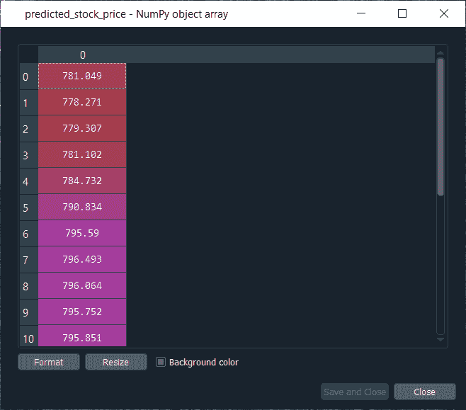

所以，在执行了整个“获取 2017 年的预测股价”部分后，我们将获得上面包含预测的输出，它确实在 2017 年 1 月的谷歌股价范围内。但是，如果它大致遵循 2017 年 1 月真实谷歌股价的趋势，我们还无法意识到这一点。

接下来，我们将继续可视化结果，这将实际见证模型的稳健性，因为我们将看到我们的预测如何跟随谷歌股票价格的趋势。因此，我们将从使用 **matplotlib.pyplot** 库中的 **plt.plot** 函数开始，在这个 plt.plot 函数中，我们首先需要输入包含我们想要绘制的存储股价的变量的名称，这些包含在 **real_stock_price** 变量中。因此，我们首先需要输入 **real_stock_price** 变量，然后添加我们的下一个参数，即我们选择了**红色**作为真实股价的**颜色**，然后最后一个参数是我们将在图表上绘制一些图例的标签。因此我们将使用 **plt.legend** 功能来显示图例。这里我们选择**‘真实谷歌股价’，**是为了记住，我们绘制的不是 2012 年到 2017 年第一个月的整个真实谷歌股价，而是 2017 年 1 月第一个月的真实谷歌股价，因为我们只有 2017 年 1 月的预测，所以我们只想比较这第一个月的这两个股价。

同样，我们将再次使用**PLT . PLT**函数绘制包含 2017 年 1 月股票价格的存储预测的**预测 _ 股票 _ 价格**变量。它将以与我们上面相同的方式进行，但是将选择不同的颜色，即蓝色和标签，即**“预测谷歌股价”**。

因为我们想要一个漂亮的图表，所以我们将为图表添加一个标题，我们将使用 **plt.title** 功能，在其中，我们将提到我们想要给我们的图表的标题，即**“谷歌股价预测”**。

接下来，我们将在 x 轴和 y 轴上添加标签，为此，我们将分别使用 **plt.xlabel** 和 **plt.ylabel** 功能。在 **plt.xlabel** 功能中，我们将输入与 x 轴相对应的标签，即**“时间”**，正如我们从 1 月 3 日 <sup>rd</sup> 到 1 月 31 日 <sup>st</sup> 一样，在 **plt.ylabel** 中，我们将输入与 y 轴相对应的标签，即**“谷歌股价”**。

之后，我们将在没有任何输入的情况下添加 **plt.legend** 功能，这样我们就可以将图例包含在图表中，然后以 **plt.show** 功能结束来显示图表。

```

# Visualizing the results
plt.plot(real_stock_price, color = 'red', label = 'Real Google Stock Price')
plt.plot(predicted_stock_price, color = 'blue', label = 'Predicted Google Stock Price')
plt.title('Google Stock Price Prediction')
plt.xlabel('Time')
plt.ylabel('Google Stock Price')
plt.legend()
plt.show()

```

**输出:**

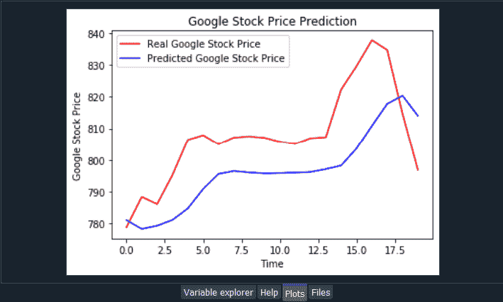

从上面的输入中，我们可以看到我们在**红色**中有**真实的谷歌股价**，在**蓝色**中有我们**预测的谷歌股价**。我们还得到了 2017 年 1 月整个月谷歌股票实际价格和预测价格的对比。我们已经从网上核实的财务来源获得了真实的谷歌股票价格。然而，这些预测来自我们刚刚实施的 RNN 模型。

我们可以看到，在某些地方，我们的预测落后于实际值。我们可以清楚地看到一个大的尖峰，就像一个股票时间奇点，后面没有预测，这是完全正常的。我们的模型落后了，因为它不能对快速的非线性变化做出反应。

图中的**尖峰**是**股票时间不规则**，确实是一个快速的非线性变化，我们的模型无法对此做出适当的反应，但这完全没问题，因为根据【金融工程】中的**布朗运动数学概念****，股价的未来变化与过去无关。因此，我们在峰值附近看到的未来变化，确实是完全独立于之前股价的变化。**

 **但另一方面，有一个好消息，我们的模型对真实谷歌股价上发生的平滑变化反应良好，除了我们的模型无法反应的峰值，但除此之外，我们的递归神经网络对这些平滑变化的反应相当好。

因此，可以得出结论，在包含一些峰值的预测部分，我们的预测落后于实际值，因为我们的模型不能对快速的非线性变化做出反应，而另一方面，对于包含平滑变化的预测部分，我们的模型预测得很好，并且能够跟踪上升和下降趋势。它设法跟随谷歌股票预测价格的上升趋势、稳定趋势和再次上升趋势。然后在 1 月的最后几个财政日出现下降趋势，并开始捕捉。因此，我们可以说它产生了非常好的结果，尽管有峰值，但实际上还是很有意义的。

* * ***