# 科霍宁自组织地图

> 原文：<https://www.javatpoint.com/keras-kohonen-self-organizing-maps>

自组织地图是在 20 世纪 80 年代由 T2·特沃科霍内发明的，有时被称为 T4·科霍宁地图。因为它们有一个特殊的属性，可以有效地为输入数据的几个特征创建空间组织的“内部插图”，因此它被用来降低维度。数据点之间的拓扑关系通过映射得到了最佳保留。

考虑图 1。下面给出并尝试理解自组织地图网络的基本结构。它有一个由神经元或细胞组成的阵列，排列在一个矩形或六边形的薄片上。这里，单元格被表示为单个索引 **i** ，使得输入向量**X(t)=【X<sub>1</sub>(t)，x <sub>2</sub> (t)，...，x<sub>n</sub>(T)】<sup>T</sup>∈R<sup>n</sup>**通过不同的权重向量**m<sub>I</sub>(T)=【m<sub>il</sub>(T)，m <sub>i2</sub> (t)...，m <sub>在</sub> (t) ∈ R <sup>n</sup>** 中，它们根据输入数据集通过自组织学习过程被进一步调整。

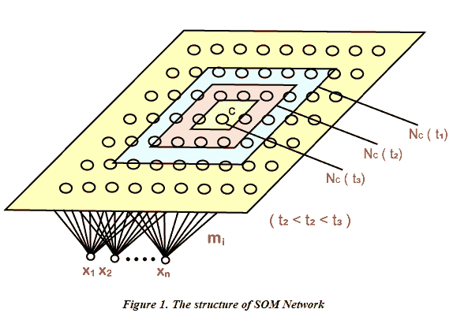

首先，我们在程序学习时用一些小的随机值初始化**m<sub>I</sub>(0)**，然后我们重复呈现数据，这些数据必须作为输入向量以原始顺序或一些随机顺序进行分析。每次我们输入 **X(t)** ，都会遇到所有单元格中最匹配的单元格 **c** ，定义如下；

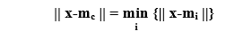

其中 **||。||** 代表欧几里得距离或其他距离的度量。我们将细胞周围的邻域 **N <sub>c</sub> (t)** 定义为横向相互作用的范围，如上图所示。基本的权重学习或权重调整过程由以下等式控制:

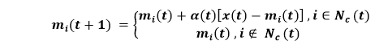

这里， **0 < α(f) < 1** 涉及一个标量因子，它负责控制学习速率，学习速率必须随时间降低才能获得良好的性能。作为横向交互的结果，根据输入数据集的结构，在足够的自学习步骤之后，网络趋向于空间“组织”。这些单元还被调谐到某些特定的输入向量或输入向量组，其中每个单元只负责响应输入模式集中的某些特定模式。最后，响应不同输入的那些单元的单元位置倾向于根据输入集合内的模式中的拓扑关系被很好地组织。通过这种方式，它有助于在神经地图上的原始数据空间中最佳地保留拓扑关系，这就是为什么它被称为**自组织地图**，因为它使网络在某些应用中相当强大。

## 自组织地图分析

让我们假设如果单元格 **i** 确认输入向量**X**；然后我们称像元 I 或它在地图上的位置，就像输入向量 x 的图像一样，输入集合中的每个模式向量在神经地图上只有一个图像，但是一个像元可以是多个向量的图像。在这种情况下，如果一个格子被放置在一个平面上，我们将它合并来表示一个神经映射，那么，在这种情况下，一个正方形对应于一个神经元，然后写入若干输入模式，其图像由存在于相应正方形中的细胞来表示，我们得到一个映射，如图 2 所示。该图描绘了输入模式图像在神经图上的分布，这就是为什么它被称为自组织映射密度图或自组织映射图像分布图。

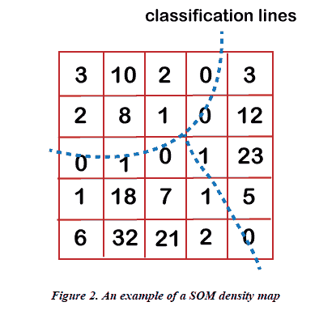

每次在原始模式集中出现分组或聚类，SOM 都会保留它，并在 SOM 密度图上展示，这不是什么，而是横向竞争的结果。驻留在原始空间中的更接近的模式将在地图上的某个地方“拥挤”它们的图像，并且由于在两个或更多图像拥挤的地方的单元受到两个相邻簇的影响，它们将倾向于不响应它们。它们将被模拟为一些“**高原**”，代表数据集中被一些“**谷**分隔的集群，这些谷对应于 SOM 密度图上的分类线。考虑图 2 以更好地理解这一现象。分类线在图中用虚线画出。

这是我们通过自组织图进行聚类分析的基础。我们分析数据以“训练”SOM，然后在经历“学习”之后，聚类被描绘在 SOM 密度图上。

以下是它的一些优点:

*   在算法完成之前，我们不需要指定聚类的数量，因为正确的数量将由结果本身直接显示。相反，大多数传统的聚类算法需要用户选择他希望在结果中得到的聚类数量，或者他认为在实现算法之前应该有，结果不同的选择可能导致非常不同的结果。在我们对数据分布有一些先验知识的情况下(例如，数据可能是高维的)，我们可能具有 SOM 聚类的优势。
*   当原始数据集中不存在聚类关系时，自组织映射聚类方法优雅地退化为一般的数据分析方法，在传统方法的情况下，最终产生一些聚类。只会产生难以置信的结果。但是在 SOM 算法的情况下，不存在这样的问题。当原始空间内没有明显的聚类关系时，它在地图上不会包含任何高原和山谷。因此，它避免了不合理的，任意的分类。此外，我们还可以检查输入模式与它们的图像在地图上的位置之间的关系。
*   可以注意到，在基本的 SOM 学习过程中，最初，邻域大小保持相当大，我们让它随着时间的推移而缩小，因为它使细胞更具体地调整到不同的模式。为了获得更精确的结果，需要一些微调程序。由于我们的 SOMA 是 SOM 网络的一个新应用，它与传统算法有不同的目的，这就是为什么它被认为不会为了聚类的更好结果而过度收缩邻域。

## 建立 SOM

我们将实施我们的第一个**无监督**深度学习模型，即**自组织地图**，来解决一种新的业务问题，这就是**欺诈检测**。因此，为了在开始实施之前了解业务问题，让我们假设我们是一名为银行工作的深度学习科学家，我们得到了一个数据集，其中包含该银行申请高级信用卡的客户信息。

基本上，这些信息是客户在填写申请表时必须提供的数据。我们的任务是检测这些应用程序中的潜在欺诈，这意味着在任务结束时，我们必须给出潜在欺诈客户的明确列表。

所以，我们的目标非常明确。我们必须返回一些东西，即潜在欺诈客户的列表，我们不会建立一个有监督的深度学习模型，并试图用一个具有二进制值的因变量来预测每个客户是否潜在欺诈。相反，我们将构建一个无监督的深度学习模型，这意味着我们将在充满非线性关系的高维数据集中识别一些模式，其中之一将是潜在的欺诈。

我们将从导入基本库开始，方法与我们在前面的主题中所做的一样，这样我们就可以继续实现模型。

```

# Importing the libraries
import numpy as np
import matplotlib.pyplot as plt
import pandas as pd

```

接下来，我们将导入“**Credit _ Card _ applications . CSV**”数据集。我们已经从**UCI 机器学习资源库**中获取了我们的数据集，该库名为 Statlog 澳大利亚信贷审批数据集，您只需点击 http://archive . ics . UCI . edu/ml/datasets/stat log+(澳大利亚+信贷+审批)即可获取。

```

# Importing the dataset
dataset = pd.read_csv('Credit_Card_Applications.csv')

```

导入数据集后，我们将转到变量资源管理器并打开它。

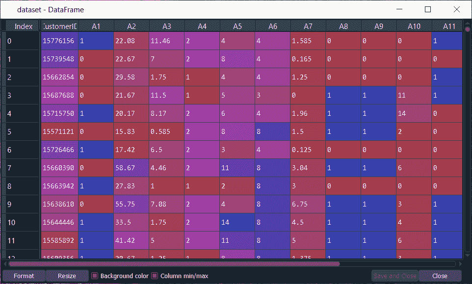

从上图中，我们首先需要了解的是，这里的列是属性，即客户的信息，行是客户。之前我们说无监督深度学习模型要识别一些模式，就是客户。这些客户是我们神经网络的输入，它们将被映射到一个新的输出空间。在输入空间和输出空间之间，我们有一个由神经元组成的神经网络，每个神经元被初始化为与客户向量相同的权重向量，即 15 个元素的向量，因为我们有客户 Id 加上 14 个属性，所以对于每个观察点或每个客户，这个客户的输出将是最接近客户的神经元。而这个神经元对于每个客户来说被称为**获胜节点**，是和客户最相似的神经元。

接下来，我们将使用类似**的邻域函数和高斯邻域函数**来更新获胜节点的邻域的权重，以使它们更接近该点。我们必须为输入空间中的所有客户重复这样做，每次重复时，输出空间都会减少，随之而来的是维度的丢失。它一点一点地缩小尺寸。然后，它到达邻域或输出空间停止减少的点，这是我们获得二维自组织图的时刻，所有最终确定的获胜节点都在这个时刻。这有助于我们更接近欺诈，因为事实上，当我们想到欺诈时，我们会想到异常值，因为欺诈是由某种东西定义的，这与一般规则相去甚远。

一般规则就是那些在申请信用卡时必须遵守的规则。因此，欺诈实际上是二维自组织图中的外围神经元，因为轮廓神经元与大多数遵循规则的神经元相距甚远。因此，为了检测 SOM 中的轮廓神经元，我们需要**平均中间神经元距离**，这意味着在我们对每个神经元的自组织图中，我们要计算一个神经元与其邻域之间的欧几里德距离的平均值，这样我们就必须手动定义邻域。

但是我们为每个神经元定义了一个邻域，并且我们计算了我们选择的神经元和邻域中所有神经元之间的欧几里德距离的平均值，我们将其定义为如果这样做，我们将能够检测到异常值，因为异常值将远离其邻域中的所有神经元。之后，我们将使用**逆映射**函数来识别哪些原本在输入空间中的客户与获胜节点相关联，这是一个异常值。

所以，这里我们已经解开了我们的谜团，我们将从它的实现部分开始。我们将首先将我们的数据集分成两个子集，包含从客户标识到属性号 14(即 **A14** )的所有变量的集合，以及类，该类是告知客户的申请是否被批准的变量。因此， **0** 涉及**否，**申请未通过，而 **1** 表示**是，**申请通过。在这里，我们需要将所有这些变量和变量类分开，这样在自组织地图上，我们就可以清楚地区分尚未批准其申请的客户和获得批准的客户，因为只有这样，它才会有用，例如，如果我们想优先检测那些申请获得批准的欺诈客户，这实际上会更有意义。

导入数据集后，我们将为这两个子集创建一个变量 **X** ，使其等于**数据集。iloc** 以获取我们想要包含在 **X** 中的观测值的索引。因此，我们将从索引行开始，由于我们想要所有的行，因为我们想要所有的客户，我们将在这里使用 **:** ，然后由于我们想要除最后一列之外的所有列，我们将使用 **:-1** 。然后，像往常一样，我们将使用**。值**表示它将返回由这些索引索引的所有观察值。

```

X = dataset.iloc[:, :-1].values

```

接下来，我们将创建最后一列，为此，我们将其称为 **y** 。既然我们要取最后一列，那么我们只需要将 **:-1** 替换为 **-1** ，剩下的代码和我们对 X 变量做的一样。

```

y = dataset.iloc[:, -1].values

```

在执行了上面两行代码之后，将会创建 X 和 Y，我们可以在变量资源管理器窗格中进行检查。从下图中，我们可以清楚地看到 **X** 包含了除最后一个变量之外的所有变量。然而， **y** 包含最后一个变量，告诉是或否，申请被批准。

**输出:**

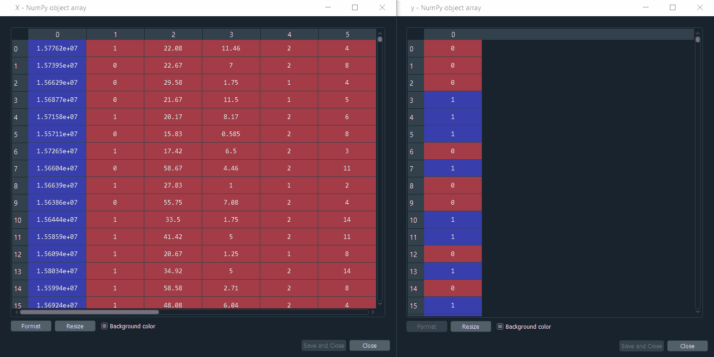

#### 注意:在这里，我们将数据集分成 x 和 y，但我们没有这样做，因为我们正在进行一些监督学习，我们并没有试图建立一个最终会预测 0 或 1 的模型。我们将在最后对获得批准的客户和未获得批准的客户进行区分。

由于我们正在训练我们的自组织图，我们将只使用 X，因为我们正在进行一些无监督的深度学习，这意味着没有考虑自变量。

接下来，我们将进行**特征缩放**，因为这是深度学习的必修课，因为要进行高计算，并且我们将从具有大量非线性关系的高维数据集开始，因此如果对特征进行缩放，我们的深度学习模型将更容易训练。

我们实际上要做和递归神经网络一样的事情。我们将使用**归一化**，这意味着我们将获得 **0** 和 **1** 之间的所有特征。所以，我们先从**sklearn . premization**导入 **MinMaxScaler** 。然后我们将创建一个对象 **sc** 的**最小最大缩放器**类，在该类中，我们将传递 **feature_range** 参数，该参数指定我们的缩放范围在 **0** 和 **1** 之间，这被称为归一化。接下来，我们将把 **sc** 对象拟合到 **X** 上，这样 sc 就得到 X 的所有信息，像最小值和最大值，它需要对 X 应用归一化的所有信息，所以，我们首先将对象拟合到 X 上，然后我们需要对 X 进行变换，也就是对 X 应用归一化，因此，我们将使用 **sc.fit_transform** 方法，我们将对 **X** 应用该方法。

```

# Feature Scaling
from sklearn.preprocessing import MinMaxScaler
sc = MinMaxScaler(feature_range = (0, 1))
X = sc.fit_transform(X)

```

执行上述代码后，我们可以从下图中看到，X 都是归一化的，我们确实可以检查所有的值都在 0 到 1 之间。

**输出:**

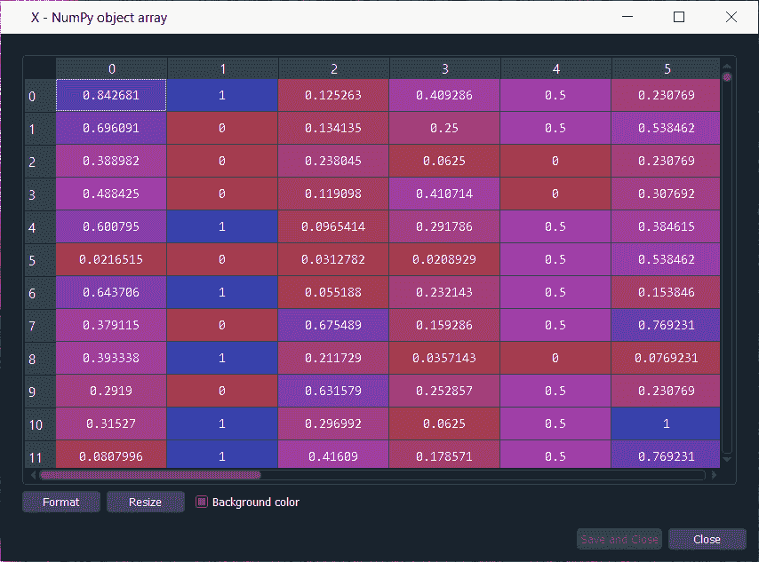

因此，我们刚刚完成了我们的数据预处理阶段，现在我们准备训练我们的 SOM 模型。为了训练我们的模型，我们有以下两种选择:

1.  第一种选择是从头开始实现 SOM。
2.  第二种选择是使用另一个开发人员制作的代码或类，就像我们使用另一个开发人员制作的 scikit learning 一样，只是在这里，自组织映射在 scikit learning 中没有实现。

因此，我们将从另一个开发人员那里获得它，这完全取决于在线可用的内容，以及 SOM 的一些好的实现是否由开发人员完成。幸运的是，SOM 的一个如此优秀的实现是 **Minisom 1.0** ，它是由 **Giuseppe Vettigili** 开发的，是一个基于[T5】NumPyT7】的自组织地图的实现。许可证是由 3.0 提供的 **Creative Commons，这意味着我们可以共享、适配以及对代码做任何我们想做的事情，因此我们完全可以使用它来构建我们的 SOM。**](https://www.javatpoint.com/numpy-tutorial)

为了开始训练 SOM 模型，我们将首先导入 MiniSom，记住在文件资源管理器的工作目录文件夹中，我们得到 minisom.py，它是开发人员自己制作的自组织地图的实现。我们将从 minisom python 文件中导入名为 **MiniSom** 的类。接下来，我们将创建这个类的一个对象，这将是自组织映射本身，它将在 **X** 上进行训练，因为我们正在进行一些无监督的学习，即我们被训练来识别 X 中包含的自变量内部的一些模式，并且我们不使用因变量的信息。我们不考虑 y 中的信息。

由于对象是自组织地图本身，所以我们将称之为 **som，**然后我们将称之为类 **MiniSom，**，我们将在其中传递以下参数。

*   第一个参数是 **x** 和 **y** ，这当然是网格到自组织图的维度。所以，这里的选择是任意的，我们可以为我们的自组织地图选择我们想要的任何东西。由于我们的数据集中没有那么多观测值，所以我们将只制作 10 乘 10 的网格。因此，我们要输入 **x=10** 和 **y=10** 。
*   下一个参数是 **input_len** ，它对应于我们数据集中的特征数量，不是在原始数据集中，而是在 X 中，因为我们在 X 上训练 som 对象，它包含 14 个属性加上客户 ID，因为它将有助于识别潜在的骗子。因此，输入长度将为 14+1= **15** 。
*   第三个参数是**σ**，是网格中不同邻域的半径。所以，我们将保留其默认值，即 **1** 。
*   最后，我们有了 **learning_rate** 参数，它是决定每次迭代中更新多少权重的超参数。因此，学习率越高，收敛速度越快，如果学习率越低，自组织映射需要的时间就越长。因此，我们将再次保留默认值，即 **5** 。

在此之后，我们将在 **X** 上训练我们的 **som** 对象，但是在此之前，我们将首先初始化权重，这将借助 **random_weights_init** 方法来完成，并且在方法内部，我们将输入 **X** 。然后我们将使用 **train_random** 方法来训练 x 上的 som，在方法内部，我们将传递两个参数；一个是数据，即 **X** ，另一个是 **num_iteration** ，即迭代次数。这里，我们正在尝试 **100** 次迭代，因为这对我们的数据集来说已经足够了。

```

# Training the SOM
from minisom import MiniSom
som = MiniSom(x = 10, y = 10, input_len = 15, sigma = 1.0, learning_rate = 0.5)
som.random_weights_init(X)
som.train_random(data = X, num_iteration = 100)

```

因此，我们刚刚训练了我们的模型，现在我们准备可视化结果，即绘制自组织地图本身，在那里我们可以清楚地看到包含所有最终获胜节点的二维网格，对于每个获胜节点，我们将获得平均中间神经距离。每个特定获胜节点的 MID 是我们定义的邻域内获胜节点周围所有神经元距离的平均值，σ是邻域的半径。因此，中间值越高，获胜节点就越是离群点，即欺诈，因为对于每个神经元，我们将获得中间值，对于该中间值，我们只需要取具有最高中间值的获胜节点。

为了开始构建地图，我们需要一些特定的函数来完成，因为我们不会使用 matplotlib，因为我们将要绘制的图实际上非常具体。我们不会绘制像直方图或曲线这样的经典图形，但我们正在构建一个自组织地图，因此在某种程度上，我们将从头开始制作它。

那么，我们将要使用的功能，我们将从 **pylab** 中导入，这些功能是**骨骼、pcolor、colorbar、plot** 、 **show** 。接下来，我们将开始制作我们首先需要初始化图形的地图，即包含地图的窗口，为此，我们将使用 **bone()** 函数。

在下一步中，我们将把不同的获胜节点放在地图上，这将通过在地图上添加由 SOM 识别的所有获胜节点的平均中间神经距离的信息来完成。这里我们不会添加所有这些 MID 的数字，相反，我们将使用对应于 MID 的不同范围值的不同颜色，为此，我们将使用 **pcolor** 函数，在该函数中，我们将为 SOM 的所有获胜节点添加 MID 的所有值。为了得到这些平均距离，我们有一些特定的方法，即距离图方法，事实上，这个距离图方法将返回一个矩阵中的所有中间值，然后进行矩阵的转置，以获得 pcolor 函数的正确顺序，这将通过使用 **som.distance_map()来完成。T** 。接下来，我们将添加 colorbar，它将为我们提供所有这些颜色的图例。

```

# Visualizing the results
from pylab import bone, pcolor, colorbar, plot, show
bone()
pcolor(som.distance_map().T)
colorbar()

```

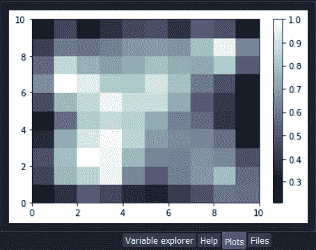

从上面的图像中，我们可以看到图像右侧有图例，这是 MID 的范围值。但这些是从 **0** 到 **1** 的归一化值。因此，我们可以清楚地看到**最高的** MID 对应**白色**颜色，**最小的** MID 对应**深色**颜色。因此，基于我们之前讨论的内容，我们已经知道欺诈在哪里，因为它们是由远离一般规则的外围获胜节点识别的。可以看出，所有大多数深色都彼此靠近，因为它们的 MID 相当低，这意味着一个获胜节点附近的所有获胜节点都靠近中心的获胜节点，这因此创建了获胜节点的集群。

由于获胜的节点具有大的 MID，因此它们是异常值，因此也是潜在的欺诈。在下一步中，我们将通过继续进行获胜节点的反向映射来获得客户的显式列表，以查看哪些客户与该特定的获胜节点相关联。但是我们可以比这张地图做得更好，因为我们可以添加一些标记来区分获得批准的客户和没有获得批准的客户，因为欺骗并获得批准的客户比没有获得批准并被欺骗的客户更适合欺诈检测。因此，最好能看到客户在自组织地图中的位置。

因此，在下一步中，我们将在各处添加标记，以告知这些获胜节点中的每一个，与这些获胜节点相关联的客户是否获得批准。我们将创建两个标记；一些红色圆圈对应没有获得批准的客户，一些绿色方块与获得批准的客户相关。为了创建一个标记，我们将首先创建一个名为**标记、**的新变量，然后创建两个标记对应的两个元素的向量，即第一个是由**“o”**引用的圆，另一个是由**“s”**引用的正方形。接下来，我们将为这些标记着色，为此我们将再次创建一个名为 **colors** 的变量，然后创建一个两个元素的向量；第一个是**“r”**引用的红色和**“g”**引用的绿色。

之后，我们将遍历所有客户，对于每个客户，我们将获得优胜节点，根据客户是否获得批准，如果客户没有获得批准，我们将使用红色圆圈标记这个优胜节点，如果客户获得批准，我们将使用绿色方块标记该节点。这里我们将使用一个 for 循环，它需要两个循环变量，即 **i** 和 **x** ，这样 I 就是我们客户数据库所有索引的不同值，这简单地意味着它将从 0，1，2，..689 和 x 将是客户的不同向量。

因此，对于 X 和 I，我们将在枚举中添加**，在枚举中，我们将添加 **X** ，然后进入循环。在这个循环中，我们将首先为第一个客户获取获胜节点，因为在这个循环的开始，我们从第一个要获取其获胜节点的客户开始。获取获胜节点，先从 **w** 开始，然后取我们的对象 **som** ，接着取**胜者**法。接下来，我们将在赢家方法中通过 **X** ，因为它将为我们获得客户 X 的获胜节点。**

拿到获胜节点后，我们将**绘制**上面的彩色标记。然后在绘图功能中，我们将指定标记的坐标，为此，我们希望将标记放置在获胜节点的中心。正如我们之前看到的，由于每个获胜节点在自组织地图中由一个正方形表示，因此我们希望将标记放在正方形的中心。因此获胜节点的坐标为 **w[0]** 对应 **X** 坐标， **w[1]** 对应 **y** 方块左下角坐标。但是我们要放在正方形的中心，所以我们会加上 **w[0] + 0.5** 放在正方形水平基的中间， **w[1] + 0.5** 放在正方形的中心。

为了知道标记将是红色圆圈还是绿色正方形，我们将采用我们之前创建的**标记**向量，然后我们将在向量内部传递 **y[i]** ，因为 **i** 是客户的指标，所以 y[i]是客户因变量的值，即如果客户没有获得批准，则 **0** ，如果客户获得批准，则 **1** 。因此可以得出结论，如果客户没有得到认可，那么 **y[i]** 将等于 **0** ，那么**标记【y[I]】**也将等于**圆**。同样，如果客户得到认可，那么 **y[i]** 和**标记【y[I]】**将变为等于 **1** ，对应一个**方块**。接下来，我们将以同样的方式添加颜色，通过获取我们的颜色向量，即颜色，然后我们将获取[y[i]]，因为它包含客户是否获得批准的信息，因此根据[y[i]]的值，如果客户没有获得批准，我们将获得红色，如果客户获得批准，我们将获得绿色。

但事实上，我们会给标记赋予颜色[y[i]]，然而，在标记中，我们可以给标记的内部和边缘着色。这里我们将对标记的边缘进行着色，因此我们将使**标记颜色**等于**颜色【y[i]】、**，对于标记的内部，我们不会对其进行着色，因为同一获胜节点可以有两个标记，因此，我们将使**标记颜色**等于**无**。最后，我们将添加**标记化**，因为否则，我们会得到太小的标记，我们希望能够看到标记，所以我们将使其等于 **10** 。最终，我们会对边缘的大小做同样的处理；因此，我们将添加**标记宽度**，然后将其设置为等于 **2** 。现在，当我们查看我们的自组织图时，我们会看到它实际上会看起来更好，因为我们不仅会看到所有获胜节点的不同平均内部神经距离，而且我们还会看到与获胜节点相关联的客户是否获得批准，为了检查它，我们将添加 **show()** 来显示该图。

```

markers = ['o', 's']
colors = ['r', 'g']
for i, x in enumerate(X):
    w = som.winner(x)
    plot(w[0] + 0.5,
         w[1] + 0.5,
         markers[y[i]],
         markeredgecolor = colors[y[i]],
         markerfacecolor = 'None',
         markersize = 10,
         markeredgewidth = 2)
show()

```

**输出:**

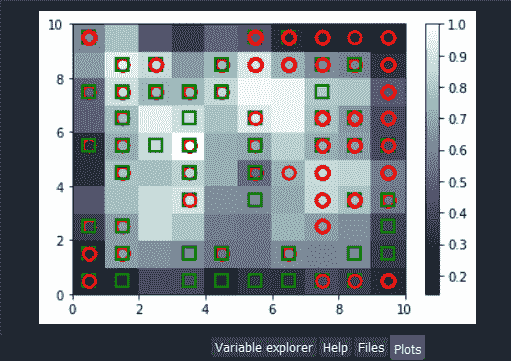

从上面的图片中，我们可以看到我们有平均的中间节点距离，以及我们得到的关于客户是否获得了每个获胜节点的批准的信息。例如，如果我们查看红色圆圈，我们可以看到与该特定获胜节点相关联的客户没有获得批准。然而，如果我们看绿色方块，我们可以看到与之相关的客户得到了认可。

现在，如果我们看一下异常值，那么它们就是获胜节点，其中平均内部神经距离几乎等于 1，这表明与这些获胜节点相关联的客户的风险很高。基本上，在那个特定的案例中，我们看到我们有两种情况，即一些客户得到了批准，而一些客户没有得到批准，因为我们得到了一个绿色的正方形和一个红色的圆圈。因此，现在我们必须在获胜的节点中抓住潜在的骗子，但首先是那些获得批准的人，因为抓住逃脱惩罚的骗子当然与银行更相关。

在这里，我们已经完成了地图，这是相当好的，现在我们将使用这张地图来捕捉这些潜在的骗子。我们将使用字典，通过使用 **minisom.py** 中提供的方法可以获得该字典，因为它包含从获胜节点到客户的所有不同映射。基本上，我们将首先获得所有这些映射，然后我们将使用我们识别的异常值获胜节点的坐标，白色节点，因为它将为我们提供客户列表。由于我们已经确定了两个外围的获胜节点，我们将不得不使用 concatenate 函数来连接两个客户列表，这样我们就可以有一个潜在骗子的完整列表。

我们将从引入 snew 变量**映射**开始，然后使用一种方法将获胜节点的所有映射的字典返回给客户。既然是方法，那么我们就需要取我们的对象 **som** ，然后我们会加上点接着加上 **win_map** 方法。在方法内部，我们将简单地输入 X，它不是全部数据，而只是训练我们的 SOM 的数据。

```

# Finding the frauds
mappings = som.win_map(X)

```

执行上述代码后，我们将得到以下输出。

**输出:**

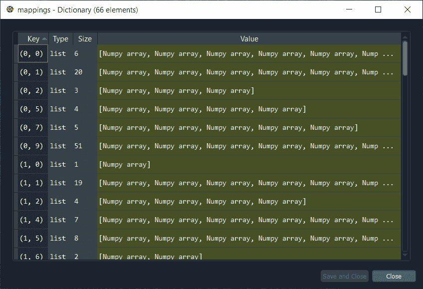

正如我们已经说过的，**映射**实际上是一个字典，如果我们点击它，我们将获得 SOM 中所有不同获胜节点的所有映射。这里的关键是获胜节点的坐标，如果我们谈论坐标 **(0，0)** ，我们会看到有 **6** 客户与那个特定的获胜节点相关联，我们实际上可以通过点击相应的值来查看列表，如下所示。

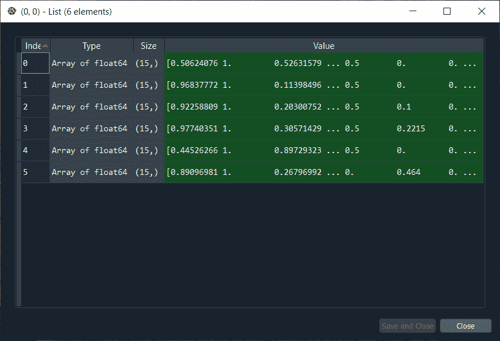

从上图中，每一行对应于一个与坐标(0，0)的获胜节点相关联的客户。

在此之后，我们创建一个名为**欺诈**的新变量，然后我们将再次回到我们的地图，以获得外围获胜节点的坐标，因为这些是对应于我们正在寻找的客户的获胜节点。所以，我们将再次执行它，然后我们将使用**映射**字典。在字典的括号内，我们将输入第一个外围节点的坐标，即 **(1，1)** ，因为它将给出与该外围获胜节点相关的客户列表，然后添加第二个外围获胜节点的坐标 **(4，1)** ，这对应于非常高的 MID。这里有一件事非常重要，要记住，即每当我们输入两个我们愿意连接成一个相同参数的列表时，我们只需要将我们的两个映射放入一对新的括号中，然后，我们添加另一个参数，即**轴**，这是一个强制参数，因为这是您指定是垂直连接还是水平连接的方式。由于我们连接客户的水平向量，并且我们希望将客户向量的第二个列表放在客户向量的第一个列表下面，因此我们将沿着垂直轴连接，默认值为 **0** 。

最终，我们都准备好获取骗子的完整列表，所以让我们执行下面的代码。

```

frauds = np.concatenate((mappings[(1,1)], mappings[(4,1)]), axis = 0)

```

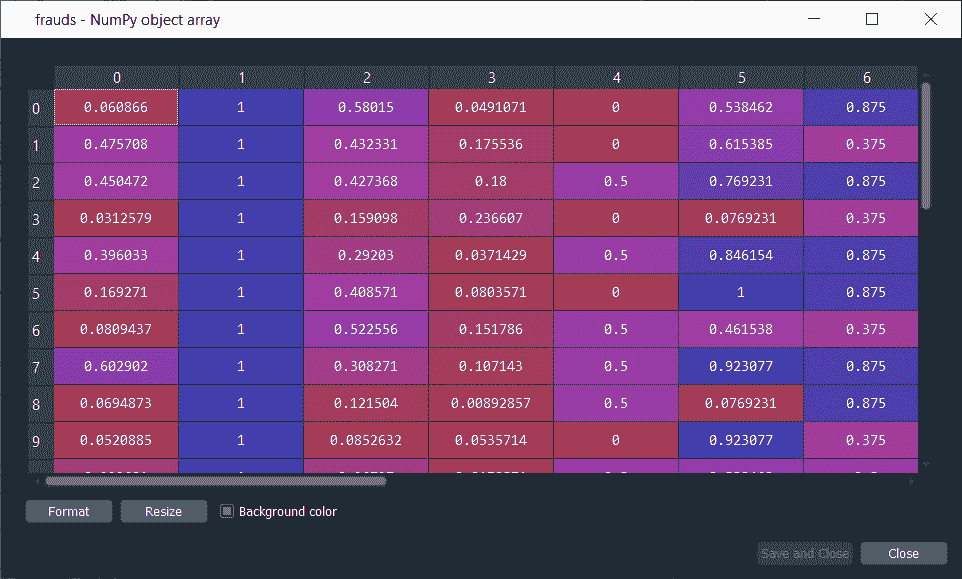

从上图中，我们可以看到潜在被骗客户的名单。我们可以看到这些值仍然是按比例缩放的，所以剩下唯一要做的就是反转缩放，为了做到这一点，我们有一个反转这个映射的反转缩放方法。

因此，我们将再次从**欺诈**列表开始，然后使用**逆变换**方法来逆此缩放。由于我们应用了我们从最小最大缩放器类创建的 sc 对象的特征缩放，所以我们将取我们的对象 **sc** ，然后我们将使用**逆变换**方法，在该方法中，我们将输入我们的欺诈列表。

```

frauds = sc.inverse_transform(frauds)

```

当我们运行上述代码时，我们得到了具有原始真实值的欺诈列表，如下所示。

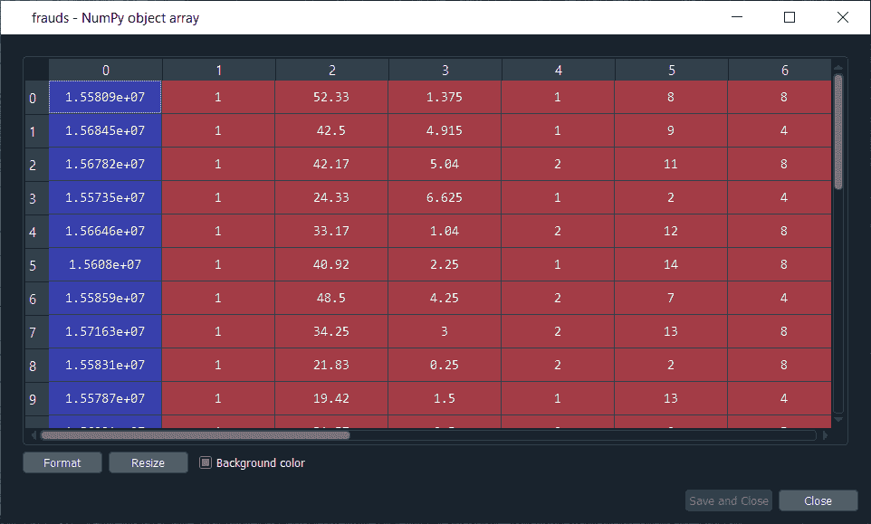

从上图可以看出，我们有**客户 ID** ，可以用来查找潜在的骗子。因此，在这里，我们完成了我们的工作，把潜在的骗子名单交给了银行。此外，分析师将调查潜在骗子的名单，他可能会获得所有这些客户标识的 **y** 值，以优先考虑那些获得批准修改申请的客户标识，然后通过更深入的调查，他们将发现客户是否真的以某种方式作弊。

* * *