# 大型案例研究

> 原文：<https://www.javatpoint.com/keras-mega-case-study>

在这个大型案例研究中，我们将制作一个混合深度学习模型。顾名思义，这个挑战是关于结合两个深度学习模型，即人工神经网络和自组织图。

因此，我们将从信用卡应用程序数据集开始识别欺诈。这个想法是做一个高级的深度学习模型，我们可以预测每个客户被欺骗的概率，并做到这一点；我们将从无监督到有监督的深度学习。

挑战由两部分组成，即在第一部分，我们将制作我们的混合深度学习模型的无监督深度学习分支，然后在第二部分，我们将制作有监督深度学习分支，这将产生由[无监督和](https://www.javatpoint.com/difference-between-supervised-and-unsupervised-learning)有监督深度学习组成的混合深度学习模型。

这里我们再次使用我们刚刚在自组织图中看到的 **Credit_Card_Applications** 数据集，该数据集包含来自银行不同客户的所有信用卡应用程序，因此我们将使用与上一主题中完全相同的自组织图来识别欺诈。但是接下来的挑战是使用这个自组织映射的结果，然后将我们的无监督深度学习模型结合到一个新的有监督深度学习模型，该模型将把我们的 SOM 给出的结果作为输入。挑战在于获得每个客户作弊的预测概率排名。

我们将获得非常小的概率，因为 SOM 只识别了几个欺诈，但这并不重要。主要目标是获得概率的排名。

## 构建混合深度学习模型

我们将从第 1 部分开始，包括制作混合深度学习模型的无监督深度学习分支，即**自组织图**，我们将使用它来识别欺诈，就像我们之前所做的那样。

### 第一部分:用自组织地图识别欺诈

因此，我们将运行以下代码来获得包含外围神经元的自组织图。

```

# Part 1 - Identify the Frauds with the Self-Organizing Map
# Importing the libraries
import numpy as np
import pandas as pd
import matplotlib.pyplot as plt

# Importing the dataset

dataset = pd.read_csv('Credit_Card_Applications.csv')
X = dataset.iloc[:, :-1].values 
y = dataset.iloc[:, -1].values

# Feature Scaling

from sklearn.preprocessing import MinMaxScaler
sc = MinMaxScaler(feature_range = (0,1))
X = sc.fit_transform(X)

#Training the SOM

from minisom import MiniSom
som = MiniSom(x=10, y=10, input_len= 15, sigma= 1.0, learning_rate = 0.5)
som.random_weights_init(X)
som.train_random(data = X, num_iteration = 100)

#Visualizing the results

from pylab import bone, pcolor, colorbar, plot, show
bone()
pcolor(som.distance_map().T)
colorbar()
markers = ['o', 's']
colors = ['r', 'g']
for i, x in enumerate(X):
    w = som.winner(x)
    plot(w[0] + 0.5,
         w[1] + 0.5,
         markers[y[i]],
         markeredgecolor = colors[y[i]],
         markerfacecolor = 'None',
         markersize = 10,
         markeredgewidth = 2)
show()

```

**输出:**

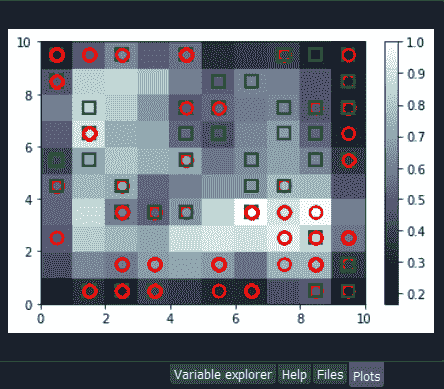

从上面的图像中，我们可以看到我们得到了一个轮廓神经元，因为它的特征是一个大的 MID，即平均中间神经距离，除此之外，它还包含了客户的类别；获得应用程序批准的客户和没有获得应用程序批准的客户。

因此，我们得到了这两种场景的欺诈，选择外围神经元是任意的，因为它取决于我们想要得到的阈值来选择这些神经元，也就是说，要么我们想要选择最白的神经元，要么我们可以稍微降低阈值。因此，我们将选择最白的一个，其余的所有神经元都是遵循一般规则的规则神经元或普通神经元，它们看起来像非潜在的欺诈者。

现在之后，我们得到了两个神经元的坐标，如上图所示，即第一个有坐标(7，2)，第二个有坐标(8，3)。因此，我们已经准备好查找欺诈列表和潜在的欺诈，我们将通过执行以下代码来实现。

```

# Finding the frauds
mappings = som.win_map(X)
frauds = np.concatenate((mappings[(7,2)], mappings[(8,3)]), axis = 0)
frauds = sc.inverse_transform(frauds)

```

执行上述代码后，我们将进入变量浏览器，然后我们将点击**欺诈**变量，在这里我们将看到我们得到 17 个欺诈。

**输出:**

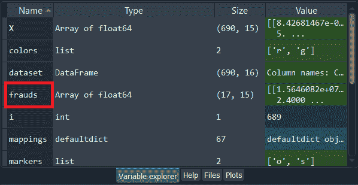

**欺诈:**

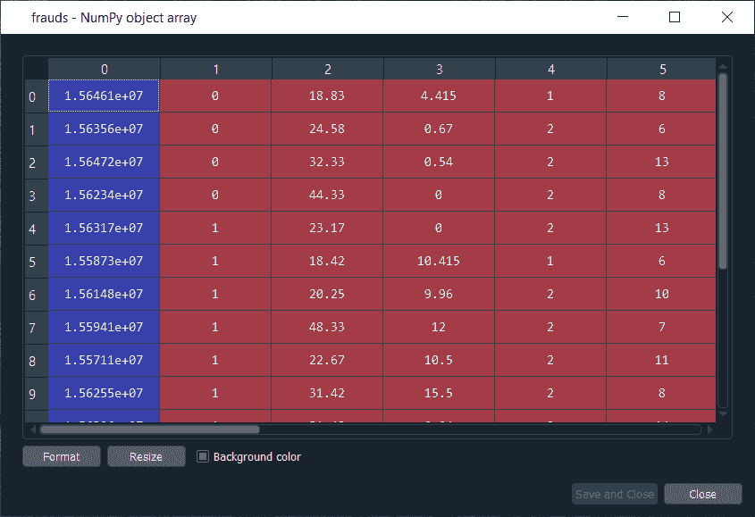

接下来，我们将使用欺诈列表从无监督深度学习到有监督深度学习，因为在切换时，我们需要一个因变量，而在无监督深度学习中，我们没有考虑任何因变量，因为它们是在没有使用任何因变量的情况下在特征上训练的。但是当进行监督学习时，我们需要一个因变量，因为我们需要模型来理解特征和结果/结果之间的一些相关性，这在因变量中。

### 第二部分:从无监督到有监督的深度学习

在第二部分中，我们将首先创建特征矩阵，这是我们训练监督学习模型所需的第一个输入，然后我们将创建因变量。

为了创建特征矩阵，我们可以用与上一部分相同的方法从数据集中提取矩阵，为此，我们将使用**客户**替换 X，因为该特征矩阵包含银行所有客户的信息，因此每一行对应于一个拥有所有不同信息的客户。所以，我们称之为客户，然后我们将因变量称为**is _ 欺诈**，等于**1**；如果**是**，则存在欺诈，**为 _ 欺诈**等于 0；如果**没有**，就不存在欺诈。我们正在取除最后一列外的所有列，即**类**，无论申请是否被批准，我们都包含了**客户标识**来跟踪客户。

但是由于我们只需要包含一些信息的特征矩阵，这可能有助于预测欺诈的概率，**客户 ID** 不会帮助我们预测欺诈的概率。因此，我们将不包括该列，但数据库的最后一列可能是相关信息，它将帮助我们确定客户信息与其作弊概率之间的一些相关性。所以，我们从来不知道我们会包括这个自变量。

为了创建特征矩阵，我们需要索引 1 中的所有变量，所以我们不包括索引 0 的第一个变量直到最后一个变量。因此，**客户**将是我们的索引数据集从 1 到最后一列的所有列，这里是**-1**；我们不包括最后一列，所以我们将删除它。这里我们包括了除了第一列之外的所有列，然后，当然，我们采取了所有的行，因为我们想采取所有的客户后面跟着**。值**创建 NumPy 数组。

```

# Creating the matrix of features
customers = dataset.iloc[:, 1:].values

```

通过执行上面的代码行，我们得到了我们的特征矩阵，如下所示。

**输出:**

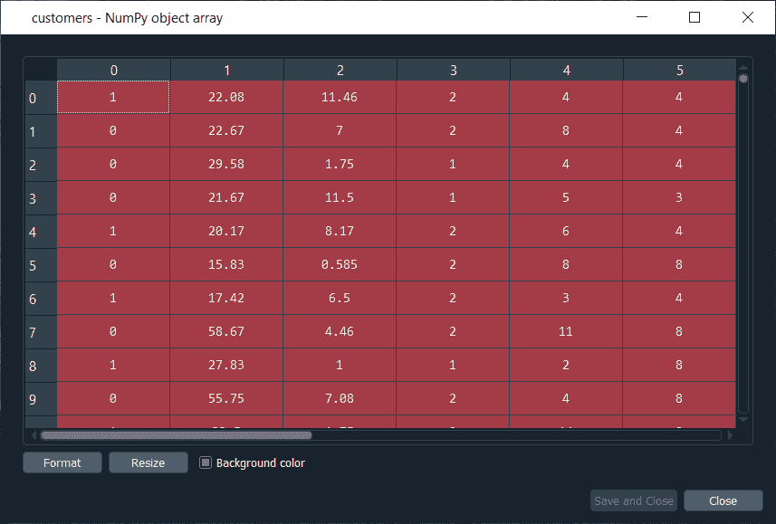

从上面的图片中，我们可以看到它包含了 690 个客户和他们的所有特征，即他们需要为信用卡申请填写的所有不同信息。

接下来，我们将创建因变量，这是这里最棘手的部分。由于因变量将包含结果，无论它是否是欺诈，它都将是具有二进制结果的欺诈，如果没有欺诈，它将获得值 0，如果有欺诈，它将获得值 1。

因此，我们将初始化一个 690 个零的向量，这基本上就像我们在开始时假装所有客户都没有作弊，然后我们将提取客户标识，我们将在零向量中放一个 1。我们将用 1 替换 0 来表示与客户标识对应的索引。

让我们从初始化向量开始，正如我们所说的，我们将把它称为**is _ fragment**，这将是我们的因变量。然后我们将使用 NumPy 函数初始化这个向量，为此，我们将首先调用它的快捷方式 **np** 来获得这个函数，即**零**，这将创建任意数量元素的 0 的向量。因为我们想要 690 个元素，所以为了更一般化，我们将在函数内部传递 **len(dataset)** ，因为它引用了数据集中的观察数，在我们的例子中是 690。

```

# Creating the dependent variable
is_fraud = np.zeros(len(dataset))

```

执行完上面一行代码后，我们可以看到我们的向量在下面给出的图像中用 690 个零初始化。

**输出:**

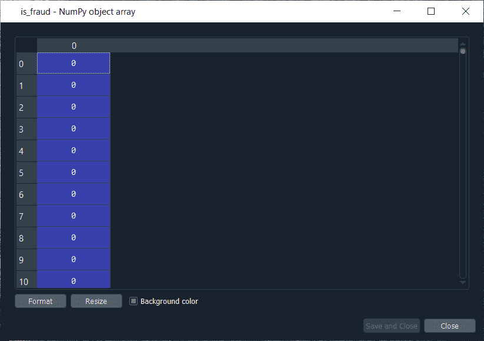

下一个挑战是为所有可能被骗的客户 ID 设置一个。因此，我们将循环所有客户，这样，对于每个客户，我们将检查该客户的客户标识是否属于欺诈列表，如果是这样，我们将把零替换为一。因此，我们将对循环进行**，然后我们需要一个我们称之为 **i** 的变量，然后我们需要一个范围，这个范围必须是客户的指标范围，所以我们将在范围**中写**。由于默认的开始是零，所以我们需要指定停止，也是 **len(数据集)**，即 690，最后加上 **:** 。**

```

For i in range(len(dataset)):

```

正如我们刚才所说的，对于每个客户，我们需要检查其客户标识是否在欺诈列表中，因此我们将通过设置 **if** 条件来做到这一点。我们先来说，如果这个客户的客户 ID，那么我们需要提取这个客户的客户 ID，这个客户 ID 包含在**dataset . iloc【I，0】**中，其中 **i** 代表数据集的 i <sup>第</sup>行，我们知道，每个客户对应一行，所以 i <sup>第</sup>行对应 i <sup>第</sup>行的客户，也就是我们刚才处理的客户， 循环然后 **0** 因为正如我们前面所说的，的第一列包含客户 id。 因此，数据集 iloc[i，0]将获得客户编号 I 的客户 ID，然后我们就不需要任何客户 ID 了。值，因为它有助于创建 NumPy 数组。在此之后，我们将检查该客户 ID 是否在欺诈列表中，除此之外，我们将在欺诈中添加**，这将查看该客户 ID 是否在欺诈列表中。但是，如果是这种情况，我们将为该特定客户用 1 替换 0。**

所以，对于这个客户，is_fraud 中的值会得到一个 1 而不是零，这个客户 is_fraud 的值由 **is_fraud[i] = 1** 给出，这是这个客户对应的 is_fraud 客户的值，因为这个客户有指标 I。

```

if dataset.iloc[i,0] in frauds:
        is_fraud[i] = 1

```

执行上述代码后，我们将看到我们的因变量现在是一个 690 个元素的向量，当我们打开它时，我们得到了我们的因变量，其中包含欺诈列表中客户索引的因变量，如下图所示。由于我们的欺诈列表中有 17 个元素，因此我们将看到 17 个元素，您可以通过向下滚动来查看。

**输出:**

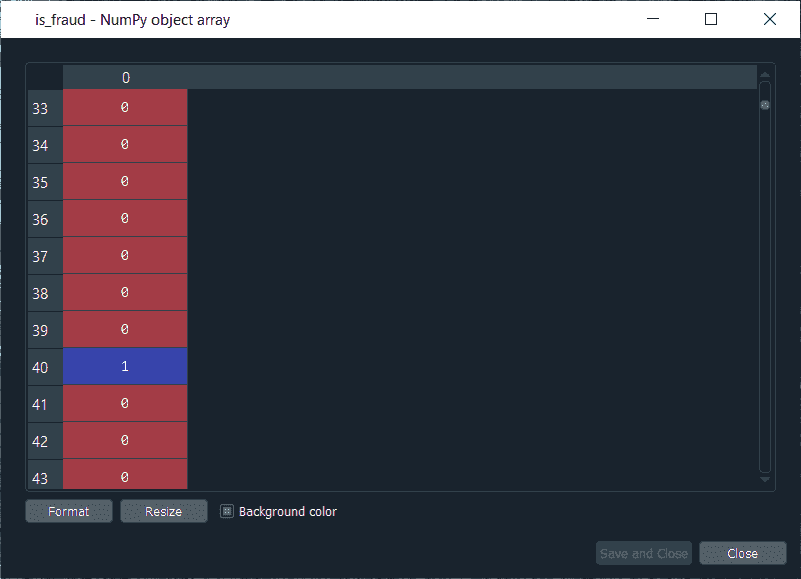

现在我们已经有了一切来训练我们的[人工神经网络](https://www.javatpoint.com/artificial-neural-network)，我们将以与前面相同的方式运行下面的代码。基本上，我们只是在所有的人工神经网络体系结构中执行特征缩放部分，然后用拟合方法进行训练，然后进行预测，即预测概率。

```

# Feature Scaling
from sklearn.preprocessing import StandardScaler
sc = StandardScaler()
customers = sc.fit_transform(customers)

```

运行以上部分后，我们可以从下面给出的图像中看到，我们的客户规模很大，因此我们可以继续下一部分。

**输出:**

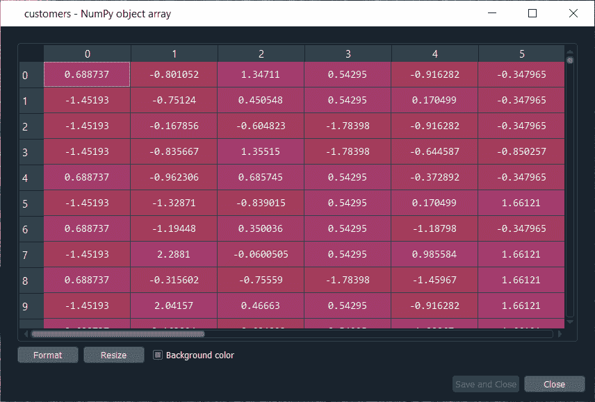

接下来，我们将构建[人工神经网络](https://www.javatpoint.com/keras-artificial-neural-networks)架构，并使神经网络适合我们的训练集。有一件重要的事情需要注意，我们正在处理一个包含 690 个观察值的非常简单的数据集，这对我们的[深度学习](https://www.javatpoint.com/deep-learning)模型来说非常小，但是这里的想法不是处理大数据或者处理一些非常复杂的数据集，而是学习如何组合两个深度学习模型。

我们简化了代码，因为我们不需要增加第二个隐藏层的复杂性，所以我们跳过了这一部分，然后在输入层，我们取了 2 个神经元，而不是 6 个，然后改变输入维度，因为它们对应于我们的特征矩阵中的特征数量。因为我们的特征矩阵中有 15 个特征，所以我们把 **input_dim** 等于 **15** 而不是 11。

```

# Part 2 - Now, let's make the ANN!
# Importing the Keras libraries and packages
from keras.models import Sequential
from keras.layers import Dense

# Initialising the ANN
classifier = Sequential()

# Adding the input layer and the first hidden layer
classifier.add(Dense(units = 2, kernel_initializer = 'uniform', activation = 'relu', input_dim = 15))

# Adding the output layer
classifier.add(Dense(units = 1, kernel_initializer = 'uniform', activation = 'sigmoid'))

# Compiling the ANN
classifier.compile(optimizer = 'adam', loss = 'binary_crossentropy', metrics = ['accuracy'])

```

此外，我们需要改变输入，输出，批处理大小以及时代。输入的是我们的特征矩阵，不再叫 X_train，现在叫**客户**。然后我们需要改变输出**，**，不再叫 y_train，现在**是 _ 欺诈**。为了简单起见，我们取了 **batch_size** 等于 **1** 和**纪元**等于 **2** ，因为数据集非常简单，我们的人工神经网络只需要 1 或 2 个纪元就能理解相关性。权重只需要在 1 或 2 次拍摄中更新，这就是为什么我们拍摄了 2 个时代。如果你的观察很少，特征很少，你不需要为 100 个时代训练一个深度学习模型。

```

# Fitting the ANN to the Training set
classifier.fit(customers, is_fraud, batch_size = 1, epochs = 2)

```

现在我们已经准备好了我们的人工神经网络，我们将把它训练成我们的特征矩阵、客户矩阵，我们的因变量是一个骗局。运行上述代码后，我们可以从下面给出的输出图像中看到，我们提高了准确率，即 **97.54%** ，损失从 **45.28%** 下降到 **14.64%** 已经相当不错了。

**输出:**

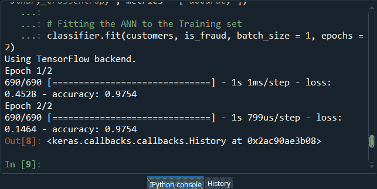

在训练了人工神经网络之后，我们将进入下一部分，我们将预测欺诈的概率。我们将把这些预测概率 **y_pred** 放在一起，当然，我们将使用我们的**分类器**，然后使用**预测**方法，不是像我们在 ANN 中做的那样对 X_test，而是对**客户**进行预测，因为我们希望为每个客户预测该客户作弊的概率或其应用中存在欺诈的概率。只需执行上面的代码，我们就可以得到预测的概率。

```

# Predicting the probabilities of frauds
y_pred = classifier.predict(customers)

```

执行完上面的行，我们可以看一下 **y_pred** ，如下图。

**输出:**

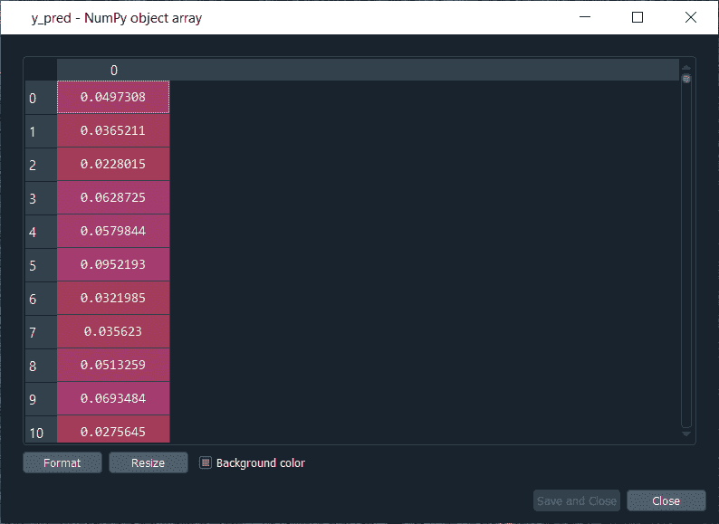

从上图中，我们可以看到 y_pred 具有所有不同的概率。它有小概率，但这是正常的，因为因变量向量包含几个概率，即总共 690 个观察中只有 17 个。

所以，这是所有的概率，现在我们必须对它们进行排序，为此，我们有两个选择；要么我们可以在 Excel 中导出 y_pred 向量并直接对概率进行排序，因为在这种情况下，我们不需要进一步遵循它，要么为了学习更多 python 技巧来理解它如何在 python 中对数组进行排序，那么我们必须遵循下面给出的步骤。

但是在对概率进行排序之前，最好将客户标识包含在 y_pred 向量中，因为到目前为止，我们只有预测的概率。如果我们能创建一个包含两列的数组，其中第一列包含客户标识，那就太好了。第二列将包含预测概率，这样我们就可以清楚地识别出拥有每个客户的每个预测概率的客户。

让我们从将第二列添加到 y_pred 开始，它实际上将位于第一个位置，因此我们将再次采用我们的 **y_pred** 向量，并且由于我们想要将包含客户 id 的第一列添加到 y_pred，因此我们将使用与我们在前面步骤中使用的相同的连接技巧。但是我们不会做什么改变；我们将首先去掉映射，然后我们将在二维数组中添加我们想要的第一列，当然，这是客户标识，即**数据集。值**之后加上 **y_pred** ，最后我们会加上**轴=1** ，因为我们要做一个水平拼接，所以我们取 **1** 而不是 0。

```

y_pred = np.concatenate((dataset.iloc[:, 0:1].values, y_pred), axis = 1)

```

现在，当我们执行上面的行时，我们将在下图中看到，它给出了一个包含两列的 2D 数组，即客户标识的第一列和预测概率的第二列。

**输出:**

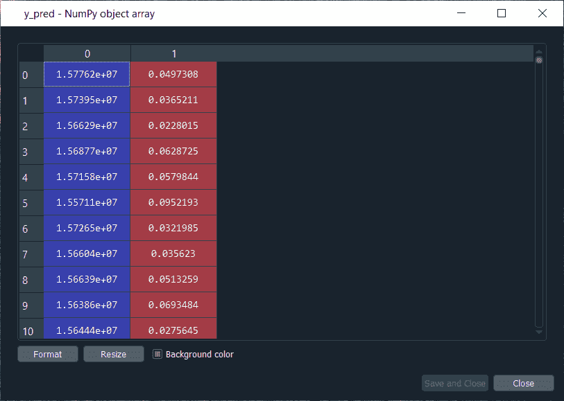

从上面的图像中，我们可以看到 y_pred 现在是一个二维数组，如我们所期望的那样有两列。它在第一列中有所有的客户标识，在第二列中有预测概率，并且我们在客户标识和预测概率之间有正确的关联。

接下来，我们将在 NumPy 排序函数的帮助下，根据预测的作弊概率对客户进行排序，该函数将同时对所有列进行排序，但我们不会这样做，因为我们希望跟踪预测概率的客户标识。

因此，我们将使用一个技巧，它将只排序我们的第二列在任何时间。我们将再次采用 **y_pred** ，因为我们想要修改它，然后采用 **y_pred[y_pred[:，1]** ，因为它指定了我们想要排序的列，这是包含预测概率的第二列。最后，我们将使用一个 NumPy 数组方法，即 **argsort()** ，按照索引 1 的列对我们的 NumPy 数组进行排序，这正是我们想要的。

```

y_pred = y_pred[y_pred[:, 1].argsort()]

```

**输出:**

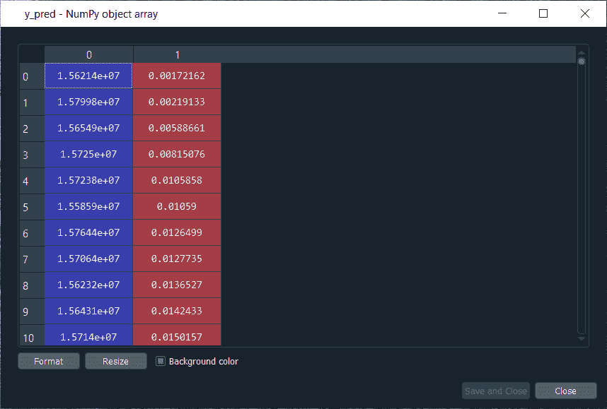

因此，从上图我们可以看出，所有的概率都是从最低到最高排序的。因此，我们得到了排名，这比现在好得多，因为欺诈部门可以利用这个排名，从欺诈的最高预测概率开始调查欺诈。

* * *