# 受限玻尔兹曼机

> 原文：<https://www.javatpoint.com/keras-restricted-boltzmann-machine>

如今，受限玻尔兹曼机是一种在深度学习框架中起主要作用的无向图形模型。最初，它是由保罗·斯摩棱斯基在 1986 年推出的一款 **Harmonium** ，然后在最近几年的**网飞**价格背景下获得了巨大的人气，RBM 在协同过滤方面取得了最先进的表现，并击败了大多数竞争对手。

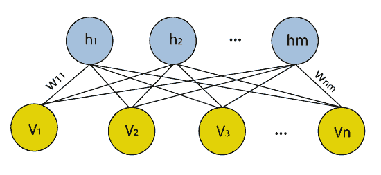

通过使用一个的未来激活作为下一个的训练数据来组成受限的玻尔兹曼机器，可以有效地学习许多隐藏层。这些基本上是属于所谓的基于能量的模型的神经网络。它是一种用于降维、分类、回归协同过滤、特征学习和主题建模的算法。

## 自动编码器与受限玻尔兹曼机器

自动编码器不是别人，正是一个包含 3 层的神经网络，这样输出层连接回输入层。与可见单位相比，它的隐藏单位要少得多。它执行训练任务，以便最小化重构或误差。简单地说，我们可以说训练有助于发现一种有效的方式来表示输入数据。

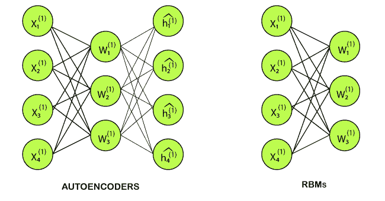

然而，RBM 也有类似的想法，但不是使用确定性分布，而是使用具有特定分布的随机单位。它训练模型来理解两组变量之间的关联。

RBM 有两个偏见，这是区别于其他自动编码器的最重要的方面之一。隐藏的偏差帮助 RBM 在向前传球时提供激活，而可见的层偏差帮助 RBM 在向后传球时学习重建。

## 受限玻尔兹曼机中的层

受限玻尔兹曼机器是浅的；他们基本上有两层神经网络，构成了深度信念网络的构件。输入层是 RBM 的第一层，也称为可见层，然后我们有第二层，即隐藏层。每个节点代表一个类似神经元的单元，它通过不同的层进一步相互连接。

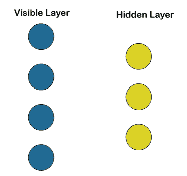

但同一层没有两个节点相连，肯定了不存在层内通信，这是受限玻尔兹曼机中唯一的限制。在每个节点，通过简单地处理输入进行计算，并随机决定是否应该开始传输输入。

## 受限玻尔兹曼机的工作

每个可见节点从驻留在数据库中的项目中获取一个低级特征，以便可以学习它；例如，从灰度图像的数据集中，每个可见节点将接收一个图像中每个像素的一个像素值。

让我们通过两层网络跟踪单个像素值 X。在隐藏层的第一个节点上， **X** 乘以一个**权重**，然后将其添加到**偏差**中。然后，结果被提供给**激活功能**，以便它可以产生该节点的输出，或者信号强度，当输入 x 已经给出时，该信号通过该节点。

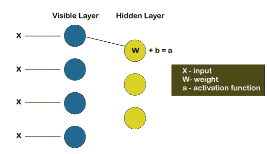

现在，我们将看看不同的输入如何在一个特定的隐藏节点上组合。基本上，每个 X 乘以一个不同的权重，然后对它们的乘积求和，然后将它们加到偏差中。同样，结果被提供给激活函数以产生该节点的输出。

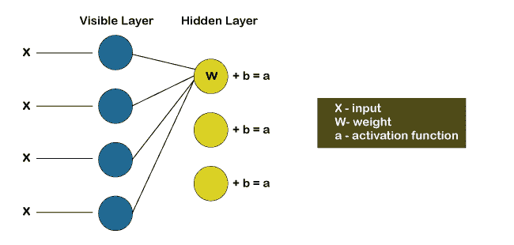

每个输入 X 在每个隐藏节点上乘以一个单独的权重 w。换句话说，我们可以说单个输入将遇到三个权重，这将进一步导致总共 12 个权重，即(4 个输入节点 x 3 个隐藏节点)。两层之间的权重将始终形成一个矩阵，其中行等于输入节点，列等于输出节点。

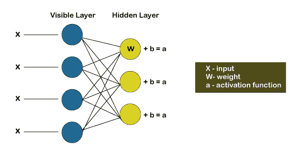

这里，每个隐藏节点将接收四个输入，这些输入将乘以单独的权重，然后再次将这些乘积加到偏差上。然后，它通过激活算法传递结果，为每个隐藏节点产生一个输出。

## 受限玻尔兹曼机的训练

受限玻尔兹曼机器的训练与通过随机梯度下降的神经网络的训练完全不同。

以下是两个主要的培训步骤:

*   吉布斯抽样

吉布斯取样是训练的第一部分。每当给我们一个输入向量 **v** ，我们使用下面的 **p(h| v)** 来预测隐藏值 **h** 。但是，如果给我们隐藏值 **h** ，我们使用 **p(v| h)** 来预测新的输入值 **v** 。

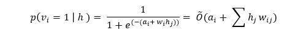

该过程被重复多次(k 次)，使得在每次迭代(k)之后，我们获得另一个输入向量 **v_k** ，其从原始输入值 **v_0** 重新创建。

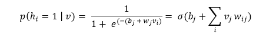

*   对比发散步骤

在对比发散步骤中，它更新权重矩阵。为了分析隐藏值 **h_0** 和 **h_k** 的激活概率，使用了向量 **v_0** 和 **v_k** 。

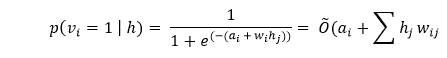

更新矩阵被计算为具有输入向量 **v_0** 和 **v_k** 的概率的外积之差，其由以下矩阵表示。

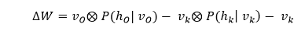

现在借助于这个更新的权重矩阵，我们可以用下面等式给出的梯度下降来分析新的权重。

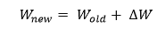

## 从训练到预测

**步骤 1:** 用所有用户的数据训练网络。

**步骤 2:** 取推理时间内特定用户的训练数据。

**步骤 3:** 使用数据获得隐藏神经元的激活。

**步骤 4:** 使用隐藏的神经元值获得输入神经元的激活。

**步骤 5:** 输入神经元的新值显示了用户给出的评级。

## 构建受限玻尔兹曼机

我们要用 [PyTorch](https://www.javatpoint.com/pytorch) 实现我们的受限玻尔兹曼机，这是一个高度先进的深度学习和 AI 平台。我们必须确保在我们的机器上安装 PyTorch，为此，请遵循以下步骤。

对于 Windows 用户:

点击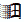左下角的窗口按钮- >程序列表- >蟒蛇- >蟒蛇提示。

在 Anaconda 提示符下，运行以下命令。

```

conda install -c pytorch pytorch

```

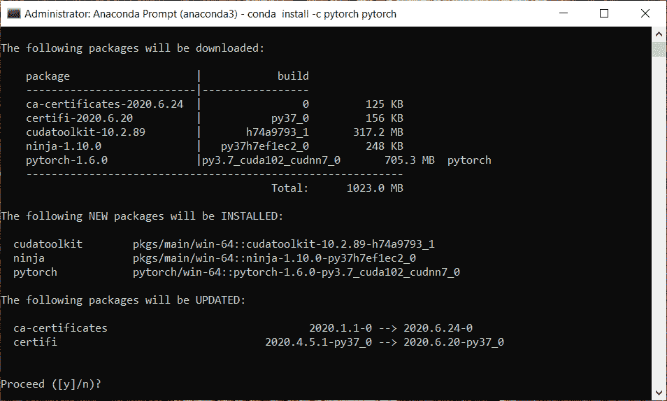

从上面的图片中，我们可以看到它询问是否继续。用 **y** 确认，按回车键。

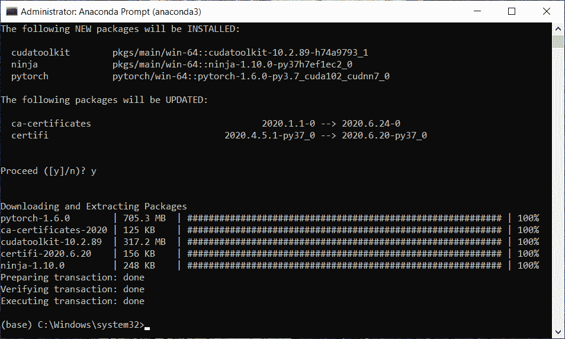

从上图中我们可以看到，我们已经成功安装了我们的库。

在此之后，我们将继续构建我们的两个推荐系统，其中一个系统将预测用户是否会喜欢电影，另一个系统将预测用户对电影的评分。所以，第一个将预测二元结果，1 或 0，即是或否，第二个预测评级从 1 到 5。这样，我们将拥有业内最常用的推荐系统。如今，许多公司建立了一些推荐系统，大多数时候，这些推荐系统或者预测用户或客户是否会喜欢该产品，或者一些其他推荐系统可以预测对某些产品的评级或评论。

因此，我们将创建一个推荐的系统，用我们受限的玻尔兹曼机器来预测二元结果是或否。我们将在本主题中实现的神经网络，然后我们将在下一个主题中实现另一个预测评级从 1 到 5 的推荐系统，这是一个自动编码器。但是，对于这两个推荐的系统，我们将使用相同的数据集，这实际上是可以在线找到的真实世界数据集，即 **MovieLens** 数据集。

您可以通过单击链接下载数据集；[https://grouplens.org/datasets/movielens/](https://grouplens.org/datasets/movielens/)，会指引你到官网。该数据集是由 **grouplens** 研究创建的，在该页面上，您将看到几个具有不同评分的数据集。但是我们将使用来自 1000 个用户和 1700 部电影的 100，000 个评价的**旧数据集**，如下图所示。此外，我们还有另一个 100 万速率的旧数据集，所以我建议您看一看这些数据集并下载它们。在这里，我们将下载两个红色标记的数据集。

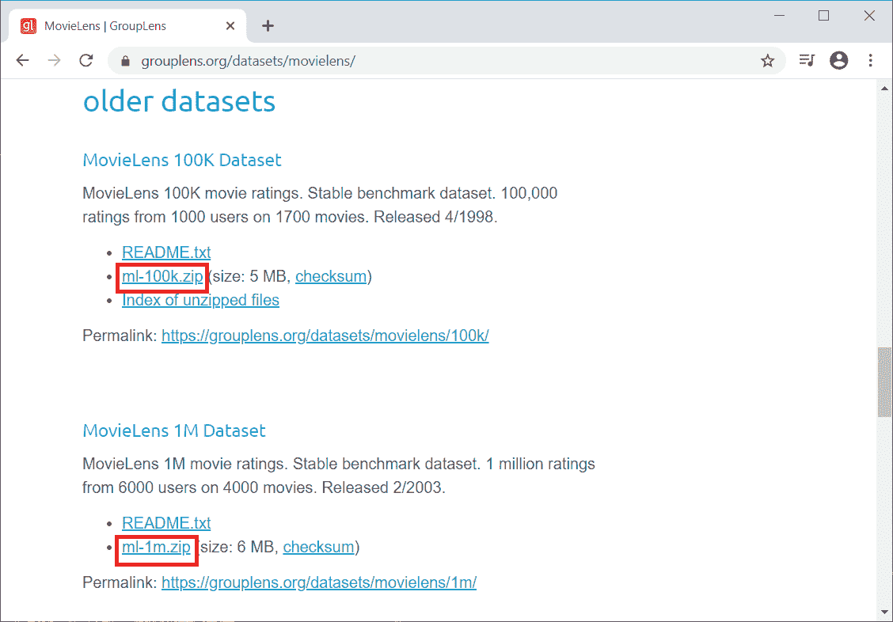

接下来，我们将导入用于导入受限玻尔兹曼机器的库。因为我们将使用数组，所以我们将导入[**【NumPy】**](https://www.javatpoint.com/numpy-tutorial)。然后是 [**Pandas**](https://www.javatpoint.com/python-pandas) 导入数据集，创建训练集和测试集。接下来，我们有所有的**火炬**库；例如 **nn** 是 Torch 实现神经网络的模块。这里**并行**用于并行计算，**优化**用于优化器，**工具**是我们将要使用的工具，**自动签名**用于随机梯度下降。

```

# Importing the libraries
import numpy as np
import pandas as pd
import torch
import torch.nn as nn
import torch.nn.parallel
import torch.optim as optim
import torch.utils.data
from torch.autograd import Variable

```

导入所有库、类和函数后，我们现在将导入数据集。我们要导入的第一个数据集是你所有的电影，都在 **movies.dat** 文件中。因此，我们将创建新的变量**电影**，它将包含我们所有的电影，然后我们将使用**read _ csv()**函数来读取 CSV 文件。在函数内部，我们将传递以下参数:

*   第一个参数是包含数据集的路径。这里路径的第一个元素是 **ml-1m** ，后面是输入文件名，也就是 **dat** 。
*   第二个参数是分隔符，默认的分隔符是逗号，适用于以逗号分隔功能的 CSV 文件。因为我们已经有了电影的标题，并且其中一些在标题中包含逗号，所以我们不能使用逗号，因为这样我们就可以在两个不同的列中有相同的电影。因此分隔符不是逗号，而是双冒号，即“**:::**”。
*   那么第三个参数是标题，因为实际上，文件 movies.dat 不包含标题，即列名。因此，我们需要指定它，因为标题的默认值不是无，因为没有列名但推断时就是这样，所以我们需要指定没有列名，为此，我们将把**标题=无**。
*   下一个参数是引擎，它是为了确保数据集正确导入，所以我们将使用 **python** 引擎使其高效。
*   最后，我们需要输入最后一个参数，即编码，我们需要输入不同于通常的编码，因为一些电影标题包含无法用经典编码 UTF-8 正确处理的特殊字符。所以，由于电影片名中的一些特殊字符，我们将输入**拉丁文-1** 。

```

# Importing the dataset
movies = pd.read_csv('ml-1m/movies.dat', sep = '::', header = None, engine = 'python', encoding = 'latin-1')

```

**输出:**

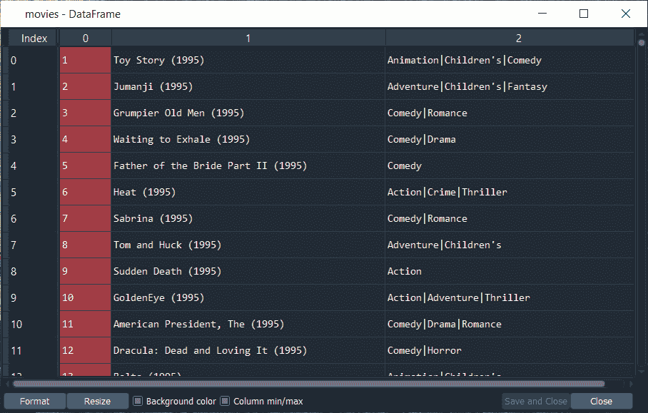

执行完上面这一行，我们会得到 **MovieLens** 数据库中所有电影的列表。我们有成千上万的电影，对于这些电影中的每一部，我们都有第一栏，这是电影 ID，这是最重要的信息，因为我们会用它来制作我们的推荐系统。我们不会使用标题；事实上，使用电影 ID 会简单得多。

接下来，我们将以同样的方式导入用户数据集。因此，我们将创建一个新的变量**用户**，我们只需为其更改路径，其余的东西将保持不变，因为我们实际上需要在这里为分隔符、标题、引擎以及编码使用完全相同的参数。

```

Users = pd.read_csv('ml-1m/users.dat', sep = '::', header = None, engine = 'python', encoding = 'latin-1')

```

**输出:**

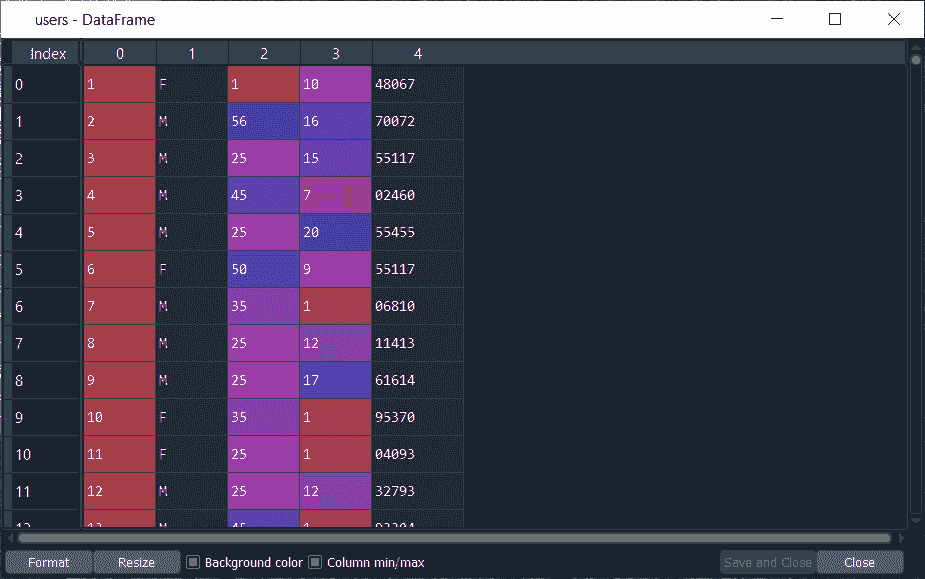

从上面的图片中，我们可以看到我们得到了用户的所有不同信息，其中第一列是用户 ID，第二列是性别，第三列是年龄，第四列是与用户工作对应的一些代码，最后第五列是邮政编码。

现在我们将导入评级，我们将像刚才一样再次进行，我们将创建新的变量**评级**，然后改变其路径，其余的将保持不变。

```

Ratings = pd.read_csv('ml-1m/ratings.dat', sep = '::', header = None, engine = 'python', encoding = 'latin-1')

```

**输出:**

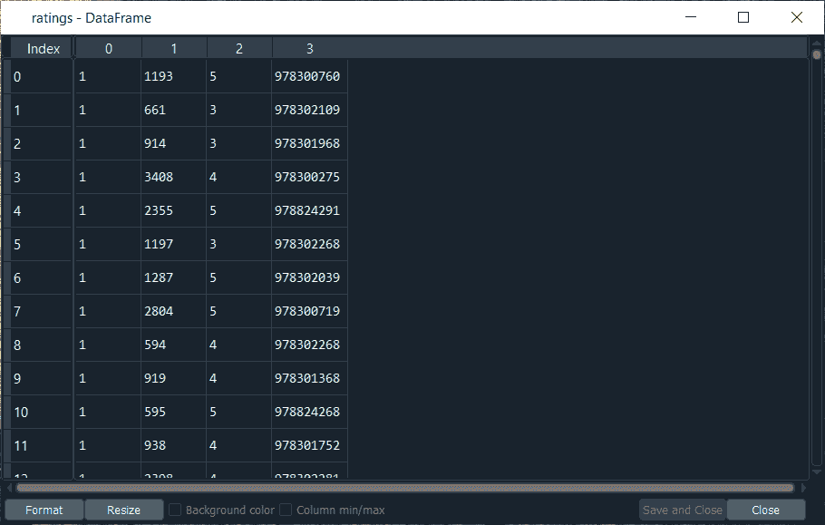

执行完上面一行代码后，我们可以看到我们已经成功导入了我们的 ratings 变量。这里，第一列对应于用户，因此所有 1 对应于同一个用户。然后第二列与电影相关，第二列中显示的数字是电影数据帧中包含的电影标识。接下来，第三列对应于评级，从 1 到 5。最后一列是时间步长，指定每个用户对电影进行分级的时间。

接下来，我们将准备训练集和测试集，我们将为其创建变量**训练集**，然后使用Pandas库导入 **u1.base** 。然后我们将这个训练集转换成一个数组，因为通过导入带有 Pandas 的 u1.base，我们将得到一个数据帧。因此，首先，我们将使用 pandas **read_csv** 函数，然后我们将传递我们的第一个参数，这是将在 ml-100k 文件夹中采用 u1.base 的路径，为此，我们将从包含 u1.base 的文件夹开始，该文件夹实际上驻留在 **ml-100k 文件夹**中，然后添加训练集的名称，即 **u1.base** 。由于 u1.base 的分隔符是制表符而不是双栏，所以我们需要指定它，因为否则，它将使用逗号，这是默认的分隔符。因此，我们将添加第二个参数，即**分隔符= '\t'** 来指定选项卡。

```

# Preparing the training set and the test set
training_set = pd.read_csv('ml-100k/u1.base', delimiter = '\t')

```

正如我们已经看到的，ml-100k 中的整个原始数据集包含 100，000 个评级，由于每个观察值对应一个评级，我们可以从下面给出的图像中看到，在执行上面一行代码后，我们有 80，000 个评级。因此，训练集是由 10 万个评分组成的原始数据集的 **80%** 。所以，这将是一个 80%:20%的训练:测试分割，这是训练集和测试集训练模型的最佳分割。

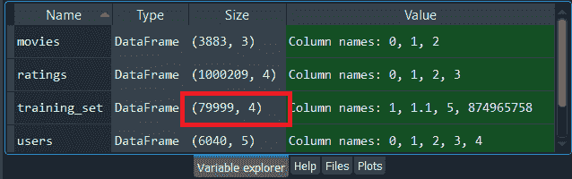

我们可以检查 **training_set** 变量，只需点击它就可以看到它的样子。

**输出:**

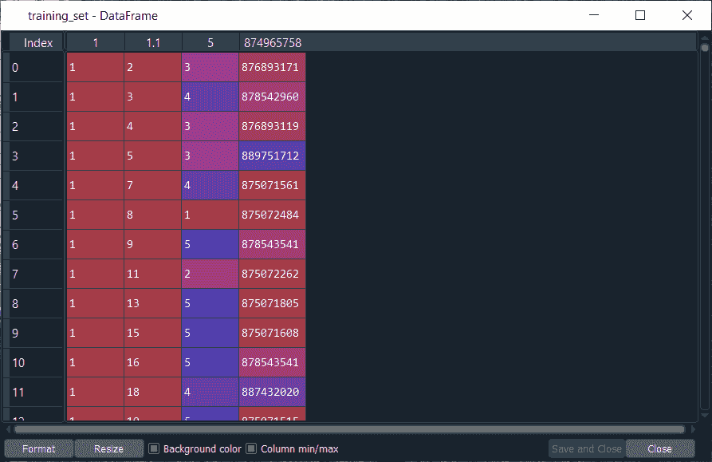

从上面的图片中，我们可以看到它与我们之前导入的收视率数据集完全相同，即第一列对应于用户，第二列对应于电影，第三列对应于收视率，第四列对应于具体我们确实不需要的时间步长，因为它与训练模型无关。training_set 作为 DataFrame 导入，我们必须将其转换为数组，因为在本主题的后面，我们将使用 PyTorch 张量，为此，我们需要一个数组来代替 data frame。

在这之后，我们将把这个训练集转换成一个数组，我们将再次使用我们的**训练集**变量，然后使用 NumPy 函数，即**数组**将数据帧转换成一个数组。在函数内部，我们将首先输入 **training_set** 参数，作为第二个参数，我们需要指定我们正在创建的这个新数组的类型。由于我们只有用户 id、电影 id 和收视率，这些都是整数，所以我们将把整个数组转换成整数数组，为此，我们将输入 **dtype = 'int'** 作为整数。

```

training_set = np.array(training_set, dtype = 'int')

```

执行上述行后，我们将看到我们的**训练集**是一个由**整数 32** 组成的数组，大小如下图所示。

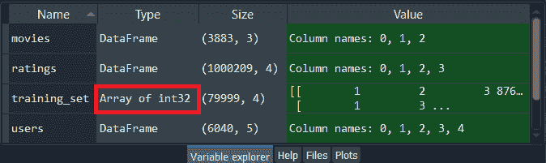

我们可以检查 **training_set** 变量，只需点击它就可以看到它的样子。

**输出:**

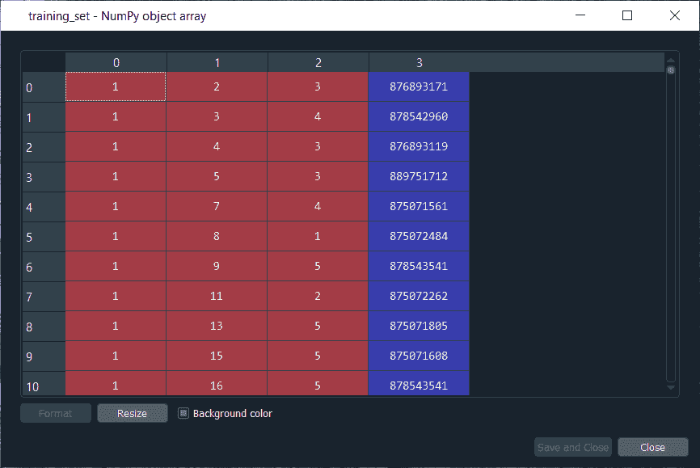

从上图可以看出，我们得到了相同的值，但这次变成了一个数组。

现在，以同样的方式，我们将为测试集做，我们将准备 test_set，这一次将非常容易，因为我们将结合相同的技术来导入我们的 test_set 并将其转换为数组。我们将完全使用上面的代码。我们所要做的就是用**测试集**替换训练集，用 **u1.test** 替换 u1.base，因为我们现在使用的是测试集，即 u1.test。

```

test_set = pd.read_csv('ml-100k/u1.test', delimiter = '\t')

```

执行完上面的行，我们会得到我们的 **test_set** ，可以看到这是完全一样的结构。第一栏是用户，第二栏是电影，第三栏是收视率。从下面给出的图片中，我们必须理解 test_set 和 training_set 具有不同的评级。在训练集和测试集之间，同一用户对同一部电影没有共同的评价。然而，我们有相同的用户。在这里，我们确实像在 training_set 中一样从用户 1 开始，但是对于这个相同的用户 1，我们不会有相同的电影，因为分级是不同的。

**输出:**

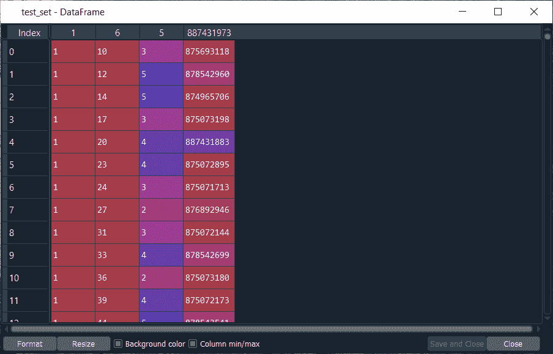

由于我们的数据集也是一个数据帧，因此我们需要将其转换为一个数组，为此，我们将使用与训练集相同的方式。

```

test_set = np.array(test_set, dtype = 'int')

```

运行上面一行代码后，我们可以从下面给出的图像中看到，我们的 **test_set** 是一个由 20，000 个等级组成的 **integers32** 数组，该数组对应于由 100，000 个等级组成的原始数据集的 **20%** 。

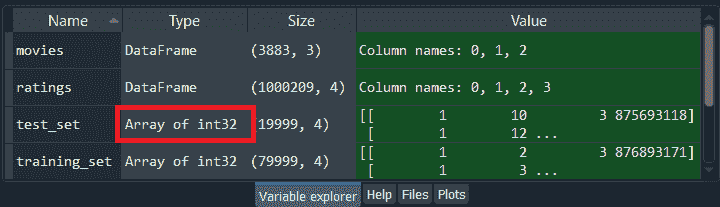

我们可以检查 **test_set** 变量，只需点击查看它的样子。

**输出:**

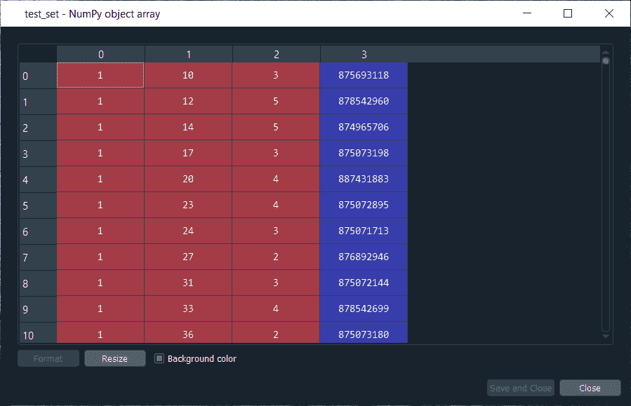

从上图可以看出，我们得到了相同的值，但这次变成了一个数组。

在下一步中，我们将获得用户和电影的总数，因为在下一步中，我们将把我们的**训练集**以及**测试集**转换成**矩阵**，其中线条将是用户，列将是电影，单元格将是收视率。我们将为训练集创建这样一个矩阵，并为测试集创建另一个矩阵。然而，除了这两个矩阵之外，我们还希望包括原始数据集中的所有用户和所有电影。如果在我们刚刚导入的训练集中，一个用户没有评价一部电影，那么，在这种情况下，我们将把一个 **0** 放入对应于这个用户和那些电影的矩阵的单元格中。

因此，为了得到用户总数和电影总数，我们将在训练集和测试集中取最大用户标识的最大值，这样我们就可以得到用户总数和电影总数，这将进一步帮助我们制作行列用户和电影的矩阵。

为此，我们将制作两个新的变量， **nb_users** ，这将是用户总数，而 **nb_movies** 将是电影总数。正如我们所说的，我们将取训练集中最大用户标识的最大值，所以我们将借助 **max(max(training_set[:，0])** 来完成。在括号内，我们需要放用户列的索引，也就是索引 **0、**以及我们需要取的所有行，所以我们增加了 **:** 。因此 **training_set[:，0]** 对应 training_set 的第一列，即用户，由于我们取的是最大值，这意味着我们肯定是取了用户 ID 列的最大值。

之后，我们需要对 **test_set** 进行同样的操作，因为最大用户 ID 可能在测试集中，所以以同样的方式，我们将对测试集进行操作，为此，我们现在将取 max **(test_set[:，0])** 。为了强制最大数值为整数，我们必须将该数值转换为整数，为此，我们使用了 **int** 函数，然后将所有这些最大值放入 int 函数中，如下所示。

```

# Getting the number of users and movies
nb_users = int(max(max(training_set[:,0]), max(test_set[:,0])))

```

通过执行上面的行，我们将获得用户标识的总数为 **943** ，但是对于其他训练/测试分割，它可能不会以相同的方式工作，因此我们将使用上面的代码，以防我们想要申请其他训练和测试集。

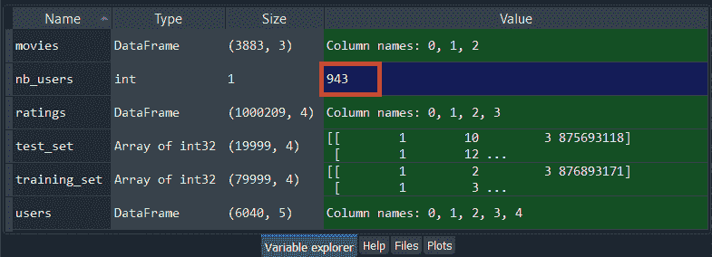

现在，我们将对电影进行同样的操作，我们将使用相同的代码，但是将使用列电影的索引替换列用户的索引，即 **0** ，即**，1** 。

```

nb_movies = int(max(max(training_set[:,1]), max(test_set[:,1])))

```

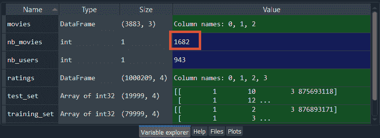

通过执行上面的行，我们得到电影 id 的总数是 **1682** 。所以，我们必须取最大值中的最大值，因为我们不知道这个电影 ID 是在训练集还是测试集中，我们实际上是通过运行以下命令来检查的。

```

max(training_set[:,1])

```

因此**训练 _ 集**中**最大电影 ID** 为 **1682** 。

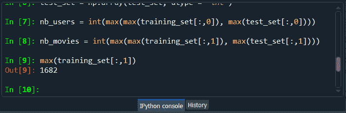

同样，我们可以检查**测试 _ 设置**。

```

max(test_set[:,1])

```

运行上述代码后，我们可以从下图中看到**测试 _ 设置**中的**最大电影 ID** 为 **1591** 。因此，它可能在 test_set 中，这不是第一次训练/测试拆分的情况，但对于其他训练/测试拆分，它可能是另一种方式。

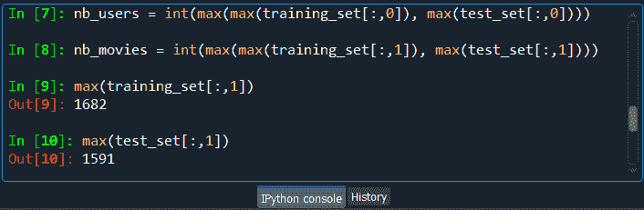

现在，我们将把我们的训练集和测试集转换成一个数组，用户在行中，电影在列中，因为我们需要制作一个特定的数据结构，该结构将对应于受限的玻尔兹曼机器期望作为输入的数据。受限制的玻尔兹曼机器是一种神经网络，其中一些输入节点是特征，一些观察值从输入节点开始一个接一个地进入网络。

因此，我们将创建一个包含这些观察值的结构，这些观察值将进入网络，它们的不同特征将进入输入节点。基本上，我们只是在为神经网络甚至是一般的机器学习制作通常的数据结构，即以行为单位的观察和以列为单位的特征，这正是神经网络所期望的数据结构。

因此，我们将把我们的数据转换成这样一个结构，因为我们将对训练集和测试集都这样做，所以我们将创建一个函数，我们将分别应用于它们。为了在 python 中创建一个函数，我们将从代表定义的 **def** 开始，然后给它起一个名为 **convert()** 的名字。在函数内部，我们将只传递一个参数，即**数据**，因为我们将只对一个集合应用这个函数，这个集合首先是训练集，然后是测试集。

```

# Converting the data into an array with users in lines and movies in columns
def convert(data):

```

接下来，我们将创建一个列表列表，这意味着我们将创建几个列表，其中一个列表用于每一行/用户。既然我们有 **943 个用户**，那么相应的，我们会有 **943 个列表**，这些将是水平列表，对应我们刚才描述的特殊结构中的线状观察。第一列表将对应于第一用户，第二列表将对应于第二用户，等等。而通过这样做，我们就会得到 **1682 部电影**的收视率被用户对应的榜单。基本上，我们将获得每部电影的评分，如果用户没有对电影进行评分，那么，在这种情况下，我们将获得该集的 **0** 。这就是为什么新转换的 training_set 和 test_set 将具有相同大小的原因，因为对于它们两者来说，我们都在考虑所有的用户和所有的电影，当用户没有对电影进行评分时，我们只放 0。

因此，我们将通过调用它 **new_data** 来创建列表列表，这将是函数返回的最终输出，也就是说，它将是用户在行中、电影在列中的最终数组。

```

    new_data = []

```

由于 **new_data** 是列表的列表，所以我们需要将其初始化为**列表**。在这之后，我们将进行一个**循环**，因为我们想要为每个用户创建一个列表，该列表列出了用户对电影的所有评价，因此，我们需要一个 for 循环来获取每个用户的评价。

为了便于循环，我们将引入一个局部变量，它将在数据的所有用户上循环，即训练集或测试集。因此，我们将这个变量称为 **id_users** ，它将获取我们数据库中所有用户的 id，然后为这些用户 id 指定一个范围，该范围将是从 1 到最大值的所有用户 id，即我们在开始此步骤之前发现的用户总数。所以 **id_users** 的范围是从 **1 到 nb_users + 1** 这样到 944 的时候就排除了，我们就到了 943。

```

for id_users in range(1, nb_users + 1):

```

现在在循环中，我们将创建这个新数据列表的第一个列表，这是第一个用户的评级，因为这里 **id_users** 从 **1** 开始，这就是为什么我们将从第一个用户开始，因此，我们将在整个列表中添加第一个用户的评级列表。我们将获取第一用户评级的所有电影的所有电影 id，为了做到这一点，我们将把所有**电影 id**放入一个名为 **id_movies** 的变量中。

然后我们将获取我们的数据，假设它是我们的训练集，因为然后我们将应用转换到训练集，然后从训练集中，我们将首先获取包含所有电影标识的列，这是我们索引的第 2 <sup>和第</sup>列，即索引 1。接下来，我们将采取我们将使用 **:** 的所有观察，然后用逗号分隔冒号和一，即 **[:，1]** 。这基本上意味着我们只拿走了这里的整个专栏，所有用户的整个专栏。

因为我们只想要第一个用户的电影 id，因为我们在循环的开始，所以我们将使用某种语法来告诉我们想要数据的第一列，即 training_set，这样第一列等于 1，为了在 python 中做到这一点，我们将添加一个新的条件，我们将添加一对新的括号[]。在这个括号里面，我们会放入条件**数据[:，0] == id_users** ，它会为第一个用户取所有的电影 id。

```

id_movies = data[:,1][data[:,0] == id_users]

```

现在，以同样的方式，我们将获得相同的评级，即我们将获得同一第一用户的所有评级。我们不取 id_movies，取 **id_ratings** ，因为我们要取 training_set 的所有收视率，在 3 <sup>rd</sup> 索引列，也就是索引 2 处，所以我们只需要用 2 替换 1，其余不变。通过这样做，我们将拥有创建第一个列表所需的一切，即第一个用户的评级列表。

```

id_ratings = data[:,2][data[:,0] == id_users]

```

在这之后，当用户没有给电影评分时，我们将获得所有的**零**或者更具体地说，我们现在将创建一个 1682 个元素的列表，其中该列表的元素对应于 1682 部电影，使得对于每部电影，如果用户给电影评分，我们将获得电影的评分，如果用户没有给电影评分，我们将获得零。

因此，我们将从初始化 1682 部电影的列表开始，我们将首先将该列表称为**分级**，然后使用具有快捷方式 **np** 的 NumPy，然后我们将使用**零**功能。在这个函数里面，我们会把我们想要的零的个数放在这个列表里面，也就是 1682，对应 **nb_movies** 。

```

ratings = np.zeros(nb_movies)

```

在此之后，我们将使用用户评分的电影的评分来替换零，为了做到这一点，我们将采用**评分**，然后添加**【id _ movies-1】**，因为它将为我们获得评分电影的索引。这些索引是我们在前面几个步骤中已经创建的 id_movies，因为它包含了所有被分级的电影的索引，这正是我们想要做的。因为在 python 中，索引从 0 开始，但是在 id_movies 中，索引从 1 开始，我们基本上需要电影 id 从与收视率的索引相同的基数开始，即 0，所以我们添加了-1。由于我们设法获得了在所有电影的分级列表中被分级的电影的索引，所以对于这些分级，我们将通过添加 **id_ratings** 来给出真实的分级。通过这样做，我们设法为每个用户创建了所有分级的列表，包括未分级电影的零。

```

ratings[id_movies - 1] = id_ratings

```

现在，我们只剩下一件事要做，即在这里将对应于一个用户的评级列表添加到包含所有 diffe 租金用户的所有不同列表的巨大列表中。因此，我们将采用整个列表，即 **new_data** ，然后采用 **append** 函数，因为它将在此为循环的用户 id_users 的一个用户将评级列表附加到整个 new_data 列表。在该功能中，我们将列出一个特定用户的全部评分。为了确保这是一个列表，我们将把**评级**放入**列表**功能，因为我们正在寻找一个列表列表，这实际上是 PyTorch 所期望的。

```

new_data.append(list(ratings))

```

现在，我们已经完成了我们的函数，现在我们将把它应用于我们的训练集和测试集。但是在继续之前，我们需要添加最后一行来返回我们想要的内容，为此，我们将首先添加 **return** ，然后添加 **new_data** ，这是所有不同收视率列表的列表。

下一步是将这个函数应用于训练集和测试集，并且这样做；我们将我们的**训练 _ 设置**，然后使用上面的**转换**功能。在 convert 函数中，我们将添加**训练集**，这是训练集的旧版本，然后将成为新版本，即用户在行中，电影在列中的数组。

以完全相同的方式，我们现在将对**测试集**进行测试。我们只需要用**测试集**替换训练集，其余的保持不变。

```

return new_data
training_set = convert(training_set)
test_set = convert(test_set)

```

通过运行上面这段代码，我们可以从下图中看到**训练 _ 集合**是一个 **943 列表**的列表。

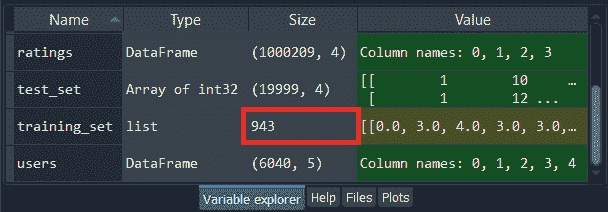

我们也可以简单点击一下**训练 _ 设置**看看。

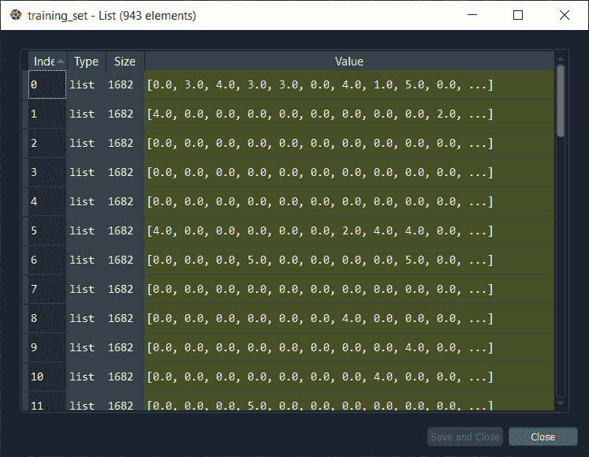

从上图中，我们可以看到这个巨大的列表包含了 943 个横向列表，其中每一个 **943 个列表**对应着我们数据库的每一个**用户**。所以，我们可以检查第一部电影、第二部电影和第三部电影；收视率果然不出所料 **0、3** 和 **4** 。可以清楚的看到，对于每个用户，我们得到的是数据库中所有电影的评分，当电影没有评分时得到一个 **0** ，当用户对电影进行评分时得到一个真实的评分。

同样，对于 test_set，我们有了新版本的 **test_set** ，它也包含了一个 **943 元素的列表**，如下所示。

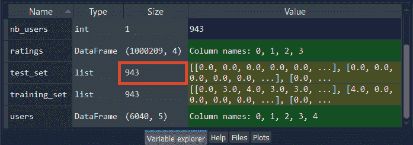

同样，我们也可以简单点击一下 **test_set** 来看看。

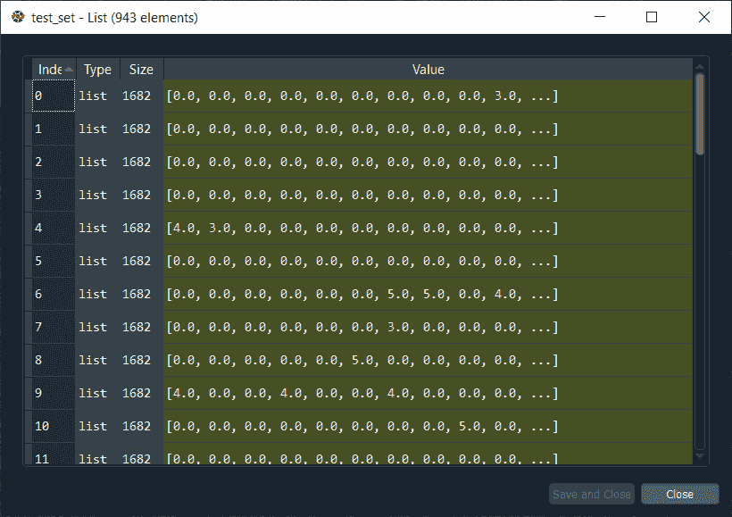

从上面的图片中，我们可以看到我们得到了一个列表，里面有所有的收视率，包括没有收视率的电影的 **0** 。

接下来，我们将把我们的训练集和测试集转换成一些 Torch 张量，这样我们的**训练集**将是**一个 Torch 张量**，而**测试集**将是另一个 Torch 张量。用一种更简单的方式，我们可以说，将有两个独立的，基于 PyTorch 的多维矩阵，并做到这一点；我们将只使用 torch 库中的一个类，它将自己进行转换。

因此，我们将从获取我们的**训练集**开始，然后给它一个新的值，将这个转换后的训练集转换成火炬张量。所以，我们将带着**一把火炬。浮动者**，其中火炬是库，**浮动者**是将创建该类对象的类。对象将是 Torch 张量本身，即一个单一类型的多维矩阵，由于我们使用的是 FloatTensor 类，那么，在这种情况下，单一类型将是一个 **float** 。

在类内部，我们将采用一个参数，该参数必须是列表的列表，即 **training_set** ，这就是我们在上一节中必须将此转换为列表列表的原因，因为 FloatTensor 类需要列表的列表。

```

# Converting the data into Torch tensors
training_set = torch.FloatTensor(training_set)

```

同样，我们将对**测试集**进行测试。我们只需要用 test_set 替换 training_set，其余的都保持不变。运行下面的代码后，我们将看到 training_set 和 test_set 变量将在变量浏览器窗格中消失，因为在 Spyder 中，它还没有识别 torch 张量。但是，该变量仍将存在，但不会显示在变量资源管理器窗格中。

```

test_set = torch.FloatTensor(test_set)

```

在执行了上面两行代码之后，我们的 training_set 和 test_set 变量将会消失，但是它们现在被转换成 Torch 张量，这样，我们就完成了一个推荐系统的公共数据预处理。

在下一步，我们将把评级转换成二进制评级，0 或 1，因为这些将是我们受限的玻尔兹曼机器的输入。因此，我们将从**训练集**开始，然后我们将由 **-1** 替换原始训练集中的所有 0，因为原始训练集中的所有 0，所有实际上不存在的评分，这些对应于用户没有评分的电影。为了访问在原始数据集中为 0 的这些原始评级，我们将在**【训练集= = 0】**的帮助下这样做，因为它将解释我们想要获取训练集的所有值，使得训练集的值等于 **0** 。而对于 training_set 中所有这些零值，这些零评级，我们想用 **-1** 来代替。

```

# Converting the ratings into binary ratings 1 (Liked) or 0 (Not Liked)
training_set[training_set == 0] = -1

```

现在我们也将做其他的评级，即从 1 到 5 的评级。它将以与我们上面相同的方式进行，注意我们想要转换为零的评分，即不喜欢的评分。正如我们已经讨论过的，不被用户喜欢的电影是那些被授予一星或二星的电影。因此，我们将对等于 1 的收视率做同样的事情，简单地用 **1** 替换 0，用 **0** 替换-1，因为在我们的新收视率中，格式 0 对应于用户不喜欢的电影。

同样，我们将对原始 training_set 中等于 2 的评分进行同样的操作。我们现在将 1 替换为 **2** ，其余部分保持不变。因此，通过下面给出的这两行，在原始训练集中等于 1 或 2 的所有评分现在将等于 **0** 。

```

training_set[training_set == 1] = 0
training_set[training_set == 2] = 0

```

在这之后，我们只需要做用户喜欢的电影。所以，被评为至少三星的电影，用户还是比较喜欢的，也就是说三星、四星、五星会变成 1。为了访问三星、四星和五星，我们需要用 **> =** 替换==以包括 3 而不是 2。所以，**【训练 _ 集合>= 3】**意味着训练 _ 集合中大于等于三的所有值都将包括获得评级， **1** 。通过这样做，三个、四个和五个将成为训练集中的一个。由于我们希望 RBM 以二进制格式输出评级，因此输入必须具有相同的二进制格式 0 或 1，这是我们在 training_set 中成功转换的所有评级。

```

training_set[training_set >= 3] = 1

```

现在我们将对 **test_set** 进行同样的操作，为了做到这一点，我们将复制上面的整个代码段，并简单地用 test_set 替换所有的 training_set。因此，有了这个，从 1 到 5 的所有等级将被转换成训练集和测试集中的二进制等级。

```

test_set[test_set == 0] = -1
test_set[test_set == 1] = 0
test_set[test_set == 2] = 0
test_set[test_set >= 3] = 1

```

执行完上面的代码后，我们的输入就可以进入 RBM 了，这样它就可以返回输入向量中最初没有评级的电影的评级，因为这是无监督的深度学习，这就是它的实际工作方式。

现在我们将创建神经网络的架构，即受限玻尔兹曼机器的**架构**。因此，我们将选择隐藏节点的数量，并且我们将构建神经网络，就像它是如何工作的一样，也就是说，我们将制作这个概率图形模型，因为 RBM 本身就是一个概率图形模型，为了构建它，我们将使用类。

基本上我们会做三个功能；一个是初始化我们将要创建的 RBM 对象，第二个函数是**采样 H** ，它将采样给定可见节点的隐藏节点的概率，第三个函数是**采样 V** ，它将采样给定隐藏节点的可见节点的概率。

因此，我们将首先通过将其命名为 **RBM** 来定义该类，在该类中，我们将首先创建 **__init__()** 函数，该函数定义了一旦创建该类将创建的对象的参数。默认情况下，它是一个强制函数，将被定义为 **def __init__()** 。之后，我们将在函数中输入以下参数:

*   第一个是默认参数 **self** ，对应后记将要创建的对象。它将帮助我们定义一些变量，我们需要为这些变量指定这些变量是将要进一步创建的对象的变量，而不是一些全局变量。所有附加到对象的变量都将通过在变量前放置一个自我来创建。
*   第二个变量是 **nv** ，对应可见节点数。
*   最后，第三个参数是 **nh** ，它定义了隐藏节点的数量。

```

# Creating the architecture of the Neural Network
class RBM():
    def __init__(self, nv, nh):

```

因为我们想要初始化权重和偏差，所以我们将进入函数内部，在那里我们将初始化我们未来对象的参数，我们将从这个类创建的对象。基本上，在 __init__ 函数中，我们将初始化在 RBM 训练期间优化的所有参数，即权重和偏差。

由于这些参数特定于 RBM 模型，也就是我们将从 RBM 类创建的未来对象，所以我们需要指定这些变量是对象的变量。因此，要初始化这些变量，需要从 **self 开始。W** ，其中 **W** 是权重变量的名称。这些权重是给定隐藏节点的可见节点概率的所有参数。接下来，我们将使用**火炬**，火炬库，然后使用 **randn** 函数随机初始化张量中的所有权重，权重的大小应该是 **nh** 和 **nv** 。

```

self.W = torch.randn(nh, nv)

```

接下来，我们将初始化**偏置**。对于给定可见节点的隐藏节点的概率有一些偏差，对于给定隐藏节点的可见节点的概率有一些偏差。因此，我们将从给定可见节点的隐藏节点概率的偏差开始。与我们之前所做的一样，我们将为这些偏见命名，对于第一个偏见，我们将命名为 **a** 。但在此之前，我们将取**的自我**-对象，因为 a 是对象的参数。然后我们再拿 **torch.randn** 按照**均值 0** 和**方差 1** 的正态分布初始化权重。由于每个隐藏节点只有一个偏差，并且我们有 **nh** 个隐藏节点，所以我们将创建一个 nh 元素的向量。但是我们需要创建一个与批处理相对应的额外维度，因此这个向量不应该像单个输入向量一样有一个维度；它应该有两个维度。第一维对应于批次，第二维对应于偏差。因此，在函数内部，我们将首先输入 **1** ，然后输入 **nh** ，因为这将有助于创建我们的二维张量。

```

self.a = torch.randn(1, nh)

```

然后我们有第三个参数要定义，它仍然特定于将要创建的对象，这是对可见节点的偏向，所以我们将它命名为 **b** 。这里和前面一行完全相似；我们将使用**火炬计划**功能，但这次是针对 **nv** 。因此，我们最终初始化了一个 nv 元素张量，其中一个额外的维度对应于批次。

```

self.b = torch.randn(1, nv)

```

接下来，我们将为我们的 RBM 类制作我们需要的第二个函数，它是关于根据给定的 **v** 的概率 **P(h)** 对隐藏节点进行采样，其中 **h** 是**隐藏节点**，而 **v** 是**可见节点**。这个概率就是 sigmoid 激活函数。

在训练过程中，我们将通过吉布斯采样近似对数似然梯度，并且为了应用它，我们需要计算给定可见节点的隐藏节点的概率。一旦我们有了这个概率，我们就可以对隐藏节点的激活进行采样。因此，我们将从调用我们的 **sample_h()** 开始，以返回我们的 RBM 的不同隐藏节点的一些样本。

在 sample_h()内部，我们将传递两个参数；

*   第一个是**自身**对应**对象**，因为要做 sample_h 函数，我们要用我们在里面定义的变量，要取这些变量，我们需要取我们的对象，它是自己识别的。所以，为了获得这些变量，我们在这里取 self。
*   那么第二个变量是 **x** ，对应于概率 P(h)给定 v 中的**可见神经元** v

```

def sample_h(self, x):

```

现在，在函数内部，我们将首先计算 h 给定 v 的概率，这是给定可见神经元的值，隐藏神经元等于 1 的概率，即具有所有评级的观察值的输入向量。h 给定 v 的概率不过是 sigmoid 激活函数，它被应用于 **wx、****w**权重向量乘以 **x** 可见神经元向量加上偏差 **a** 的乘积，因为 a 对应于隐藏节点的偏差。那么 **b** 对应的是可见节点的偏差，我们将使用它来定义样本函数，但是对于可见节点。而且由于我们目前处理的是隐藏节点，所以我们就取隐藏节点的偏向，即 **a** 。

我们将首先计算权重乘以神经元的乘积，即 **x** 。因此，我们将首先定义 **wx** 作为变量，然后我们将使用火炬，因为我们正在使用火炬张量。由于我们将要制作一个两个张量的产品，所以我们必须拿一个手电筒来制作这个产品，为此我们将使用 **mm** 函数。在函数内部，我们将输入我们的两个矩阵；矩阵 1 和矩阵 2。

正如我们之前说过的，我们想要制作 **x** (可见神经元)和 **nw** (权重张量)的乘积。但是在这里，W 是附着在物体上的，因为它是物体的权重张量，将由 __init__ 函数初始化，所以我们将取**的自我，而不是只取 W。W** 那我们就在 mm 功能里面输入。为了使其在数学上正确，我们将借助 **t()** 计算其权重矩阵的转置。

```

wx = torch.mm(x, self.W.t())

```

之后，我们将计算 sigmoid 激活函数内部的内容，它只是 wx 加上偏差，即神经元的线性函数，其中系数是权重，然后我们有偏差，a。

我们将 wx + a 称为**激活**，因为这将在激活函数中。然后我们取 **wx** 加上偏差，即 a，由于它附加到 RBM 类将要创建的对象上，所以我们需要取 **self.a** 来指定 a 是对象的变量。

如前所述，每个输入向量不会被单独处理，而是在批次内部处理，即使批次包含一个输入向量或一个偏差向量，该输入向量仍然存在于批次中，我们也将其称为小批次。因此，当我们添加隐藏节点的偏差时，我们希望确保该偏差应用于小批量的每一行，即维度的每一行。我们将使用**expand _ as**函数，该函数将再次为我们正在添加的这些偏差添加一个新的维度，然后将 **wx** 作为参数传递到函数内部，因为它对应于我们想要扩展的偏差。

```

activation = wx + self.a.expand_as(wx)

```

接下来，我们将计算激活函数，为此我们将调用 **p_h_given_v** 函数，该函数对应于隐藏节点被激活的概率，给定可见节点的值。既然我们已经讨论过 p _ h _ given _ v 是激活的 sigmoid，那么我们就追求取**的 torch.sigmoid** 函数，然后在函数内部传递**激活**。

```

p_h_given_v = torch.sigmoid(activation) 

```

在这之后，在最后一步中，我们将返回概率以及 h 的样本，h 是根据概率 p _ h _ 给定 _v 的所有隐藏神经元的所有隐藏节点的样本。因此，我们将首先使用**返回 p _ h _ 给定 _v** ，这将返回我们想要的第一个元素，然后使用**torch . Bernoulli(p _ h _ 给定 _v)** ，这将导致返回隐藏神经元的所有概率，给定可见节点的值，即评级以及

```

return p_h_given_v, torch.bernoulli(p_h_given_v)

```

所以，我们只是实现了 sample_h 函数，根据概率 p_h_given_v 对隐藏节点进行采样，现在我们将对**可见节点**进行同样的操作，因为根据隐藏节点中的值，即它们是否被激活，我们还将估计可见节点的概率，即每个可见节点等于 1 的概率。

最后，我们将输出预测的收视率，用户最初没有给的电影的 0 或 1，我们最终获得的这些新收视率将取自我们在隐藏节点中获得的，即来自隐藏节点的样本。因此，我们将使函数 **sample_v** 成为可能，因为当我们近似**对数似然梯度**时，我们将应用 Gibbs 抽样也需要该函数。

而为了使这个功能，它与上面的功能完全一样；我们只需要更换很少的东西。首先，我们将调用函数 **sample_v** ，因为我们将根据概率 **p_v_given_h** 对可见节点进行一些采样，即给定隐藏节点的值，我们返回每个可见节点等于 1 的概率。

这里我们将返回 p _ v _ 给定 _h 和仍然基于伯努利采样的可见节点的一些样本，即我们有可见节点的概率向量，并且从这个向量，我们将返回可见节点的一些采样。接下来，我们将改变激活函数内部的内容，为此，我们将首先用 **y** 替换变量 x，因为 sample_h 函数中的 x 表示可见节点，但是这里我们正在制作 **sample_v** 函数，该函数将返回给定隐藏节点值的可见节点的概率，因此变量是这一次隐藏节点的值， **y** 对应于**隐藏节点**。

同样的，我们用 **wy** 来代替 wx，然后我们用所有权重的矩张量来取不是 x 而是 **y** 的张量矩阵的矩积。因为我们是使隐藏节点和权重火炬张量的乘积，即概率 p _ v _ 给定 h 的 W，所以我们这里不取转置。在此之后，我们将计算 sigmoid 函数内部隐藏神经元的激活，为此，我们将不采用 wx，而是采用 **wy** ,并且我们将使用 **b** 替换 a，因为我们将需要采用包含在 **self.b** 变量中的可见节点的偏差，保持其余部分不变。

```

def sample_v(self, y):
        wy = torch.mm(y, self.W)
        activation = wy + self.b.expand_as(wy)
        p_v_given_h = torch.sigmoid(activation)
        return p_v_given_h, torch.bernoulli(p_v_given_h)

```

现在，我们将制作最后一个函数，关于对比散度，我们将使用它来近似对数似然梯度，因为 RBM 是一个基于能量的模型，也就是说，我们有一些能量函数，我们试图最小化，因为这个能量函数取决于模型的权重，我们在开始定义的权重张量中的所有权重，所以我们需要优化这些权重来最小化能量。

这并不是说它可以被视为一个基于能量的模型，但它也可以被视为一个概率图形模型，其目标是最大化训练集的对数似然性。为了最小化能量或最大化任何深度学习模型或机器学习模型的对数似然性，我们需要计算梯度。然而，梯度的直接计算太重，所以我们宁愿尝试借助对比散度来近似梯度，而不是直接计算它。

因此，我们将再次开始定义我们的新函数，称为**训练，**，然后在函数内部，我们将传递几个参数，如下所示:

*   第一个参数是**自身**，因为我们将更新权重张量和偏差 a 和 b，它们是专门附加到对象的变量。
*   第二个参数是输入向量，我们称之为 **v0** ，它包含一个用户对所有电影的评分。
*   第三个参数是 **vk** ，其对应于在 k 次采样之后获得的可见节点，即在从可见节点到隐藏节点的 k 次往返之后，然后从隐藏节点返回到可见节点。这样，经过 k 次迭代和 k 次对比发散，得到了可见节点。
*   那么我们的第四个参数是 **ph0** ，这是概率向量，在第一次迭代中，给定 v0 的值，隐藏节点等于 1，即我们的观察输入向量。
*   最后，我们将采用我们的第五个参数，即 **phk** ，它将对应于给定可见节点 vk 的值的 k 个采样后隐藏节点的概率。

```

def train(self, v0, vk, ph0, phk):

```

在这之后，我们将采取我们的张量或权重**自我。W** ，既然要再拿一次加东西，那就拿 **+=** 。然后我们将使给定输入向量 v0 时隐藏节点等于 1 的概率与该输入向量 **v0** 的乘积，以及给定输入向量 v0 时隐藏节点等于 1 的概率只不过是 **ph0** 。

因此，为了做到这一点，我们将首先获取我们的 **torch** 库，然后获取 **mm** 来制作两个张量的乘积，在括号内，我们将输入该乘积中的两个张量，即 **v0** ，输入观察值向量，然后借助 **t()** 获取其转置，然后获取 **ph0** ，这是乘积的第二个元素。

然后我们需要再次减去 **torch.mm** ，k 采样后得到的可见节点的 torch 乘积，即 **vk** ，然后借助 **t()** 取其转置，给定这些可见节点 vk 的值，隐藏节点等于 1 的概率，不外乎 **phk** 。

```

self.W += torch.mm(v0.t(), ph0) - torch.mm(vk.t(), phk)

```

接下来，我们将更新权重 b，这是给定 h 的概率 p(v)的偏差，为了做到这一点，我们将从获取 **self.b** 开始，然后再次获取 **+=** ，因为我们将向 **b** 添加一些东西，然后获取 **torch.sum** ，因为我们将对 **(v0 - vk)** 求和，这是 k 采样 vk 和**之后观察值 v0 的输入向量和可见节点之间的差基本上，我们只是在做 v0-vk 和 0 的和，这只是为了保持 b 的格式为二维张量。**

```

self.b += torch.sum((v0 - vk), 0)

```

在这之后，我们将进行最后一次更新，即偏差 a，它包含 P(h)给定 v 的概率。因此，我们将从 **self.a** 开始，然后取 **+=** ，因为我们也将添加一些东西，即我们将添加隐藏节点等于 1 的概率(给定 v0 的值，观察的输入向量)和隐藏节点等于 1 的概率(给定 vk 的值，即 k 采样后可见节点的值)之间的差值。基本上，我们将只添加差异 **(ph0-phk)** 和 **0** ，我们将以与上面相同的方式执行。

现在我们有了自己的类，我们可以用它来创建几个对象。因此，我们可以创建几个 RBM 模型。我们可以用不同的配置测试它们中的许多，也就是说，用几个隐藏节点，因为这是我们的主要参数。但是我们也可以给类添加更多的参数，比如学习速率，以便改进和调整模型。

```

 self.a += torch.sum((ph0 - phk), 0)

```

执行完上面的代码后，我们现在准备创建我们的 RBM 对象，为此我们需要两个参数， **nv** 和 **nh** 。这里 nv 是一个固定的参数，对应的是电影的数量，因为 nv 是可见节点的数量，在开始的时候，可见节点是特定用户对所有电影的评分，这也是我们每部电影都有一个可见节点的唯一原因。所以，我们有很多方法可以得到可见节点的数量；首先，我们可以说 nv 等于 nb_movies，1682 或者另一种方法是确保它对应于我们的特征矩阵中的特征数量，这就是训练集，特征张量。

因此，我们将从定义 **nv** 为 **len(training_set[0])** 开始，其中 training_set[0]对应于训练集的第一行，len(training_set[0])是第一行中的元素数量，即我们想要的 nv 的特征数量。

```

nv = len(training_set[0])

```

接下来我们对 **nh** 做，对应隐藏节点数。由于我们有 1682 部电影，或者我们可以说 1682 个可见节点，并且正如我们所知，隐藏节点对应于将被 RBM 模型检测到的一些特征，所以最初，我们将从检测 **100** 特征开始。

```

nh = 100

```

然后我们还有另一个变量 **batch_size** ，还没有高亮显示。然而，我们已经在上面的代码部分提到了它的概念，这是因为当我们训练我们的模型算法时，我们不会在每次观察后更新权重，而是在几个观察后更新权重，这些观察将进入一个批次，因此每个批次将具有相同数量的观察。

因此，我们还可以调整这个额外的参数来尝试改进模型，最终，这个参数就是 batch_size 本身。为了得到快速的训练，我们会创建一个新的变量 **batch_size** 并使其等于 **100** ，但是你可以尝试几个 batch_size 来获得更好的性能结果。

```

batch_size = 100

```

现在我们将创建我们的 RBM 对象，因为我们有 __init__ 方法的两个必需参数，即 nv 和 nh。为了创建我们的对象，我们将首先调用我们的对象作为 **rbm** ，然后调用我们的类 **RBM** 。在课内，我们将输入 **nv** 和 **nh** 作为参数。

```

rbm = RBM(nv, nh)

```

接下来，我们将继续训练我们的受限玻尔兹曼机器，为此我们必须在 for 循环中包含我们在 RBM 课上制作的不同函数。我们将首先选择一些我们称之为变量 **nb_epoch** 的纪元，然后使其等于 **10** ，因为我们的观测值很少，即 943，此外，我们只有二进制值 0 和 1，因此收敛会很快达到。

```

# Training the RBM
nb_epoch = 10

```

在此之后，我们将做一个 for 循环，它将经历 10 个时代。在每个纪元中，我们所有的观察值都会回到网络中，然后在每一批的观察值通过网络后更新权重，最后，我们将获得最终的可见节点，该节点具有原始未评级电影的新评级。

为了进行 for 循环，我们将从**开始进行**，然后我们将为 epoch 想出一个变量，所以我们将简单地将其称为**一个 epoch** ，这是范围中循环变量**的名称，然后在括号内，我们将从 **(1，nb_epoch+1)** 开始，这将确保我们从 1 到 10，因为即使 **nb_epoch + 1** 等于 **11****

```

for epoch in range(1, nb_epoch + 1):

```

然后，我们将进入循环，并制作损失函数，以衡量预测和实际评级之间的误差。在本培训中，我们将把预测与我们已经拥有的评分进行比较，即 training_set 的评分。因此，基本上，我们将测量预测评级之间的差异，即 0 或 1 与实际评级 0 或 1 之间的差异。

对于这个 RBM 模型，我们将采用绝对值法中的简单差值来衡量损失。因此，我们将引入一个损失变量，称之为 **train_loss** ，并将它初始化为 **0** ，因为在开始训练之前，损失为零，当我们发现预测和实际评级之间存在一些误差时，损失将进一步增加。

```

train_loss = 0

```

在这之后，我们将需要一个计数器，因为我们将对列车损失进行归一化，为了对列车损失进行归一化，我们将简单地用计数器除以列车损失， **s** ，然后将其初始化为 **0** 。因为我们希望它是一个浮点数，所以我们将在 0 之后添加一个点，以确保 s 具有浮点数类型。有了这个，我们就有了一个计数器，它会在每个纪元后递增。

```

    s = 0.

```

接下来，我们将对我们在上述步骤中创建的三个函数进行真正的训练，即 sample _h、sample_v 和 train，当我们创建这些函数时，这些函数是针对一个用户的，当然，采样以及对比散度算法必须对该批中的所有用户进行。

因此，我们将首先获得用户的批次，为了做到这一点，我们将需要另一个 for 循环。在这里，我们将在第一个 for 循环中创建一个 for 循环，因此将从的**开始，因为这个 for 循环是关于在所有用户上循环的，所以我们将引入一个循环变量 **id_user in range()** 。我们已经知道，用户的索引从 0 开始，所以我们将从 **0** 开始范围。**

现在，在我们继续之前，有一点很重要，那就是我们想带走一些批次的用户。我们不想逐个获取每个用户，然后更新权重，而是希望在每批用户通过网络后更新权重。所以，我们不会逐个取每个用户，而是取用户的批次。

由于 batch_size 等于 100，那么，第一批将包含从索引 0 到 99 的所有用户，然后第二批将包含从索引 100 到索引 199 的用户，第三批将从 200 到 299，等等。直到最后。因此，将进入网络的最后一批将是来自索引 943 - 100 = 84 的用户的 batch_size，这意味着最后一批将包含来自 843 到 943 的用户。因此用户范围的停止不是 nb_users 而是 **nb_users - batch_size** ，即 **843** 。在这之后，我们将需要一个步骤，因为我们不想从 1 到 1，相反，我们想从 1 到 100 和 100 到 200，等等。直到最后一批。因此，步骤，也就是我们需要输入的第三个参数，将不是 1，默认步骤而是 100，即**批处理大小**。

```

for id_user in range(0, nb_users - batch_size, batch_size):

```

现在我们将进入循环，我们的第一步将分离输入和目标，其中输入是我们在循环中处理的特定用户对所有电影的评分，目标将在开始时与输入相同。由于输入将在吉布斯链内，并将被更新以获得每个可见节点的新评级，因此输入将会改变，但目标将保持不变。

因此，我们将输入称为 **vk** ，因为它将是随机行走的 **k** 步之后的吉布斯采样的输出。但是最初，这个 vk 实际上将是所有观察的输入批次，即该批次中用户的所有评级的输入批次。因此，输入将是**训练集**，并且由于我们处理的是具有 id_user 的特定用户，因此我们想要获得的批次是从 id_user 到 id_user + batch_size 的所有用户，并且为了达到这一点，我们将**【ID _ user:ID _ user+batch _ size】**因为它将产生 100 个用户的批次。

```

vk = training_set[id_user:id_user+batch_size]

```

同样，我们会为目标做，目标是我们不想接触的那批原始评级，但我们希望最终将其与我们预测的评级进行比较。我们需要它，因为我们想测量预测的收视率和实际收视率之间的误差，以获得损失，train_loss。

所以，我们将目标称为 **v0** ，其中包含了该批次 100 位用户已经评分的电影的评分。由于目标与开始时的输入相同，我们将复制上面的代码行，因为在开始时，输入与目标相同，它将在稍后更新。

```

v0 = training_set[id_user:id_user+batch_size]

```

然后我们会取 **ph0** 后面加上**，_** 以便让它明白我们只想要返回 sample_h 函数的第一个元素。由于 sample_h 是 rbm 类的方法，因此我们将借助 **rbm.sample_h** 使用来自我们的 RBM 对象的 sample_h 函数。在该功能中，我们将输入 **v0** ，因为它对应于开始时的可见节点，即我们批次所有用户的电影原始收视率。

```

ph0,_ = rbm.sample_h(v0)

```

在下一步中，我们将为对比发散的 k 个步骤添加另一个 for 循环。因此，我们将从的**开始，然后调用循环变量，即范围(10)** 中的 **k**

```

for k in range(10):

```

接下来，我们将取 **_，hk** ，这将是在对比发散的第 k <sup>步</sup>获得的隐藏节点，因为我们在开始，所以 k 等于 0。但是 h0 将是 sample_h 方法返回的第二个元素，由于 sample_h 方法在 RBM 类中，所以我们将从我们的 **rbm.sample_h** 中调用它。当我们对第一个隐藏节点进行采样时，给定第一个可见节点的值，即原始评级，那么在吉布斯采样的第一步中，sample_h 函数的第一个输入将是 **vk** ，因为到目前为止 vk 是我们的一批输入观察值，然后 vk 将被更新。这里 vk 等于 v0。

```

    _,hk = rbm.sample_h(vk)

```

现在我们将更新 **vk** 使得 vk 不再是 v0，但是现在 vk 将是 Gibbs Sampling 第一步之后的采样可见节点。为了得到这个样本，我们将在我们隐藏节点的第一个样本上调用**sample _ v**函数，即 **hk** ，这是基于第一个可见节点的第一次采样的结果，原始可见节点。因此，vk 将是 **rbm.sample_v** ，我们称之为 **hk** ，第一个采样的隐藏节点。

```

  _,vk = rbm.sample_v(hk)

```

下一步，我们将在 vk 的帮助下更新权重和偏差。但是在前进之前，我们需要做一件重要的事情。即，我们将通过冻结包含-1 评级的可见节点来跳过培训过程中具有-1 评级的销售，因为在吉布斯抽样期间不可能更新它们。

为了冻结包含-1 评级的可见节点，我们将采取 **vk** ，这是我们在随机行走的 k 步期间正在更新的可见节点。然后在我们的目标 v0 的帮助下，我们将获得具有-1 评级的节点，因为它没有改变，它实际上保持了原始评级。因此，我们将采取**【v0<0】**来获得-1 的评级，因为我们的评级是-1、0 或 1。对于这些可见的节点，我们会说它们等于-1 评级，因为它没有改变，所以从目标中获取原始的-1 评级，为此，我们将获取**v0【v0<0】**，因为它将获取所有的-1 评级。这只是为了确保培训不会在这些实际上并不存在的评分上进行。我们只想做关于收视率的培训。

```

vk[v0<0] = v0[v0<0]

```

接下来，我们将在应用 train 函数之前计算 phk，为此，我们将从获取 **phk，_** 开始，因为我们想要获取 sample_h 函数返回的第一个元素。然后，我们将获得应用于可见节点的最后一个样本的 sample_h 函数，即在 for 循环结束时。因此，我们将首先获取我们的 **rbm** 对象，然后在 10 步之后对可见节点的最后一个样本应用 **sample_h** 函数，即 **vk** 。

```

phk,_ = rbm.sample_h(vk)

```

现在，我们将应用 train 函数，由于它不返回任何东西，所以我们不会创建任何新的变量，相反，我们将我们的 **rbm** 对象作为来自 rbm 类的函数。然后从 rbm 对象，我们将调用我们的 **train** 函数，然后传递 **v0** 、 **vk** 、 **ph0** 和 **phk** 作为函数内部的参数。

现在训练和权重一样容易发生，偏差将朝着最大似然的方向更新，因此，给定隐藏节点的状态，我们所有的概率 P(v)将更加相关。我们将获得最重要的概率的最大权重，并最终导致一些预测的评级，这些评级将接近真实评级。

```

rbm.train(v0, vk, ph0, phk)

```

接下来，我们将更新 **train_loss** ，然后我们将使用 **+=** ，因为我们想在其中添加误差，这是目标 v0 的预测收视率和真实原始收视率之间的差异。因此，我们将从比较 **vk** 开始，vk 是最后一批通过网络的用户之后最后一个可见的节点，v0 是从一开始就没有改变的目标。

在这里，我们将借助预测值和真实评级值之间的简单绝对值距离来测量误差，为此，我们将使用 **torch** 函数，即**均值**。在均值函数内部，我们将使用另一个 torch 函数，即返回一个数字绝对值的 **abs** 函数。所以，我们将取目标 **v0** 的绝对值和我们的预测 **vk** 。为了提高 v0-vk 的绝对值，我们将包括实际存在的评级，即 v0 和 vk 的**【v0>= 0】**，因为它对应于存在的评级指标。

```

train_loss += torch.mean(torch.abs(v0[v0>=0] - vk[v0>=0]))

```

现在我们将更新计数器，以使火车损失正常化。所以，在这里，我们将在浮点数中增加 1。

```

        s += 1.

```

最后，我们将打印训练中将要发生的所有事情，即在训练期间我们所处的时代的数量，然后对于这些时代，我们希望看到损失，它是如何减少的。因此，我们将使用**打印**功能，该功能包含在 for 循环中，循环遍历所有纪元，因为我们希望它在每个纪元打印。

在打印函数中，我们将从一个字符串开始，这将是纪元，即**‘纪元’:**，然后添加 **+** 来连接两个字符串，然后我们将添加我们通过 str 函数获得的第二个字符串，因为在该函数中，我们将输入我们在训练中所处的纪元，即一个整数纪元，该纪元将成为 str 函数中的字符串，因此我们将简单地添加 **str(纪元)**。然后我们再加上 **+** ，接着再加上另一个字符串，即 **' loss: '** 然后再加上 **+ str(train_loss/s)** 。基本上，它将打印我们在训练中所处的时代以及相关的损失，这实际上是标准化的 train_loss。

```

print('epoch: '+str(epoch)+' loss: '+str(train_loss/s))

```

所以，在执行了上面这段代码之后，我们可以从下面给出的图像中看到，我们以 0.245 的 **train_loss** 结束，或者我们可以近似地说 **0.25** ，这是相当好的，因为这意味着在训练集中，我们得到了正确的预测评级，四分之三，四分之一，我们在预测所有用户对电影的评级时出错了。

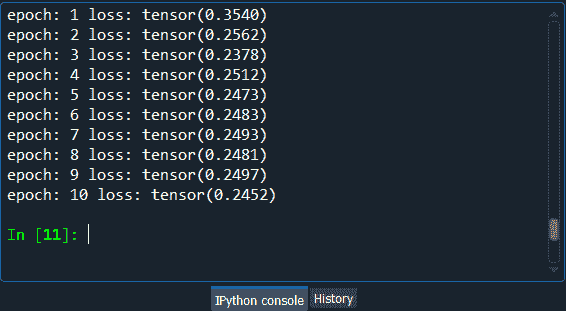

接下来，我们将使用 **test_set** 结果获得新观察的最终结果，以便查看结果是否接近训练 _set 结果，即即使在新预测上，我们也可以预测四个中的三个正确评级。测试测试集结果非常简单，与测试训练集结果非常相似；唯一不同的是不会有任何训练。因此，我们将简单地复制上面的代码并进行所需的更改。

为了得到测试集结果，我们将把训练集替换为**测试集**。由于没有任何训练，所以我们不需要循环整个纪元，因此，我们将移除 nb_epoch = 10，然后移除第一个 for 循环。然后我们用**测试损耗**代替列车损耗来计算损耗。我们将把初始化的计数器保持在零，然后在每一步递增 1。

```

# Testing the RBM
test_loss = 0
s = 0.

```

然后我们对 test_set 的所有用户使用 for 循环，所以我们将不包括 batch_size，因为它只是一种特定于训练的技术。这是一个参数，您可以对其进行调整，以便在 training_set 以及 test_set 上获得或多或少的性能结果。但是在批处理大小中收集观察值只是为了训练阶段。

因此，我们将删除与 batch_size 相关的所有内容，并将用户带到最后一个用户，因为基本上，我们将为每个用户逐个进行一些预测。此外，我们将删除 0，因为这是默认的开始。因此，我们将对范围内的 id _ user(nb _ user)进行**，因为基本上，我们是一个接一个地循环所有的用户。**

```

for id_user in range(nb_users):

```

现在对于每个用户，我们将进入循环，我们将再次移除 batch_size，因为我们并不真正需要它们。由于我们将对每个用户逐一进行预测，因此我们将简单地用 **1** 替换 batch_size。之后我们用 **v** 和 **vt** 针对的 v0 来代替 vk。这里 v 是我们进行预测的输入。对于输入 v，我们不会用 test_set 替换这里的 training_set，因为 **training_set** 是将用于激活隐藏神经元以获得输出的输入。由于 vt 包含 test_set 的原始评级，我们最终将使用它来与我们的预测进行比较，因此我们将用 **test_set** 替换此处的 training_set。

```

    v = training_set[id_user:id_user+1]
    vt = test_set[id_user:id_user+1]

```

现在，我们将进入下一步，我们将迈出一步，这样我们的预测将直接是吉布斯采样一次往返的结果，或者我们可以说一步，绑定行走的一次迭代。这里我们将简单地去掉 for 循环，因为我们不需要走 10 步，只需要走一步。因此，为了完成这一步，我们将从 **if** 条件开始过滤测试集不存在的评级，然后使用**透镜**功能。在该功能中，我们将输入**vt【vt>= 0】**，该值与所有存在的额定值相关，即 0 或 1。所以如果 len，长度也就是包含设定评级的可见节点数，(vt[vt > =0])大于 0，那么我们可以做一些预测。

```

if len(vt[vt>=0]) > 0:

```

因为我们只需要进行盲走的一步，即吉布斯采样，因为我们没有超过 10 步的循环，所以我们将移除所有的 k。

```

        _,h = rbm.sample_h(v)
        _,v = rbm.sample_v(h)

```

接下来，我们将使用 **test_loss** 替换 train_loss，以便对其进行更新。然后，我们将再次从**火炬**库中更新**均值**函数，并且我们仍将获取预测和目标之间的绝对距离。所以，这次我们的目标不是 v0 而是 **vt** ，然后取 test_set 中存在的所有评级，即**【vt>= 0】**。还有，预测不再是 vk，而是 **v** 因为只有一步，然后我们会再次取相同的已有评级，**【vt>= 0】**因为它会帮助我们得到已有评级的单元格的指标。

```

   test_loss += torch.mean(torch.abs(vt[vt>=0] - v[vt>=0]))

```

现在之后，我们将更新**计数器**，以使 test_loss 正常化。

```

   s += 1.

```

最后，我们将打印最终的 test_loss，为此我们将从代码中删除所有的纪元。然后从第一个字符串开始，我们用 **test_loss** 替换这个损失，指定它是一个测试损失。接下来，我们用**测试损耗**代替火车损耗，我们用**的**来进行归一化。

```

print('test loss: '+str(test_loss/s))

```

**输出:**

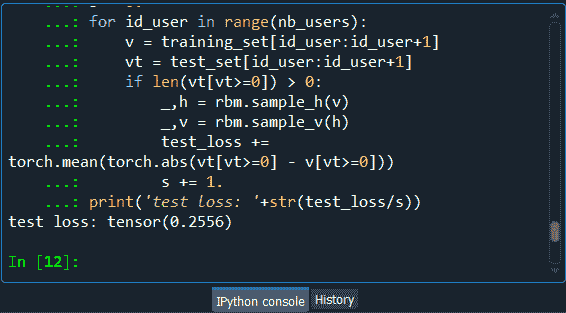

因此，在执行了上面一行代码之后，我们可以从上面的图片中看到，我们得到了一个 **0.25** 的 **test_loss** ，这是相当不错的，因为这是针对新的观察，新的电影。我们四分之三地预测了一些正确的评级。我们实际上设法制作了一个强大的推荐系统，这是一个更容易的系统，预测二进制评级。

* * *